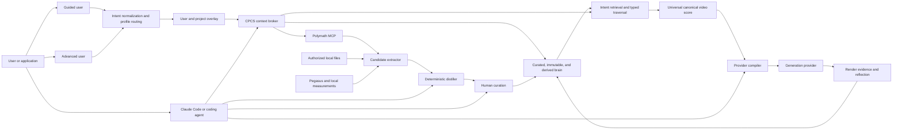
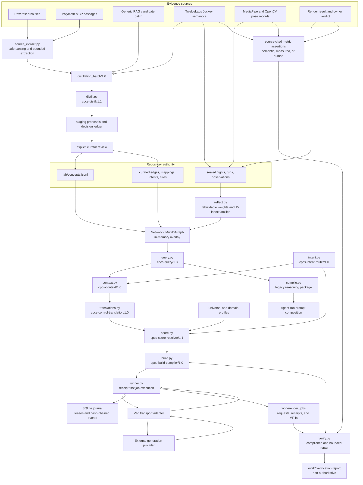
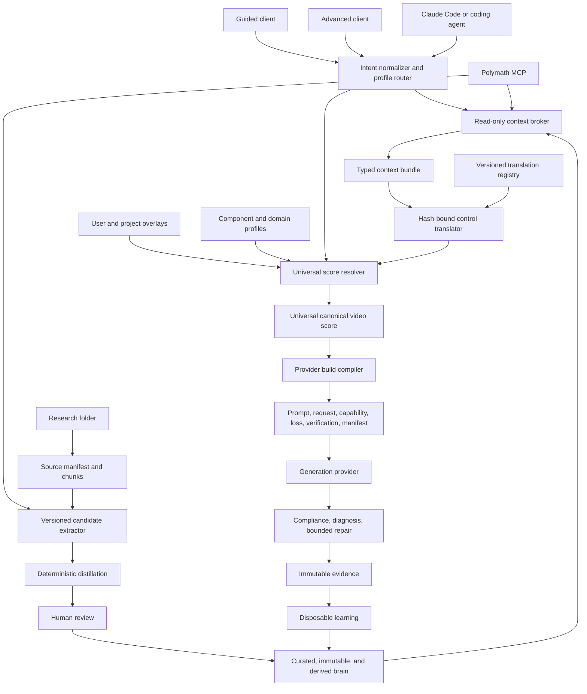

# Codebase Intent Gap Analysis: CPCS Production Architecture

**Verdict:** FAIL
**Repository:** `/Users/king/Documents/New project`
**Plan:** owner contract for one universal end-user video-intent system with a canonical score, composable domain profiles, provider compilation, and verification
**Revision:** Slice 13 application-facade audit on `codex/application-facade-slice-13`, based on integrated Slice 12 baseline `966cb919456c0b4b9b6ec0013da510cfd872f0c0`
**Audited at:** 2026-08-03

The repository gate is green, but the stated product loop is not yet an end-to-end production
system. Query safety, intent normalization, profile routing, the read-only context broker, and one
universal score resolver, hash-bound research-to-control translator, and non-submitting provider
build compiler now provide a governed ordinary-language-to-provider-request path. The end-user
path now reaches a journaled, transport-only Veo execution boundary and a deterministic local
render-verification boundary and a controlled immutable-evidence and derived-calibration loop, but
still lacks live-provider qualification. The
owned source extractor now turns authorized local folders and typed Polymath passages into hashed,
bounded, reviewable candidate bundles without promoting knowledge. Curated records now support
validated validity intervals and supersession, current and historical reads share one temporal
policy, and reflection rebuilds a schema-checked 15-family retrieval catalog. A source-bounded
TwelveLabs cascade now separates Analyze, Segment, Batch, Search, Jockey, and Marengo; normalizes
semantic and local-measurement evidence into a contradiction-preserving Video Observation Graph;
and reverse-compiles through the same universal score kernel before immutable handoff. This path is
contract- and fake-client-qualified, but no live provider asset was supplied, so production response
compatibility remains blocked. The render runner validates exact build bytes, leases one SQLite
writer, captures a provider request and operation receipt, resumes polling without duplicate
submission, quarantines ambiguous submissions, retrieves hash-bound artifacts, and redacts
credentials. Its Veo adapter has not run against live credentials, and the provider exposes no
documented request idempotency key or remote-cancel method. The verifier locally checks media
identity and metadata, keeps semantic, measured, and human-review lanes distinct, preserves
disagreements, executes one closed product-visibility comparator, and can only reassert an existing
canonical control. Verified renders can now enter a content-addressed run that binds the sealed
experiment, canonical build, score, request, provider, profiles, concepts, blocks, assets, seed,
artifact, compliance report, metrics, and human review. Reflection permits a causal `promotes`
signal only when two evidence-complete arms isolate one predeclared control and its target is an
explicitly sealed outcome concept; bundled observations remain noncausal and provider/model filters
survive into query-time ranking. One shared application service now exposes deterministic request
and response envelopes through a repository-local `cpcs` command, MCP stdio, loopback HTTP, and
headless guided or advanced clients. Chat, operator, and curator catalogs are distinct, and
curated or immutable writes require authorization bound to the exact request. The highest-impact
admitted gap is now release hardening: packaging, authenticated deployment, CI, observability,
backup and restore, networked Polymath retrieval, and live-qualified render and analysis providers
remain absent.

This file is the architecture source of truth. Root and subsystem `AGENTS.md` files govern how an
agent edits the repository. Runbooks govern procedures. Frozen `research/` packages supply upstream
evidence. `lab/second_brain/IMPLEMENTATION_PLAN.md` remains a dated audit of the control-plane slice.

## Intent Contract

### Product intent

> **CPCS is a universal AI video-intent generator and creative-direction compiler that turns a
> user's goal into an evidence-informed, provider-ready video production plan.**

The end user should not need to understand graphs, FACS, Laban, Pegasus, schemas, retrieval policy,
serialization formats, or provider adapters. The visible product accepts ordinary language,
references, duration, platform, constraints, and preferences. The internal system normalizes that
input, selects or blends domain profiles, retrieves relevant knowledge, reasons through conflicts
and prerequisites, builds one canonical score, negotiates provider capabilities, emits a production
package, and verifies the render.

UGC, advertising, cinema, dialogue, action, anime, VFX, music video, education, social content, and
custom projects are specialized interpretations of one video-intent language. They are not separate
products, ontologies, canonical schemas, or compilers.

CPCS is Claude Code-first, but not Claude Code-dependent. The core remains headless and owns the
knowledge, reasoning, compilation, and evidence contracts. Claude Code is the primary repository
operator. Chat models, Codex, other coding agents, local models, and applications are clients of the
same CLI or MCP boundary rather than alternate knowledge authorities.

The intended user path has seven outcomes:

1. Normalize an ordinary-language request into domain, task, audience effect, workflow, hard
   constraints, soft preferences, and missing inputs.
2. Apply user and project context without turning preferences into curated knowledge.
3. Select or blend domain profiles that configure one universal score contract.
4. Retrieve relevant concepts, prior evidence, provider observations, and external passages through
   the governed knowledge path.
5. Resolve prerequisites, conflicts, locks, alternatives, unsupported controls, and allowed creative
   variation into one canonical score.
6. Compile provider requests, prompts, reference instructions, capability and loss reports, and a
   verification plan from that score.
7. Record renders and verdicts, verify outputs, and rebuild evidence-backed recommendations without
   letting learned data rewrite curated truth.

The knowledge-growth path remains separate. It accepts authorized research, RAG passages, media
semantics, measurements, and experiment records; extracts atomic proposals; performs deterministic
deduplication and placement; and requires explicit curation before promotion.

### Primary users and decisions

| User or actor | Decision | Required output |
|---|---|---|
| Guided end user | Describe a video, provide references, choose duration or platform, and review detected intent | canonical score summary and provider-ready build |
| Advanced end user | Edit beats, performance, motion, camera, timing, contacts, profile blend, and verification thresholds | the same canonical score with explicit overrides and conflicts |
| Repository owner | Accept, merge, refine, or reject new knowledge and product contracts | review record and durable IDs |
| Claude Code or repository operator | Implement, validate, curate, compile, test, and maintain CPCS | verified changes through stable CPCS contracts |
| Research and distillation agent | Fill a named knowledge or graph gap | hashed candidate batch |
| Experiment and media operator | Extract or compare controlled media evidence | typed observations, sealed runs, metrics, and verdicts |

### Acceptance criteria

The product path is accepted only when an ordinary-language request can travel through the same
public runtime used by guided and advanced clients: normalized intent, profile resolution, governed
knowledge context, canonical score, provider build, render record, verification, and later learning.
Representative UGC, cinematic dialogue, action or anime, product demonstration, and blended-profile
fixtures must share one score schema and differ only through typed data and rules. Every stage must
support replay, bounded failure, durable lineage, and a verifier through the same public path.

The knowledge-growth acceptance path remains: authorized folder or passage input, bounded candidate
extraction, deterministic distillation, explicit promotion, later retrieval, and source trace. The
same headless core must return read-only client context without changing curated, immutable, derived,
or staging stores. Claude-specific code cannot own business rules or be required at runtime.

### Constraints and non-goals

| Constraint | Architectural consequence |
|---|---|
| `research/` is frozen | new findings enter staging and curated lab stores, never upstream files |
| Human authority owns truth | retrieval and extraction may propose; only curation may promote |
| IDs survive refactors | fingerprints aid deduplication but never replace durable curated IDs |
| Semantic evidence is not measurement | Pegasus output cannot claim exact joints, force, contact, or FACS intensity |
| Learned data is disposable | derived files must rebuild byte-identically from curated and immutable inputs |
| The repository is file-backed | current persistence is JSONL, JSON, YAML, CSV, Git, and ignored `work/` artifacts |
| Clients do not own knowledge | Claude Code, chat models, and MCP hosts call CPCS contracts but cannot redefine authority |
| Read and write surfaces differ | ordinary chat receives read tools; curation and immutable writes require an explicit operator boundary |
| LLM extraction is bounded | models receive selected passage packets, never an entire large source file as one prompt |
| One universal score owns video meaning | profiles and providers configure or project that score; none may fork it |
| User and project context is an overlay | preferences affect selection and compilation but do not become curated research truth |
| Automatic routing is the default | clients show detected profiles and allow correction; they do not require domain expertise |
| Guided and advanced modes share data | advanced editing exposes more fields but never changes the underlying score contract |

The system is not currently a hosted service, a vector database, a production graph database, a
general chat-memory product, or an autonomous truth authority. TwelveLabs analyzes media; it is not
the video-generation backend. Claude Code is not the second brain, and query-time Polymath results
are not repository knowledge.

### System boundary



### Universal kernel and domain profiles

The universal score owns the stable video language:

```text
project, intent, entities, shots, beats, actions, performance, motion, interaction,
camera, editing, audio, marketing function, style, continuity, constraints, assets,
provenance, provider disposition, verification
```

Domain profiles extend that contract with required layers, defaults, composition rules, conflicts,
preferred workflows, serialization preferences, and verification metrics. A domain profile may
blend existing component profiles such as movement, capture, camera, performance, screen action,
and style. It cannot add a parallel canonical schema or knowledge authority.

The intended profile contract has this logical shape:

```json
{
  "profile_id": "profile://ugc/product_demo/1.0",
  "extends": ["profile://universal/video/1.0"],
  "required_layers": [
    "marketing",
    "performance",
    "product_interaction",
    "camera"
  ],
  "defaults": {},
  "composition_rules": [],
  "conflicts": [],
  "preferred_workflows": [],
  "verification_metrics": []
}
```

Merge precedence is deterministic:

```text
universal defaults
-> domain profiles
-> user defaults
-> project profile
-> scene overrides
-> shot overrides
-> event locks
```

Later defaults may override earlier defaults. Hard constraints and event locks never silently drop.
A named dominance rule resolves each conflict; unresolved conflicts become explicit user decisions.
Automatic routing is the default, but the detected profile set remains visible and editable.

### User build contract

Guided and advanced clients operate on the same canonical score. Guided clients show the original
request, detected intent and profiles, missing inputs, major constraints, and a render action.
Advanced clients expose score fields and provider projections without creating a second authoring
format.

A successful build is intended to produce:

```text
build/
├── canonical_score.json
├── provider_request.json
├── prompt.txt
├── reference_still_prompt.txt
├── capability_report.json
├── loss_report.json
├── verification_plan.json
└── build_manifest.json
```

`canonical_score.json` preserves provider-neutral meaning. `provider_request.json` and `prompt.txt`
are projections. `capability_report.json` names supported controls. `loss_report.json` records what
the selected provider cannot represent. `verification_plan.json` defines observable checks.
`build_manifest.json` binds every artifact to intent, profiles, concepts, evidence, compiler policy,
provider, model, assets, and hashes.

### Product surfaces

The intended product hierarchy has seven surfaces over one kernel:

| Surface | Responsibility |
|---|---|
| Intent Studio | ordinary-language planning, detected intent, missing inputs, and score editing |
| Reference Intelligence | Pegasus and measurement analysis, segmentation, and recreation inputs |
| Creative Compiler | canonical score, merge policy, capability negotiation, and provider builds |
| Domain Profiles | UGC, advertising, cinema, dialogue, action, anime, VFX, music, education, and custom configuration |
| Knowledge Brain | research, concepts, graph reasoning, provenance, and evidence |
| Render Lab | controlled alternatives, provider comparisons, and experiment records |
| Verification and Learning | output checks, verdicts, immutable evidence, and rebuildable recommendations |

### Agent, Polymath, and chat operating surfaces

CPCS is a headless directing and knowledge-control system. It has three interfaces with different
authority: Polymath supplies evidence, chat consumes temporary context, and Claude Code operates the
repository. They share one CPCS core and cannot promote themselves into competing knowledge stores.

Polymath supports two paths. The query-time path is read-only and ephemeral:

```text
user question
-> CPCS intent and domain classification
-> curated second-brain retrieval
-> Polymath retrieval when coverage is incomplete
-> typed graph expansion with path-level relevance checks
-> conflict, prerequisite, and duplicate resolution
-> evidence reranking and token-budget packing
-> context bundle for the requesting client
```

The governed distillation path proposes a knowledge write:

```text
named knowledge gap
-> Polymath passages with source IDs, locators, hashes, and retrieval metadata
-> bounded LLM candidate extraction
-> distillation_batch/1.0
-> deterministic duplicate, placement, reference, and dependency checks
-> staged proposals
-> explicit human review
-> curated promotion
```

### Bounded LLM distillation contract

Large documents never enter an LLM request as one payload. CPCS owns the source boundary and uses
the model as a bounded interpretation worker:

1. Deterministic discovery and format parsing produce a heading tree, stable locators, chunk IDs,
   byte hashes, media types, and normalized text.
2. Whole-document orientation sends only title, metadata, table of contents, heading tree, a short
   summary, and current CPCS coverage. The model returns section references, not knowledge records.
3. Section-level retrieval selects a configurable packet, initially 4 to 12 passages within a hard
   token and byte budget, for one named research goal.
4. Structured LLM extraction proposes atomic records and cites only passage IDs present in the
   request.
5. Schema validation, deterministic admission, review, and curation decide whether a proposal can
   enter repository authority.

The extractor request carries existing concept references and closed output instructions. A packet
has this logical shape before the adapter builds `distillation_batch/1.0`:

```json
{
  "research_goal": "How does Laban Flow affect restrained acting direction?",
  "existing_concepts": [
    "c_laban_flow",
    "c_restrained_performance"
  ],
  "source_passages": [
    {
      "source_id": "source_001",
      "locator": "section_12.3",
      "content_hash": "sha256:...",
      "text": "..."
    }
  ],
  "allowed_outputs": [
    "concept",
    "edge",
    "intent",
    "mapping",
    "rule"
  ]
}
```

The response is an extraction proposal, not a curated record:

```json
{
  "proposals": [
    {
      "proposal_type": "mapping",
      "concept_ref": "c_laban_flow",
      "control_target": "performance.motion_restraint",
      "claim": "Bound Flow can support restrained or contained movement direction.",
      "evidence_refs": ["source_001#section_12.3"],
      "extractor_confidence": 0.78,
      "limitations": [
        "This is a directorial application, not a universal psychological inference."
      ]
    }
  ]
}
```

`extractor_confidence` is a diagnostic ranking hint. It cannot become curated evidence confidence.
The adapter resolves every evidence reference against the request packet, maps accepted fields into
the current candidate schema, and rejects unknown fields or types. A proposed contradiction becomes
a typed `conflicts_with` or `invalid_for` edge; `contradiction` is not a batch proposal type.

Responsibility remains split at a checkable boundary:

| Owner | May do | Must not do |
|---|---|---|
| Source adapter | discover files, parse formats, build headings and chunks, assign locators, hash bytes, retrieve passages | interpret a claim as true or write curated data |
| LLM extractor | propose concepts, definitions, relationships, mappings, rules, contradictions, limitations, merges, refinements, and compiler implications | assign durable IDs, establish truth, authorize numbers, or promote records |
| Deterministic control plane | validate schemas and allowed types, resolve existing IDs, detect duplicates, enforce references and placement, record provenance | invent unsupported meaning or waive review requirements |
| Human curator | verify sources, judge proposed identity and usefulness, assign durable IDs, and authorize promotion | erase immutable history or bypass repository validation |

Version one uses LLM-first extraction, deterministic parsing and chunking, strict structured output,
the existing deterministic control plane, and human promotion. It does not add an encoder-based
relation extractor. Reconsider an encoder only after measurement shows excessive extraction cost,
insufficient throughput, repeated span or offset errors, dominant simple relation types, or a privacy
requirement for a fully local first pass.

Similarity does not establish truth. A retrieved passage can help a chat model answer one request,
but it remains untrusted external evidence until the candidate, distillation, and review path accepts
it. Derived associations remain rebuildable ranking signals. Session context remains temporary.

The context broker must return a typed package rather than inject arbitrary retrieved chunks:

```json
{
  "schema": "cpcs.context_bundle/1.0",
  "request": {
    "query": "Create restrained fear that becomes physical urgency",
    "intent": "directorial_composition",
    "token_budget": 12000
  },
  "curated_knowledge": [
    {
      "concept_id": "c_example",
      "status": "proven",
      "reason_selected": "Matches restrained affect and escalating movement",
      "evidence_ids": ["e_example"],
      "path": ["intent", "requires", "concept"]
    }
  ],
  "retrieved_evidence": [
    {
      "origin": "polymath_mcp",
      "source_id": "source_123",
      "locator": "chapter_4.section_2",
      "content_hash": "sha256:...",
      "evidence_class": "source_passage",
      "passage": "..."
    }
  ],
  "derived_associations": [],
  "conflicts": [],
  "coverage": {
    "covered_terms": [],
    "uncovered_terms": [],
    "additional_retrieval_recommended": false
  },
  "compiler_candidates": [],
  "trust_boundary": {
    "curated_knowledge": "repository_authority",
    "retrieved_evidence": "untrusted_external_evidence",
    "derived_associations": "rebuildable_ranking_signal",
    "session_context": "ephemeral"
  }
}
```

Claude Code reads repository governance, identifies knowledge and implementation gaps, runs context
and traversal canaries, prepares candidate batches, inspects distillation decisions, performs
authorized promotion, changes adapters and compilers, and runs the repository gate. Those actions
must call stable CPCS contracts. Claude-specific business logic is forbidden.

The target MCP surface separates ordinary read access from controlled writes:

| Tool | Authority | Default client access |
|---|---|---|
| `cpcs.status` | read system and provider state | chat and operators |
| `cpcs.intent.normalize` | normalize user input and detect editable profiles | chat and operators |
| `cpcs.context.get` | build a token-budgeted, read-only context bundle | chat and operators |
| `cpcs.reason` | retrieve concepts and typed paths | chat and operators |
| `cpcs.score.build` | resolve one provider-neutral canonical video score | chat and operators |
| `cpcs.build.compile` | project a validated score into provider build artifacts | chat and operators |
| `cpcs.distill.prepare` | retrieve evidence and construct a candidate batch | operators only |
| `cpcs.distill.run` | execute deterministic admission policy | operators only |
| `cpcs.curate.review` | display review requirements and decisions | operators only |
| `cpcs.curate.promote` | write only after explicit human authorization | controlled write |
| `cpcs.record.render` | append immutable render evidence | controlled write |
| `cpcs.reflect.rebuild` | rebuild derived learning state | operators only |

CLI and MCP adapters must call the same application functions and return the same versioned
contracts. Chat deployments normally expose only the read-only product and reasoning tools above
the distillation boundary.

## Actual Runtime

### Current state snapshot

The repository contains 132 concept cards, 236 curated authored edges, 45 mappings, one intent, one
rule, five sealed flights, five immutable runs, four distillation runs, and 111 historical proposal
rows. Provenance shows all 111 proposals as promoted, although their append-only staging rows remain
`pending`. The live second-brain graph contains 142 nodes and 241 edges. Derived reflection contains
zero learned edges, zero Pegasus observations, and zero measurement observations.

The profile library contains eight component profiles, eight domain configurations, one universal
profile, and one router-only policy. `src/intent.py` returns normalized intent, profile labels,
conflicts, missing inputs, and a safe context handoff. `lab/compiler/score.py` consumes that pair,
adapts current component profiles, applies typed field operators and transient overlays, retains
per-field provenance and hard locks, and returns `cpcs.universal_score/1.0`. Three active,
hash-bound translations now convert gated FACS, Laban curvature, and dramatic-camera mappings into
declared canonical fields with loss, limitation, disposition, and verification trace. Other
retrieved mappings remain explicit `no_translation` dispositions. `lab/compiler/build.py` validates
a ready score and emits the declared eight-artifact Veo 3.1 build directory without network
submission or authority-store writes.

`lab/runtime/runner.py` revalidates that build and owns the local operational path through a
single-writer SQLite journal and the transport-only Veo adapter. It has a module CLI for create,
run, resume, reconcile, cancel, show, and events. Offline tests prove receipt-first recovery and
artifact normalization, but no live provider request has been authorized.

`lab/verification/verify.py` revalidates the build, runtime result, exact MP4 bytes, local `ffprobe`
metadata, and a self-contained evidence bundle. It emits `cpcs.compliance_report/1.0` with artifact
and score-control checks, source hashes, evidence lanes, conflicts, deviations, locations, and a
bounded repair plan. Product-visibility duty cycle is the first closed deterministic measurement
comparator. Other declared methods require source-cited assertions from Pegasus semantics, local
measurements, or human review and remain unobservable when their required lane is absent.

Of the 236 curated edges, 199 remain legacy `pairs_with` associations. Four source-backed high-use
associations now use operational or dependency semantics without changing their durable edge IDs:
the graph contains 21 `refines`, six `applies_to`, four `conflicts_with`, three `alternative_to`,
two `requires`, and one `produces` edge. There are no curated `is_a`, `part_of`, `valid_for`, or
`invalid_for` edges. The validator caps `pairs_with` at 199 and at a `0.844` share once the graph has
at least 236 edges, preventing the migrated distribution from silently regressing.

The temporal policy is `cpcs-temporal/1.0`. Curated concepts, edges, mappings, intents, and rules
may declare inclusive `valid_from`, exclusive `valid_until`, reciprocal replacement links, and an
active, superseded, or deprecated status. Current reads choose open-ended active heads without
using the wall clock; historical reads require an offset-aware `as_of`; `all_versions` is an audit
view. The current dataset has no explicit replacement chain yet, so the live supersession index is
empty; isolated fixtures prove replacement selection and lineage rather than manufacturing a data
migration without evidence.

Reflection now emits five derived files, including `derived/indexes/catalog.json`. The catalog
contains lexical, alias, deterministic hashed-TF-IDF semantic, typed-adjacency, prerequisite,
conflict, temporal, supersession, concept-source, concept-evidence, intent-concept,
control-provider, provider-performance, experiment, and video-observation families. Retrieval
diagnostics expose lexical, alias, vector, and fused candidate lists; vector similarity is ranking
evidence only and cannot override a hard conflict or create a root that failed query eligibility.

The domain modules retain their Python CLIs, while `lab/application/service.py` is now the stable
shared client surface. The
`cpcs.context_bundle/1.0` broker now packages the `cpcs-query/1.3` safe query result, temporal
replacement lineage, validity-matched mappings, curated lineage, and typed external evidence under
deterministic full-envelope token accounting. There is
also a `cpcs.normalized_intent/1.0` module CLI, an in-process intent-to-context function, and a
`cpcs.universal_score/1.0` resolver CLI, a `cpcs.build_request/1.0` provider-build CLI, and a
`cpcs.render_job/1.0` journaled runtime CLI, and a `cpcs.compliance_report/1.0` verifier CLI.
`cpcs.application_request/1.0` and `cpcs.application_response/1.0` now wrap status, intent, context,
reason, score, inline provider build, distillation, review, curation, render evidence, and reflection
operations. `bin/cpcs`, MCP `tools/call`, loopback HTTP `/v1/invoke`, and guided or advanced Python
clients all call the identical dispatcher. This repository-local facade is not an installed
package or authenticated remote service. Networked query-time Polymath, live-qualified generation,
and a retrieval reranker remain absent. `AGENT_PROMPT.md` remains operator guidance rather than a
separate runtime authority.

### Runtime topology



Solid arrows exist in code or governed data. Local-folder and typed-passage extraction now exist;
networked Polymath retrieval and live provider qualification remain missing. The journaled adapter
path is offline-contract-qualified only. The legacy reasoning-package composition path remains
agent-operated.

### Pipeline A: research to curated knowledge

#### A1. Source discovery and retrieval

`lab/second_brain/src/source_extract.py` owns the raw-source bridge. Its `folder` command inventories
authorized Markdown, text, JSON, JSONL, YAML, and XML, hashes bytes before parsing, rejects links and
unsafe syntax, creates content-addressed locators and bounded passage packets, audits every section,
and emits `cpcs.source_extraction_bundle/1.0` under ignored `work/`. Its `passages` command accepts a
typed Polymath envelope with source IDs, locators, content hashes, retrieval metadata, and rights.
An optional extractor-neutral semantic response can cite only chunks in its packet; the adapter
replaces those references with source-owned hash and locator records before candidate admission.

`lab/second_brain/src/ingest.py` inventories the Polymath corpus and accepts a JSON object that
satisfies `distillation_batch.schema.json`. Registered external origins are `local_source`,
`polymath_mcp`, `pegasus`, and `rag_pipeline`. Those origins cannot call the manual proposal route.

The batch pins four classes of lineage:

| Contract area | Required data |
|---|---|
| Retrieval | adapter, corpus ID, query, tool, parameters, retrieval timestamp |
| Extractor | agent, model, prompt hash |
| Candidate | candidate ID, proposal type, suggested ID, proposed record, creator, timestamp |
| Evidence | source ID, locator, claim, SHA-256 content hash |

The extractor deliberately does not call a provider-specific model. It produces bounded semantic
packets and validates typed responses carrying extractor, model, and prompt identity. Structural
proposals without both connected placement and operational use are expected to be rejected by the
distiller rather than silently entering staging.

#### A2. Deterministic distillation

`lab/second_brain/src/distill.py:728` validates and normalizes the batch. Candidate and evidence
order are sorted before hashing. The run ID is derived from the normalized input hash, policy hash,
and curated-snapshot hash. Replaying the same batch against the same snapshot returns the same run.

Policy `cpcs-distill/1.1` applies these decisions in order:

1. Preserve an existing proposal or curated identity when provenance matches.
2. Reject unhashed evidence and exact record duplicates.
3. Compare concepts by normalized token overlap. A score at least `0.92` is treated as exact; a
   score at least `0.55` requires merge review.
4. Reject references that resolve to neither curated concepts nor same-batch proposed concepts.
5. For each new concept, require a typed structural path to a curated concept plus at least one
   operational edge or executable mapping.

The structural proof accepts `is_a`, `part_of`, or `refines`. The operational bridge accepts
`requires`, `applies_to`, `produces`, or a mapping. `pairs_with` cannot satisfy placement. If a
concept or structural member fails admission, dependent records are rejected in the same run.

This distiller is a deterministic admission policy, not an LLM research reader. It evaluates
structured candidates supplied by another actor. Its similarity function is token-based Jaccard
over name, definition, use case, triggers, and layer. NetworkX supplies graph and shortest-path
operations.

#### A3. Staging and review

Admitted candidates become pending proposals in `staging/proposals.jsonl`; every decision, including
rejections and possible duplicates, remains in `staging/distillation_runs.jsonl`. The current
`staging/rejected.jsonl` file is not used by `distill.py`; rejection lineage lives inside the run.

`lab/second_brain/src/curate.py` requires explicit true values for source verification, source
locator resolution, duplicate review, operational usefulness, relationship validation, and numeric
precision support. The curator assigns durable IDs. External proposals also need an admissible
distillation-run reference.

Bundle promotion writes concepts and intents before dependent edges, mappings, and rules. It takes
byte snapshots of every target file and restores them if a later member fails in the same process.
This curated-write path has no journal or lock for power loss, process termination, or concurrent
writers; the render journal does not broaden its authority into curation.

#### A4. Curated ownership

| Record | Authority | Meaning |
|---|---|---|
| Concept | `lab/concepts.jsonl` | atomic vocabulary, triggers, status, evidence, source |
| Edge | `lab/second_brain/curated/edges.jsonl` | authored semantic relationship |
| Mapping | `lab/second_brain/curated/mappings.jsonl` | concept to provider-independent control |
| Rule | `lab/second_brain/curated/rules.jsonl` | data bound to one named Python evaluator |
| Intent | `lab/second_brain/curated/intents.jsonl` | normalized recurring goal |

JSON Schema Draft 2020-12 validates all five stores. Curated IDs must be unique across stores, edge
endpoints must exist, mappings must resolve, and rule evaluator names must exist in Python.

### Pipeline B: goal to traversal and compiled output

#### B1. Live graph assembly

`lab/second_brain/src/graph.py:build_live_graph` creates a NetworkX `MultiDiGraph` in memory. It
validates one `current`, `historical`, or `all_versions` temporal view, overlays only visible curated
concepts and authored edges with immutable flights, evidence nodes, and optional derived learned
edges, and records the temporal policy in graph metadata. It does not persist the live graph.

This live reasoning graph is different from `lab/graph.json`. The latter is a repository-wide
derived index containing research packages, blocks, variants, experiments, runbooks, evidence, and
second-brain records. `lab/scripts/build_graph.py` builds that index and
`lab/scripts/sync_repo.py` checks it for drift. `query.py` does not query `lab/graph.json`.

#### B2. Root retrieval

`lab/second_brain/src/query.py:reason` tokenizes the goal, filters the selected temporal view, and
scores each visible concept from its natural-language triggers, name, definition, use case, and
layer. Multi-term queries normally need two overlapping terms, a complete name match, or a one-word
trigger match. At most five roots are admitted.

Root eligibility still owns admission: concept status, excluded layers, declared encodings, and
lexical eligibility are hard gates. `indexes.py` supplies inspectable lexical, alias, deterministic
hashed-TF-IDF vector, and fused diagnostics, but those scores may only reorder concepts that already
passed root eligibility. There is no learned encoder, BM25 dependency, external vector database,
opaque reranker, or LLM call in this path. The Marengo embedding wrapper remains separate from
curated concept retrieval.

#### B3. Hop semantics

The authored edge policy is versioned as `cpcs-edge-policy/1.0`:

| Edge family | Types | Traversal behavior |
|---|---|---|
| Structural | `is_a`, `part_of`, `refines` | bidirectional with named generalize, specialize, part, and whole transitions |
| Operational | `applies_to`, `produces` | bidirectional connection between knowledge and use |
| Dependency | `requires` | bidirectional relation, plus admissibility check for prerequisites |
| Contextual | `alternative_to` | traversable choice |
| Constraint | `conflicts_with`, `valid_for`, `invalid_for` | selection filter, never an expansion hop |
| Legacy | `pairs_with` | low-priority hop, at most one per path and three globally |

Derived learned edges rank below authored hops. Every accepted path row records direction,
transition, family, tier, depth, edge ID, and policy version.

#### B4. Selection safety and prerequisite closure

After root retrieval, policy `cpcs-query/1.3` requires every selected non-root concept to declare
one admission reason: `structural_term_support`, `operational_bridge`, or
`required_prerequisite`. Roots declare `direct_match`. A neighbor with no term support,
operational bridge, or dependency role is rejected with `connectivity_only`; graph reachability
alone cannot import it.

Relevant candidates resolve their complete `requires` closure before selection. A stable
concept-ID topological order places prerequisites before dependents. Missing prerequisites reject
the dependent with `missing_prerequisite`; cycles reject every cycle member with
`dependency_cycle`. Prerequisites inherit relevance only from their dependent and are not expanded
as traversal roots unless another path independently establishes relevance.

The Slice 1 canary is:

```bash
python3 -m lab.second_brain.src.query reason \
  "Laban effort decimal spatial movement" \
  --minimum-status ingested --include-unproven --maximum-depth 5
```

It selects seven Laban or motion concepts, excludes `c_dual_view_color_integration`, and compiles no
VFX color control. `decimal` and `spatial` remain uncovered, so centralized gap policy
`cpcs-gap-policy/1.1` returns `status: partial`, `should_retrieve: true`, and reason
`material_query_terms_uncovered`. Isolated fixtures prove transitive prerequisite ordering,
missing-prerequisite rejection, cycle termination, and byte-equivalent replay of selected order,
paths, rejections, and gap output.

#### B5. Read-only context broker

`lab/second_brain/src/context.py:build_context_bundle` calls `reason()` and never traverses the graph
itself. It enriches only the admitted concept IDs with provider/model mappings visible in the same
temporal view, replacement traces, and aggregated source and evidence references. Typed external
passages must name the declared knowledge-gap query,
carry a SHA-256 that matches their UTF-8 text, and remain labelled
`untrusted_external_evidence`. Duplicate passage hashes are retained once with an omission reason.

Policy `cpcs-context/1.0` sorts direct matches before prerequisites, operational bridges, and
structural support. It reserves an omission row for every packable item, then admits items while the
canonical UTF-8 bundle estimate remains within the requested budget. The estimate includes the
request, trust boundary, policies, knowledge gap, selected content, and omission report. Replay with
the same repositories, request, evidence, and budget is byte-identical. The CLI writes only stdout;
tests compare curated, immutable, derived, and staging bytes before and after both function and CLI
calls.

#### B6. Compilation

`lab/second_brain/src/compile.py:compile_result` accepts only `cpcs-query/1.3` results whose selected
rows carry an allowed admission reason. It rejects unsafe policy versions, connectivity-only rows,
and any concept present in both selected and rejected sets. It then resolves mappings for the
already-gated selection, filters provider and model-specific mappings, runs three named
deterministic evaluators, and renders one of four Jinja templates. `hybrid` currently aliases to
JSON.

The output is an intermediate reasoning package containing goal, selected concepts, mappings,
control IDs, rule results, paths, evidence, sources, rejections, alternatives, and the knowledge-gap
decision. It does not merge profiles, resolve overlays, negotiate provider capabilities, or submit a
render. The universal score and provider build paths now own those later deterministic boundaries.

#### B7. Canonical score to provider build

`lab/compiler/build.py` accepts `cpcs.build_request/1.0`, verifies the embedded score schema and
content-derived score ID, rejects unresolved scores, checks score-bound reference assets, and loads
the source-linked `veo-3.1-generate-001` capability profile. It projects canonical control paths and
values into a measured prompt carrier, preserves hard locks or fails the build, assigns exactly one
capability disposition per control, and records unsupported or evaluation-only controls instead of
silently dropping them.

The public `compile` command writes exactly eight files into an empty output directory. Seven
artifact hashes, the canonical score hash, profile and current concept content hashes, an explicit
empty block-hash set, capability hash, seed,
creative mode, repository commit, and compiler version feed a deterministic build ID and build hash.
The resulting `provider_request.json` validates against the declared Vertex AI Veo 3.1 REST shape.
The module performs no authentication, request submission, polling, artifact retrieval, or authority
write.

#### B8. Journaled provider execution

`lab/runtime/runner.py` revalidates the complete eight-file build before registering a
`cpcs.render_job/1.0`. `journal.py` uses SQLite `BEGIN IMMEDIATE`, a unique idempotency key, one
expiring worker lease, and per-job hash-chained events. Requests, operation receipts, numbered poll
responses, final provider envelopes, downloaded MP4 files, and the normalized
`cpcs.render_result/1.0` stay under ignored `work/render_jobs/`; none are knowledge or experimental
authority.

Every adapter implements the same `validate`, `prepare`, `submit`, `poll`, `retrieve`, `normalize`,
and `cancel` lifecycle. The initial `google_vertex_ai.veo/1.0` adapter submits the compiler-owned
REST payload to `predictLongRunning`, polls only the matching operation through
`fetchPredictOperation`, retrieves GCS or inline MP4 bytes, and hashes each artifact. Application
Default Credentials are loaded only inside the transport call. Secret-shaped job fields are
rejected. The prepared request preserves compiler-owned content; provider responses and journal
payloads are recursively redacted.

The runner provides the strongest guarantee the provider contract permits. A receipt is fsynced
before the journal advances to `submitted`; kill and resume recover that receipt and do not submit
again. If the provider might have accepted a request but no receipt reached disk, the state becomes
`submission_unknown` and automatic resubmission is forbidden until an operator reconciles a known
operation. This is deliberately not described as universal exactly-once delivery: Veo documents no
server-side idempotency key or lookup by client request ID. Veo also documents polling but no remote
cancel method, so cancellation reports `unsupported` and warns that local polling cessation may not
stop work or charges. Live authentication, submit, poll, and retrieval remain unqualified.

#### B9. Render compliance, diagnosis, and bounded repair

`lab/verification/verify.py` accepts only a complete validated build, a matching
`cpcs.render_result/1.0`, the exact selected MP4, and
`cpcs.verification_evidence_bundle/1.0`. It resolves the artifact below the render-result directory,
rejects links and hash or size drift, and uses the existing local `ffprobe` boundary to check the
compiler's artifact identity, duration, aspect-ratio, resolution, and frame-rate requirements.

Evidence sources are embedded and content-hashed. Normalized Pegasus or local-measurement records
must validate against the second-brain schema and cite the exact artifact hash; human reviews use a
separate typed record. The required observability lane decides each metric. Another lane remains
supplemental, a missing lane produces `unobservable` or `review_required`, and opposing semantic and
measured verdicts produce `preserved_for_review` instead of confidence averaging.

The first closed deterministic metric is `product_visibility_duty_cycle`. It verifies the measured
visible time, interval duration, and duty-cycle arithmetic, then compares nonzero visibility with
the existing boolean canonical control. A caller cannot replace that comparator with a supplied
verdict. Other metric methods currently consume source-cited assertions; the verifier does not
pretend to calculate gaze, action order, or human performance quality without the required tool or
review.

`cpcs.compliance_report/1.0` identifies every failed metric, canonical control, evidence source,
interval, and deviation. The repair planner can only emit `reassert_existing_control` for the
already-authored canonical value and lists every unrelated control as preserved. Artifact failures,
conflicts, missing lanes, and review requirements block repair. Reports remain ignored diagnostics
under `work/`; recording them as experimental evidence belongs to Slice 12.

### Pipeline C: media analysis, experiments, and learning

#### C1. TwelveLabs transport and Pegasus semantics

`lab/second_brain/src/providers/twelvelabs/` isolates the provider SDK and pins API `v1.3`, SDK
`1.3.1`, Pegasus 1.5, Jockey, and Marengo 3.0. Assets, synchronous exact or clipped Analyze,
asynchronous Segment, same-mode Batch, item-filtered knowledge-store Search, selected-item Jockey
Responses, and embeddings have distinct modules and strict job contracts. The transport has no
curated, staging, or immutable write authority.

`lab/second_brain/analysis_profiles.yaml` is a closed 14-profile catalog. `pegasus.py` verifies local
source bytes and `ffprobe` timing, saves exact requests before external calls, runs a broad source
map, deterministic segmentation, and clipped deep passes, then normalizes semantic rows through
`video_observation.py`. Optional local measurements remain typed separately. Fusion creates a
source-bounded, content-hashed VOG; support and contradictions remain explicit and confidence is not
averaged. `lab/compiler/reverse.py` projects only declared VOG fields through the existing canonical
score resolver. One hash-chained semantic observation is appended only after VOG and optional score
validation succeed; proposed knowledge still enters the shared distiller.

The offline contract is working: fake-client tests cover upload through exactly-once immutable
handoff, raw-response renormalization without provider access, surface isolation, failure atomicity,
VOG replay, contradiction retention, and canonical score identity. Live production qualification is
blocked because the SDK, API key, and authorized provider asset are absent.

#### C2. Measurement lane

`lab/scripts/extract_pose_tier2.py` uses optional MediaPipe and OpenCV imports to read an analysis
proxy, detect 2D pose landmarks, associate actors by nearest centroid, keyframe tracks, and write
schema-checked observation records. Its stated evidence class is `detected`, not `measured`, because
camera and subject motion remain entangled.

MediaPipe, OpenCV, and the pose model are not installed or declared in the main second-brain
requirements. No measurement observation has entered the immutable control plane. The wider
reference-video workflow still requires separate frozen research scripts for manifest creation,
observation merging, and graph validation, followed by manual reverse compilation and regeneration.

#### C3. Experiment recording

`lab/second_brain/src/record.py` seals a flight by hashing selected concept contents and locking the
intent, arms, provider, model, seed, compiler version, experiment classification, metric set, and
per-arm delta. An isolated design requires at least two arms that vary one shared concept/control
and seals explicit non-delta outcome concepts so background context cannot become a causal claim;
a bundled design cannot claim a tested delta. `record experiment` validates the exact compiler
build, runtime result, selected artifact bytes, compliance-report identity, and human review before
creating a content-derived, retry-idempotent run. The evidence lineage binds request, intent,
context, profile, concept, block, asset, build, score, provider response, artifact, verification,
and review hashes. The generic raw-run append is legacy-only, so a new run cannot bypass exact
evidence admission. Runs and observations form independent append-only hash chains.

The older lab workflow still records five result rows in `lab/runs/results.csv`. Migration created
five immutable flights and five runs, but those legacy records do not link concepts. As a result,
reflection currently reports zero concepts with immutable evidence.

#### C4. Reflection

`lab/second_brain/src/reflect.py` deletes and rebuilds `derived/` from curated and immutable data. It
creates co-occurrence associations for success, failure, and confounded runs. A positive `promotes`
edge requires an evidence-complete, provider- and model-matched, seed-controlled pair that differs
by one predeclared control while intent, context, profiles, concepts, blocks, assets, compiler, and
all other controls match. Its trace retains both build, artifact, compliance, and human-review
identities. Bundled and single-run associations are explicitly noncausal and use a smaller ranking
weight. Provider and measurement observations create zero-weight `confounded_with` edges.

The reflector also writes coverage, compatibility concept-to-evidence and weight files, insights,
and the schema-validated `cpcs.derived_indexes/1.1` catalog. The provider-performance and experiment
families expose controlled, bundled, causal-run, artifact, compliance, and causal-effect lineage.
The catalog is an optimization and
diagnostic projection, not authority: current, historical, or all-version views can be rebuilt in
memory from curated and immutable inputs. Two consecutive rebuilds produce byte-identical files.
This mechanism and its score-to-query canary work. The checked-in dataset still produces zero
learned edges because its five immutable runs are explicit legacy migrations with no concept-linked
render evidence; the test fixture is not promoted into production history.

### Storage and write authority

| Tier | Store | Writer | Mutation model | Read consumers |
|---|---|---|---|---|
| Frozen | `research/` | none in normal operation | SHA-protected upstream package | agents, build scripts |
| Curated | concepts and `curated/` | `curate.py` or reviewed Git edit | append or reviewed edit | graph, query, compiler, recorder |
| Immutable | `immutable/` | `record.py`, governed Pegasus path | append-only hash chain | graph, reflector, validator |
| Derived | `derived/` | `reflect.py` | delete and rebuild | graph, query, coverage review |
| Staging | `staging/` | inventory adapter and distiller | resumable, non-authoritative | curator, validator, status |
| Temporary | `work/` | query, render journal, provider adapters, and compliance reports | ignored; render jobs are resumable but non-authoritative | operator and replay diagnostics |

`validate.py:55` enforces these actor-to-path boundaries before programmatic writes. It is a local
path check, not an operating-system permission boundary. Direct manual file edits remain possible.

### Direct dependencies and module roles

Versions below come from `lab/second_brain/requirements.txt`; installed versions were checked on
2026-08-03.

| Module | Declared or observed version | Where used | Actual responsibility | License and primary source |
|---|---|---|---|---|
| NetworkX | `>=3.2,<4`; installed `3.2.1` | `graph.py`, `query.py`, `distill.py` | in-memory `MultiDiGraph`, neighbors, paths, parallel typed edges | BSD-3-Clause, [networkx/networkx](https://github.com/networkx/networkx) |
| jsonschema | `>=4.18,<5`; installed `4.25.1` | `validate.py`, compiler, optional pose validation | checks 33 second-brain schemas with `Draft202012Validator` | MIT, [python-jsonschema/jsonschema](https://github.com/python-jsonschema/jsonschema) |
| Jinja2 | `>=3.1,<4`; installed `3.1.6` | `compile.py`, four templates | strict rendering of reasoning packages | BSD-3-Clause, [pallets/jinja](https://github.com/pallets/jinja) |
| PyYAML | `>=6,<7`; installed `6.0.3` | migration, registry and experiment validation, frozen compilers | safe parsing of YAML control data | MIT, [yaml/pyyaml](https://github.com/yaml/pyyaml) |
| defusedxml | `>=0.7,<1`; installed `0.7.1` | `source_extract.py` | rejects DTDs, entities, and unsafe XML before bounded tree extraction | Python Software Foundation License, [tiran/defusedxml](https://github.com/tiran/defusedxml) |
| MediaPipe | optional; not installed | `extract_pose_tier2.py` | on-device 2D pose landmarks | Apache-2.0, [google-ai-edge/mediapipe](https://github.com/google-ai-edge/mediapipe) |
| OpenCV Python | optional; not installed | `extract_pose_tier2.py` | video decode, frame access, color conversion | Apache-2.0 for current releases, [opencv/opencv](https://github.com/opencv/opencv) |
| TwelveLabs Python SDK | pinned `1.3.1`; not installed | `providers/twelvelabs/` | assets, Pegasus Analyze/Segment/Batch, store Search, Jockey, and Marengo transport | public source at [twelvelabs-io/twelvelabs-python](https://github.com/twelvelabs-io/twelvelabs-python); no root license file was present during this audit, so this document does not classify it as open source |
| SQLite | Python standard library `sqlite3` | `lab/runtime/journal.py` | single-writer leases, idempotency binding, resumable job state, and hash-chained operational events | Public domain SQLite, [sqlite/sqlite](https://github.com/sqlite/sqlite) |
| google-auth | `>=2.40,<3`; not installed | `lab/runtime/adapters/veo.py` | lazily loads Application Default Credentials and refreshes an OAuth access token only inside transport calls | Apache-2.0, [googleapis/google-auth-library-python](https://github.com/googleapis/google-auth-library-python) |

The second brain is custom CPCS code. It does not use LangChain, LlamaIndex, Mem0, Microsoft
GraphRAG, Neo4j, Qdrant, Chroma, FAISS, or Weaviate. SQLite is used only for ignored operational
render jobs; it is not a curated, immutable, derived, or staging knowledge store.

### Open-source systems considered for future slices

These projects are references, not current dependencies:

| Project | Relevant capability | Fit decision |
|---|---|---|
| [Microsoft GraphRAG](https://github.com/microsoft/graphrag) | LLM extraction of entities and relationships from raw text, local and global graph search | study its extraction and evaluation contracts; do not import its graph as curated truth |
| [LlamaIndex](https://github.com/run-llama/llama_index) | document readers, transformations, cached ingestion pipelines, property-graph adapters | candidate for the missing raw-folder adapter behind CPCS batch schemas |
| [Qdrant](https://github.com/qdrant/qdrant) | persistent dense and sparse retrieval with metadata filters | defer until corpus scale or latency proves file-backed retrieval inadequate |
| [Mem0](https://github.com/mem0ai/mem0) | conversational and agent memory with multi-signal retrieval | poor primary fit for evidence-governed research truth; useful only for user/session preferences outside curated knowledge |

Any adoption must remain behind the existing versioned batch or query boundary. No external module
may become a second curated authority.

### Operational and security model

The current runtime includes domain Python CLIs, one shared application dispatcher, a repository-local
`cpcs` shim, an MCP stdio server, a loopback HTTP adapter, a read-only context broker, a local
single-worker SQLite render runner, and a read-only render verifier. There is no package build
metadata, lockfile, authenticated or TLS-enabled service, container, scheduler, distributed queue,
formal database migration system, CI workflow, telemetry, or deployment definition. Installation
uses `pip` against bounded requirement ranges.

Provider secrets are read from environment variables or Application Default Credentials and doctor
commands return booleans rather than values. The render job contract rejects credential-shaped
fields, and runtime capture redacts secrets. Provider request and response bodies are saved under
ignored `work/`. Source authorization is represented by a job's asset reference and content hash;
the repository does not implement user authentication, access control, encryption, secret rotation,
data retention, or remote artifact deletion.

### Slice completion audit

| Slice | Capability | Status | Evidence or blocking gap |
|---|---|---|---|
| 0 | Governance and validation baseline | WORKING | Repository routing, sync, integrity, and architecture-report gates execute locally. |
| 1 | Safe, goal-relevant knowledge query | WORKING | `cpcs-query/1.3` enforces relevance, dependencies, temporal views, gaps, and write denial. |
| 2 | Read-only context broker | WORKING | `cpcs-context/1.0` packages curated and external evidence without authority mutation. |
| 3 | Intent normalization and profile routing | WORKING | `cpcs.normalized_intent/1.0` passes the required routing canaries. |
| 4 | Universal score and typed profile resolution | WORKING | `cpcs.universal_score/1.0` passes merge, conflict, lock, provenance, and replay canaries. |
| 5 | Typed research-to-control translation | WORKING | Three hash-bound FACS, Laban, and camera translations apply only gated mappings; every other selected mapping receives an explicit disposition. |
| 6 | Provider build compiler | WORKING | `cpcs-build-compiler/1.0` emits the exact eight-file, capability-accounted Veo 3.1 build contract without submission or authority writes. |
| 7 | Raw research ingestion | WORKING | `source_extract.py` emits replay-stable, coverage-audited candidate bundles from six safe local formats or typed Polymath passages. |
| 8 | Temporal and self-indexing knowledge | WORKING | `cpcs-temporal/1.0` and `cpcs-derived-indexes/1.1` pass current, historical, lineage, replay, conflict-precedence, distribution, and latency canaries. |
| 9 | Full Pegasus and TwelveLabs integration | PARTIAL | The seven-surface contracts, 14-profile catalog, source-bounded cascade, VOG fusion, reverse compiler, deterministic replay, and failure-atomic immutable handoff pass offline; the SDK, API key, authorized media, and live production observation are absent. |
| 10 | Job runner and generation providers | PARTIAL | The local single-writer journal, shared adapter lifecycle, receipt-first resume, ambiguity quarantine, retries, timeout, cancellation dispositions, redaction, and hash-bound Veo result path pass offline. Live ADC, submit, poll, and retrieval are absent, and Veo exposes neither documented request idempotency nor remote cancellation. |
| 11 | Verification, diagnosis, and repair | WORKING | Exact media checks, source-cited evidence lanes, one deterministic product-visibility comparator, conflict and unobservable dispositions, control-level diagnosis, and bounded repair pass locally without authority writes. |
| 12 | Learning and calibration | WORKING | `cpcs-controlled-evidence/1.0` binds verified render lineage into idempotent immutable runs; isolated comparisons rebuild causal, provider-scoped traces while bundled observations stay noncausal and curated bytes remain unchanged. The checked-in dataset still contains only five legacy runs and therefore no learned edge. |
| 13 | Stable CLI, MCP, API, and user surfaces | WORKING | `cpcs-application/1.0` dispatches one operation catalog through a repository-local CLI, MCP stdio, loopback HTTP, and headless guided or advanced clients; nine canaries prove score/build parity, replay, adapter thinness, role separation, request-bound authorization, and no read-path authority mutation. |
| 14 | Hardening and release qualification | MISSING | Locking, CI, deployment, observability, security, recovery, and measured release evidence remain absent. |

## Gap Matrix

| ID | Requirement | Expected evidence | Observed evidence | Status | Impact | Dependency | Smallest remediation | Verifier |
|---|---|---|---|---|---|---|---|---|
| REQ-001 | Governed repository routing and validation | one routed source of truth plus executable drift and integrity gates | entrypoint: `python3 lab/scripts/validate_repo.py`; wiring: root and lab routes call sync, control-plane validation, application contracts, and tests; outcome: derived graph, registered artifacts, router, temporal, index, provider surfaces, VOG, reverse score, controlled evidence, facade transports, and schema policies remain aligned; verification:PASS all 17 gate groups with 62 second-brain, 28 compiler, 8 runtime, 6 verification, and 9 application tests and zero warnings | WORKING | prevents file and authority drift | none | preserve the gate and route this document | `python3 lab/scripts/validate_repo.py` |
| REQ-002 | Frozen research package boundary | sync detects additions, removals, aliases, cards, and index coverage | entrypoint: `python3 lab/scripts/sync_repo.py`; wiring: research directories map through `PAPER_ALIASES` to cards and index entries; outcome: frozen packages remain source evidence rather than writable authority; verification:PASS `SYNC GREEN` | WORKING | protects upstream evidence | REQ-001 | keep package admission in the sync contract | `python3 lab/scripts/sync_repo.py` |
| REQ-003 | Versioned structured RAG intake | public command accepts lineage-complete batches and blocks direct external proposals | entrypoint: `python3 -m lab.second_brain.src.ingest batch`; wiring: batch schema calls shared distiller and write-boundary checks; outcome: four durable distillation runs and 111 proposal rows; verification:PASS ingest, distill, and bypass tests | WORKING | gives all retrieval providers one contract | REQ-001 | retain the batch schema as the only external knowledge port | `python3 -m unittest lab.second_brain.tests.test_distill lab.second_brain.tests.test_curate` |
| REQ-004 | Raw file or Polymath passage to candidate batch | one command parses MD, text, JSON, JSONL, safe YAML, and XXE-disabled XML into stable chunks, or accepts retrieved passages; it selects bounded evidence packets, validates structured semantic extraction, audits coverage, and emits the batch schema | entrypoint: `python3 -m lab.second_brain.src.source_extract`; wiring: byte-first inventory and format parsers feed source-owned locators, deterministic structural candidates, bounded semantic packets, an extractor-neutral response contract, coverage accounting, and `distillation_batch/1.0`; outcome: the 150-file owner folder produced 139 parsed sources, 11 explicit unsupported records, 9,973 chunks, 256 candidates, 12 packets, and one byte-identical replay bundle; verification:PASS seven focused tests plus real-folder replay and distiller handoff | WORKING | supplied research now reaches the governed admission gate without whole-file model context or silent promotion | REQ-003 | preserve packet, path, parser, hash, lineage, replay, and no-authority-write canaries; add provider model invocation only behind the typed response port | `python3 -m unittest lab.second_brain.tests.test_source_extract` |
| REQ-005 | Deterministic deduplication, placement, and bundle decisions | normalized replay, exact and probable dedup, connected placement, dependency reconciliation, and decision lineage | entrypoint: `run_distillation`; wiring: policy `cpcs-distill/1.1` hashes input, policy, and curated snapshot then checks duplicates and connectivity; outcome: 225 durable candidate decisions; verification:PASS distillation and Laban decimal tests | WORKING | prevents orphan and duplicate concepts | REQ-003 | version thresholds and retain decision fixtures | `python3 -m unittest lab.second_brain.tests.test_distill` |
| REQ-006 | Explicit reviewed promotion with rollback | exact bundle assignments, source review, durable lineage, dependency order, and failure rollback | entrypoint: `curate bundle`; wiring: concepts and intents precede dependent members and byte snapshots restore touched stores; outcome: 111 proposals resolve through curated provenance; verification:PASS promotion and rollback tests | WORKING | keeps retrieval separate from truth authority | REQ-005 | add a journal before claiming crash recovery | `python3 -m unittest lab.second_brain.tests.test_curate` |
| REQ-007 | Typed graph coverage | operational knowledge uses structural, dependency, operational, contextual, and constraint edges rather than loose associations | four source-backed high-use edges retained their durable IDs while migrating to `applies_to`, `produces`, and `requires`; 199 of 236 curated edges remain `pairs_with`; four declared types remain unused; a hard count and ratio gate prevents regression beyond this measured baseline | PARTIAL | typed coverage improved and cannot silently regress, but nesting and use-specific hops remain sparse | REQ-006 | continue evidence-backed migrations cluster by cluster while preserving IDs and query equivalence | edge-distribution gate plus domain query fixtures |
| REQ-008 | Goal-relevant traversal | every selected non-root concept remains relevant to the goal and compiled controls do not cross domains without an explicit bridge | entrypoint: `python3 -m lab.second_brain.src.query reason`; wiring: `cpcs-query/1.3` assigns one allowed admission reason, rejects reachability-only nodes, and permits derived fusion only to reorder root-eligible concepts; outcome: Laban canary excludes `c_dual_view_color_integration` and its VFX control while retaining Laban mappings; verification:PASS query, compiler, and vector-conflict regression | WORKING | prevents connected or semantically similar but incompatible controls from contaminating prompts | REQ-001 | retain admission-reason, connectivity-only, and conflict-precedence fixtures as policy regressions | `python3 -m unittest lab.second_brain.tests.test_query.QueryTests.test_laban_canary_blocks_unrelated_color_and_requests_retrieval lab.second_brain.tests.test_temporal.TemporalKnowledgeTests.test_vector_signal_cannot_override_conflict_and_distribution_gate` |
| REQ-009 | Dependency-correct traversal | a concept with `requires` causes prerequisite selection before dependent admission | entrypoint: `reason()`; wiring: stable transitive dependency plan validates and topologically orders prerequisites before the relevant candidate; outcome: C then B then A for A-requires-B-requires-C, explicit missing rejection, and deterministic cycle termination; verification:PASS three dependency fixtures | WORKING | makes future dependency edges executable instead of self-blocking | REQ-008 | retain stable-ID ordering and cycle fixtures | `python3 -m unittest lab.second_brain.tests.test_query.QueryTests.test_prerequisites_close_transitively_and_precede_dependents lab.second_brain.tests.test_query.QueryTests.test_missing_prerequisite_rejects_dependent_with_stable_code lab.second_brain.tests.test_query.QueryTests.test_dependency_cycle_is_rejected_and_terminates` |
| REQ-010 | Honest knowledge-gap feedback | any material uncovered term produces a retrieval request with consistent fields | entrypoint: `reason()`; wiring: `cpcs-gap-policy/1.1` produces status, retrieval decision, covered and uncovered terms, suggested query, and reason together; outcome: three of five covered Laban terms returns `partial`, `should_retrieve=true`, and `decimal spatial`; verification:PASS Laban and unknown-goal fixtures | WORKING | exposes missing research without contradictory fields | REQ-008 | retain the invariant that any material uncovered term requests retrieval | `python3 -m unittest lab.second_brain.tests.test_query` |
| REQ-011 | Explainable reasoning package compiler | public command emits controls and preserves selection, path, rule, source, evidence, temporal, and gap trace | entrypoint: `python3 -m lab.second_brain.src.compile`; wiring: compiler accepts only `cpcs-query/1.3` rows with allowed admission reasons and filters mappings and rules through the identical temporal view before deterministic evaluators and strict Jinja templates; outcome: JSON, YAML, XML, or prose reasoning package on stdout without rejected, stale, or connectivity-only controls; verification:PASS unsafe reasoning payload is refused, historical fixtures use the matching mapping, and live Laban compile excludes color | WORKING | makes control selection inspectable and preserves query safety | REQ-008 and REQ-019 | preserve as an intermediate representation, not the final provider compiler | `python3 -m unittest lab.second_brain.tests.test_query lab.second_brain.tests.test_temporal` |
| REQ-012 | Provider-ready CPCS build compiler | one production path projects the universal score into provider requests, prompts, reference instructions, capability and loss reports, verification plans, and a hash-bound manifest | entrypoint: `python3 -m lab.compiler.build compile`; wiring: `build.py` validates `cpcs.build_request/1.0` and score identity, loads the source-linked Veo 3.1 capability profile, binds only score assets, projects canonical controls under a measured prompt budget, validates all report and provider schemas, and hashes every artifact; outcome: exactly eight deterministic files with one capability disposition per score control and explicit unsupported loss, without provider submission or authority mutation; verification:PASS 10 build canaries cover eight golden domains, replay, hashes, budget, locks, score tampering, assets, creative modes, CLI output, and authority safety | WORKING | the repository can deterministically produce a traceable provider request while preserving unsupported controls and canonical meaning | REQ-021 and REQ-011 | preserve the non-submitting boundary and update provider claims only with source-linked capability-profile changes | `python3 -m unittest lab.compiler.tests.test_build` |
| REQ-013 | Evidence-driven learning loop | production runs link concepts and isolated deltas, then reflection produces evidence-backed learned edges | entrypoint: `python3 -m lab.second_brain.src.record experiment` followed by `python3 -m lab.second_brain.src.reflect rebuild`; wiring: a sealed design fixes isolated or bundled status, arm deltas, and allowed outcome concepts, the recorder validates exact build/render/compliance bytes and appends a content-derived run, and reflection derives provider-scoped associations and causal promotions only toward those sealed outcomes; outcome: an exact retry appends once, a tampered report fails, an isolated A/B changes the later query trace with both artifact hashes, a bundled run stays noncausal, and curated bytes remain identical; verification:PASS controlled-evidence, record, and reflection tests | WORKING | closes the governed render-to-ranking feedback path without promoting observations into curated truth | REQ-012 and REQ-025 | preserve the isolated-vs-bundled, declared-outcome, provider isolation, idempotency, tamper, replay, and no-curated-write canaries; record live experiments only after provider qualification | `python3 -m unittest lab.second_brain.tests.test_evidence_learning lab.second_brain.tests.test_reflect` |
| REQ-014 | Production TwelveLabs semantic analysis | installed pinned SDK, credentials, exact authorized asset, completed Analyze and Segment responses, normalized observations, VOG, reverse score, immutable observation, and distillation lineage | entrypoints: seven modules under `providers/twelvelabs/`, `pegasus.py`, `video_observation.py`, and `compiler/reverse.py`; wiring: exact source registration to broad Analyze to Segment to clipped deep Analyze to optional measurement fusion to VOG to canonical score to final append; outcome: deterministic fake-client replay, strict source and interval gates, request/raw hashes, separate evidence lanes, preserved contradictions, no partial immutable writes, and exactly-once handoff; verification:PASS focused provider, cascade, VOG, and reverse-identity tests, but doctor reports SDK and API key absent and no production observation exists | PARTIAL | the complete local runtime is testable, but live provider compatibility and output quality are not proven | credential and authorized media | install the pinned SDK and run the bounded authorized cascade; configure a store only for Search or Jockey | `python3 -m lab.second_brain.src.pegasus cascade work/twelvelabs/cascade.json --intent-context work/twelvelabs/intent-context.json --score-assets work/twelvelabs/score-assets.json` |
| REQ-015 | Measured reference-video lane | installed local pose dependencies, validated observation output, immutable measurement handoff, reverse compile, regenerate, and round-trip comparison | MediaPipe and OpenCV script exists, but dependencies are absent, immutable measurements are zero, and reverse compilation plus regeneration remain manual | PARTIAL | exact movement reconstruction is not a closed loop | approved test clip and REQ-012 | declare optional pose dependencies, add a measurement adapter, and automate one low-risk round-trip fixture | authorized short-clip run produces observation, compiled score, regenerated artifact, and diff record |
| REQ-016 | Operable end-to-end production job | one idempotent job owns state transitions, retries, resume, cancellation, locking, metrics, and failure recovery | entrypoint: `python3 -m lab.runtime.runner`; wiring: exact build validation to SQLite idempotency and lease to prepared request to receipt-first submit to matching-operation poll to artifact retrieval and normalized result; outcome: one ignored, hash-chained operational journal with no authority writes, no automatic ambiguous retry, explicit reconciliation, safe poll or retrieval retries, persisted deadline, cancellation disposition, secret redaction, and content-hashed artifacts; verification:PASS eight runtime canaries including kill after receipt capture, active-lease denial, expired-lease takeover, and one submission, but live Veo transport is unqualified and remote cancellation is unsupported | PARTIAL | local jobs are recoverable without duplicate automatic submission, but provider compatibility and universal exactly-once delivery are not established | REQ-012; credentials for live qualification | run one authorized live Veo build through ADC, submission, polling, retrieval, and result validation; retain ambiguity quarantine because the provider has no documented idempotency key | `python3 -m unittest discover -s lab/runtime/tests -p "test_*.py"` then one approved `python3 -m lab.runtime.runner run <job-id>` |
| REQ-017 | Read-only context broker with typed external evidence | versioned context bundle combines curated concepts, relevant typed paths, external passages, conflicts, coverage, trust labels, deduplication, and token-budget accounting without persistent writes | entrypoint: `python3 -m lab.second_brain.src.context build`; wiring: `build_context_bundle()` calls `reason()`, expands only admitted concepts and mappings, validates external passage hashes against the declared gap query, and packs the complete schema-valid envelope; outcome: stdout bundle differentiates curated authority from external evidence and all repository tiers remain byte-identical; verification:PASS five context canaries cover forbidden controls, gaps, deduplication, malformed evidence, provider/model filters, replay, budgets, and mutations | WORKING | gives chat and coding clients one safe in-process read contract | REQ-008 and REQ-010 | preserve the versioned schema and keep network retrieval outside this broker | `python3 -m unittest lab.second_brain.tests.test_context` |
| REQ-018 | Shared headless CLI and MCP interfaces | one application service backs a stable `cpcs` CLI and versioned MCP tools with read-only defaults and explicit write authorization | entrypoint: `bin/cpcs`, `python3 -m lab.application.mcp`, and `python3 -m lab.application.http`; wiring: all transports construct `cpcs.application_request/1.0`, call `invoke()`, and return `cpcs.application_response/1.0`; outcome: CLI, MCP, HTTP, and in-process intent plus eight-artifact build payloads are identical, the chat catalog excludes staging and write tools, operator access stops at staging or derived state, curator writes require an exact request hash, adapters import no domain implementation, and read paths leave all authority tiers unchanged; verification:PASS nine application-facade canaries | WORKING | chat, coding agents, and local applications share one governed machine boundary | REQ-017 and REQ-011 | retain adapter parity and authority canaries; add installed packaging and authenticated remote roles only in Slice 14 | `python3 -m unittest discover -s lab/application/tests -p "test_*.py"` |
| REQ-019 | Time-aware validity and supersession | concepts and relationships can declare validity intervals and replacement links; queries can retrieve current or historical knowledge as of a named time | entrypoint: `lab/second_brain/src/temporal.py` with `indexes.py`, `query.py`, `context.py`, and `compile.py`; wiring: five curated schemas accept one strict validity object, validation checks intervals, reciprocal replacement links and acyclicity, query selects current, historical, or all versions, and context plus compiler reuse that exact view; outcome: replacement traces preserve predecessors, successors, and current heads while the 15-family catalog rebuilds byte-identically; verification:PASS five temporal/index fixtures including prior-date mapping selection, conflict precedence, distribution, and sub-second local query | WORKING | changing knowledge can retain history without serving stale controls | REQ-007 and REQ-006 | admit real supersession records only with source-backed changes; preserve deterministic head and boundary rules | `python3 -m unittest lab.second_brain.tests.test_temporal` |
| REQ-020 | Ordinary-language intent normalization and automatic profile routing | one public contract converts a user goal and constraints into domain, task, audience effect, workflow, hard constraints, soft preferences, missing inputs, and an editable detected profile set | entrypoint: `python3 -m lab.second_brain.src.intent normalize`; wiring: `cpcs.normalized_intent/1.0` loads the router-only YAML policy, reports blends and conflicts, and `build_intent_context()` passes its query and layer gates to `cpcs-context/1.0`; outcome: five domain canaries and an ambiguity fixture replay byte-identically without authority writes or provider output; verification:PASS 9 intent tests plus full repository gate | WORKING | ordinary user language now reaches governed knowledge through a stable machine boundary | REQ-001 and REQ-017 | keep directing controls and score resolution out of the router; expand labels only with fixtures | `python3 -m unittest lab.second_brain.tests.test_intent` |
| REQ-021 | Universal canonical video score and typed profile merge | one versioned score owns project, intent, entities, shots, beats, action, performance, motion, interaction, camera, editing, audio, marketing, style, continuity, constraints, assets, provenance, provider disposition, and verification; all profiles extend it through deterministic precedence | entrypoint: `python3 -m lab.compiler.score resolve-context`; wiring: the CLI consumes the public intent-context envelope, then `score.py` validates both contracts, adapts eight CPCS-MX component profiles, selects eight domain configurations, applies 46 field policies, gated research translations, and transient overlays, retains locks and provenance, and validates `cpcs.universal_score/1.0`; outcome: one provider-neutral score with explicit unresolved conflicts or a deterministic ready state; verification:PASS 17 compiler canaries cover the public intent-to-score CLI, UGC, cinematic UGC, dialogue, anime action, profile order, merge operators, locks, provenance, research translation, replay, and authority mutation | WORKING | domain work now shares one canonical score instead of agent-only profile interpretation | REQ-011, REQ-017, and REQ-020 | preserve the closed field-policy table and keep provider compilation outside this resolver | `python3 -m unittest discover -s lab/compiler/tests -p "test_*.py"` |
| REQ-022 | User and project context overlays | preferences, brand rules, approved claims, references, platform defaults, aspect ratios, realism choices, budgets, and durations apply through a separate versioned overlay without entering curated research authority | `cpcs.score_request/1.0` accepts transient user, project, scene, shot, event-lock, and explicit-correction overlays; the resolver applies stable scope precedence, rejects undeclared fields, and preserves hard locks, but no persistent user/project schema, privacy boundary, or storage policy exists | PARTIAL | individual score requests can vary safely, but repeated users cannot yet retain governed preferences | REQ-021 | define the persistence and privacy contract, then add typed fields for platform, brand, claims, duration, budget, and references | two persisted user/project fixtures produce intentional score differences while every knowledge-tier hash remains unchanged |
| REQ-023 | Guided and advanced end-user surfaces over one score | guided flow accepts description, references, duration, and platform; advanced flow edits typed controls; both call the same application service and produce the same score contract | `lab/application/clients.py` supplies headless guided text and advanced intent-context calls through the identical `cpcs.score.build` operation; equivalent input produces the exact same intent, context, and canonical score, and both can feed the parity-tested build operation. No graphical client, detected-mode review screen, score editor, render action, session identity, or persisted project context exists | PARTIAL | the product kernel is client-ready, but ordinary users still lack an interactive product experience | REQ-012, REQ-016, REQ-018, REQ-020, REQ-021, and REQ-022 | after authentication and persistence policy, build guided and advanced views as presentation-only clients over these contracts | a graphical guided and advanced client passes the existing score/build parity canary plus accessibility, session, and authorization tests |
| REQ-024 | Typed research-to-control translation | every compiler-used concept or mapping has a versioned translation into declared score fields, operators, scope, limits, evidence, and provider-neutral loss semantics | entrypoint: `python3 -m lab.compiler.score resolve-context`; wiring: `translations.py` validates `cpcs.control_translation_registry/1.0`, pins each source mapping hash, rejects provider-specific or tampered records, enforces declared field operators and preconditions, then applies translations below user overlays; outcome: gated Duchenne FACS, Laban hand-path curvature, and dramatic-action camera mappings change canonical fields with mapping, concept, source, loss, limitation, disposition, and verification trace while every untranslated mapping is reported and ignored; verification:PASS six translation canaries cover exact values, profile gating, overlay precedence, untranslated disposition, undeclared-field and tamper rejection, replay, and authority immutability | WORKING | researched directing knowledge now has one governed path into the canonical score without a curated-to-provider shortcut | REQ-005, REQ-011, and REQ-021 | add new translations only when a mapping has a declared canonical target, operational limit, and verifier | `python3 -m unittest lab.compiler.tests.test_translations` |
| REQ-025 | Render compliance, diagnosis, and repair | a rendered artifact is measured against score-linked verification criteria, producing per-control pass or fail evidence and a bounded repair plan | entrypoint: `python3 -m lab.verification.verify verify`; wiring: exact build and render identity to local media probe to content-hashed semantic, measurement, or human sources to lane-aware metric checks to conflict-preserving diagnosis to existing-control-only repair; outcome: `cpcs.compliance_report/1.0` records artifact checks, failed controls, locations, deviations, evidence trace, unobservable or review dispositions, and one minimal repair action while preserving unrelated controls; verification:PASS six canaries cover replay, read-only authority, deterministic product-visibility duty cycle, interval-bounded failure, semantic-measurement conflict, wrong-lane rejection, metadata failure, tampering, detached evidence, and verdict-bypass prevention | WORKING | rendered evidence can now be compared without collapsing evidence classes or inventing repair values | REQ-012, REQ-014, and REQ-016 | add deterministic comparators only when the canonical metric has a measurable input contract; record reports through the controlled experiment path in Slice 12 | `python3 -m unittest discover -s lab/verification/tests -p "test_*.py"` |
| REQ-026 | Controlled provider calibration | isolated score deltas, provider versions, seeds, artifacts, measurements, and verdicts update derived effectiveness estimates without changing curated truth | entrypoint: reflection's `provider_performance` and `experiments` indexes; wiring: nonlegacy runs carry compliance and human-review hashes, causal grouping requires equal flight, provider, model, seed, compiler, concepts, intent, context, profiles, blocks, assets, and all controls except one declared delta, each target must be a predeclared outcome concept, and query filters learned signals by provider and model; outcome: the offline isolated experiment yields `causal_signal_available`, both run/build/artifact/report traces, and provider-isolated ranking; bundled evidence yields `noncausal_only`; verification:PASS end-to-end controlled-evidence canary | WORKING | future experiments can adjust disposable provider-specific ranking without modifying curated truth | REQ-013, REQ-025, and REQ-012 | populate calibration with live-qualified provider runs and keep fixture evidence out of the checked-in immutable store | `python3 -m unittest lab.second_brain.tests.test_evidence_learning` |
| REQ-027 | Hardened and qualified release | pinned reproducible environments, concurrent-write safety, crash recovery, CI, authorization, observability, backup and restore, and measured acceptance evidence | bounded requirements, local gates, a single-writer SQLite render journal, leases, hash-chained events, and kill-resume tests exist; no lockfile, CI workflow, deployment unit, authorization service, telemetry, backup and restore process, schema migration tooling, or release benchmark exists | PARTIAL | local job recovery reduces one risk but does not establish safe multi-user or unattended production operation | REQ-016, REQ-018, and REQ-026 | qualify one local single-worker release with a lockfile, CI gate, journal backup and restore canary, migration policy, and explicit operator limits | clean-machine install, concurrent-writer denial, kill-and-resume, restore, security, and latency canaries all pass against a tagged commit |

## Directory Contract

### Current ownership

| Capability | Current owner | Public contract | Test owner |
|---|---|---|---|
| Repo governance and architecture | `AGENTS.md`, `ARCHITECTURE.md` | routing and validation commands | `sync_repo.py`, `validate_repo.py` |
| Stable client boundary | `lab/application/` + `bin/cpcs` | application request/response, operation catalog, local roles, CLI, MCP, and HTTP | `lab/application/tests/` plus gate group 16 |
| Prompt authoring knowledge | `lab/registry.yaml`, `blocks.yaml`, profiles, assets | agent procedures and record schemas | repo gate and experiment files |
| Component and domain profiles | `lab/profiles/` | eight component profiles, eight domain configurations, one universal profile, and one router policy | profile schema, compiler configuration gate, and score canaries |
| Intent normalization | `lab/second_brain/src/intent.py` | `cpcs.normalized_intent/1.0` | `test_intent.py` |
| Universal score, merge policy, and provider build | `lab/compiler/` | score, capability, build-request, provider-request, report, and manifest schemas plus module CLIs | `lab/compiler/tests/` |
| Journaled generation execution | `lab/runtime/` | render-job and render-result schemas, shared adapter lifecycle, SQLite journal, and module CLI | `lab/runtime/tests/` |
| Render verification and bounded repair | `lab/verification/` | verification-evidence and compliance-report schemas plus module CLI | `lab/verification/tests/` |
| Curated concepts and relations | `lab/concepts.jsonl`, `lab/second_brain/curated/` | 34 second-brain JSON Schemas and curation CLI | `lab/second_brain/tests/` |
| Evidence and learned state | `immutable/`, `derived/` | recorder, reflector, query CLIs | record, reflect, query, and temporal tests |
| Temporal views and derived retrieval catalog | `lab/second_brain/src/temporal.py`, `indexes.py` | `cpcs-temporal/1.0`, `cpcs-derived-indexes/1.0`, and current, historical, or audit view parameters | `test_temporal.py` plus control-plane rebuild gate |
| Read-only client context | `lab/second_brain/src/context.py` | `cpcs.context_bundle/1.0` and module CLI | `test_context.py` |
| Raw research extraction | `lab/second_brain/src/source_extract.py` | `cpcs.source_extraction_bundle/1.0`, retrieved-passage and semantic-response schemas, and module CLI | `test_source_extract.py` |
| External semantic transport | `providers/twelvelabs/`, `pegasus.py`, `video_observation.py`, `compiler/reverse.py` | seven surface jobs, closed profiles, normalized observations, VOG, cascade, and reverse score | fake-client surface, cascade, VOG, and reverse tests |
| External agent guidance | `AGENT_PROMPT.md` | pasteable operating instructions | repository gate only; no runtime contract test |

### Target ownership for missing slices

| Missing capability | Target owner | Boundary rule |
|---|---|---|
| Extraction-model invocation | provider-neutral adapter behind `semantic_extraction_response.schema.json` | receives only emitted bounded packets; returns candidate records plus model and prompt hashes; never assigns durable IDs, evidence confidence, placement truth, or promotion authority |
| User and project overlays | application-core contract with local ignored instances under `work/` until a persistence decision is admitted | influence resolution but never enter curated, immutable, derived, or staging knowledge authority |
| Authenticated remote API and installed CLI | packaging and identity adapters over `lab/application/service.py` | preserve application request/response parity; remote clients cannot assert a role without verified identity |
| Graphical guided and advanced clients | presentation-only clients over the existing service and score contract | guided mode hides fields; advanced mode exposes fields; neither owns business rules |

Forbidden dependencies remain: external adapters to curated files, reflector to curated writes,
query to persistent graph mutation, compiler to staging, provider transport to repository authority,
user overlays to curated knowledge, domain profiles to alternate canonical schemas, client interfaces
to business rules, and generated output to `research/`.

Current mismatches are optional pose dependencies outside a declared extra, hard-coded Polymath
capability metadata in `ingest.py`, two graph products whose names do not make their different
purposes obvious, and a local role selector that is intentionally not an authenticated identity
boundary.

## Remediation Order

### Slice 1: query safety, implemented

`cpcs-query/1.3` now gates every post-root admission by continuing relevance, resolves transitive
prerequisites in stable topological order, records stable rejection codes, and binds traversal to a
validated temporal view. Gap policy
`cpcs-gap-policy/1.1` requests retrieval whenever material terms remain uncovered. The compiler
accepts only a gated result. Exit evidence is the passing Laban, dependency, cycle, replay, and
compiler tests; curated, immutable, and derived data do not change. Rollback is limited to query
policy, compiler validation, tests, and this status record.

### Slice 2: context bundle and token-budgeted broker

`cpcs-context/1.0` now calls the gated query path, combines curated facts with explicitly untrusted
typed external passages, preserves conflicts, rejections, source trace, and knowledge gaps,
deduplicates evidence, and packs the complete canonical bundle within a declared token budget.
Provider and model filters share the compiler's mapping selector. Exit evidence is the passing
schema, Laban safety, trust, hash validation, deduplication, priority, replay, provider/model, CLI,
and byte-identical authority canaries. Networked Polymath transport remains outside this slice.

### Product contract: universal end-user kernel, governed

Root governance now defines CPCS as one end-user intent-to-video system. UGC, advertising, cinema,
dialogue, action, anime, VFX, music, education, social, and custom work share one future score
contract. The product documents name guided and advanced users, domain-profile constraints, merge
precedence, expected build artifacts, ownership, runtime gaps, and verifiers. This is an enforceable
architecture decision, not evidence that the corresponding runtime exists.

### Slice 3: intent normalization and automatic profile routing

`cpcs.normalized_intent/1.0` and `cpcs-intent-router/1.0` now route ordinary-language UGC product,
cinematic dialogue, action or anime, educational product, and blended-profile goals into domain,
task, audience effect, workflow, constraints, preferences, missing inputs, and an editable profile
set. `build_intent_context()` passes the resulting knowledge query and layer gates into the existing
context broker. Replay, override, provider-neutrality, ambiguity, schema, and no-mutation canaries
pass. Retrieval and directing knowledge remain outside the router.

### Slice 4: universal score and typed profile resolver

`cpcs.universal_score/1.0` now resolves normalized intent and matching context through one universal
profile, eight domain configurations, eight adapted CPCS-MX component profiles, 46 field policies,
and six transient overlay scopes. The public CLI emits a schema-valid score with deterministic ID,
per-field candidates and winners, explicit UGC/cinematic conflicts, hard-lock enforcement,
provider-neutral controls, verification requirements, and no provider prompt. Eleven score canaries
and the repository gate prove profile-order invariance, replay, authority safety, and the UGC,
dialogue, action or anime, education, and blended cases.

### Slice 5: typed control graph and research-to-control translation

`cpcs-control-translation/1.0` now pins curated mapping hashes and converts only registered, gated,
provider-neutral mappings into fields declared by the universal score. The initial FACS, Laban, and
camera records state preconditions, operators, loss, limitations, conflict handling, and verification.
Unregistered mappings are reported and ignored. Seventeen compiler canaries prove exact field changes,
profile gating, user precedence, tamper rejection, replay, provenance, and authority immutability.

### Slice 6: production compiler and build package

`cpcs-build-compiler/1.0` now projects a validated, ready universal score into
`canonical_score.json`, `provider_request.json`, `prompt.txt`, `reference_still_prompt.txt`, strict
capability and loss reports, a verification plan, and a hash-bound manifest. The first source-linked
capability profile targets Vertex AI `veo-3.1-generate-001`; it keeps prompt enhancement disabled,
validates text, image, and first/last-frame requests, and does not submit them. Every score control
receives exactly one disposition, unsupported controls remain in the loss report, and prompt
overflow fails if a hard lock would be lost. Ten build canaries cover UGC product, cinematic UGC,
restrained dialogue, multi-actor action, anime action, education, reference transfer, image-led
generation, deterministic replay, all six creative modes, asset bindings, tampering, output scope,
and authority immutability.

### Slice 7: owned raw-folder ingestion and deterministic extraction, implemented

`cpcs-source-extract/1.0` parses authorized Markdown, text, JSON, JSONL, safe YAML, and XXE-disabled
XML into hashed, locator-stable chunks. It runs deterministic structural extraction, selects bounded
semantic packets, validates packet-scoped semantic responses, accounts for every section, and emits
`distillation_batch/1.0` without staging or promotion. Seven focused tests reject hostile paths and
parsers, enforce file, tree, node, chunk, and packet limits, validate evidence ownership, replay
folder and Polymath inputs, and prove that only the existing distiller may mutate staging. The
owner-supplied 150-file motion-direction folder replayed byte-identically; its structural-only
candidates were rejected by the placement gate until semantic edges and mappings are supplied.

### Slice 8: temporal knowledge and self-indexing, implemented

`cpcs-temporal/1.0` validates optional validity intervals and reciprocal, acyclic supersession for
all five curated record families. `cpcs-query/1.3`, the context broker, and the reasoning compiler
share current, historical `as_of`, and all-version audit semantics. Replacement traces preserve
lineage while deterministic current reads choose only open-ended active heads. Reflection emits a
schema-checked `cpcs.derived_indexes/1.0` catalog with 15 lexical, alias, semantic, graph,
prerequisite, conflict, temporal, lineage, control, experiment, and observation families.

Retrieval reports each lexical, alias, vector, and fused candidate list; its deterministic
hashed-TF-IDF signal may reorder only root-eligible concepts and cannot override conflicts. Four
source-backed associations were migrated to typed edges without changing durable IDs, and a hard
distribution floor prevents regression. Five focused canaries prove current and prior-date answers,
mapping-view agreement, lineage, invalid-chain rejection, byte-identical rebuilds,
conflict-over-vector precedence, exact migrations, and the local sub-second query budget.

### Slice 9: full-spectrum Pegasus and TwelveLabs integration

Route exact-video analysis, interval analysis, segmentation, batch work, store search, Jockey, and
Marengo through separate job contracts. Persist and hash requests and raw responses, retain semantic
evidence classes, fuse selected local measurements, and build a Video Observation Graph. Exit when
one authorized source completes upload, analysis, segmentation, normalization, measurement fusion,
reverse compilation, and immutable recording.

Implementation state: the complete local contract and fake-client cascade now pass. Exact-video
Analyze is isolated from stores; interval Analyze and Segment enforce the provider's four-second
minimum; Batch refuses non-ready or truncated members; Search filters explicit item IDs; Jockey uses
explicit selections; and Marengo is embedding-only. The VOG has a separate namespace from curated
knowledge, retains contradictions, and reverse compilation calls the existing universal score
kernel. Slice 9 remains `PARTIAL` until the same bounded cascade succeeds against one live,
authorized provider asset and the archived response shapes pass local schemas.

### Slice 10: journaled job runner and generation-provider adapters

`lab/runtime/` now owns one SQLite single-writer journal with unique idempotency binding, expiring
leases, safe retries, persisted deadlines, resume, cancellation dispositions, request and response
capture, artifact hashing, secret rejection or redaction, and hash-chained events. Generation
adapters implement one shared validate, prepare, submit, poll, retrieve, normalize, and cancel
contract. The initial Veo adapter executes only the byte-validated request emitted by the compiler.

Eight canaries prove one submission across a kill after receipt capture, active-lease exclusion and
expired-lease takeover, recovery from the receipt, ambiguous-submission quarantine and explicit
reconciliation, safe poll retry, timeout, supported and unsupported cancellation dispositions,
fail-closed provider statuses, complete build validation, journal tamper detection, artifact hashes,
idempotency conflict rejection, and OAuth-token non-persistence through the real Veo adapter. Slice 10
remains `PARTIAL`: no ADC credential or authorized live generation was supplied. The provider has no
documented idempotency key or Veo remote-cancel method, so the honest invariant is no automatic
duplicate submission, not universal exactly-once delivery.

### Slice 11: render verification, diagnosis, and repair planning

Compare the canonical score and verification plan with generated media through Pegasus semantics
and local measurements. Preserve unobservable values and semantic-measurement disagreements. Exit
when compliance reports identify the failed control, location, deviation, evidence, and smallest
repair scope without failing unrelated shots.

Implementation state: `lab/verification/` now validates the exact build, render result, selected
artifact, local media metadata, embedded source records, and content-derived assertions before
emitting one replay-stable compliance report. Six canaries prove an all-pass replay, read-only
authority, deterministic product-visibility duty-cycle evaluation, one interval-bounded repair of
an existing control, complete preservation of unrelated controls, conflict retention, wrong-lane
unobservability, artifact failure blocking, tamper rejection, and assertion-bypass denial. Slice 11
is `WORKING` locally. Live semantic or measurement quality remains bounded by the explicitly
partial provider and measurement lanes rather than being hidden inside this status.

### Slice 12: controlled evidence learning and provider calibration

Bind every render to flight, build, score, request, provider, profile, concept, block, asset, seed,
experiment arm, delta, predeclared outcome concepts, artifact, metrics, and human verdict. Permit
causal learned edges only for isolated comparisons and only toward those sealed outcomes; keep
bundled observations noncausal. Exit when a controlled experiment changes future ranking through a
rebuildable trace while curated hashes remain unchanged.

Implementation state: `cpcs-controlled-evidence/1.0` extends the existing sealed-flight and run
contracts rather than creating a second experiment store. The recorder admits only exact build,
render-result, artifact, compliance-report, and review lineage; derives a stable run ID; returns the
existing row on an exact retry; and rejects changed evidence. Reflection scopes every learned signal
to provider and model, gives bundled associations a noncausal weight, and emits a causal `promotes`
edge only when the complete isolated-comparison invariants hold and its target was declared before
the experiment. The provider-performance and
experiment indexes retain both control values and both artifact, compliance, build, and review
hashes. One end-to-end canary compiles two canonical scores with one control delta, verifies both
fixture renders, records them, rebuilds twice, changes the later query trace, rejects a tampered
report, blocks cross-provider reuse, and proves curated bytes are unchanged. Slice 12 is `WORKING`
locally; no live provider calibration claim is made, and the checked-in immutable store remains the
five explicit legacy runs.

### Slice 13: stable CLI, MCP, API, and user surfaces

Expose one application service through thin CLI, MCP, HTTP, guided, and advanced clients. Read and
operator permissions remain separate. Persist user and project context only after privacy,
retention, and access rules are explicit. Exit when every client produces equivalent score and build
payloads and no adapter contains business rules.

Implementation state: `cpcs-application/1.0` owns a 13-operation catalog and validates one request
and response envelope. Seven read-only operations are visible to chat. Operators add source
preparation, staging distillation, curation review, and derived reflection. Curators add promotion
and immutable render evidence, but those handlers execute only when
`cpcs.explicit_authorization/1.0` matches the exact operation and arguments. `bin/cpcs`, MCP stdio,
loopback HTTP, and guided or advanced Python clients all call `invoke()`; none imports intent,
context, query, score, or build implementations. Nine canaries prove deterministic replay,
authority immutability, score and eight-artifact build parity, ambiguous-input rejection, MCP
handshake shape, adapter thinness, role visibility, and authorization binding. Slice 13 is
`WORKING` locally. The command is not installed system-wide, the HTTP role is not authenticated,
the MCP adapter is not host-qualified, and no graphical interface or persisted user context is
claimed.

### Slice 14: production hardening and release qualification

Add dependency locks, packaging, CI, reproducible runtime, secret management, logging, metrics,
tracing, backup and restore, migrations, quotas, cost controls, privacy, rights checks, parser
fuzzing, and release manifests. Exit only after named recoverability, reproducibility, schema,
annotation, calibration, held-out, provider, graph-write, and security gates pass on a fresh clone.

The target production flow is:



## Verification Record

| Check | Result | Evidence and limit |
|---|---|---|
| Repository gate | exit 0 | 17 gate groups, 62 second-brain tests, 28 compiler tests, eight runtime tests, six verification tests, nine application tests, zero warnings; live provider execution and release qualification remain absent |
| Control-plane validator | exit 0 | 34 second-brain schemas plus two application schemas, the closed 14-profile catalog, curated and immutable references, temporal chains, staging lineage, derived catalog validation, and two byte-identical reflection rebuilds |
| Current data | observed | 132 concepts, 236 curated edges, 45 mappings, five flights, five runs, five derived files, zero learned edges |
| Ingestion status | observed | 80 corpus items, four distillation runs, 225 decisions, 111 effectively promoted proposals |
| Laban query canary | query safety passed | selected seven Laban or motion concepts, excluded the VFX color concept and mapping, and requested retrieval for `decimal spatial` |
| Dependency canaries | query safety passed | transitive closure selected C then B then A; missing prerequisites and cycles produced stable deterministic rejections |
| Context broker canaries | context safety passed | schema-valid Laban bundle excludes VFX color, reports `decimal spatial`, differentiates trust, deduplicates hash-matched passages, enforces the complete bundle budget, replays byte-identically, and leaves all four tiers unchanged |
| Intent-router canaries | intent boundary passed | five representative requests select stable profiles, the cinematic UGC blend exposes its realism conflict, ambiguous input exposes alternatives, explicit overrides remain visible, and the generated knowledge query enters the safe context path without authority mutation or provider output |
| Universal-score canaries | score boundary passed | UGC keeps deep-focus phone realism; cinematic UGC removes disputed values until two explicit choices; dialogue has subtext and no marketing; anime preserves choreography independently of style; typed operators, profile order, locks, field provenance, CLI replay, schema validation, and authority immutability pass |
| Control-translation canaries | translation boundary passed | hash-bound FACS, Laban, and camera mappings produce exact canonical fields and verification records; preconditions, untranslated mappings, tampering, user precedence, replay, and authority immutability are explicit and deterministic |
| Provider-build canaries | build boundary passed | eight golden domain packages, all creative modes, exact artifact and build hashes, score identity, prompt budget, lock survival, explicit unsupported loss, first/last-frame assets, public CLI output, and no authority mutation pass without network submission |
| Render-runtime canaries | offline execution boundary passed | eight tests prove one-submit receipt recovery, active-lease exclusion, expired-lease takeover, ambiguous-submit quarantine and reconciliation, safe retries, deadlines, explicit cancellation support, fail-closed statuses, complete build admission, journal tamper detection, artifact hashes, and credential non-persistence; no live Veo operation is claimed |
| Render-verification canaries | compliance boundary passed | six tests prove byte and metadata checks, replay, authority immutability, source-hash trace, required-lane enforcement, deterministic product-visibility comparison, disagreement preservation, unobservable handling, interval-bounded existing-control repair, unrelated-control preservation, and fail-closed tamper or assertion bypass |
| Controlled-evidence canaries | learning boundary passed | a real pair of canonical fixture builds isolates one control, seals one non-delta outcome concept, passes render verification, records content-derived runs exactly once, rejects a tampered compliance report, rebuilds byte-identically, emits provider-scoped causal traces with both artifact hashes only toward that outcome, changes the later query trace, excludes another provider, keeps bundled evidence noncausal, and leaves curated bytes unchanged |
| Application-facade canaries | client boundary passed | in-process, repository-local CLI, MCP stdio mapping, and loopback HTTP return identical intent and eight-artifact build envelopes; guided and advanced clients return the same canonical score; chat cannot discover or invoke staging, curated, immutable, or derived writes; curator authorization is request-bound; ambiguous inputs fail closed; adapters contain no domain implementation imports; read calls leave every authority tier unchanged |
| Source-extraction canaries | extraction boundary passed | seven focused tests cover six formats, hostile parsers and paths, byte-first hashes, stable locators, bounds, packet-scoped semantic evidence, Polymath lineage, replay, distiller handoff, staging-only mutation, and no authority writes; the owner folder produced a byte-identical 9,973-chunk replay bundle |
| Temporal and index canaries | temporal boundary passed | five focused tests prove current and prior-date version selection, replacement lineage, context/compiler mapping agreement, invalid and cyclic chain rejection, all 15 catalog families, byte-identical rebuild, conflict precedence over vector similarity, exact typed-edge migrations, and a sub-second local query |
| Pegasus cascade canaries | offline contract passed | seven separate provider surfaces, exact and clipped source isolation, source hashes and absolute intervals, saved request/raw artifacts, raw renormalization, semantic/measurement fusion, preserved contradictions, VOG replay, canonical reverse-score identity, failure atomicity, and exactly-once immutable handoff pass with fake clients; no live provider result is claimed |
| Universal product contract | governance passed | `README.md`, `AGENTS.md`, this intent contract, gap rows REQ-020 through REQ-023, directory boundaries, and remediation Slices 3 through 14 define one kernel; the local client boundary is working while graphical and release paths retain partial or missing status |
| Pegasus doctor | blocked | SDK not installed and API key absent; knowledge-store ID is also absent but is required only for Search or Jockey |
| Optional pose runtime | blocked | `mediapipe` and `opencv-python` not installed; no immutable measurement rows |
| Deployment search | absent | a local SQLite render journal exists, but there is no container, service queue, API framework, CI workflow, lockfile, or package build metadata outside frozen research |
| Product-interface search | partial | normalized-intent, context, source-extraction, temporal, derived-index, score, control-translation, build, render-job, render-result, verification-evidence, compliance-report, controlled run, and application envelopes exist; a repository-local `cpcs` command, MCP stdio, loopback HTTP, and headless guided/advanced clients share one dispatcher; no installed package, authenticated remote API, graphical client, live-qualified provider adapter, or networked Polymath retrieval adapter exists |

Commands used:

```bash
python3 /Users/king/.codex/skills/codebase-intent-gap-analysis/scripts/inventory.py \
  --repo "/Users/king/Documents/New project"
python3 lab/scripts/validate_repo.py
python3 -m lab.second_brain.src.validate control-plane
python3 -m lab.second_brain.src.ingest status
python3 -m lab.second_brain.src.distill status
python3 -m lab.second_brain.src.source_extract --help
python3 -m unittest lab.second_brain.tests.test_source_extract
python3 -m lab.second_brain.src.graph stats
python3 -m unittest lab.second_brain.tests.test_temporal
python3 -m lab.second_brain.src.reflect rebuild
python3 -m lab.second_brain.src.context build \
  "Laban effort decimal spatial movement" --token-budget 12000 \
  --minimum-status ingested --target-format json --no-external-evidence
python3 -m lab.compiler.score validate
python3 -m lab.compiler.build validate
python3 -m unittest lab.compiler.tests.test_build
python3 -m unittest discover -s lab/compiler/tests -p "test_*.py"
./bin/cpcs --list
./bin/cpcs status
python3 -m lab.application.contracts
python3 -m unittest discover -s lab/application/tests -p "test_*.py"
python3 lab/scripts/concepts.py stats
python3 -m lab.second_brain.src.pegasus doctor
```

### Client-interface acceptance canaries

The transport-neutral REQ-017 canary now runs through the stable application CLI:

Read-only context must not mutate repository authority:

```bash
git status --short
./bin/cpcs context.get <<'JSON'
{"query":"restrained fear escalating into urgent movement","token_budget":12000}
JSON
git status --short
```

The two Git outputs must be identical, and the CLI, MCP, HTTP, and in-process response envelopes must
match. Polymath evidence must remain external until review:

```bash
./bin/cpcs distill.prepare --role operator --input work/polymath_prepare.json
./bin/cpcs distill.run --role operator --input work/distillation_request.json
```

This may append staging decisions and proposals. It must not modify curated concepts or immutable
history. Traversal precision must exclude unrelated controls:

```bash
./bin/cpcs reason <<'JSON'
{"goal":"Laban effort decimal spatial movement"}
JSON
```

The result must exclude VFX color controls. Deterministic replay must return the same distillation
run ID when the batch, policy, and curated snapshot are unchanged:

```bash
./bin/cpcs distill.run --role operator --input work/distillation_request.json
./bin/cpcs distill.run --role operator --input work/distillation_request.json
```

The repository gate remains the final integrity check:

```bash
python3 lab/scripts/validate_repo.py
```

## Residual Unknowns

| Unknown | Why unresolved | Exact next check |
|---|---|---|
| Intent-taxonomy expansion threshold | the router policy deliberately covers only the current canaries; no labeled corpus measures when another label is justified | build an expected-profile fixture set before adding another routing label or signal |
| User and project persistence and privacy boundary | the repository is local and has no identity, access, retention, encryption, or multi-user storage contract | choose local single-user, encrypted local, or hosted multi-user scope before admitting persistent overlays |
| Production TwelveLabs response compatibility | no SDK, API key, or authorized asset in this environment | run one bounded authorized Analyze/Segment cascade and archive its request, response, VOG, and reverse-score artifacts |
| Generation-provider prompt acceptance | no generation provider adapter or contract exists | choose one target model and validate one canonical IR serializer against its current API |
| Retrieval precision across the whole corpus | tests cover policies and canaries, not a labeled benchmark | create at least one expected-concept and forbidden-concept set per priority domain |
| Concurrency behavior | file-backed writers have no lock and tests are single-process | run two competing staging, curation, and recorder processes against an isolated repository |
| Scale limit for NetworkX and JSONL | 132 concepts are too small to expose latency or memory pressure | benchmark ingest, build, query, and rebuild at 10x and 100x cloned-but-uniquely-IDed fixtures |
| Two Polymath records with zero chunks | upstream retrieval returned no content | reingest those source records and repeat the corpus manifest pass |
