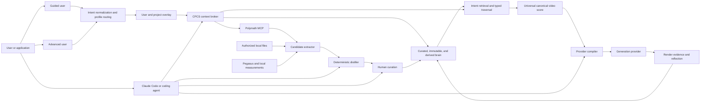
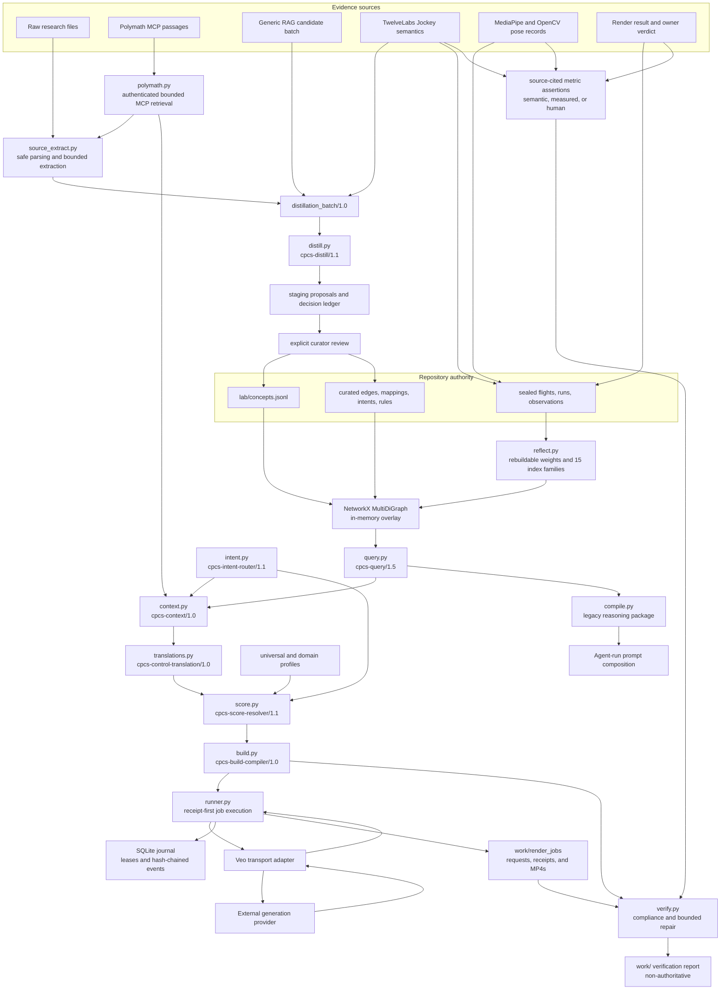
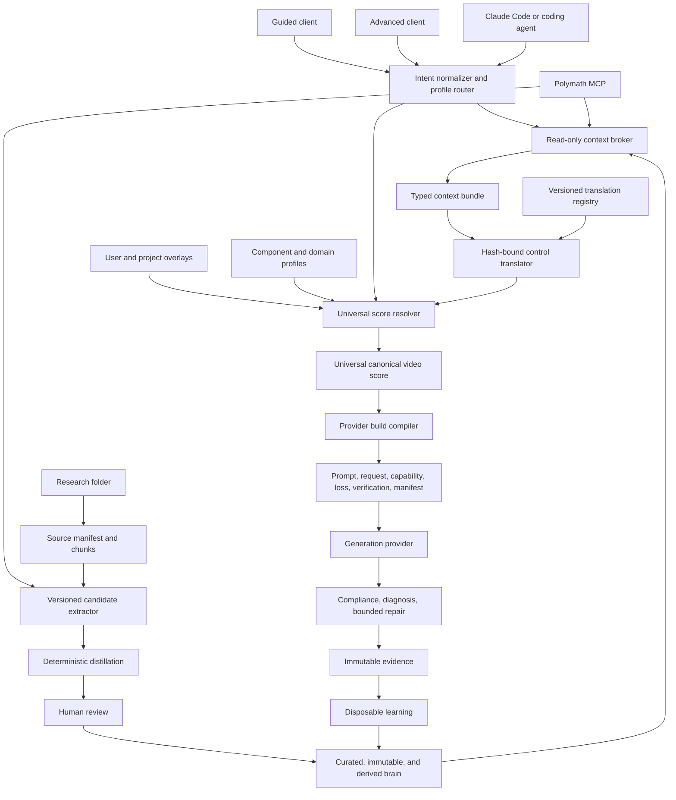

# Codebase Intent Gap Analysis: CPCS Production Architecture

**Verdict:** FAIL
**Repository:** `/Users/king/Documents/New project`
**Plan:** owner contract for one universal end-user video-intent system with a canonical score, composable domain profiles, provider compilation, and verification
**Revision:** Slice 30 Polymath MCP audit on `codex/polymath-mcp-slice-30`, based on integrated and remote-green Slice 29 baseline `160940e174820930f9f90cb36e641811f1a72930` plus the current working slice
**Audited at:** 2026-08-04

The repository gate is green, but the stated product loop is not yet an end-to-end production
system. Query safety, intent normalization, profile routing, the read-only context broker, and one
universal score resolver, hash-bound research-to-control translator, and non-submitting provider
build compiler now provide a governed ordinary-language-to-provider-request path. The end-user
path now reaches a journaled, transport-only Veo execution boundary and a deterministic local
render-verification boundary and a controlled immutable-evidence and derived-calibration loop, but
still lacks live-provider qualification. The
owned source extractor now turns authorized local folders and typed Polymath passages into hashed,
bounded, reviewable candidate bundles without promoting knowledge. Curated records now support
validated validity intervals and supersession, current and historical reads share one temporal
policy, and reflection rebuilds a schema-checked 15-family retrieval catalog. A source-bounded
TwelveLabs cascade now separates Analyze, Segment, Batch, Search, Jockey, and Marengo; normalizes
semantic and local-measurement evidence into a contradiction-preserving Video Observation Graph;
and reverse-compiles through the same universal score kernel before immutable handoff. This path is
contract- and fake-client-qualified, but no live provider asset was supplied, so production response
compatibility remains blocked. The render runner validates exact build bytes, leases one SQLite
writer, captures a provider request and operation receipt, resumes polling without duplicate
submission, quarantines ambiguous submissions, retrieves hash-bound artifacts, and redacts
credentials. Its Veo adapter has not run against live credentials, and the provider exposes no
documented request idempotency key or remote-cancel method. The verifier now prepares hash-bound
artifact-upload and score-closed Pegasus analysis jobs, converts normalized score-compliance
observations into assertions without caller-authored mapping, locally checks media identity and
metadata, keeps semantic, measured, and human-review lanes distinct, preserves
disagreements, executes closed product-visibility and per-hand 2D-curvature comparators, and can only reassert an existing
canonical control. Verified renders can now enter a content-addressed run that binds the sealed
experiment, canonical build, score, request, provider, profiles, concepts, blocks, assets, seed,
artifact, compliance report, metrics, and human review. Reflection permits a causal `promotes`
signal only when two evidence-complete arms isolate one predeclared control and its target is an
explicitly sealed outcome concept; bundled observations remain noncausal and provider/model filters
survive into query-time ranking. One shared application service now exposes deterministic request
and response envelopes through the installed `cpcs` command, MCP stdio, loopback HTTP, headless
clients, and a session-bound `cpcs-ui` graphical surface. Ordinary language can reach a
materialized build in one call. Guided users can review detected profiles, conflicts, missing
inputs, references, score controls, and build identity; advanced users submit compiler-validated
overlays and use the same role-filtered operation catalog. The same
service now reaches the real TwelveLabs surface dispatcher, journaled render runner, and compliance
verifier. Every public TwelveLabs surface execution now claims one local attempt and writes a
content-bound completion receipt over the exact job, result, request, response, and normalized
artifacts. Exact retries replay locally without constructing a provider client; changed jobs,
tampered artifacts, and incomplete attempts fail closed before resubmission. Chat, operator, and
curator catalogs are distinct. External provider calls, cancellation,
reconciliation, curated writes, and immutable writes require authorization bound to the exact
request. A bounded local
single-worker release now adds a wheel and installed command, exact dependency locks, CI definition,
versioned journal migrations, hash-verified backup and non-overwriting restore, request limits,
content-free telemetry, security scans, parser fuzzing, and a categorical qualification report.
External gate evidence now requires a revision-bound `2.0` bundle, a policy-registered evaluator
whose HMAC secret fingerprint and allowed gate scope are committed, and exact verification of every
relative artifact path, byte size, and SHA-256. The default evaluator registry is empty, so no agent
can self-approve a release by supplying status text and arbitrary hash strings.
Every versioned second-brain writer now enters one repository-wide nonblocking POSIX transaction
lock before reading authority. Staging, curation, immutable recording, migrations, reflection, and
the cross-tier Pegasus handoff therefore reject a competing local process before mutation. Nested
roles reuse one owner, and process death releases the kernel lock without stale-lock deletion.
Supported multi-file reasoning, context, compiler, graph, index, status, reflection, and
source-coverage reads now hold the same transaction in shared mode. Readers may coexist across
processes, while a writer remains exclusive, so one supported read sees a before-or-after snapshot.
Every curated promotion now also prepares a content-bound before/after journal before atomic target
replacement. Missing commit markers roll back on the next curation; committed markers preserve the
after state. Hard-kill canaries cover death during preparation, after one member, and after all
members, while journal or target tampering fails closed.
These controls are locally qualified, but the release is deliberately not production-qualified:
closed-world annotation, calibration, held-out evaluation, live generation and analysis providers,
graph-write promotion, and authenticated remote deployment remain absent. Networked Polymath MCP
retrieval now works through an exact-authorized operator boundary; automatic gap-triggered context
enrichment remains a separate unimplemented policy decision.

This file is the architecture source of truth. Root and subsystem `AGENTS.md` files govern how an
agent edits the repository. Runbooks govern procedures. Frozen `research/` packages supply upstream
evidence. `lab/second_brain/IMPLEMENTATION_PLAN.md` remains a dated audit of the control-plane slice.

## Intent Contract

### Product intent

> **CPCS is a universal AI video-intent generator and creative-direction compiler that turns a
> user's goal into an evidence-informed, provider-ready video production plan.**

The end user should not need to understand graphs, FACS, Laban, Pegasus, schemas, retrieval policy,
serialization formats, or provider adapters. The visible product accepts ordinary language,
references, duration, platform, constraints, and preferences. The internal system normalizes that
input, selects or blends domain profiles, retrieves relevant knowledge, reasons through conflicts
and prerequisites, builds one canonical score, negotiates provider capabilities, emits a production
package, and verifies the render.

UGC, advertising, cinema, dialogue, action, anime, VFX, music video, education, social content, and
custom projects are specialized interpretations of one video-intent language. They are not separate
products, ontologies, canonical schemas, or compilers.

CPCS is Claude Code-first, but not Claude Code-dependent. The core remains headless and owns the
knowledge, reasoning, compilation, and evidence contracts. Claude Code is the primary repository
operator. Chat models, Codex, other coding agents, local models, and applications are clients of the
same CLI or MCP boundary rather than alternate knowledge authorities.

The intended user path has seven outcomes:

1. Normalize an ordinary-language request into domain, task, audience effect, workflow, hard
   constraints, soft preferences, and missing inputs.
2. Apply user and project context without turning preferences into curated knowledge.
3. Select or blend domain profiles that configure one universal score contract.
4. Retrieve relevant concepts, prior evidence, provider observations, and external passages through
   the governed knowledge path.
5. Resolve prerequisites, conflicts, locks, alternatives, unsupported controls, and allowed creative
   variation into one canonical score.
6. Compile provider requests, prompts, reference instructions, capability and loss reports, and a
   verification plan from that score.
7. Record renders and verdicts, verify outputs, and rebuild evidence-backed recommendations without
   letting learned data rewrite curated truth.

The knowledge-growth path remains separate. It accepts authorized research, RAG passages, media
semantics, measurements, and experiment records; extracts atomic proposals; performs deterministic
deduplication and placement; and requires explicit curation before promotion.

### Primary users and decisions

| User or actor | Decision | Required output |
|---|---|---|
| Guided end user | Describe a video, provide references, choose duration or platform, and review detected intent | canonical score summary and provider-ready build |
| Advanced end user | Edit beats, performance, motion, camera, timing, contacts, profile blend, and verification thresholds | the same canonical score with explicit overrides and conflicts |
| Repository owner | Accept, merge, refine, or reject new knowledge and product contracts | review record and durable IDs |
| Claude Code or repository operator | Implement, validate, curate, compile, test, and maintain CPCS | verified changes through stable CPCS contracts |
| Research and distillation agent | Fill a named knowledge or graph gap | hashed candidate batch |
| Experiment and media operator | Extract or compare controlled media evidence | typed observations, sealed runs, metrics, and verdicts |

### Acceptance criteria

The product path is accepted only when an ordinary-language request can travel through the same
public runtime used by guided and advanced clients: normalized intent, profile resolution, governed
knowledge context, canonical score, provider build, render record, verification, and later learning.
Representative UGC, cinematic dialogue, action or anime, product demonstration, and blended-profile
fixtures must share one score schema and differ only through typed data and rules. Every stage must
support replay, bounded failure, durable lineage, and a verifier through the same public path.

The knowledge-growth acceptance path remains: authorized folder or passage input, bounded candidate
extraction, deterministic distillation, explicit promotion, later retrieval, and source trace. The
same headless core must return read-only client context without changing curated, immutable, derived,
or staging stores. Claude-specific code cannot own business rules or be required at runtime.

### Constraints and non-goals

| Constraint | Architectural consequence |
|---|---|
| `research/` is frozen | new findings enter staging and curated lab stores, never upstream files |
| Human authority owns truth | retrieval and extraction may propose; only curation may promote |
| IDs survive refactors | fingerprints aid deduplication but never replace durable curated IDs |
| Semantic evidence is not measurement | Pegasus output cannot claim exact joints, force, contact, or FACS intensity |
| Learned data is disposable | derived files must rebuild byte-identically from curated and immutable inputs |
| The repository is file-backed | current persistence is JSONL, JSON, YAML, CSV, Git, and ignored `work/` artifacts |
| Clients do not own knowledge | Claude Code, chat models, and MCP hosts call CPCS contracts but cannot redefine authority |
| Read and write surfaces differ | ordinary chat receives read tools; curation and immutable writes require an explicit operator boundary |
| LLM extraction is bounded | models receive selected passage packets, never an entire large source file as one prompt |
| One universal score owns video meaning | profiles and providers configure or project that score; none may fork it |
| User and project context is an overlay | preferences affect selection and compilation but do not become curated research truth |
| Automatic routing is the default | clients show detected profiles and allow correction; they do not require domain expertise |
| Guided and advanced modes share data | advanced editing exposes more fields but never changes the underlying score contract |

The system is not currently a hosted service, a vector database, a production graph database, a
general chat-memory product, or an autonomous truth authority. TwelveLabs analyzes media; it is not
the video-generation backend. Claude Code is not the second brain, and query-time Polymath results
are not repository knowledge.

### System boundary



### Universal kernel and domain profiles

The universal score owns the stable video language:

```text
project, intent, entities, shots, beats, actions, performance, motion, interaction,
camera, editing, audio, marketing function, style, continuity, constraints, assets,
provenance, provider disposition, verification
```

Domain profiles extend that contract with required layers, defaults, composition rules, conflicts,
preferred workflows, serialization preferences, and verification metrics. A domain profile may
blend existing component profiles such as movement, capture, camera, performance, screen action,
and style. It cannot add a parallel canonical schema or knowledge authority.

The intended profile contract has this logical shape:

```json
{
  "profile_id": "profile://ugc/product_demo/1.0",
  "extends": ["profile://universal/video/1.0"],
  "required_layers": [
    "marketing",
    "performance",
    "product_interaction",
    "camera"
  ],
  "defaults": {},
  "composition_rules": [],
  "conflicts": [],
  "preferred_workflows": [],
  "verification_metrics": []
}
```

Merge precedence is deterministic:

```text
universal defaults
-> domain profiles
-> user defaults
-> project profile
-> scene overrides
-> shot overrides
-> event locks
```

Later defaults may override earlier defaults. Hard constraints and event locks never silently drop.
A named dominance rule resolves each conflict; unresolved conflicts become explicit user decisions.
Automatic routing is the default, but the detected profile set remains visible and editable.

### User build contract

Guided and advanced clients operate on the same canonical score. Guided clients show the original
request, detected intent and profiles, missing inputs, major constraints, and a render action.
Advanced clients expose score fields and provider projections without creating a second authoring
format.

A successful build is intended to produce:

```text
build/
├── canonical_score.json
├── provider_request.json
├── prompt.txt
├── reference_still_prompt.txt
├── capability_report.json
├── loss_report.json
├── verification_plan.json
└── build_manifest.json
```

`canonical_score.json` preserves provider-neutral meaning. `provider_request.json` and `prompt.txt`
are projections. `capability_report.json` names supported controls. `loss_report.json` records what
the selected provider cannot represent. `verification_plan.json` defines observable checks.
`build_manifest.json` binds every artifact to intent, profiles, concepts, evidence, compiler policy,
provider, model, assets, and hashes.

### Product surfaces

The intended product hierarchy has seven surfaces over one kernel:

| Surface | Responsibility |
|---|---|
| Intent Studio | ordinary-language planning, detected intent, missing inputs, and score editing |
| Reference Intelligence | Pegasus and measurement analysis, segmentation, and recreation inputs |
| Creative Compiler | canonical score, merge policy, capability negotiation, and provider builds |
| Domain Profiles | UGC, advertising, cinema, dialogue, action, anime, VFX, music, education, and custom configuration |
| Knowledge Brain | research, concepts, graph reasoning, provenance, and evidence |
| Render Lab | controlled alternatives, provider comparisons, and experiment records |
| Verification and Learning | output checks, verdicts, immutable evidence, and rebuildable recommendations |

### Agent, Polymath, and chat operating surfaces

CPCS is a headless directing and knowledge-control system. It has three interfaces with different
authority: Polymath supplies evidence, chat consumes temporary context, and Claude Code operates the
repository. They share one CPCS core and cannot promote themselves into competing knowledge stores.

Polymath supports two paths. The query-time path is read-only and ephemeral:

```text
user question
-> CPCS intent and domain classification
-> curated second-brain retrieval
-> Polymath retrieval when coverage is incomplete
-> typed graph expansion with path-level relevance checks
-> conflict, prerequisite, and duplicate resolution
-> evidence reranking and token-budget packing
-> context bundle for the requesting client
```

The governed distillation path proposes a knowledge write:

```text
named knowledge gap
-> Polymath passages with source IDs, locators, hashes, and retrieval metadata
-> bounded LLM candidate extraction
-> distillation_batch/1.0
-> deterministic duplicate, placement, reference, and dependency checks
-> staged proposals
-> explicit human review
-> curated promotion
```

### Bounded LLM distillation contract

Large documents never enter an LLM request as one payload. CPCS owns the source boundary and uses
the model as a bounded interpretation worker:

1. Deterministic discovery and format parsing produce a heading tree, stable locators, chunk IDs,
   byte hashes, media types, and normalized text.
2. Whole-document orientation sends only title, metadata, table of contents, heading tree, a short
   summary, and current CPCS coverage. The model returns section references, not knowledge records.
3. Section-level retrieval selects a configurable packet, initially 4 to 12 passages within a hard
   token and byte budget, for one named research goal.
4. Structured LLM extraction proposes atomic records and cites only passage IDs present in the
   request.
5. Schema validation, deterministic admission, review, and curation decide whether a proposal can
   enter repository authority.

The extractor request carries existing concept references and closed output instructions. A packet
has this logical shape before the adapter builds `distillation_batch/1.0`:

```json
{
  "research_goal": "How does Laban Flow affect restrained acting direction?",
  "existing_concepts": [
    "c_laban_flow",
    "c_restrained_performance"
  ],
  "source_passages": [
    {
      "source_id": "source_001",
      "locator": "section_12.3",
      "content_hash": "sha256:...",
      "text": "..."
    }
  ],
  "allowed_outputs": [
    "concept",
    "edge",
    "intent",
    "mapping",
    "rule"
  ]
}
```

The response is an extraction proposal, not a curated record:

```json
{
  "proposals": [
    {
      "proposal_type": "mapping",
      "concept_ref": "c_laban_flow",
      "control_target": "performance.motion_restraint",
      "claim": "Bound Flow can support restrained or contained movement direction.",
      "evidence_refs": ["source_001#section_12.3"],
      "extractor_confidence": 0.78,
      "limitations": [
        "This is a directorial application, not a universal psychological inference."
      ]
    }
  ]
}
```

`extractor_confidence` is a diagnostic ranking hint. It cannot become curated evidence confidence.
The adapter resolves every evidence reference against the request packet, maps accepted fields into
the current candidate schema, and rejects unknown fields or types. A proposed contradiction becomes
a typed `conflicts_with` or `invalid_for` edge; `contradiction` is not a batch proposal type.

Responsibility remains split at a checkable boundary:

| Owner | May do | Must not do |
|---|---|---|
| Source adapter | discover files, parse formats, build headings and chunks, assign locators, hash bytes, retrieve passages | interpret a claim as true or write curated data |
| LLM extractor | propose concepts, definitions, relationships, mappings, rules, contradictions, limitations, merges, refinements, and compiler implications | assign durable IDs, establish truth, authorize numbers, or promote records |
| Deterministic control plane | validate schemas and allowed types, resolve existing IDs, detect duplicates, enforce references and placement, record provenance | invent unsupported meaning or waive review requirements |
| Human curator | verify sources, judge proposed identity and usefulness, assign durable IDs, and authorize promotion | erase immutable history or bypass repository validation |

Version one uses LLM-first extraction, deterministic parsing and chunking, strict structured output,
the existing deterministic control plane, and human promotion. It does not add an encoder-based
relation extractor. Reconsider an encoder only after measurement shows excessive extraction cost,
insufficient throughput, repeated span or offset errors, dominant simple relation types, or a privacy
requirement for a fully local first pass.

Similarity does not establish truth. A retrieved passage can help a chat model answer one request,
but it remains untrusted external evidence until the candidate, distillation, and review path accepts
it. Derived associations remain rebuildable ranking signals. Session context remains temporary.

The context broker must return a typed package rather than inject arbitrary retrieved chunks:

```json
{
  "schema": "cpcs.context_bundle/1.0",
  "request": {
    "query": "Create restrained fear that becomes physical urgency",
    "intent": "directorial_composition",
    "token_budget": 12000
  },
  "curated_knowledge": [
    {
      "concept_id": "c_example",
      "status": "proven",
      "reason_selected": "Matches restrained affect and escalating movement",
      "evidence_ids": ["e_example"],
      "path": ["intent", "requires", "concept"]
    }
  ],
  "retrieved_evidence": [
    {
      "origin": "polymath_mcp",
      "source_id": "source_123",
      "locator": "chapter_4.section_2",
      "content_hash": "sha256:...",
      "evidence_class": "source_passage",
      "passage": "..."
    }
  ],
  "derived_associations": [],
  "conflicts": [],
  "coverage": {
    "covered_terms": [],
    "uncovered_terms": [],
    "additional_retrieval_recommended": false
  },
  "compiler_candidates": [],
  "trust_boundary": {
    "curated_knowledge": "repository_authority",
    "retrieved_evidence": "untrusted_external_evidence",
    "derived_associations": "rebuildable_ranking_signal",
    "session_context": "ephemeral"
  }
}
```

Claude Code reads repository governance, identifies knowledge and implementation gaps, runs context
and traversal canaries, prepares candidate batches, inspects distillation decisions, performs
authorized promotion, changes adapters and compilers, and runs the repository gate. Those actions
must call stable CPCS contracts. Claude-specific business logic is forbidden.

The target MCP surface separates ordinary read access from controlled writes:

| Tool | Authority | Default client access |
|---|---|---|
| `cpcs.status` | read system and provider state | chat and operators |
| `cpcs.intent.normalize` | normalize user input and detect editable profiles | chat and operators |
| `cpcs.context.get` | build a token-budgeted, read-only context bundle | chat and operators |
| `cpcs.reason` | retrieve concepts and typed paths | chat and operators |
| `cpcs.score.build` | resolve one provider-neutral canonical video score | chat and operators |
| `cpcs.build.compile` | project a validated score into provider build artifacts | chat and operators |
| `cpcs.distill.prepare` | retrieve evidence and construct a candidate batch | operators only |
| `cpcs.distill.run` | execute deterministic admission policy | operators only |
| `cpcs.curate.review` | display review requirements and decisions | operators only |
| `cpcs.curate.promote` | write only after explicit human authorization | controlled write |
| `cpcs.experiment.prepare` | validate exact application builds and construct an experiment draft | operators only |
| `cpcs.experiment.seal` | append an authorized immutable flight | controlled write |
| `cpcs.record.render` | append immutable render evidence | controlled write |
| `cpcs.reflect.rebuild` | rebuild derived learning state | operators only |

CLI and MCP adapters must call the same application functions and return the same versioned
contracts. Chat deployments normally expose only the read-only product and reasoning tools above
the distillation boundary.

## Actual Runtime

### Current state snapshot

The repository contains 132 concept cards, 277 curated authored edge records with 195 current heads,
45 mappings, one intent, one rule, five sealed flights, five immutable runs, four distillation runs,
and 111 historical proposal
rows. Provenance shows all 111 proposals as promoted, although their append-only staging rows remain
`pending`. The live second-brain graph contains 142 nodes and 200 edges. Derived reflection contains
zero learned edges, zero Pegasus observations, and zero measurement observations.

The profile library contains eight component profiles, eight domain configurations, one universal
profile, and one router-only policy. `src/intent.py` returns normalized intent, profile labels,
conflicts, missing inputs, and a safe context handoff. `lab/compiler/score.py` consumes that pair,
adapts current component profiles, applies typed field operators and transient overlays, retains
per-field provenance and hard locks, and returns `cpcs.universal_score/1.0`. Three active,
hash-bound translations now convert gated FACS, Laban curvature, and dramatic-camera mappings into
declared canonical fields with loss, limitation, disposition, and verification trace. Other
retrieved mappings remain explicit `no_translation` dispositions. `lab/compiler/build.py` validates
a ready score and emits the declared eight-artifact Veo 3.1 build directory without network
submission or authority-store writes.

`lab/runtime/runner.py` revalidates that build and owns the local operational path through a
single-writer SQLite journal and the transport-only Veo adapter. It has a module CLI for create,
run, resume, reconcile, cancel, show, and events. Offline tests prove receipt-first recovery and
artifact normalization, but no live provider request has been authorized.

`lab/verification/verify.py` revalidates the build, runtime result, exact MP4 bytes, local `ffprobe`
metadata, and a self-contained evidence bundle. It emits `cpcs.compliance_report/1.0` with artifact
and score-control checks, source hashes, evidence lanes, conflicts, deviations, locations, and a
bounded repair plan. Product-visibility duty cycle and per-hand average 2D path curvature are the
closed deterministic measurement comparators. Other declared methods require source-cited
assertions from Pegasus semantics, local measurements, or human review and remain unobservable
when their required lane is absent.

Of the 195 current authored edges, 158 remain legacy `pairs_with` associations. A journaled
migration consolidated 41 reciprocal groups by superseding 82 directional predecessor records with
41 symmetric current heads. It preserved every predecessor ID and the union of each pair's source
references without assigning unsupported edge semantics. Four source-backed high-use associations
use operational or dependency semantics without changing their durable edge IDs. The current graph
contains 21 `refines`, six `applies_to`, four `conflicts_with`, three `alternative_to`, two
`requires`, and one `produces` edge. There are no curated `is_a`, `part_of`, `valid_for`, or
`invalid_for` edges. Policy `cpcs-typed-edge-distribution/1.1` rejects repeated current symmetric
relationships, caps `pairs_with` at 158, and caps its share at `0.811` when at least 195 current
edges exist.

The temporal policy is `cpcs-temporal/1.0`. Curated concepts, edges, mappings, intents, and rules
may declare inclusive `valid_from`, exclusive `valid_until`, reciprocal replacement links, and an
active, superseded, or deprecated status. Current reads choose open-ended active heads without
using the wall clock; historical reads require an offset-aware `as_of`; `all_versions` is an audit
view. The current dataset contains 82 superseded edge predecessors and 41 current successors from
the reciprocal-association consolidation. Historical queries before `2026-08-04T00:00:00Z` return
the predecessor directions; current queries and the repository-derived graph return one symmetric
head per group.

Reflection now emits five derived files, including `derived/indexes/catalog.json`. The catalog
contains lexical, alias, deterministic hashed-TF-IDF semantic, typed-adjacency, prerequisite,
conflict, temporal, supersession, concept-source, concept-evidence, intent-concept,
control-provider, provider-performance, experiment, and video-observation families. Retrieval
diagnostics expose lexical, alias, vector, and fused candidate lists; vector similarity is ranking
evidence only and cannot override a hard conflict or create a root that failed query eligibility.

The domain modules retain their Python CLIs, while `lab/application/service.py` is now the stable
shared client surface. The
`cpcs.context_bundle/1.0` broker now packages the `cpcs-query/1.5` safe query result, temporal
replacement lineage, validity-matched mappings, curated lineage, and typed external evidence under
deterministic full-envelope token accounting. There is
also a `cpcs.normalized_intent/1.0` module CLI, an in-process intent-to-context function, and a
`cpcs.universal_score/1.0` resolver CLI, a `cpcs.build_request/1.0` provider-build CLI, and a
`cpcs.render_job/1.0` journaled runtime CLI, and a `cpcs.compliance_report/1.0` verifier CLI.
`cpcs.application_request/1.0` and `cpcs.application_response/1.0` now wrap status, intent, context,
reason, score, inline provider build, distillation, review, curation, render evidence, and reflection
operations. `bin/cpcs`, MCP `tools/call`, loopback HTTP `/v1/invoke`, and guided or advanced Python
clients all call the identical dispatcher. This facade is packaged with installed `cpcs` and
`cpcs-ui` commands but is not an authenticated remote service. Exact-authorized networked
Polymath retrieval now returns typed context and distillation evidence. Automatic gap-triggered
retrieval, live-qualified generation, and a learned retrieval reranker remain absent.
`AGENT_PROMPT.md` remains operator guidance rather than a
separate runtime authority.

### Runtime topology



Solid arrows exist in code or governed data. Local-folder extraction, typed-passage extraction, and
exact-authorized networked Polymath retrieval now exist. The context handoff is caller-mediated;
ordinary gap detection does not silently make an external request. Live generation and analysis
provider qualification remain missing. The legacy reasoning-package composition path remains
agent-operated.

### Pipeline A: research to curated knowledge

#### A1. Source discovery and retrieval

`lab/second_brain/src/source_extract.py` owns the raw-source bridge. Its `folder` command inventories
authorized Markdown, text, JSON, JSONL, YAML, and XML, hashes bytes before parsing, rejects links and
unsafe syntax, creates content-addressed locators and bounded passage packets, audits every section,
and emits `cpcs.source_extraction_bundle/1.0` under ignored `work/`. Its `passages` command accepts a
typed Polymath envelope with source IDs, locators, content hashes, retrieval metadata, and rights.
An optional extractor-neutral semantic response can cite only chunks in its packet; the adapter
replaces those references with source-owned hash and locator records before candidate admission.

`lab/second_brain/src/providers/polymath.py` owns authenticated network retrieval. It accepts HTTPS
or exact loopback HTTP, reads bearer credentials only from the process environment, tries current
MCP discovery before a narrowly admitted legacy session fallback, discovers the live tool catalog,
allowlists only read search tools, caps query, response, passage, count, corpus, and timeout bounds,
and converts provider chunks into `cpcs.polymath_retrieval/1.0`. The application exposes this as
operator-only `cpcs.polymath.retrieve` with authorization bound to the exact query and options.
Its context view is explicitly untrusted, and its extraction view must still pass source extraction,
deterministic distillation, and human promotion.

`lab/second_brain/src/ingest.py` inventories the Polymath corpus and accepts a JSON object that
satisfies `distillation_batch.schema.json`. Registered external origins are `local_source`,
`polymath_mcp`, `pegasus`, and `rag_pipeline`. Those origins cannot call the manual proposal route.

The batch pins four classes of lineage:

| Contract area | Required data |
|---|---|
| Retrieval | adapter, corpus ID, query, tool, parameters, retrieval timestamp |
| Extractor | agent, model, prompt hash |
| Candidate | candidate ID, proposal type, suggested ID, proposed record, creator, timestamp |
| Evidence | source ID, locator, claim, SHA-256 content hash |

The extractor deliberately does not call a provider-specific model. It produces bounded semantic
packets and validates typed responses carrying extractor, model, and prompt identity. Structural
proposals without both connected placement and operational use are expected to be rejected by the
distiller rather than silently entering staging.

#### A2. Deterministic distillation

`lab/second_brain/src/distill.py:728` validates and normalizes the batch. Candidate and evidence
order are sorted before hashing. The run ID is derived from the normalized input hash, policy hash,
and curated-snapshot hash. Replaying the same batch against the same snapshot returns the same run.

Policy `cpcs-distill/1.1` applies these decisions in order:

1. Preserve an existing proposal or curated identity when provenance matches.
2. Reject unhashed evidence and exact record duplicates.
3. Compare concepts by normalized token overlap. A score at least `0.92` is treated as exact; a
   score at least `0.55` requires merge review.
4. Reject references that resolve to neither curated concepts nor same-batch proposed concepts.
5. For each new concept, require a typed structural path to a curated concept plus at least one
   operational edge or executable mapping.

The structural proof accepts `is_a`, `part_of`, or `refines`. The operational bridge accepts
`requires`, `applies_to`, `produces`, or a mapping. `pairs_with` cannot satisfy placement. If a
concept or structural member fails admission, dependent records are rejected in the same run.

This distiller is a deterministic admission policy, not an LLM research reader. It evaluates
structured candidates supplied by another actor. Its similarity function is token-based Jaccard
over name, definition, use case, triggers, and layer. NetworkX supplies graph and shortest-path
operations.

#### A3. Staging and review

Admitted candidates become pending proposals in `staging/proposals.jsonl`; every decision, including
rejections and possible duplicates, remains in `staging/distillation_runs.jsonl`. The current
`staging/rejected.jsonl` file is not used by `distill.py`; rejection lineage lives inside the run.

`lab/second_brain/src/curate.py` requires explicit true values for source verification, source
locator resolution, duplicate review, operational usefulness, relationship validation, and numeric
precision support. The curator assigns durable IDs. External proposals also need an admissible
distillation-run reference.

Bundle promotion writes concepts and intents before dependent edges, mappings, and rules. It takes
byte snapshots of every target file and restores them if a later member fails in the same process.
This curated-write path has no journal or lock for power loss, process termination, or concurrent
writers; the render journal does not broaden its authority into curation.

#### A4. Curated ownership

| Record | Authority | Meaning |
|---|---|---|
| Concept | `lab/concepts.jsonl` | atomic vocabulary, triggers, status, evidence, source |
| Edge | `lab/second_brain/curated/edges.jsonl` | authored semantic relationship |
| Mapping | `lab/second_brain/curated/mappings.jsonl` | concept to provider-independent control |
| Rule | `lab/second_brain/curated/rules.jsonl` | data bound to one named Python evaluator |
| Intent | `lab/second_brain/curated/intents.jsonl` | normalized recurring goal |

JSON Schema Draft 2020-12 validates all five stores. Curated IDs must be unique across stores, edge
endpoints must exist, mappings must resolve, and rule evaluator names must exist in Python.

### Pipeline B: goal to traversal and compiled output

#### B1. Live graph assembly

`lab/second_brain/src/graph.py:build_live_graph` creates a NetworkX `MultiDiGraph` in memory. It
validates one `current`, `historical`, or `all_versions` temporal view, overlays only visible curated
concepts and authored edges with immutable flights, evidence nodes, and optional derived learned
edges, and records the temporal policy in graph metadata. It does not persist the live graph.

This live reasoning graph is different from `lab/graph.json`. The latter is a repository-wide
derived index containing research packages, blocks, variants, experiments, runbooks, evidence, and
second-brain records. `lab/scripts/build_graph.py` builds that index and
`lab/scripts/sync_repo.py` checks it for drift. `query.py` does not query `lab/graph.json`.

#### B2. Root retrieval

`lab/second_brain/src/query.py:reason` tokenizes the goal, filters the selected temporal view, and
scores each visible concept from its natural-language triggers, name, definition, use case, and
layer. Multi-term queries normally need two overlapping terms, a complete name match, or a one-word
trigger match. At most five roots are admitted.

Root eligibility still owns admission: concept status, excluded layers, declared encodings, and
lexical eligibility are hard gates. `indexes.py` supplies inspectable lexical, alias, deterministic
hashed-TF-IDF vector, and fused diagnostics, but those scores may only reorder concepts that already
passed root eligibility. There is no learned encoder, BM25 dependency, external vector database,
opaque reranker, or LLM call in this path. The Marengo embedding wrapper remains separate from
curated concept retrieval.

#### B3. Hop semantics

The authored edge policy is versioned as `cpcs-edge-policy/1.0`:

| Edge family | Types | Traversal behavior |
|---|---|---|
| Structural | `is_a`, `part_of`, `refines` | bidirectional with named generalize, specialize, part, and whole transitions |
| Operational | `applies_to`, `produces` | bidirectional connection between knowledge and use |
| Dependency | `requires` | bidirectional relation, plus admissibility check for prerequisites |
| Contextual | `alternative_to` | traversable choice |
| Constraint | `conflicts_with`, `valid_for`, `invalid_for` | selection filter, never an expansion hop |
| Legacy | `pairs_with` | low-priority hop, at most one per path and three globally |

Derived learned edges rank below authored hops. Every accepted path row records direction,
transition, family, tier, depth, edge ID, and policy version.

#### B4. Selection safety and prerequisite closure

After root retrieval, policy `cpcs-query/1.5` requires every selected non-root concept to declare
one admission reason: `structural_term_support`, `operational_bridge`, or
`required_prerequisite`. Roots declare `direct_match`. A neighbor with no term support,
operational bridge, or dependency role is rejected with `connectivity_only`; graph reachability
alone cannot import it.

Exact semantic signatures now gate both root selection and frontier enqueue. Duplicate records
retain a hash and bounded suppression preview in the reasoning trace but cannot consume the six-root
or 25-concept traversal budgets. Durable IDs remain authoritative for prerequisites; semantic
deduplication does not substitute one ID for another inside a `requires` closure.

Relevant candidates resolve their complete `requires` closure before selection. A stable
concept-ID topological order places prerequisites before dependents. Missing prerequisites reject
the dependent with `missing_prerequisite`; cycles reject every cycle member with
`dependency_cycle`. Prerequisites inherit relevance only from their dependent and are not expanded
as traversal roots unless another path independently establishes relevance.

The Slice 1 canary is:

```bash
python3 -m lab.second_brain.src.query reason \
  "Laban effort decimal spatial movement" \
  --minimum-status ingested --include-unproven --maximum-depth 5
```

It selects seven Laban or motion concepts, excludes `c_dual_view_color_integration`, and compiles no
VFX color control. `decimal` and `spatial` remain uncovered, so centralized gap policy
`cpcs-gap-policy/1.1` returns `status: partial`, `should_retrieve: true`, and reason
`material_query_terms_uncovered`. Isolated fixtures prove transitive prerequisite ordering,
missing-prerequisite rejection, cycle termination, and byte-equivalent replay of selected order,
paths, rejections, and gap output.

#### B5. Read-only context broker

`lab/second_brain/src/context.py:build_context_bundle` calls `reason()` and never traverses the graph
itself. It enriches only the admitted concept IDs with provider/model mappings visible in the same
temporal view, replacement traces, and aggregated source and evidence references. Typed external
passages must name the declared knowledge-gap query,
carry a SHA-256 that matches their UTF-8 text, and remain labelled
`untrusted_external_evidence`. Duplicate passage hashes are retained once with an omission reason.

Policy `cpcs-context/1.0` sorts direct matches before prerequisites, operational bridges, and
structural support. It reserves an omission row for every packable item, then admits items while the
canonical UTF-8 bundle estimate remains within the requested budget. The estimate includes the
request, trust boundary, policies, knowledge gap, selected content, and omission report. Replay with
the same repositories, request, evidence, and budget is byte-identical. The CLI writes only stdout;
tests compare curated, immutable, derived, and staging bytes before and after both function and CLI
calls.

#### B6. Compilation

`lab/second_brain/src/compile.py:compile_result` accepts only `cpcs-query/1.5` results whose selected
rows carry an allowed admission reason. It rejects unsafe policy versions, connectivity-only rows,
and any concept present in both selected and rejected sets. It then resolves mappings for the
already-gated selection, filters provider and model-specific mappings, runs three named
deterministic evaluators, and renders one of four Jinja templates. `hybrid` currently aliases to
JSON.

The output is an intermediate reasoning package containing goal, selected concepts, mappings,
control IDs, rule results, paths, evidence, sources, rejections, alternatives, and the knowledge-gap
decision. It does not merge profiles, resolve overlays, negotiate provider capabilities, or submit a
render. The universal score and provider build paths now own those later deterministic boundaries.

#### B7. Canonical score to provider build

`lab/compiler/build.py` accepts `cpcs.build_request/1.0`, verifies the embedded score schema and
content-derived score ID, rejects unresolved scores, checks score-bound reference assets, and loads
the source-linked `veo-3.1-generate-001` capability profile. It projects canonical control paths and
values into a measured prompt carrier, preserves hard locks or fails the build, assigns exactly one
capability disposition per control, and records unsupported or evaluation-only controls instead of
silently dropping them.

The public `compile` command writes exactly eight files into an empty output directory. Seven
artifact hashes, the canonical score hash, profile and current concept content hashes, an explicit
empty block-hash set, capability hash, seed,
creative mode, repository commit, and compiler version feed a deterministic build ID and build hash.
The resulting `provider_request.json` validates against the declared Vertex AI Veo 3.1 REST shape.
The module performs no authentication, request submission, polling, artifact retrieval, or authority
write.

#### B8. Journaled provider execution

`lab/runtime/runner.py` revalidates the complete eight-file build before registering a
`cpcs.render_job/1.0`. `journal.py` uses SQLite `BEGIN IMMEDIATE`, a unique idempotency key, one
expiring worker lease, and per-job hash-chained events. Requests, operation receipts, numbered poll
responses, final provider envelopes, downloaded MP4 files, and the normalized
`cpcs.render_result/1.0` stay under ignored `work/render_jobs/`; none are knowledge or experimental
authority.

Every adapter implements the same `validate`, `prepare`, `submit`, `poll`, `retrieve`, `normalize`,
and `cancel` lifecycle. The initial `google_vertex_ai.veo/1.0` adapter submits the compiler-owned
REST payload to `predictLongRunning`, polls only the matching operation through
`fetchPredictOperation`, retrieves GCS or inline MP4 bytes, and hashes each artifact. Application
Default Credentials are loaded only inside the transport call. Secret-shaped job fields are
rejected. The prepared request preserves compiler-owned content; provider responses and journal
payloads are recursively redacted.

The runner provides the strongest guarantee the provider contract permits. A receipt is fsynced
before the journal advances to `submitted`; kill and resume recover that receipt and do not submit
again. If the provider might have accepted a request but no receipt reached disk, the state becomes
`submission_unknown` and automatic resubmission is forbidden until an operator reconciles a known
operation. This is deliberately not described as universal exactly-once delivery: Veo documents no
server-side idempotency key or lookup by client request ID. Veo also documents polling but no remote
cancel method, so cancellation reports `unsupported` and warns that local polling cessation may not
stop work or charges. Live authentication, submit, poll, and retrieval remain unqualified.

#### B9. Render compliance, diagnosis, and bounded repair

`lab/verification/verify.py` accepts only a complete validated build, a matching
`cpcs.render_result/1.0`, the exact selected MP4, and
`cpcs.verification_evidence_bundle/1.0`. It resolves the artifact below the render-result directory,
rejects links and hash or size drift, and uses the existing local `ffprobe` boundary to check the
compiler's artifact identity, duration, aspect-ratio, resolution, and frame-rate requirements.

Evidence sources are embedded and content-hashed. Normalized Pegasus or local-measurement records
must validate against the second-brain schema and cite the exact artifact hash; human reviews use a
separate typed record. The required observability lane decides each metric. Another lane remains
supplemental, a missing lane produces `unobservable` or `review_required`, and opposing semantic and
measured verdicts produce `preserved_for_review` instead of confidence averaging.

The closed `product_visibility_duty_cycle` metric verifies measured visible time, interval duration,
and duty-cycle arithmetic, then compares nonzero visibility with the existing boolean canonical
control. `measured_average_hand_path_curvature` validates paired left and right wrist tracks for
every supplied actor and calculates total absolute turn in radians divided by normalized 2D path
length. It verifies that the canonical measurement procedure completed; it does not infer creative
quality, depth-axis curvature, or camera-separated subject motion. A caller cannot replace either
comparator with a supplied verdict. Other metric methods currently consume source-cited assertions;
the verifier does not pretend to calculate gaze, action order, or human performance quality without
the required tool or review.

`cpcs.compliance_report/1.0` identifies every failed metric, canonical control, evidence source,
interval, and deviation. The repair planner can only emit `reassert_existing_control` for the
already-authored canonical value and lists every unrelated control as preserved. Artifact failures,
conflicts, missing lanes, and review requirements block repair. Reports remain ignored diagnostics
under `work/`; recording them as experimental evidence belongs to Slice 12.

### Pipeline C: media analysis, experiments, and learning

#### C1. TwelveLabs transport and Pegasus semantics

`lab/second_brain/src/providers/twelvelabs/` isolates the provider SDK and pins API `v1.3`, SDK
`1.3.1`, Pegasus 1.5, Jockey, and Marengo 3.0. Assets, synchronous exact or clipped Analyze,
asynchronous Segment, same-mode Batch, item-filtered knowledge-store Search, selected-item Jockey
Responses, and embeddings have distinct modules and strict job contracts. The transport has no
curated, staging, or immutable write authority.

`lab/second_brain/analysis_profiles.yaml` is a closed 14-profile catalog. `pegasus.py` verifies local
source bytes and `ffprobe` timing, saves exact requests before external calls, runs a broad source
map, deterministic segmentation, and clipped deep passes, then normalizes semantic rows through
`video_observation.py`. Optional local measurements remain typed separately. Fusion creates a
source-bounded, content-hashed VOG; support and contradictions remain explicit and confidence is not
averaged. `lab/compiler/reverse.py` projects only declared VOG fields through the existing canonical
score resolver. One hash-chained semantic observation is appended only after VOG and optional score
validation succeed; proposed knowledge still enters the shared distiller.

The offline contract is working: fake-client tests cover upload through exactly-once immutable
handoff, raw-response renormalization without provider access, surface isolation, failure atomicity,
VOG replay, contradiction retention, and canonical score identity. The public dispatcher also
creates `cpcs.twelvelabs_surface_completion/1.0`, whose job, execution, result, request, response,
and normalized hashes must all validate before a completed job can replay. One exclusive attempt
marker prevents concurrent local entry; any request or response without a valid completion receipt
is quarantined instead of being submitted again automatically. Live production qualification is
blocked because the SDK, API key, and authorized provider asset are absent. Quarantined remote
attempts still require provider-specific operator reconciliation because CPCS cannot infer whether
an interrupted provider call committed remotely.

#### C2. Measurement lane

`lab/second_brain/src/measurement.py` owns exact-byte `cpcs.pose_measurement_job/1.0` requests and
reviewable `cpcs.measurement_batch/1.0` results. It verifies the authorized video and MediaPipe
Tasks model before decoding, calls the detector once per selected frame, associates actors by
deterministic nearest-centroid tracking, keyframes visible 2D joints, and writes request, raw-frame,
and batch artifacts under ignored `work/`. Every track is `detected`, not `measured`, because camera
and subject motion remain entangled and actor identity may swap across cuts or occlusion.

`cpcs.measure.pose.prepare` and `.run` cannot write authority. After review,
`cpcs.record.measurement` requires exact request-bound curator authorization and atomically appends
the batch to immutable measurement evidence. `cpcs.measure.normalize` projects selected records
through the current observation contract. `cpcs.analyze.cascade` then uses those immutable IDs in
the existing semantic fusion, VOG, and optional reverse-score path without a manually rewritten
record. Exact optional versions are declared in `requirements-measurement.lock`; they and a pose
model are not installed in the audited environment, and no approved real-clip detector evidence or
checked-in immutable measurement exists.

#### C3. Experiment recording

`lab/second_brain/src/record.py` seals a flight by hashing selected concept contents and locking the
intent, arms, provider, model, seed, compiler version, experiment classification, metric set, and
per-arm delta. An isolated design requires at least two arms that vary one shared concept/control
and seals explicit non-delta outcome concepts so background context cannot become a causal claim;
a bundled design cannot claim a tested delta. `record experiment` validates the exact compiler
build, runtime result, selected artifact bytes, compliance-report identity, and human review before
creating a content-derived, retry-idempotent run. The evidence lineage binds request, intent,
context, profile, concept, block, asset, build, score, provider response, artifact, verification,
and review hashes. The generic raw-run append is legacy-only, so a new run cannot bypass exact
evidence admission. Runs and observations form independent append-only hash chains.

The shared application service now owns the formerly hidden precondition. `cpcs.experiment.prepare`
accepts application build IDs rather than paths, revalidates every build and current concept hash,
and returns `cpcs.experiment_flight_preparation/1.0` only when the declared isolated pair differs on
exactly one canonical control. It performs no authority write. `cpcs.experiment.seal` requires exact
curator authorization; exact retries return the existing flight while changed content under the
same ID fails closed. The public Layer O fixture first promotes a source-traceable concept,
relationship, and mapping from an authorized MD and JSON folder, rebuilds the index, then exercises
both arms through production build, journaled fake-provider render, Pegasus score-compliance
analysis, local pose measurement, verification, sealing, immutable receipts, reflection, and a
later query whose learned trace cites both run IDs. Curated bytes change only during authorized
promotion and remain unchanged throughout rendering and learning.

The older lab workflow still records five result rows in `lab/runs/results.csv`. Migration created
five immutable flights and five runs, but those legacy records do not link concepts. As a result,
reflection currently reports zero concepts with immutable evidence.

#### C4. Reflection

`lab/second_brain/src/reflect.py` deletes and rebuilds `derived/` from curated and immutable data. It
creates co-occurrence associations for success, failure, and confounded runs. A positive `promotes`
edge requires an evidence-complete, provider- and model-matched, seed-controlled pair that differs
by one predeclared control while intent, context, profiles, concepts, blocks, assets, compiler, and
all other controls match. Its trace retains both build, artifact, compliance, and human-review
identities. Bundled and single-run associations are explicitly noncausal and use a smaller ranking
weight. Provider and measurement observations create zero-weight `confounded_with` edges.

The reflector also writes coverage, compatibility concept-to-evidence and weight files, insights,
and the schema-validated `cpcs.derived_indexes/1.1` catalog. The provider-performance and experiment
families expose controlled, bundled, causal-run, artifact, compliance, and causal-effect lineage.
The catalog is an optimization and
diagnostic projection, not authority: current, historical, or all-version views can be rebuilt in
memory from curated and immutable inputs. Two consecutive rebuilds produce byte-identical files.
This mechanism and its score-to-query canary work. The checked-in dataset still produces zero
learned edges because its five immutable runs are explicit legacy migrations with no concept-linked
render evidence; the test fixture is not promoted into production history.

### Storage and write authority

| Tier | Store | Writer | Mutation model | Read consumers |
|---|---|---|---|---|
| Frozen | `research/` | none in normal operation | SHA-protected upstream package | agents, build scripts |
| Curated | concepts and `curated/` | `curate.py` or reviewed Git edit | append or reviewed edit | graph, query, compiler, recorder |
| Immutable | `immutable/` | `record.py`, governed Pegasus path | append-only hash chain | graph, reflector, validator |
| Derived | `derived/` | `reflect.py` | delete and rebuild | graph, query, coverage review |
| Staging | `staging/` | inventory adapter and distiller | resumable, non-authoritative | curator, validator, status |
| Temporary | `work/` | query, render journal, provider adapters, and compliance reports | ignored; render jobs are resumable but non-authoritative | operator and replay diagnostics |

`validate.py:55` enforces these actor-to-path boundaries before programmatic writes. It is a local
path check, not an operating-system permission boundary. Direct manual file edits remain possible.

### Direct dependencies and module roles

Versions below come from `lab/second_brain/requirements.txt`; installed versions were checked on
2026-08-03.

| Module | Declared or observed version | Where used | Actual responsibility | License and primary source |
|---|---|---|---|---|
| NetworkX | `>=3.2,<4`; installed `3.2.1` | `graph.py`, `query.py`, `distill.py` | in-memory `MultiDiGraph`, neighbors, paths, parallel typed edges | BSD-3-Clause, [networkx/networkx](https://github.com/networkx/networkx) |
| jsonschema | `>=4.18,<5`; installed `4.25.1` | `validate.py`, compiler, measurement and application contracts | checks 44 second-brain schemas with `Draft202012Validator` | MIT, [python-jsonschema/jsonschema](https://github.com/python-jsonschema/jsonschema) |
| Jinja2 | `>=3.1,<4`; installed `3.1.6` | `compile.py`, four templates | strict rendering of reasoning packages | BSD-3-Clause, [pallets/jinja](https://github.com/pallets/jinja) |
| PyYAML | `>=6,<7`; installed `6.0.3` | migration, registry and experiment validation, frozen compilers | safe parsing of YAML control data | MIT, [yaml/pyyaml](https://github.com/yaml/pyyaml) |
| defusedxml | `>=0.7,<1`; installed `0.7.1` | `source_extract.py` | rejects DTDs, entities, and unsafe XML before bounded tree extraction | Python Software Foundation License, [tiran/defusedxml](https://github.com/tiran/defusedxml) |
| MediaPipe | optional pinned `0.10.35`; not installed | `measurement.py` | MediaPipe Tasks multi-person 2D pose landmarks | Apache-2.0, [google-ai-edge/mediapipe](https://github.com/google-ai-edge/mediapipe) |
| OpenCV Python | optional pinned `4.13.0.92`; not installed | `measurement.py` | authorized-interval video decode, frame access, and color conversion | Apache-2.0 for current releases, [opencv/opencv](https://github.com/opencv/opencv) |
| TwelveLabs Python SDK | pinned `1.3.1`; not installed | `providers/twelvelabs/` | assets, Pegasus Analyze/Segment/Batch, store Search, Jockey, and Marengo transport | public source at [twelvelabs-io/twelvelabs-python](https://github.com/twelvelabs-io/twelvelabs-python); no root license file was present during this audit, so this document does not classify it as open source |
| SQLite | Python standard library `sqlite3` | `lab/runtime/journal.py` | single-writer leases, idempotency binding, resumable job state, and hash-chained operational events | Public domain SQLite, [sqlite/sqlite](https://github.com/sqlite/sqlite) |
| google-auth | `>=2.40,<3`; not installed | `lab/runtime/adapters/veo.py` | lazily loads Application Default Credentials and refreshes an OAuth access token only inside transport calls | Apache-2.0, [googleapis/google-auth-library-python](https://github.com/googleapis/google-auth-library-python) |

The second brain is custom CPCS code. It does not use LangChain, LlamaIndex, Mem0, Microsoft
GraphRAG, Neo4j, Qdrant, Chroma, FAISS, or Weaviate. SQLite is used only for ignored operational
render jobs; it is not a curated, immutable, derived, or staging knowledge store.

### Open-source systems considered for future slices

These projects are references, not current dependencies:

| Project | Relevant capability | Fit decision |
|---|---|---|
| [Microsoft GraphRAG](https://github.com/microsoft/graphrag) | LLM extraction of entities and relationships from raw text, local and global graph search | study its extraction and evaluation contracts; do not import its graph as curated truth |
| [LlamaIndex](https://github.com/run-llama/llama_index) | document readers, transformations, cached ingestion pipelines, property-graph adapters | candidate for the missing raw-folder adapter behind CPCS batch schemas |
| [Qdrant](https://github.com/qdrant/qdrant) | persistent dense and sparse retrieval with metadata filters | defer while the 13,200-concept local benchmark remains inside its declared envelope; reconsider for lower-latency or hosted multi-worker targets |
| [Mem0](https://github.com/mem0ai/mem0) | conversational and agent memory with multi-signal retrieval | poor primary fit for evidence-governed research truth; useful only for user/session preferences outside curated knowledge |

Any adoption must remain behind the existing versioned batch or query boundary. No external module
may become a second curated authority.

### Operational and security model

The current runtime includes domain Python CLIs, one shared application dispatcher, installable
`cpcs` and `cpcs-ui` commands and wheel, an MCP stdio server, a loopback HTTP adapter, a read-only context broker,
a local typed-context SQLite store, a local single-worker SQLite render runner, and a read-only
render verifier. Exact core and provider
locks, a GitHub Actions validation workflow, a versioned SQLite migration journal, a content-free
telemetry stream, and hash-verified backup and non-overwriting restore support the declared
`local_single_worker` release class. There is no authenticated or TLS-enabled service, container,
scheduler, distributed queue, remote secret manager, or multi-user deployment definition. The lock
files pin distributions but do not yet carry distribution hashes; the workflow remains unproven
until it passes against the integrated remote revision.

Provider secrets are read from environment variables or Application Default Credentials and doctor
commands return booleans rather than values. The render job contract rejects credential-shaped
fields, and runtime capture redacts secrets. Provider request and response bodies are saved under
ignored `work/`. Source authorization is represented by a job's asset reference, content hash, and
explicit rights contract. The local release enforces payload, token, evidence, sample, duration, and
generation-cost limits, and its telemetry allowlist excludes user text, prompts, evidence, provider
bodies, and artifacts. The graphical surface exchanges one single-use bootstrap secret for an
HttpOnly SameSite cookie, binds the session identity to the launching operating-system account,
requires exact loopback Host and Origin plus CSRF for POSTs, and derives request-bound
authorization server-side only after a visible approval. Exact-byte references are signature
checked, capped at 32 MiB, stored mode `0600` in one ignored session workspace, and deleted on
clean process exit. This is a local single-account possession boundary, not a remote identity
provider. The repository does not implement verified remote roles, encryption, secret rotation,
remote retention enforcement, or remote artifact deletion.
Local profile records contain compiler-validated overlays only, use mode-`0600` SQLite bytes under
ignored work state, bind project profiles to one project ID, require explicit as-of selection, and
delete expired revisions on each access. They are not included in second-brain authority backups.

### Slice completion audit

| Slice | Capability | Status | Evidence or blocking gap |
|---|---|---|---|
| 0 | Governance and validation baseline | WORKING | Repository routing, sync, integrity, and architecture-report gates execute locally. |
| 1 | Safe, goal-relevant knowledge query | WORKING | `cpcs-query/1.5` enforces relevance, exact-semantic root/frontier diversity, dependencies, temporal views, gaps, write denial, and labeled retrieval and scale benchmarks. |
| 2 | Read-only context broker | WORKING | `cpcs-context/1.0` packages curated and external evidence without authority mutation. |
| 3 | Intent normalization and profile routing | WORKING | `cpcs.normalized_intent/1.0` passes the required routing canaries. |
| 4 | Universal score and typed profile resolution | WORKING | `cpcs.universal_score/1.0` passes merge, conflict, lock, provenance, and replay canaries. |
| 5 | Typed research-to-control translation | WORKING | Three hash-bound FACS, Laban, and camera translations apply only gated mappings; every other selected mapping receives an explicit disposition. |
| 6 | Provider build compiler | WORKING | `cpcs-build-compiler/1.0` emits the exact eight-file, capability-accounted Veo 3.1 build contract without submission or authority writes. |
| 7 | Raw research ingestion | WORKING | `source_extract.py` emits replay-stable, coverage-audited candidate bundles from six safe local formats or typed Polymath passages. |
| 8 | Temporal and self-indexing knowledge | WORKING | `cpcs-temporal/1.0` and `cpcs-derived-indexes/1.1` pass current, historical, lineage, replay, conflict-precedence, distribution, and latency canaries. |
| 9 | Full Pegasus and TwelveLabs integration | PARTIAL | The seven-surface contracts, 14-profile catalog, content-bound completion replay, incomplete-attempt quarantine, source-bounded cascade, VOG fusion, reverse compiler, and failure-atomic immutable handoff pass offline; the SDK, API key, authorized media, and live production observation are absent. |
| 10 | Job runner and generation providers | PARTIAL | The local single-writer journal, shared adapter lifecycle, receipt-first resume, ambiguity quarantine, retries, timeout, cancellation dispositions, redaction, and hash-bound Veo result path pass offline. Live ADC, submit, poll, and retrieval are absent, and Veo exposes neither documented request idempotency nor remote cancellation. |
| 11 | Verification, diagnosis, and repair | WORKING | Hash-bound render upload, score-closed Pegasus analysis, deterministic observation-to-evidence conversion, exact media checks, source-cited lanes, closed product-visibility and per-hand 2D curvature comparators, diagnosis, and bounded repair pass locally without authority writes. |
| 12 | Learning and calibration | WORKING | `cpcs-controlled-evidence/1.0` binds verified render lineage into idempotent immutable runs; isolated comparisons rebuild causal, provider-scoped traces while bundled observations stay noncausal and curated bytes remain unchanged. The checked-in dataset still contains only five legacy runs and therefore no learned edge. |
| 13 | Stable CLI, MCP, API, and user surfaces | WORKING | `cpcs-application/1.7` dispatches one 37-operation catalog through the installed CLI, MCP stdio, loopback HTTP, headless clients, and the session-bound `cpcs-ui` graphical client; 29 canaries prove score/build parity, guided materialization, typed advanced overlays, local context persistence, one-time sessions, CSRF and Origin denial, ephemeral reference-byte handling and stale-workspace pruning, exact UI authorization, one-submit graphical runtime replay, accessible markup, authorized analysis, governed measurement, controlled learning, compliance verification, exact-authorized Polymath retrieval, adapter thinness, role separation, and authority safety. |
| 14 | Hardening and release qualification | PARTIAL | Packaging, exact locks, curated write-ahead recovery, CI definition, local limits, privacy-safe telemetry, backup/restore, migrations, security scans, parser fuzzing, and categorical qualification work locally. External evidence cannot pass without scoped policy trust, runtime HMAC verification, and exact artifact bytes. The report remains `not_qualified` until the annotation, calibration, held-out, provider, and graph-promotion gates receive that evidence. |
| 15 | Stable application runtime completion | WORKING | `cpcs.production.prepare` reaches intent, context, score, and atomic build materialization; operator operations reach the real TwelveLabs dispatcher, render journal, and verifier; external side effects require exact authorization and emit authorization-linked content-free telemetry. |
| 16 | Verification evidence completion | WORKING | Verifier-owned operations prepare the exact render upload and score-bound Pegasus jobs; the provider response schema rejects undeclared metric targets, and normalized observations become a deterministic evidence bundle without manual mapping. |
| 17 | Local measurement adapter completion | WORKING | Exact video and model jobs produce replay-stable candidate batches under `work/`; explicit curator admission appends immutable detected tracks, selected records normalize into VOG observations, and the authorized cascade reaches fusion and optional reverse scoring. Real detector quality and reference round-trip qualification remain external evidence gaps. |
| 18 | Public controlled-learning acceptance | WORKING | Exact application build IDs prepare a validated experiment draft; authorized sealing is append-only and retry-idempotent; the application can record a verified isolated pair and expose its immutable evidence in later ranking. |
| 19 | Layer O offline acceptance | WORKING | One public-contract canary now runs authorized folder extraction, semantic candidates, deterministic distillation, reviewed promotion, index rebuild, ordinary-language intent, profile and context resolution, universal scores, provider builds, journaled fake renders, artifact retrieval, fake Pegasus score compliance, fake-detector local pose extraction, deterministic verification, immutable runs, reflection, and evidence-cited later retrieval. Live provider and detector qualification remain external gates. |
| 20 | External analysis completion replay | WORKING | All seven TwelveLabs surface jobs create one content-bound completion receipt. Exact retries return saved results without a provider-client call; changed input, modified artifacts, concurrent or partial attempts, and missing completion identity fail closed. The Layer O canary repeats both upload and score-compliance analysis through the public application operation. |
| 21 | External qualification evidence integrity | WORKING | `cpcs.external_qualification_evidence/2.0` binds revision, evaluator, gate status, scalar metrics, artifact identities, and HMAC. Policy scopes each trusted evaluator to named gates. Qualification verifies the runtime secret fingerprint, MAC, containment, symlinks, existence, size, hash, count, and total bytes before reading any status. The empty default registry prevents self-promotion. |
| 22 | Authority writer transactions | WORKING | One mode-0600 POSIX `flock` serializes staging, curation, immutable, migration, reflection, and cross-tier Pegasus writers. Nested roles reuse the outer claim; competing processes fail before authority reads; forced owner death releases the kernel lock; symlinked lock paths fail closed. Multi-host locking remains outside the local release. |
| 23 | Curated transaction recovery | WORKING | `cpcs.curated_transaction/1.0` activates exact before/after recovery data before atomic curated replacement. Missing commit markers roll back, committed markers preserve after hashes, orphan preparations are archived, and hard-kill plus tamper canaries pass. |
| 24 | Authority read snapshot isolation | WORKING | Shared POSIX readers coexist and reject overlapping supported writers before runtime bodies execute. |
| 25 | Labeled retrieval qualification | WORKING | Thirteen reviewed domain and research cases require 45 concepts, forbid 41 unrelated concepts, replay exactly, and leave authority unchanged. |
| 26 | Reciprocal edge consolidation | WORKING | Forty-one legacy reciprocal groups have one current symmetric head with journaled supersession and preserved historical source union. |
| 27 | Local scale qualification | WORKING | The real reasoning path passes deterministic 10x and 100x corpus fixtures inside declared single-worker limits. |
| 28 | Local user and project context | WORKING | Typed, revisioned, project-bound, retention-limited overlays enter the canonical score without entering knowledge authority. |
| 29 | Session-bound local UI | WORKING | Installed guided, advanced, and operations views use one local session and the shared application dispatcher. |
| 30 | Authenticated Polymath MCP retrieval | WORKING | Dynamic MCP discovery, environment-only credentials, read-tool allowlisting, transport and evidence bounds, exact application authorization, typed untrusted output, fake modern and legacy servers, and a live Polymath 1.29.0 probe pass. Automatic gap-triggered retrieval is intentionally not claimed. |

## Gap Matrix

| ID | Requirement | Expected evidence | Observed evidence | Status | Impact | Dependency | Smallest remediation | Verifier |
|---|---|---|---|---|---|---|---|---|
| REQ-001 | Governed repository routing and validation | one routed source of truth plus executable drift and integrity gates | entrypoint: `python3 lab/scripts/validate_repo.py`; wiring: root and lab routes call sync, control-plane validation, labeled retrieval and scale qualification, application and release contracts, security checks, packaging canaries, and tests; outcome: derived graph, registered artifacts, router, temporal, index, retrieval labels, Polymath MCP, provider surfaces, VOG, reverse score, controlled evidence, facade transports, local context, graphical surface, measurement adapter, release controls, and schema policies remain aligned; verification:PASS the final Slice 30 gate with all 18 groups, 101 second-brain tests, 28 compiler tests, eight runtime tests, eight verification tests, 29 application tests, eight release tests, and zero warnings | WORKING | prevents file, authority, retrieval-quality, scale, external-evidence, UI, and local-context drift | none | preserve the gate and route this document | `python3 lab/scripts/validate_repo.py` |
| REQ-002 | Frozen research package boundary | sync detects additions, removals, aliases, cards, and index coverage | entrypoint: `python3 lab/scripts/sync_repo.py`; wiring: research directories map through `PAPER_ALIASES` to cards and index entries; outcome: frozen packages remain source evidence rather than writable authority; verification:PASS `SYNC GREEN` | WORKING | protects upstream evidence | REQ-001 | keep package admission in the sync contract | `python3 lab/scripts/sync_repo.py` |
| REQ-003 | Versioned structured RAG intake | public command accepts lineage-complete batches and blocks direct external proposals | entrypoint: `python3 -m lab.second_brain.src.ingest batch`; wiring: batch schema calls shared distiller and write-boundary checks; outcome: four durable distillation runs and 111 proposal rows; verification:PASS ingest, distill, and bypass tests | WORKING | gives all retrieval providers one contract | REQ-001 | retain the batch schema as the only external knowledge port | `python3 -m unittest lab.second_brain.tests.test_distill lab.second_brain.tests.test_curate` |
| REQ-004 | Raw file or Polymath passage to candidate batch | one command parses MD, text, JSON, JSONL, safe YAML, and XXE-disabled XML into stable chunks, or accepts retrieved passages; it selects bounded evidence packets, validates structured semantic extraction, audits coverage, and emits the batch schema | entrypoint: `python3 -m lab.second_brain.src.source_extract`; wiring: byte-first inventory and format parsers feed source-owned locators, deterministic structural candidates, bounded semantic packets, an extractor-neutral response contract, coverage accounting, and `distillation_batch/1.0`; outcome: the 150-file owner folder produced 139 parsed sources, 11 explicit unsupported records, 9,973 chunks, 256 candidates, 12 packets, and one byte-identical replay bundle; verification:PASS seven focused tests plus real-folder replay and distiller handoff | WORKING | supplied research now reaches the governed admission gate without whole-file model context or silent promotion | REQ-003 | preserve packet, path, parser, hash, lineage, replay, and no-authority-write canaries; add provider model invocation only behind the typed response port | `python3 -m unittest lab.second_brain.tests.test_source_extract` |
| REQ-005 | Deterministic deduplication, placement, and bundle decisions | normalized replay, exact and probable dedup, connected placement, dependency reconciliation, and decision lineage | entrypoint: `run_distillation`; wiring: policy `cpcs-distill/1.1` hashes input, policy, and curated snapshot then checks duplicates and connectivity; outcome: 225 durable candidate decisions; verification:PASS distillation and Laban decimal tests | WORKING | prevents orphan and duplicate concepts | REQ-003 | version thresholds and retain decision fixtures | `python3 -m unittest lab.second_brain.tests.test_distill` |
| REQ-006 | Explicit reviewed crash-recoverable promotion | exact bundle assignments, source review, durable lineage, dependency order, and all-or-none target state | entrypoint: `curate bundle` and `curate recover`; wiring: concepts and intents precede dependent members, then a schema-valid content-bound journal fsyncs before/after images before atomic target replacement; outcome: 111 proposals resolve through curated provenance, live failures roll back, hard kills before commit recover exact before hashes, committed markers preserve exact after hashes, and tampering blocks recovery; verification:PASS nine curation canaries | WORKING | keeps retrieval separate from truth authority without leaving partial curated bundles after process death | REQ-005 and REQ-030 | preserve the journal schema, target allowlist, recovery bounds, and hard-kill canaries | `python3 -m unittest lab.second_brain.tests.test_curate` |
| REQ-007 | Typed graph coverage | operational knowledge uses structural, dependency, operational, contextual, and constraint edges rather than loose associations | four source-backed high-use edges retained their durable IDs while migrating to `applies_to`, `produces`, and `requires`; a journaled migration retained 82 reciprocal predecessor IDs and source unions while replacing them with 41 symmetric heads; 158 of 195 current authored edges remain `pairs_with`; four declared types remain unused; the 1.1 gate rejects current reciprocal duplicates and caps both count and ratio | PARTIAL | redundant current hops are gone and cannot silently return, but source evidence is still insufficient to assign typed semantics to 158 associations | REQ-006 | continue evidence-backed typed migrations cluster by cluster; never infer an edge type from reciprocity or connectivity | `python3 -m lab.second_brain.src.migrate consolidate-reciprocal-edges --effective-at 2026-08-04T00:00:00Z --by codex_curator` plus `python3 -m unittest lab.second_brain.tests.test_temporal` |
| REQ-008 | Goal-relevant traversal | every selected non-root concept remains relevant to the goal and compiled controls do not cross domains without an explicit bridge | entrypoint: `python3 -m lab.second_brain.src.query reason`; wiring: `cpcs-query/1.5` assigns one allowed admission reason, rejects reachability-only nodes, requires stronger root evidence, suppresses exact semantic duplicates before root and frontier budgets, removes low-information query tokens, and permits derived fusion only to reorder root-eligible concepts; outcome: Laban excludes color, identity excludes reasoning orchestration, product contact excludes color/style transfer, and natural UGC excludes format discipline while retaining expected concepts at current and 100x fixture scale; verification:PASS query, compiler, vector-conflict, 13-case retrieval qualification, and 10x/100x scale qualification | WORKING | prevents connected, duplicated, or semantically similar but incompatible controls from contaminating prompts or starving distinct hops | REQ-001 | retain admission-reason, semantic-duplicate, connectivity-only, conflict-precedence, expected-concept, and forbidden-concept fixtures as policy regressions | `python3 -m lab.second_brain.src.retrieval_eval && python3 -m lab.second_brain.src.scale_eval` |
| REQ-009 | Dependency-correct traversal | a concept with `requires` causes prerequisite selection before dependent admission | entrypoint: `reason()`; wiring: stable transitive dependency plan validates and topologically orders prerequisites before the relevant candidate; outcome: C then B then A for A-requires-B-requires-C, explicit missing rejection, and deterministic cycle termination; verification:PASS three dependency fixtures | WORKING | makes future dependency edges executable instead of self-blocking | REQ-008 | retain stable-ID ordering and cycle fixtures | `python3 -m unittest lab.second_brain.tests.test_query.QueryTests.test_prerequisites_close_transitively_and_precede_dependents lab.second_brain.tests.test_query.QueryTests.test_missing_prerequisite_rejects_dependent_with_stable_code lab.second_brain.tests.test_query.QueryTests.test_dependency_cycle_is_rejected_and_terminates` |
| REQ-010 | Honest knowledge-gap feedback | any material uncovered term produces a retrieval request with consistent fields | entrypoint: `reason()`; wiring: `cpcs-gap-policy/1.1` produces status, retrieval decision, covered and uncovered terms, suggested query, and reason together; outcome: three of five covered Laban terms returns `partial`, `should_retrieve=true`, and `decimal spatial`; verification:PASS Laban and unknown-goal fixtures | WORKING | exposes missing research without contradictory fields | REQ-008 | retain the invariant that any material uncovered term requests retrieval | `python3 -m unittest lab.second_brain.tests.test_query` |
| REQ-011 | Explainable reasoning package compiler | public command emits controls and preserves selection, path, rule, source, evidence, temporal, and gap trace | entrypoint: `python3 -m lab.second_brain.src.compile`; wiring: compiler accepts only `cpcs-query/1.5` rows with allowed admission reasons and filters mappings and rules through the identical temporal view before deterministic evaluators and strict Jinja templates; outcome: JSON, YAML, XML, or prose reasoning package on stdout without rejected, stale, duplicated, or connectivity-only controls; verification:PASS unsafe reasoning payload is refused, historical fixtures use the matching mapping, and live Laban compile excludes color | WORKING | makes control selection inspectable and preserves query safety | REQ-008 and REQ-019 | preserve as an intermediate representation, not the final provider compiler | `python3 -m unittest lab.second_brain.tests.test_query lab.second_brain.tests.test_temporal` |
| REQ-012 | Provider-ready CPCS build compiler | one production path projects the universal score into provider requests, prompts, reference instructions, capability and loss reports, verification plans, and a hash-bound manifest | entrypoint: `python3 -m lab.compiler.build compile`; wiring: `build.py` validates `cpcs.build_request/1.0` and score identity, loads the source-linked Veo 3.1 capability profile, binds only score assets, projects canonical controls under a measured prompt budget, validates all report and provider schemas, and hashes every artifact; outcome: exactly eight deterministic files with one capability disposition per score control and explicit unsupported loss, without provider submission or authority mutation; verification:PASS 10 build canaries cover eight golden domains, replay, hashes, budget, locks, score tampering, assets, creative modes, CLI output, and authority safety | WORKING | the repository can deterministically produce a traceable provider request while preserving unsupported controls and canonical meaning | REQ-021 and REQ-011 | preserve the non-submitting boundary and update provider claims only with source-linked capability-profile changes | `python3 -m unittest lab.compiler.tests.test_build` |
| REQ-013 | Evidence-driven learning loop | production runs link concepts and isolated deltas, then reflection produces evidence-backed learned edges | entrypoint: `cpcs experiment.prepare`, `cpcs experiment.seal`, `cpcs record.render`, and `cpcs reflect.rebuild`; wiring: exact materialized builds prove one isolated canonical delta before an authorized flight seals its arms and allowed outcome concepts, the recorder validates exact build/render/compliance bytes and appends a content-derived run, and reflection derives provider-scoped associations and causal promotions only toward those sealed outcomes; outcome: exact retries append once, changed flight content and tampered reports fail, a public A/B changes the later query trace with both immutable run IDs, bundled evidence stays noncausal, and curated bytes remain identical; verification:PASS record, controlled-evidence, reflection, and universal application-acceptance tests | WORKING | closes the governed render-to-ranking feedback path without hidden build-path construction or promoting observations into curated truth | REQ-012 and REQ-025 | preserve isolated-vs-bundled, declared-outcome, provider isolation, idempotency, tamper, replay, and no-curated-write canaries; record live experiments only after provider qualification | `python3 -m unittest lab.second_brain.tests.test_record lab.second_brain.tests.test_evidence_learning lab.second_brain.tests.test_reflect lab.application.tests.test_universal_acceptance` |
| REQ-014 | Production TwelveLabs semantic analysis | installed pinned SDK, credentials, exact authorized asset, completed Analyze and Segment responses, normalized observations, VOG, reverse score, immutable observation, and distillation lineage | entrypoints: seven modules under `providers/twelvelabs/`, `pegasus.py`, `video_observation.py`, and `compiler/reverse.py`; wiring: exact source registration to broad Analyze to Segment to clipped deep Analyze to optional measurement fusion to VOG to canonical score to final append, plus hash-bound generated-render upload to a score-closed compliance response schema and a completion receipt around every public surface call; outcome: deterministic fake-client replay without second provider contact, strict source and interval gates, undeclared verification-target rejection, request/raw/result/artifact hashes, incomplete-attempt quarantine, separate evidence lanes, preserved contradictions, no partial immutable writes, and exactly-once handoff; verification:PASS focused provider, compliance, cascade, VOG, reverse-identity, and public Layer O replay tests, but doctor reports SDK and API key absent and no production observation exists | PARTIAL | the complete local runtime is replay-safe and testable, but live provider compatibility, reconciliation, and output quality are not proven | credential and authorized media | install the pinned SDK and run the bounded authorized cascade and generated-render compliance job; configure a store only for Search or Jockey | `python3 -m lab.second_brain.src.pegasus cascade work/twelvelabs/cascade.json --intent-context work/twelvelabs/intent-context.json --score-assets work/twelvelabs/score-assets.json` |
| REQ-015 | Measured reference-video lane | installed local pose dependencies, validated observation output, immutable measurement handoff, reverse compile, regenerate, and round-trip comparison | entrypoints: `cpcs measure.pose.*`, `record.measurement`, `measure.normalize`, and `analyze.cascade`; wiring: exact video and Tasks model hashes to one-call-per-frame pose extraction to deterministic actor tracks to reviewable detected records to explicit immutable admission to VOG normalization and reverse-score fusion; outcome: five fake-detector canaries prove replay, actor order, hash denial, failure atomicity, idempotent admission, and normalized actor-bound output, while the public application canary proves candidates do not mutate authority and admission or cascade requires exact curator authorization. Optional dependencies and model are absent, immutable production rows are zero, no approved clip has measured accuracy, Tier 3 camera separation/contact remains absent, and reference regeneration plus round-trip diff is not automated | PARTIAL | the hidden 2D extraction-to-VOG handoff is closed, but exact movement reconstruction is not empirically qualified or a full round trip | approved test clip and REQ-012 | install the declared measurement extra, approve one short clip and exact model, record detector metrics, then automate regeneration and pose-diff evidence without relabeling 2D detections as measured | authorized short-clip run produces admitted observations, reverse score, regenerated artifact, and source-bound diff record |
| REQ-016 | Operable end-to-end production job | one idempotent job owns state transitions, retries, resume, cancellation, locking, metrics, and failure recovery | entrypoint: `python3 -m lab.runtime.runner`; wiring: exact build validation to SQLite idempotency and lease to prepared request to receipt-first submit to matching-operation poll to artifact retrieval and normalized result; outcome: one ignored, hash-chained operational journal with no authority writes, no automatic ambiguous retry, explicit reconciliation, safe poll or retrieval retries, persisted deadline, cancellation disposition, secret redaction, and content-hashed artifacts; verification:PASS eight runtime canaries including kill after receipt capture, active-lease denial, expired-lease takeover, and one submission, but live Veo transport is unqualified and remote cancellation is unsupported | PARTIAL | local jobs are recoverable without duplicate automatic submission, but provider compatibility and universal exactly-once delivery are not established | REQ-012; credentials for live qualification | run one authorized live Veo build through ADC, submission, polling, retrieval, and result validation; retain ambiguity quarantine because the provider has no documented idempotency key | `python3 -m unittest discover -s lab/runtime/tests -p "test_*.py"` then one approved `python3 -m lab.runtime.runner run <job-id>` |
| REQ-017 | Read-only context broker with typed external evidence | versioned context bundle combines curated concepts, relevant typed paths, external passages, conflicts, coverage, trust labels, deduplication, and token-budget accounting without persistent writes | entrypoint: `python3 -m lab.second_brain.src.context build`; wiring: `build_context_bundle()` calls `reason()`, expands only admitted concepts and mappings, validates external passage hashes against the declared gap query, and packs the complete schema-valid envelope; outcome: stdout bundle differentiates curated authority from external evidence and all repository tiers remain byte-identical; verification:PASS five context canaries cover forbidden controls, gaps, deduplication, malformed evidence, provider/model filters, replay, budgets, and mutations | WORKING | gives chat and coding clients one safe in-process read contract | REQ-008 and REQ-010 | preserve the versioned schema and keep network retrieval outside this broker | `python3 -m unittest lab.second_brain.tests.test_context` |
| REQ-018 | Shared CLI, MCP, HTTP, and local UI interfaces | one application service backs stable `cpcs` and `cpcs-ui` commands, versioned MCP tools, and authority-safe transport defaults with explicit side-effect authorization | entrypoint: installed `cpcs`, installed `cpcs-ui`, `python3 -m lab.application.mcp`, and `python3 -m lab.application.http`; wiring: every transport constructs `cpcs.application_request/1.0`, calls the 37-operation `invoke()` catalog, and returns `cpcs.application_response/1.0` under policy 1.7; the UI adds presentation, a process-local OS-account session, and server-derived exact authorization but no domain logic; outcome: ordinary text reaches intent, context, local typed profile resolution, canonical score, and an atomic eight-artifact build, operator calls reach context lifecycle, exact-authorized Polymath retrieval, local measurement candidates, experiment preparation, the completion-replayed TwelveLabs dispatcher, render journal, and verifier, while curator calls control experiment sealing, measurement admission, semantic/measurement cascade, curated promotion, and immutable render evidence; chat cannot discover operator or authority operations, browser clients cannot assert roles or authorization, external, delete, and authority calls require exact request hashes where declared, authorization IDs enter content-free telemetry, and operational reads leave all authority tiers unchanged; verification:PASS 29 application canaries including graphical prepare-to-render replay, retention pruning, persisted-profile preparation, guided prepare-to-render-to-verify, authorized analysis without second-call provider contact, bounded Polymath retrieval, governed measurement, controlled learning, and the continuous offline Layer O path | WORKING | chat, coding agents, local applications, and an ordinary local browser share one governed runtime boundary | REQ-017, REQ-011, REQ-014, REQ-015, REQ-016, REQ-022, REQ-023, REQ-025, and REQ-035 | retain transport parity, session/CSRF/origin gates, context isolation, external authorization, one-submit replay, completion replay, experiment collision, quota, and authority canaries; add remote roles only through a future identity adapter | `python3 -m unittest discover -s lab/application/tests -p "test_*.py"` |
| REQ-019 | Time-aware validity and supersession | concepts and relationships can declare validity intervals and replacement links; queries can retrieve current or historical knowledge as of a named time | entrypoint: `lab/second_brain/src/temporal.py` with `indexes.py`, `query.py`, `context.py`, and `compile.py`; wiring: five curated schemas accept one strict validity object, validation checks intervals, reciprocal replacement links and acyclicity, query selects current, historical, or all versions, and context plus compiler reuse that exact view; outcome: replacement traces preserve predecessors, successors, and current heads while the 15-family catalog rebuilds byte-identically; verification:PASS five temporal/index fixtures including prior-date mapping selection, conflict precedence, distribution, and sub-second local query | WORKING | changing knowledge can retain history without serving stale controls | REQ-007 and REQ-006 | admit real supersession records only with source-backed changes; preserve deterministic head and boundary rules | `python3 -m unittest lab.second_brain.tests.test_temporal` |
| REQ-020 | Ordinary-language intent normalization and automatic profile routing | one public contract converts a user goal and constraints into domain, task, audience effect, workflow, hard constraints, soft preferences, missing inputs, and an editable detected profile set | entrypoint: `python3 -m lab.second_brain.src.intent normalize`; wiring: `cpcs.normalized_intent/1.0` loads the router-only YAML policy, reports blends and conflicts, and `build_intent_context()` passes its query and layer gates to `cpcs-context/1.0`; outcome: five domain canaries and an ambiguity fixture replay byte-identically without authority writes or provider output; verification:PASS 9 intent tests plus full repository gate | WORKING | ordinary user language now reaches governed knowledge through a stable machine boundary | REQ-001 and REQ-017 | keep directing controls and score resolution out of the router; expand labels only with fixtures | `python3 -m unittest lab.second_brain.tests.test_intent` |
| REQ-021 | Universal canonical video score and typed profile merge | one versioned score owns project, intent, entities, shots, beats, action, performance, motion, interaction, camera, editing, audio, marketing, style, continuity, constraints, assets, provenance, provider disposition, and verification; all profiles extend it through deterministic precedence | entrypoint: `python3 -m lab.compiler.score resolve-context`; wiring: the CLI consumes the public intent-context envelope, then `score.py` validates both contracts, adapts eight CPCS-MX component profiles, selects eight domain configurations, applies 53 field policies, gated research translations, and transient or persisted overlays, retains locks and provenance, and validates `cpcs.universal_score/1.0`; outcome: one provider-neutral score with explicit unresolved conflicts or a deterministic ready state, including typed platform, aspect ratio, duration, budget, brand rules, approved claims, and reference-role project fields; verification:PASS 17 compiler canaries plus four persisted-context canaries cover the public intent-to-score CLI, UGC, cinematic UGC, dialogue, anime action, profile order, merge operators, locks, provenance, research translation, replay, authority mutation, and project settings flowing into production build settings | WORKING | domain work now shares one canonical score instead of agent-only profile interpretation | REQ-011, REQ-017, and REQ-020 | preserve the closed field-policy table and keep provider compilation outside this resolver | `python3 -m unittest discover -s lab/compiler/tests -p "test_*.py"` |
| REQ-022 | User and project context overlays | preferences, brand rules, approved claims, references, platform defaults, aspect ratios, realism choices, budgets, and durations apply through a separate versioned overlay without entering curated research authority | entrypoint: `cpcs context.profile.put|get|list|delete`, `cpcs score.build`, and `cpcs production.prepare`; wiring: `cpcs.context_profile/1.0` to compiler-owned field validation to a mode-0600 SQLite revision store under ignored work state to explicit as-of selection, project-ID binding, 30-day retention pruning, revision-specific score provenance, and normal typed overlay precedence; outcome: exact retries return one profile, changes chain the prior hash, expired rows are deleted, unknown fields, tampering, symlinks, cross-project reuse, and unauthorized deletion fail closed, two persisted project fixtures produce intentionally different scores, and production preparation consumes the same profile without changing any knowledge tier; verification:PASS four context-profile canaries inside the 29-test application suite | WORKING | the admitted local operating-system-account store is persistence-complete for the declared single-user release but is not encrypted, synchronized, remotely authenticated, or multi-user | REQ-021 and REQ-027 | retain typed-only content, explicit validity, project isolation, byte limits, source refs, and authority immutability; introduce another storage adapter only with a new authenticated privacy contract | `python3 -m unittest lab.application.tests.test_context_profiles` |
| REQ-023 | Guided and advanced end-user surfaces over one score | guided flow accepts description, references, duration, and platform; advanced flow edits typed controls; both call the same application service and produce the same score contract | entrypoint: installed `cpcs-ui`; wiring: one-time local bootstrap to HttpOnly SameSite session to exact Host, Origin, and CSRF gates to guided intent review, reference staging, profile/conflict/missing-input presentation, canonical build preparation, advanced compiler-validated overlays, and the role-filtered 37-operation service catalog; the guided service now admits platform beside duration and aspect ratio as the same typed project overlay; outcome: a real browser selected UGC profiles, built a ready cinematic score, recompiled a different score and build from a locked advanced camera overlay, invoked status through the public console, displayed exact approval for render submission, preserved its session on reload, had no console findings, and fit 390-pixel and 1280-pixel viewports without horizontal overflow; verification:PASS eight focused UI canaries additionally prove single-use bootstrap, timeout, cookie, CSP, CSRF, Origin, role catalog, authorization derivation, signature-checked ephemeral uploads, clean-exit deletion, 30-day stale-workspace pruning without following symlinks, accessible markup, real score/build dispatch, and exactly one fake-provider submission on approved replay | WORKING | the declared local single-user release now has an interactive guided, advanced, and operational surface over one score; it still makes no authenticated remote or multi-user claim | REQ-012, REQ-016, REQ-018, REQ-020, REQ-021, and REQ-022 | preserve presentation-only ownership, session isolation, compiler validation, exact side-effect approval, media bounds, accessibility, and responsive browser canaries; require a separate identity adapter before any network exposure | `python3 -m unittest lab.application.tests.test_ui` plus real-browser guided, advanced, operation, reload, and responsive canaries |
| REQ-024 | Typed research-to-control translation | every compiler-used concept or mapping has a versioned translation into declared score fields, operators, scope, limits, evidence, and provider-neutral loss semantics | entrypoint: `python3 -m lab.compiler.score resolve-context`; wiring: `translations.py` validates `cpcs.control_translation_registry/1.0`, pins each source mapping hash, rejects provider-specific or tampered records, enforces declared field operators and preconditions, then applies translations below user overlays; outcome: gated Duchenne FACS, Laban hand-path curvature, and dramatic-action camera mappings change canonical fields with mapping, concept, source, loss, limitation, disposition, and verification trace while every untranslated mapping is reported and ignored; verification:PASS six translation canaries cover exact values, profile gating, overlay precedence, untranslated disposition, undeclared-field and tamper rejection, replay, and authority immutability | WORKING | researched directing knowledge now has one governed path into the canonical score without a curated-to-provider shortcut | REQ-005, REQ-011, and REQ-021 | add new translations only when a mapping has a declared canonical target, operational limit, and verifier | `python3 -m unittest lab.compiler.tests.test_translations` |
| REQ-025 | Render compliance, diagnosis, and repair | a rendered artifact is measured against score-linked verification criteria, producing per-control pass or fail evidence and a bounded repair plan | entrypoint: `python3 -m lab.verification.verify verify` and `cpcs verify.*`; wiring: exact build, render, and artifact bytes to a hash-bound TwelveLabs upload job, compiler-declared semantic criteria to a closed Pegasus response schema, normalized observations to deterministic source-cited assertions, and then local probe, lane-aware checks, conflict-preserving diagnosis, and existing-control-only repair; outcome: `cpcs.compliance_report/1.0` records artifact checks, failed controls, locations, deviations, evidence trace, unobservable or review dispositions, and bounded repairs without a manual observation-mapping bridge; verification:PASS eight verifier canaries plus the public Layer O canary cover job binding, response closure, replay, authority safety, deterministic product visibility, per-hand 2D curvature, incomplete-pair rejection, interval-bounded failure, lane conflict, wrong-lane rejection, metadata failure, tampering, detached evidence, and verdict-bypass prevention | WORKING | generated-render semantics can reach compliance without collapsing evidence classes, inventing repair values, or trusting undeclared targets | REQ-012, REQ-014, and REQ-016 | add deterministic comparators only when the canonical metric has a measurable input contract; record reports through the controlled experiment path in Slice 12 | `python3 -m unittest discover -s lab/verification/tests -p "test_*.py"` |
| REQ-026 | Controlled provider calibration | isolated score deltas, provider versions, seeds, artifacts, measurements, and verdicts update derived effectiveness estimates without changing curated truth | entrypoint: reflection's `provider_performance` and `experiments` indexes; wiring: nonlegacy runs carry compliance and human-review hashes, causal grouping requires equal flight, provider, model, seed, compiler, concepts, intent, context, profiles, blocks, assets, and all controls except one declared delta, each target must be a predeclared outcome concept, and query filters learned signals by provider and model; outcome: the offline isolated experiment yields `causal_signal_available`, both run/build/artifact/report traces, and provider-isolated ranking; bundled evidence yields `noncausal_only`; verification:PASS end-to-end controlled-evidence canary | WORKING | future experiments can adjust disposable provider-specific ranking without modifying curated truth | REQ-013, REQ-025, and REQ-012 | populate calibration with live-qualified provider runs and keep fixture evidence out of the checked-in immutable store | `python3 -m unittest lab.second_brain.tests.test_evidence_learning` |
| REQ-027 | Hardened and qualified release | pinned reproducible environments, concurrent read/write safety, crash recovery, CI, authorization, observability, backup and restore, and measured acceptance evidence | entrypoints: `python3 -m lab.release.security`, `.backup`, `.migrations`, `.evidence`, and `.qualification`; wiring: exact locks and wheel metadata to CI, one policy-declared POSIX shared-reader/exclusive-writer authority transaction, policy-declared curated write-ahead rollback, policy-bound rights and context, build, analysis, batch, and render quotas, authorization-linked content-free telemetry, versioned SQLite migration, hash-verified authority backup, non-overwriting restore, hostile-input fuzzing, trusted external-evidence verification, and ten categorical release gates; outcome: competing local authority writers fail before reads, supported authority readers cannot overlap a writer, incomplete curation is recovered or blocks security qualification, release canaries and the public application runtime pass locally, while the report fails closed until a clean matching remote and policy-trusted, artifact-verified annotation, calibration, held-out, provider, and graph-promotion bundle exists | PARTIAL | the declared local single-worker boundary is recoverable, inspectable, and bounded for provider work, but no multi-user, authenticated, live-provider, distributed-lock, or externally qualified production release is claimed | REQ-016, REQ-018, REQ-026, REQ-029, REQ-030, REQ-031, and REQ-032 | publish the exact revision, prove its CI run, then register a human evaluator fingerprint and scope and supply the exact external evidence without weakening the policy | `python3 -m unittest discover -s lab/release/tests -p "test_*.py"` then `python3 -m lab.release.qualification --check-remote --external-evidence work/qualification/evidence.json --output work/release/qualification.json` |
| REQ-028 | Recoverable TwelveLabs surface completion | every public surface call is content-bound, completed calls replay locally, and ambiguous prior calls never resubmit automatically | entrypoint: `execute_surface_job()` through `cpcs.analyze.run`; wiring: strict job validation to an exclusive attempt marker to the seven existing executors to exact request, response, and normalized artifacts to `cpcs.twelvelabs_surface_completion/1.0`; outcome: the receipt binds job, normalization source, result, and all artifact hashes, exact retry does not construct a provider client, changed content and artifact tampering fail, and an incomplete or concurrent attempt is quarantined; verification:PASS all-surface replay, collision, tamper, partial-attempt, real Analyze replay, and public Layer O upload plus compliance replay canaries | WORKING | process interruption after an external call cannot silently cause an automatic duplicate charge through the supported dispatcher | REQ-014 and REQ-018 | add provider-specific status reconciliation only when a durable remote request ID exists; never infer remote non-submission from a missing local receipt | `python3 -m unittest lab.second_brain.tests.test_twelvelabs lab.application.tests.test_universal_acceptance` |
| REQ-029 | Trusted external qualification evidence | no evaluator or agent can make a categorical external gate pass with a self-reported status or unverifiable hashes | entrypoint: `python3 -m lab.release.evidence` and `.qualification`; wiring: committed `cpcs.release_policy/1.7` evaluator fingerprints and per-gate scope to runtime-only 32-byte secrets to canonical HMAC over `cpcs.external_qualification_evidence/2.0` to exact safe artifact verification; outcome: missing trust, wrong key, gate-scope escalation, altered status, changed size, same-size content tamper, traversal, symlink, missing file, count excess, and byte excess fail before statuses enter the report; the default empty evaluator registry blocks all external promotion; verification:PASS trusted-evidence hostile-input canary | WORKING | release authority can no longer be forged by writing plausible JSON; external quality is still only as credible as the human evaluator and supplied measurements | REQ-027 | keep secrets outside Git, register the narrowest evaluator gate scope, and replace shared-secret HMAC with KMS or public-key identity before a hosted multi-party release | `python3 -m unittest lab.release.tests.test_release.ReleaseHardeningTests.test_external_gate_evidence_requires_trust_mac_and_exact_artifacts` |
| REQ-030 | Process-safe authority transaction | every local staging, curated, immutable, migration, and derived writer plus authority backup shares one fail-closed process boundary | entrypoint: `lab.second_brain.src.authority.authority_transaction`; wiring: decorator-rooted full writer and backup calls to one mode-0600 nonblocking exclusive POSIX `flock` under ignored work state; nested staging, curation, immutable, Pegasus, migration, reflection, and backup roles reuse one owning thread while another process is rejected before domain validation, snapshot, or mutation; outcome: multiprocessing canaries prove every tier and backup contend on one lock, holder PID and actor are diagnosable, forced process death releases kernel ownership, exact nested reuse does not deadlock, and a symlinked lock path cannot redirect writes; verification:PASS authority multiprocessing suite | WORKING | separate local agent or CLI processes can no longer race JSONL hash chains, dedup decisions, curated IDs, derived rebuilds, or authority backups | REQ-003, REQ-006, REQ-013, and REQ-027 | never unlink the lock path while active; replace this boundary for multi-host or network-filesystem deployment | `python3 -m unittest lab.second_brain.tests.test_authority` |
| REQ-031 | Crash-recoverable curated transaction | every reviewed single or bundled promotion has a durable all-or-none disposition across process death | entrypoint: `lab.second_brain.src.curation_journal.apply_curated_transaction` and `recover_curated_transactions`; wiring: a five-target allowlist to exact before/after sizes and hashes to schema-valid content identity to fsynced pre-activation blobs to atomic target replacement to a durable commit marker and archived receipt; outcome: process death during preparation changes no authority, death after one or all replacements restores every before image, post-commit receipt failure preserves all after images, and modified manifests, blobs, targets, symlinks, hard links, paths, or excess bytes fail closed; verification:PASS curation hard-kill and tamper suite | WORKING | the next supported curation and security qualification cannot accept a partial curated transaction left by local writer death | REQ-006, REQ-027, and REQ-030 | retain exact recovery blobs until receipt retention is automated; do not generalize this local file transaction into a distributed or concurrent-reader claim | `python3 -m unittest lab.second_brain.tests.test_curate` |
| REQ-032 | Authority reader snapshot isolation | every supported multi-file authority read sees one before-or-after snapshot and cannot interleave with a supported writer | entrypoint: `lab.second_brain.src.authority.authority_reader`; wiring: query, context, reasoning compiler, graph, index, ingest status, distillation status, application status, reflection materialization, and source-coverage calls acquire nonblocking shared POSIX `flock`; shared readers coexist across processes, exclusive writers reject while readers hold authority, exclusive owners may nest readers, and shared owners cannot upgrade; outcome: cross-process canaries prove two readers coexist, a writer fails before mutation, every decorated surface fails before its body during an exclusive transaction, and process death releases ownership; verification:PASS shared-reader and exclusive-writer canaries | WORKING | supported query operations no longer mix authority file generations during local mutation | REQ-002, REQ-003, REQ-017, REQ-027, and REQ-030 | keep direct file reads out of public runtime paths; this snapshot covers one decorated call only and does not claim distributed or network-filesystem coordination | `python3 -m unittest lab.second_brain.tests.test_authority` |
| REQ-033 | Labeled whole-corpus retrieval qualification | priority-domain ordinary requests and research questions must retrieve named required concepts, reject named unrelated concepts, retain exact profile/conflict routing, replay identically, and leave authority unchanged | entrypoint: `python3 -m lab.second_brain.src.retrieval_eval`; wiring: schema-valid `cpcs.retrieval_benchmark/1.0` cases execute twice through production `reason()` or `build_intent_context()` under one shared snapshot, validate every concept/profile/conflict label, and emit `cpcs.retrieval_benchmark_report/1.0`; outcome: 13 cases search the live 132-concept corpus across UGC, product, education, dialogue, cinematic restraint, anime action, identity, contact, FACS, Laban, format ownership, and research reasoning with 45/45 required concepts, 0/41 forbidden concepts, exact replay, and no authority mutation; verification:PASS public CLI plus repository gate | WORKING | traversal and profile regressions now fail before a commit instead of relying on anecdotal spot checks | REQ-008, REQ-017, REQ-020, and REQ-032 | grow labels with owner-reviewed intents and never weaken a failing case merely to accept current output; this is a regression benchmark, not a statistical relevance estimate for arbitrary language | `python3 -m lab.second_brain.src.retrieval_eval --output work/retrieval/qualification.json` |
| REQ-034 | Local 10x and 100x scale qualification | file-backed ingest, graph build, index build, real query replay, and reflection rebuild remain correct, deterministic, bounded, and authority-safe as the concept corpus grows | entrypoint: `python3 -m lab.second_brain.src.scale_eval`; wiring: `cpcs.scale_benchmark/1.0` clones every concept and mapping to unique fixture IDs under ignored work state, adds fixture-only typed `refines` reachability, executes four research queries twice through production `reason()`, measures each phase with `tracemalloc`, and rebuilds derived state twice; outcome: 1,320 and 13,200 concept fixtures pass 8/8 query replays with no forbidden selections, exact rebuilds, unchanged authority, 100x p95 9.835 seconds, 430,785,701-byte peak Python allocation, and 53.711-second slower rebuild under the declared local limits; verification:PASS schema-valid `work/scale/qualification-0.27.0-slice27.json` with file SHA-256 `b3a703d01884939dba096946421788b74467c2151e80a31b71aa58b3d891a99e` and the repository gate | WORKING | corpus growth can no longer silently exhaust root/hop budgets or exceed the declared local single-worker envelope | REQ-008, REQ-009, REQ-027, and REQ-033 | keep the benchmark heavyweight and deterministic; reconsider cached catalogs or an external retrieval backend only when a lower-latency, larger, hosted, or multi-worker target is declared | `python3 -m lab.second_brain.src.scale_eval --output work/scale/qualification.json` |

| REQ-035 | Authenticated bounded Polymath MCP retrieval | an operator can retrieve source-located passages from the live research service without persisting credentials, exceeding declared bounds, bypassing trust labels, or mutating authority | entrypoint: `cpcs polymath.retrieve` and `python3 -m lab.second_brain.src.providers.polymath`; wiring: exact authorization to HTTPS or loopback-only Streamable HTTP to current `server/discover` or narrowly allowed legacy initialize/session fallback to dynamic `tools/list` to two read-search tools to deterministic corpus and passage scope enforcement to `cpcs.polymath_retrieval/1.0`; outcome: credentials remain environment-only, endpoints are hashed, query and response bytes, passage count and bytes, corpora, tools, and timeout are capped, over-return is deterministically truncated, every passage has a source locator and exact content hash, context evidence is labeled `untrusted_external_evidence`, and no authority tier changes; verification:PASS modern JSON/SSE, legacy session, header binding, auth, collision, duplication, scope, bound, source-extractor handoff, application-role, exact-authorization, and live Polymath 1.29.0 canaries | WORKING | closes the owned network bridge from Polymath retrieval to context or governed distillation without making similarity authoritative | REQ-003, REQ-004, REQ-017, REQ-018, and REQ-027 | retain explicit operator authorization; add automatic gap-triggered retrieval only with a separately reviewed consent and budget policy | `python3 -m unittest lab.second_brain.tests.test_polymath lab.application.tests.test_polymath_surface` plus one credentialed `doctor` and exact-authorized live retrieval |

## Directory Contract

### Current ownership

| Capability | Current owner | Public contract | Test owner |
|---|---|---|---|
| Repo governance and architecture | `AGENTS.md`, `ARCHITECTURE.md` | routing and validation commands | `sync_repo.py`, `validate_repo.py` |
| Stable client boundary | `lab/application/` + `bin/cpcs` | application request/response, operation catalog, local roles, CLI, MCP, and HTTP | `lab/application/tests/` plus gate group 16 |
| Local user and project profiles | `lab/application/context_store.py` + `lab/release/policy.yaml` | `cpcs.context_profile/1.0`, four lifecycle operations, and context-aware score and production inputs | `test_context_profiles.py` plus application and security gates |
| Local release control plane | `lab/release/`, root packaging files, and `.github/workflows/validate.yml` | release policy, four JSON Schemas, exact locks, wheel, backup, migration, security, trusted external-evidence, telemetry, and qualification commands | `lab/release/tests/` plus gate group 17 |
| Prompt authoring knowledge | `lab/registry.yaml`, `blocks.yaml`, profiles, assets | agent procedures and record schemas | repo gate and experiment files |
| Component and domain profiles | `lab/profiles/` | eight component profiles, eight domain configurations, one universal profile, and one router policy | profile schema, compiler configuration gate, and score canaries |
| Intent normalization | `lab/second_brain/src/intent.py` | `cpcs.normalized_intent/1.0` | `test_intent.py` |
| Universal score, merge policy, and provider build | `lab/compiler/` | score, capability, build-request, provider-request, report, and manifest schemas plus module CLIs | `lab/compiler/tests/` |
| Journaled generation execution | `lab/runtime/` | render-job and render-result schemas, shared adapter lifecycle, SQLite journal, and module CLI | `lab/runtime/tests/` |
| Render verification and bounded repair | `lab/verification/` | verification-evidence and compliance-report schemas plus module CLI | `lab/verification/tests/` |
| Curated concepts and relations | `lab/concepts.jsonl`, `lab/second_brain/curated/` | 40 second-brain JSON Schemas, hash-bound transaction recovery, and curation CLI | `lab/second_brain/tests/` |
| Local 2D measurement | `lab/second_brain/src/measurement.py` | exact-byte pose job, candidate batch, explicit immutable admission, normalized VOG observation, and authorized cascade operations | `test_measurement.py`, cascade tests, and application runtime canary |
| Evidence and learned state | `immutable/`, `derived/` | recorder, reflector, query CLIs | record, reflect, query, and temporal tests |
| Temporal views and derived retrieval catalog | `lab/second_brain/src/temporal.py`, `indexes.py` | `cpcs-temporal/1.0`, `cpcs-derived-indexes/1.0`, and current, historical, or audit view parameters | `test_temporal.py` plus control-plane rebuild gate |
| Read-only client context | `lab/second_brain/src/context.py` | `cpcs.context_bundle/1.0` and module CLI | `test_context.py` |
| Raw research extraction | `lab/second_brain/src/source_extract.py` | `cpcs.source_extraction_bundle/1.0`, retrieved-passage and semantic-response schemas, and module CLI | `test_source_extract.py` |
| External semantic transport | `providers/twelvelabs/`, `pegasus.py`, `video_observation.py`, `compiler/reverse.py` | seven surface jobs, closed profiles, normalized observations, VOG, cascade, and reverse score | fake-client surface, cascade, VOG, and reverse tests |
| External agent guidance | `AGENT_PROMPT.md` | pasteable operating instructions | repository gate only; no runtime contract test |

### Target ownership for missing slices

| Missing capability | Target owner | Boundary rule |
|---|---|---|
| Extraction-model invocation | provider-neutral adapter behind `semantic_extraction_response.schema.json` | receives only emitted bounded packets; returns candidate records plus model and prompt hashes; never assigns durable IDs, evidence confidence, placement truth, or promotion authority |
| Authenticated remote API and installed CLI | packaging and identity adapters over `lab/application/service.py` | preserve application request/response parity; remote clients cannot assert a role without verified identity |
| Graphical guided and advanced clients | presentation-only clients over the existing service and score contract | guided mode hides fields; advanced mode exposes fields; neither owns business rules |

Forbidden dependencies remain: external adapters to curated files, reflector to curated writes,
query to persistent graph mutation, compiler to staging, provider transport to repository authority,
user overlays to curated knowledge, domain profiles to alternate canonical schemas, client interfaces
to business rules, and generated output to `research/`.

Current mismatches are optional pose dependencies outside a declared extra, hard-coded Polymath
capability metadata in `ingest.py`, two graph products whose names do not make their different
purposes obvious, and a local role selector that is intentionally not an authenticated identity
boundary.

## Remediation Order

### Slice 1: query safety, implemented

`cpcs-query/1.5` now gates every post-root admission by continuing relevance, resolves transitive
prerequisites in stable topological order, records stable rejection codes, and binds traversal to a
validated temporal view. Gap policy
`cpcs-gap-policy/1.1` requests retrieval whenever material terms remain uncovered. The compiler
accepts only a gated result. Exit evidence is the passing Laban, dependency, cycle, replay, and
compiler tests; curated, immutable, and derived data do not change. Rollback is limited to query
policy, compiler validation, tests, and this status record.

### Slice 2: context bundle and token-budgeted broker

`cpcs-context/1.0` now calls the gated query path, combines curated facts with explicitly untrusted
typed external passages, preserves conflicts, rejections, source trace, and knowledge gaps,
deduplicates evidence, and packs the complete canonical bundle within a declared token budget.
Provider and model filters share the compiler's mapping selector. Exit evidence is the passing
schema, Laban safety, trust, hash validation, deduplication, priority, replay, provider/model, CLI,
and byte-identical authority canaries. Networked Polymath transport remains outside this slice.

### Product contract: universal end-user kernel, governed

Root governance now defines CPCS as one end-user intent-to-video system. UGC, advertising, cinema,
dialogue, action, anime, VFX, music, education, social, and custom work share one future score
contract. The product documents name guided and advanced users, domain-profile constraints, merge
precedence, expected build artifacts, ownership, runtime gaps, and verifiers. This is an enforceable
architecture decision, not evidence that the corresponding runtime exists.

### Slice 3: intent normalization and automatic profile routing

`cpcs.normalized_intent/1.0` and `cpcs-intent-router/1.1` now route ordinary-language UGC product,
cinematic dialogue, action or anime, educational product, and blended-profile goals into domain,
task, audience effect, workflow, constraints, preferences, missing inputs, and an editable profile
set. `build_intent_context()` passes the resulting knowledge query and layer gates into the existing
context broker. Replay, override, provider-neutrality, ambiguity, schema, and no-mutation canaries
pass. Retrieval and directing knowledge remain outside the router.

### Slice 4: universal score and typed profile resolver

`cpcs.universal_score/1.0` now resolves normalized intent and matching context through one universal
profile, eight domain configurations, eight adapted CPCS-MX component profiles, 53 field policies,
and six transient overlay scopes. The public CLI emits a schema-valid score with deterministic ID,
per-field candidates and winners, explicit UGC/cinematic conflicts, hard-lock enforcement,
provider-neutral controls, verification requirements, and no provider prompt. Eleven score canaries
and the repository gate prove profile-order invariance, replay, authority safety, and the UGC,
dialogue, action or anime, education, and blended cases.

### Slice 5: typed control graph and research-to-control translation

`cpcs-control-translation/1.0` now pins curated mapping hashes and converts only registered, gated,
provider-neutral mappings into fields declared by the universal score. The initial FACS, Laban, and
camera records state preconditions, operators, loss, limitations, conflict handling, and verification.
Unregistered mappings are reported and ignored. Seventeen compiler canaries prove exact field changes,
profile gating, user precedence, tamper rejection, replay, provenance, and authority immutability.

### Slice 6: production compiler and build package

`cpcs-build-compiler/1.0` now projects a validated, ready universal score into
`canonical_score.json`, `provider_request.json`, `prompt.txt`, `reference_still_prompt.txt`, strict
capability and loss reports, a verification plan, and a hash-bound manifest. The first source-linked
capability profile targets Vertex AI `veo-3.1-generate-001`; it keeps prompt enhancement disabled,
validates text, image, and first/last-frame requests, and does not submit them. Every score control
receives exactly one disposition, unsupported controls remain in the loss report, and prompt
overflow fails if a hard lock would be lost. Ten build canaries cover UGC product, cinematic UGC,
restrained dialogue, multi-actor action, anime action, education, reference transfer, image-led
generation, deterministic replay, all six creative modes, asset bindings, tampering, output scope,
and authority immutability.

### Slice 7: owned raw-folder ingestion and deterministic extraction, implemented

`cpcs-source-extract/1.0` parses authorized Markdown, text, JSON, JSONL, safe YAML, and XXE-disabled
XML into hashed, locator-stable chunks. It runs deterministic structural extraction, selects bounded
semantic packets, validates packet-scoped semantic responses, accounts for every section, and emits
`distillation_batch/1.0` without staging or promotion. Seven focused tests reject hostile paths and
parsers, enforce file, tree, node, chunk, and packet limits, validate evidence ownership, replay
folder and Polymath inputs, and prove that only the existing distiller may mutate staging. The
owner-supplied 150-file motion-direction folder replayed byte-identically; its structural-only
candidates were rejected by the placement gate until semantic edges and mappings are supplied.

### Slice 8: temporal knowledge and self-indexing, implemented

`cpcs-temporal/1.0` validates optional validity intervals and reciprocal, acyclic supersession for
all five curated record families. `cpcs-query/1.5`, the context broker, and the reasoning compiler
share current, historical `as_of`, and all-version audit semantics. Replacement traces preserve
lineage while deterministic current reads choose only open-ended active heads. Reflection emits a
schema-checked `cpcs.derived_indexes/1.0` catalog with 15 lexical, alias, semantic, graph,
prerequisite, conflict, temporal, lineage, control, experiment, and observation families.

Retrieval reports each lexical, alias, vector, and fused candidate list; its deterministic
hashed-TF-IDF signal may reorder only root-eligible concepts and cannot override conflicts. Four
source-backed associations were migrated to typed edges without changing durable IDs, and a hard
distribution floor prevents regression. Five focused canaries prove current and prior-date answers,
mapping-view agreement, lineage, invalid-chain rejection, byte-identical rebuilds,
conflict-over-vector precedence, exact migrations, and the local sub-second query budget.

### Slice 9: full-spectrum Pegasus and TwelveLabs integration

Route exact-video analysis, interval analysis, segmentation, batch work, store search, Jockey, and
Marengo through separate job contracts. Persist and hash requests and raw responses, retain semantic
evidence classes, fuse selected local measurements, and build a Video Observation Graph. Exit when
one authorized source completes upload, analysis, segmentation, normalization, measurement fusion,
reverse compilation, and immutable recording.

Implementation state: the complete local contract and fake-client cascade now pass. Exact-video
Analyze is isolated from stores; interval Analyze and Segment enforce the provider's four-second
minimum; Batch refuses non-ready or truncated members; Search filters explicit item IDs; Jockey uses
explicit selections; and Marengo is embedding-only. The VOG has a separate namespace from curated
knowledge, retains contradictions, and reverse compilation calls the existing universal score
kernel. Slice 9 remains `PARTIAL` until the same bounded cascade succeeds against one live,
authorized provider asset and the archived response shapes pass local schemas.

### Slice 10: journaled job runner and generation-provider adapters

`lab/runtime/` now owns one SQLite single-writer journal with unique idempotency binding, expiring
leases, safe retries, persisted deadlines, resume, cancellation dispositions, request and response
capture, artifact hashing, secret rejection or redaction, and hash-chained events. Generation
adapters implement one shared validate, prepare, submit, poll, retrieve, normalize, and cancel
contract. The initial Veo adapter executes only the byte-validated request emitted by the compiler.

Eight canaries prove one submission across a kill after receipt capture, active-lease exclusion and
expired-lease takeover, recovery from the receipt, ambiguous-submission quarantine and explicit
reconciliation, safe poll retry, timeout, supported and unsupported cancellation dispositions,
fail-closed provider statuses, complete build validation, journal tamper detection, artifact hashes,
idempotency conflict rejection, and OAuth-token non-persistence through the real Veo adapter. Slice 10
remains `PARTIAL`: no ADC credential or authorized live generation was supplied. The provider has no
documented idempotency key or Veo remote-cancel method, so the honest invariant is no automatic
duplicate submission, not universal exactly-once delivery.

### Slice 11: render verification, diagnosis, and repair planning

Compare the canonical score and verification plan with generated media through Pegasus semantics
and local measurements. Preserve unobservable values and semantic-measurement disagreements. Exit
when compliance reports identify the failed control, location, deviation, evidence, and smallest
repair scope without failing unrelated shots.

Implementation state: `lab/verification/` now validates the exact build, render result, selected
artifact, local media metadata, embedded source records, and content-derived assertions before
emitting one replay-stable compliance report. Six canaries prove an all-pass replay, read-only
authority, deterministic product-visibility duty-cycle evaluation, one interval-bounded repair of
an existing control, complete preservation of unrelated controls, conflict retention, wrong-lane
unobservability, artifact failure blocking, tamper rejection, and assertion-bypass denial. Slice 11
is `WORKING` locally. Live semantic or measurement quality remains bounded by the explicitly
partial provider and measurement lanes rather than being hidden inside this status.

### Slice 12: controlled evidence learning and provider calibration

Bind every render to flight, build, score, request, provider, profile, concept, block, asset, seed,
experiment arm, delta, predeclared outcome concepts, artifact, metrics, and human verdict. Permit
causal learned edges only for isolated comparisons and only toward those sealed outcomes; keep
bundled observations noncausal. Exit when a controlled experiment changes future ranking through a
rebuildable trace while curated hashes remain unchanged.

Implementation state: `cpcs-controlled-evidence/1.0` extends the existing sealed-flight and run
contracts rather than creating a second experiment store. The recorder admits only exact build,
render-result, artifact, compliance-report, and review lineage; derives a stable run ID; returns the
existing row on an exact retry; and rejects changed evidence. Reflection scopes every learned signal
to provider and model, gives bundled associations a noncausal weight, and emits a causal `promotes`
edge only when the complete isolated-comparison invariants hold and its target was declared before
the experiment. The provider-performance and
experiment indexes retain both control values and both artifact, compliance, build, and review
hashes. One end-to-end canary compiles two canonical scores with one control delta, verifies both
fixture renders, records them, rebuilds twice, changes the later query trace, rejects a tampered
report, blocks cross-provider reuse, and proves curated bytes are unchanged. Slice 12 is `WORKING`
locally; no live provider calibration claim is made, and the checked-in immutable store remains the
five explicit legacy runs.

### Slice 13: stable CLI, MCP, API, and user surfaces

Expose one application service through thin CLI, MCP, HTTP, guided, and advanced clients. Read and
operator permissions remain separate. Persist user and project context only through explicit
privacy, retention, and access rules. Exit when every client produces equivalent score and build
payloads and no adapter contains business rules.

Implementation state: `cpcs-application/1.7` owns a 37-operation catalog and validates one request
and response envelope. Eight operations are visible to chat. Operators add source preparation,
atomic build materialization, authorized TwelveLabs analysis, journaled render control, verifier-owned
asset and score-compliance preparation, observation-derived compliance verification, staging distillation,
curation review, local typed-context lifecycle, local pose candidate extraction, measurement
normalization, build-bound experiment preparation, and derived reflection. Curators add promotion,
immutable experiment sealing,
measurement and render evidence, and the external source cascade.
External calls and authority writes execute only when
`cpcs.explicit_authorization/1.0` matches the exact operation and arguments. The installed command,
MCP stdio, loopback HTTP, guided or advanced Python clients, and `cpcs-ui` all call `invoke()`;
transport adapters import no domain implementation. Twenty-six canaries prove deterministic replay, authority
immutability, score and build parity, guided preparation through render and verification, authorized
analysis, public controlled learning, one-submit replay, quotas, ambiguous-input rejection, MCP
shape, adapter thinness, role visibility, local context lineage, project isolation, and
authorization-linked telemetry. Slice 13 is `WORKING` locally. The UI is guarded by one
single-use bootstrap, an HttpOnly session cookie, exact local Origin, CSRF, server-derived
request authorization, and the launching OS-account identity. The generic HTTP role is not
authenticated, the MCP adapter is not host-qualified, and no remote or multi-user interface is
claimed. Local context is filesystem-permission protected rather than encrypted or multi-user.

### Slice 14: production hardening and release qualification

Exact core, provider, and measurement locks, wheel metadata, an installed `cpcs` canary, a GitHub Actions workflow,
policy-bound quotas and rights checks, content-free telemetry, journal migrations, hash-verified
backup, non-overwriting restore, security scans, hostile-parser fuzzing, and a versioned categorical
qualification report are implemented. The release class is deliberately bounded to one local
worker; local roles are not remote identities and loopback HTTP is not a public deployment.

Implementation state: eight release canaries prove wheel contents and installed entrypoint,
lock-to-package alignment, payload and rights denial, telemetry minimization and trace correlation,
backup integrity and tamper rejection, restore non-overwrite, migration backup requirements,
revision-bound external evidence, trusted evaluator and gate scope, HMAC integrity, exact artifact
bytes, categorical gate dependencies, and 24 hostile parser inputs. The qualification command never
converts missing, untrusted, forged, or detached evidence into success. Slice 14 remains `PARTIAL`
until a clean remote revision proves reproducibility and CI, and closed-world annotation,
calibration, held-out, provider, and graph-write-promotion evidence passes its own declared gate.

### Slice 15: application runtime completion

The shared application service now owns the previously missing bridge from a user-facing operation
to the existing analysis, generation, and verification runtimes. `cpcs.production.prepare` resolves
ordinary language through the intent, context, score, and provider-build owners, then atomically
materializes the exact build under ignored operational state. `cpcs.analyze.run` accepts only one of
the existing versioned TwelveLabs surface jobs. Render create, run, show, events, cancel, and
reconcile operations reuse the SQLite journal and registered Veo adapter. `cpcs.verify.run` consumes
the existing evidence contract and persists a content-addressed compliance report.

Provider analysis, submission, cancellation, and reconciliation require authorization bound to the
exact operation and arguments. The authorization ID is retained in content-free telemetry; prompt,
evidence, provider bodies, and media bytes are not. One canary traverses preparation, materialized
build, real render lifecycle with a fake transport, artifact retrieval, compliance verification,
one-submit replay, and authority immutability. A second traverses the real TwelveLabs dispatcher
with a fake client and retained request, response, normalized artifacts, and a content-bound
completion receipt. Exact public retries return that saved result without constructing a provider
client; partial attempts are quarantined. Live transport quality and provider-side reconciliation
remain separate provider-qualification work.

### Slice 16: verification evidence completion

The verifier now prepares the exact rendered artifact upload job after revalidating its runtime
result, relative path, byte count, and hash. Once TwelveLabs returns the asset ID, it prepares an
exact-video Pegasus job containing only the semantic metric, method, and canonical target tuples
declared by the compiler verification plan. The dedicated structured response admits pass, fail, or
unobservable assessments and rejects undeclared or duplicated target pairs and out-of-bounds
intervals. Generic batches and source-analysis cascades cannot use the score-compliance profile.

`cpcs.verify.run` can consume the normalized observations directly. It binds every record to the
rendered artifact hash, converts only score-compliance pass or fail claims into deterministic
assertions, preserves unobservable claims as evidence, and still computes closed measurement
methods locally. The application canary now crosses preparation, rendering, upload-job preparation,
score-compliance-job preparation, observation conversion, compliance, replay, and authority safety
without a caller-authored metric mapping. Live upload and analysis remain provider-qualification
work because no credentials or authorized media are present.

### Slice 17: local measurement adapter completion

The standalone Tier 2 pose script is now a thin wrapper over the second-brain measurement owner.
The owner creates content-addressed jobs from exact authorized source and PoseLandmarker bytes,
rejects symlinks or changed hashes, processes only the declared interval, calls the detector once
per selected frame, and emits deterministic actor tracks with explicit 2D, camera-motion, and
identity limitations. Operational output is a versioned candidate batch under ignored `work/`, not
repository truth.

The application separates `measure.pose.prepare`, `measure.pose.run`, `record.measurement`,
`measure.normalize`, and `analyze.cascade`. Recording and cascade execution require curator role
plus authorization bound to the exact arguments. Batch admission validates content identity,
concept references, every final immutable record, and the next hash-chain values before one append;
exact replay returns the existing records. Normalization binds each record to the cascade source,
hash, interval, actor, tool, model, and immutable record hash. The authorized cascade consumes the
selected immutable IDs through the existing VOG and reverse-score owners.

Five focused measurement canaries and one public application canary cover replay, one detector call
per frame, stable actor ordering, exact-byte denial, failure atomicity, candidate-only extraction,
idempotent admission, VOG normalization, role visibility, and authorization. The optional runtime is
pinned separately to MediaPipe 0.10.35 and OpenCV Python 4.13.0.92, but it is not installed here.
No approved clip, reviewed pose-model artifact, detector accuracy result, Tier 3 camera solve, live
Pegasus cascade, regeneration, or reference round-trip diff is claimed.

### Slice 18: public controlled-learning acceptance

The application service now owns experiment preparation and sealing instead of requiring a caller
to hand-construct an immutable flight through an internal module. `cpcs.experiment.prepare`
resolves only materialized application build IDs, revalidates all build bytes, requires a shared
compiler, seed, concept set, and concept hashes, and proves an isolated pair differs on exactly one
canonical control with one sealed delta concept. Its versioned preparation record performs no
authority write. `cpcs.experiment.seal` requires exact curator authorization and is idempotent only
for identical content; a changed flight under the same ID is an immutable collision.

The original application acceptance canary used only public `invoke()` operations after fixture
setup. It started from ordinary action language, resolved two scores with one user-controlled
delta, materialized two builds, submitted each once through the journaled fake-provider adapter,
verified both artifacts, prepared and sealed the experiment, appended two reviewed receipts,
rebuilt derived state twice, and proved a later provider-scoped query cited both immutable runs.
Slice 19 extends that same canary across the previously missing research and media stages.

### Slice 19: Layer O offline acceptance

The continuous acceptance canary now begins with an authorized folder containing MD and JSON
research. `cpcs.distill.prepare` inventories and chunks the exact bytes, returns a bounded semantic
packet, and accepts a schema-closed extractor response that proposes one atomic decimal-curvature
sampling concept, one typed refinement edge, and one provider-neutral measurement mapping.
`cpcs.distill.run` replays byte-identically, `cpcs.curate.review` exposes every staged proposal, and
an exactly authorized `cpcs.curate.promote` is the only step that changes curated authority.
`cpcs.reflect.rebuild` then rebuilds the current index and the ordinary-language query selects the
new durable concept through the standard relevance gate.

The same test continues through two canonical scores differing on one camera-path control, two
eight-artifact builds, two journaled fake-provider renders, and exact artifact retrieval. The
verifier-owned upload and analysis-preparation operations create hash-bound TwelveLabs and Pegasus
jobs. A fake TwelveLabs client returns schema-valid score-compliance evidence for the compiler's
semantic FACS requirement. The public pose path hashes the exact render and model, produces both
wrist tracks, admits them through authorized immutable recording, and normalizes them back to the
render hash. The verifier computes total absolute 2D turning divided by path length for each hand,
refuses supplied verdicts for that closed method, and marks an incomplete hand pair unobservable.

Both verified renders enter a sealed isolated experiment. Exact run and measurement retries do not
duplicate immutable evidence. Exact upload and score-compliance retries also return the saved
surface results without constructing a provider client. Reflection replays byte-identically, and a later provider-scoped
query cites both immutable run IDs in its causal trace. Curated bytes remain identical to the
post-promotion snapshot. This proves the complete Layer O sequence with offline provider and
detector fakes. It does not qualify real TwelveLabs output, a real pose model, a live generation
provider, detector accuracy, calibration, held-out quality, or graph-write promotion.

### Slice 20: external analysis completion replay

`execute_surface_job()` now wraps Assets, Analyze, Segment, Batch, Search, Jockey, and Marengo with
one shared operational completion boundary. The dispatcher validates the versioned job before any
write, claims `attempt.json` exclusively, executes the existing surface owner, hashes the exact
request, response, normalized artifact, and returned result, and writes
`cpcs.twelvelabs_surface_completion/1.0`. The receipt also binds the optional normalization source
identity so replay cannot silently return observations under a different source reference.

An exact retry validates the receipt identity and every saved byte before returning the stored
result. It does not create a TwelveLabs client. A changed job under the same identity, missing or
modified artifact, malformed receipt, or directory containing an unfinished attempt fails before
provider contact. The exclusive attempt marker also prevents two local callers from entering the
external executor concurrently. This guarantees no automatic second charge through the supported
dispatcher after local interruption. It does not claim remote reconciliation when interruption
occurred after the provider committed but before CPCS captured a durable remote identifier; those
attempts remain quarantined for explicit operator handling.

### Slice 21: qualification-evidence integrity

The former `1.0` external-evidence shape accepted evaluator text, a claimed status, and arbitrary
hash strings without proving that the named artifacts existed or that the evaluator was trusted.
That contradicted the release message's claim of signed evidence and could allow a plausible JSON
file to promote categorical gates.

`cpcs.external_qualification_evidence/2.0` now binds one full source revision, one evaluator ID,
named gates, scalar metrics, relative artifact paths, byte sizes, hashes, summaries, and a canonical
HMAC. `cpcs.release_policy/1.1` introduced evaluator secret fingerprints and the exact gates each
evaluator may approve. Secrets are at least 32 bytes, arrive through evaluator-specific environment
variables, and never enter the repository, evidence, report, telemetry, or error output.
The current `1.5` policy retains that trust contract and declares the POSIX authority lock,
shared-reader isolation, curated write-ahead rollback, and bounded local typed-context runtimes.

Before qualification reads any status, `lab/release/evidence.py` validates policy trust and gate
scope, compares the runtime secret fingerprint, verifies the HMAC, rejects traversal and symlinks,
and checks every file's existence, size, and streamed SHA-256 under bounded artifact-count and total
byte limits; the manifest itself is rejected above 1 MiB before JSON parsing. Tests reject a wrong
secret, scope escalation, status forgery, appended data, same-size
tampering, traversal, symlinks, and an unregistered evaluator. The committed evaluator registry is
empty by default, so no external gate can pass until the owner deliberately registers a fingerprint
and scope. This is a local shared-secret integrity boundary, not public-key nonrepudiation; a hosted
release still needs KMS or identity-provider signing.

### Slice 22: process-safe authority transactions

The render runner already serialized its SQLite journal, but second-brain staging, curated,
immutable, migration, and derived writers previously performed independent file reads and appends.
Two local CLI or agent processes could therefore validate the same prior state and race a proposal
ID, durable concept ID, immutable hash-chain predecessor, or destructive reflection rebuild.

`lab/second_brain/src/authority.py` now owns one repository-wide, nonblocking POSIX `flock` at
`work/locks/second_brain_authority.lock`. Decorators acquire it around each complete writer before
authority reads. One outer Pegasus transaction spans immutable semantic admission and staging
distillation; nested tier roles reuse the same owning thread. A competing process receives
`AuthorityBusy` with the holder actor and PID, before any domain function can mutate a tier.

The lock file is mode `0600`, rejects symlink redirection, and stores diagnostic metadata only.
Kernel ownership, not that JSON, determines exclusion, so forced process death releases the lock
and the next process can acquire it without deleting stale state. Two multiprocessing canaries
exercise every writer tier, nested cross-tier reuse, forced termination, mode, and symlink safety.
The boundary is deliberately limited to the declared single-host POSIX release. Slice 24 adds
shared-reader isolation for supported operations, but no distributed coordination or
network-filesystem guarantee.

### Slice 23: crash-recoverable curated transactions

The authority lock prevents two supported writers from interleaving, but kernel lock release after
process death cannot undo bytes already written. The former bundle path appended one member at a
time and kept rollback snapshots only in memory. A hard kill could therefore leave a concept visible
without its reviewed edge or mapping.

`lab/second_brain/src/curation_journal.py` now owns one `cpcs.curated_transaction/1.0` state machine
for both single and bundled promotion. It snapshots each allowlisted target, constructs the exact
after image, writes bounded before/after blobs plus hashes, sizes, mode, operation identity, and a
content-bound manifest under `work/curation_transactions/preparing/`, fsyncs them, then atomically
moves the complete journal into `active/` before changing authority. Each target update uses a
same-directory atomic replacement and directory fsync. Only a durable `committed` manifest permits
the after images to survive; any `prepared` transaction restores every exact before image before the
next curator reads authority. Completed, recovered, and abandoned pre-activation journals move to
diagnostic receipt directories.

Multiprocessing canaries force uncatchable exits during preparation, after the first replacement,
and after every replacement but before commit. Recovery leaves no partial authority and the same
reviewed bundle can then commit once. Separate canaries prove that a post-commit receipt failure
cannot be reported as rollback and that altered target bytes or manifest identity block recovery
without overwriting unknown state. Security qualification now fails while any active or preparing
transaction remains. This is a local file transaction, not a distributed commit protocol; receipt
retention is not yet automated.

### Slice 24: authority-read snapshot isolation

Writer serialization and curated rollback prevent writer-to-writer corruption, but a query could
previously read concepts before a concurrent promotion and mappings after it. The result could be a
valid JSON response assembled from two different authority generations.

`lab/second_brain/src/authority.py` now exposes shared and exclusive modes. Supported multi-file
reasoning, context, reasoning compilation, graph, index, ingest status, distillation status,
application status, reflection materialization, and extraction-coverage operations acquire a shared
transaction before opening authority. Readers coexist across local processes; every supported
writer and backup remains exclusive. An exclusive owner may invoke nested readers without
deadlocking, but shared-to-exclusive upgrade is rejected rather than silently weakening isolation.

Multiprocessing canaries hold a shared transaction in one process, admit another reader, and reject
a writer before it creates a tier. A separate exclusive holder rejects every decorated read surface
before its body executes. Kernel ownership still disappears on process death. The lock is advisory,
single-host, and operation-scoped: it does not protect direct file reads, a sequence of independent
API calls, network filesystems, or distributed deployments.

### Slice 25: labeled retrieval qualification

Policy canaries previously proved individual traversal rules but did not measure the live
132-concept corpus against a reviewed cross-domain expectation set. Manual probes reproduced three
precision failures: identity continuity pulled reasoning-orchestration hops, product contact pulled
color/style-transfer concepts, and natural UGC pulled format-discipline knowledge. Format ownership
also missed the two-document architecture because five stronger roots exhausted the cap.

`lab/second_brain/src/retrieval_eval.py` now validates a bounded committed benchmark, holds one
shared authority snapshot, and executes each case twice through production `reason()` or
`build_intent_context()`. It verifies known, disjoint expected and forbidden concept labels, exact
profile and conflict routing, byte-identical replay, and no curated, immutable, staging, or derived
mutation. Its report is schema-valid and may be written only under ignored `work/`; the repository
gate invokes the same module entrypoint.

The first 13 cases cover UGC product recommendation, educational demonstration, restrained
dialogue, anime counterattack, cinematic UGC conflict, Laban decimal curvature, timed FACS,
YAML/JSON/XML ownership, graph reasoning for distillation, character identity, hand contact,
natural handheld UGC, and a cinematic product ad. The initial run passed 9/13, found 44/45 required
concepts, and selected 8/41 forbidden concepts. Query policy `cpcs-query/1.5` now ignores the
observed low-information tokens, raises root evidence from 0.8 to 1.2, permits six roots, removes
the generic `video intent` suffix, and maps product routing to exact research vocabulary. The same
labels now pass 13/13 with 45/45 required, 0/41 forbidden, 13 deterministic replays, and unchanged
authority. This is a deterministic regression contract, not a statistical relevance claim for all
possible natural language.

### Slice 28: governed local user and project context

Transient score overlays already had closed compiler fields and deterministic precedence, but no
owned persistence boundary. Repeated work therefore depended on caller-managed files, and project
preferences had no retention, privacy, access, project-isolation, or revision-lineage contract.

`lab/application/context_store.py` now owns `cpcs.context_profile/1.0` records in one mode-`0600`
SQLite store under ignored `work/application/contexts/` state. The release policy admits only typed
overlays for one local operating-system account, caps profile count, revisions, and bytes, and limits
every validity interval to 30 days. Each access prunes expired revisions. Exact puts replay one row;
changed content increments a revision, cites the prior profile hash, and adds a revision-specific
source reference. Compiler-owned validation rejects undeclared canonical fields before persistence.

Four role-gated application operations own put, get, list, and exact-authorized deletion.
`cpcs.score.build`, the guided and advanced clients, and `cpcs.production.prepare` resolve named
profiles at an explicit as-of time. Project profiles must match the requested production project;
normal overlay precedence still lets scene, shot, event-lock, and explicit corrections refine the
stored defaults. Canaries prove two stored projects produce intentionally different scores, the
production path consumes the same record, every field cites its context revision, tampered or
symlinked storage fails closed, expired rows disappear, and all second-brain authority bytes remain
unchanged. This completes local single-user persistence. It does not claim encryption, remote
identity, synchronization, or multi-user isolation.

### Slice 29: session-bound local guided and advanced UI

The working application boundary previously required a command, Python client, MCP host, or raw
HTTP request. That satisfied machine access but left the ordinary-user detected-mode review,
reference intake, score inspection, advanced control editing, visible side-effect approval, and
runtime control experience unimplemented.

`lab/application/ui.py` now owns a loopback-only browser session. The launching process generates
one bootstrap secret, exchanges it once for an HttpOnly SameSite cookie, binds the displayed
identity to the local operating-system account, expires idle sessions after 30 minutes, rejects
nonlocal Host and Origin values, and requires a separate CSRF token for every POST. The browser
cannot send an authorization object. When a catalog operation declares authorization, the UI
requires a visible confirmation and reason, then the server derives
`cpcs.explicit_authorization/1.0` from the exact operation, argument hash, and local account.

The packaged `web/` assets provide semantic Guided, Advanced, and Operations views. Guided mode
normalizes ordinary language, displays profiles, conflicts, missing inputs, and the knowledge
route, accepts platform, duration, aspect, resolution, profile overrides, and authorized
references, then presents the ready canonical score and materialized provider build. Advanced mode
passes JSON overlays, conflict resolutions, and asset bindings to the same compiler-owned
validation and shows the changed score and build identity. Operations mode is generated from the
role-filtered service catalog and exposes explicit approval only for declared side effects. It also
offers render create, approved run, show, and cancel shortcuts without implementing runner rules.

Reference bytes accept only signature-matched JPEG, PNG, MP4, MOV, or WebM, are capped by release
policy at 32 MiB per file, receive content-derived identities, use mode `0600`, remain under one
ignored session workspace, and are deleted on clean UI shutdown. A later UI start prunes abandoned
recognized session workspaces after the 30-day release-retention boundary without following
symlinks. The files become canonical score asset metadata only; local presence does not invent a
provider URI or curated evidence status.

Eight focused tests cover bootstrap replay, session timeout, CSP, CSRF, Origin, role catalog,
browser-forged authorization denial, server-derived exact approval, media typing, replay and
cleanup, semantic markup, keyboard focus and reduced motion, real intent-to-build dispatch, typed
platform flow, and a journaled fake-provider render that submits once across an approved replay.
A real in-app browser additionally completed detected-mode review, a ready canonical build, an
advanced locked camera overlay that changed both score and build identity, the read-only status
operation, approval-field disclosure for render submission, cookie-backed reload, and 390-pixel
plus 1280-pixel responsive checks with no horizontal overflow or console findings. This closes the
local graphical requirement. Remote identity, TLS, multi-user sessions, and live providers remain
separate gates.

### Slice 30: authenticated bounded Polymath MCP retrieval

CPCS previously accepted a typed Polymath passage envelope but did not own the authenticated
network request that produced it. Ingest status also embedded a historical endpoint, server
version, tool count, corpus count, and document count, allowing operational metadata to drift from
the live service.

`lab/second_brain/src/providers/polymath.py` now owns the retrieval boundary. It discovers the live
MCP contract, supports the current `2026-07-28` discovery flow and the deployed `2025-11-25`
session flow, mirrors current protocol metadata and declared header bindings, and restricts calls
to `polymath_search` or `polymath_cross_corpus_search`. HTTPS is required outside exact loopback.
Bearer credentials come from `POLYMATH_MCP_TOKEN` or `MCP_API_KEY`, never enter an artifact, and
are represented only by a non-secret configured or missing status.

The adapter caps query bytes, HTTP response bytes, passage count, per-passage and total passage
bytes, corpus scope, catalog size, and timeout. It rejects source-locator collisions and
out-of-scope corpora, omits exact duplicates, deterministically truncates provider over-return, and
produces both `cpcs.retrieved_passages/1.0` and trust-labeled context evidence inside one validated
`cpcs.polymath_retrieval/1.0` packet. `cpcs.polymath.retrieve` is operator-only, marked as an
open-world external operation, and requires authorization bound to the exact query and options.

Fake current and legacy MCP servers exercise JSON and SSE responses, session negotiation, current
metadata headers, tool-schema header binding, credential-safe errors, response limits, scope,
deduplication, collisions, source-extractor handoff, and application authorization. A local live
probe negotiated Polymath 1.29.0, discovered 27 tools and both admitted search tools, then returned
two content-hashed untrusted passages after deterministically truncating one upstream over-return.
The operation made no repository-authority write. It does not make automatic external calls when a
normal chat query reports a knowledge gap; that requires a separate consent and budget policy.

The target production flow is:



## Verification Record

| Check | Result | Evidence and limit |
|---|---|---|
| Repository gate | exit 0 | The final Slice 30 gate passed all 18 groups with zero warnings: 101 second-brain tests, 28 compiler tests, eight runtime tests, eight verification tests, 29 application tests, and eight release tests. |
| Control-plane validator | exit 0 | 44 second-brain schemas plus three application and four release schemas, the closed 14-profile catalog, curated and immutable references, temporal chains, staging lineage, derived catalog validation, three exact dependency locks, release policy, and two byte-identical reflection rebuilds |
| Retrieval qualification | priority-domain regression passed | 13 real reason or intent-context cases found 45/45 required concepts, selected 0/41 forbidden concepts, retained exact expected profiles and conflicts, replayed identically, and left all authority tiers unchanged; labels are deterministic regression coverage, not a statistical estimate of arbitrary-language relevance |
| Scale qualification | local 10x/100x regression passed | 1,320 and 13,200 uniquely-IDed concept fixtures passed 8/8 production-query replays, all limits, exact double rebuilds, and authority immutability; a Slice 30 gate recorded a 100x p95 query latency of 8.918 seconds. Performance remains a local deterministic regression envelope rather than a hosted-service claim. |
| Current data | observed | 132 concepts, 277 raw curated edge records, 195 current authored edges, 45 mappings, five flights, five runs, five derived files, zero learned edges |
| Ingestion status | observed | 80 corpus items, four distillation runs, 225 decisions, 111 effectively promoted proposals |
| Laban query canary | query safety passed | selected seven Laban or motion concepts, excluded the VFX color concept and mapping, and requested retrieval for `decimal spatial` |
| Dependency canaries | query safety passed | transitive closure selected C then B then A; missing prerequisites and cycles produced stable deterministic rejections |
| Context broker canaries | context safety passed | schema-valid Laban bundle excludes VFX color, reports `decimal spatial`, differentiates trust, deduplicates hash-matched passages, enforces the complete bundle budget, replays byte-identically, and leaves all four tiers unchanged |
| Intent-router canaries | intent boundary passed | five representative requests select stable profiles, the cinematic UGC blend exposes its realism conflict, ambiguous input exposes alternatives, explicit overrides remain visible, and the generated knowledge query enters the safe context path without authority mutation or provider output |
| Universal-score canaries | score boundary passed | UGC keeps deep-focus phone realism; cinematic UGC removes disputed values until two explicit choices; dialogue has subtext and no marketing; anime preserves choreography independently of style; typed operators, profile order, locks, field provenance, CLI replay, schema validation, and authority immutability pass |
| Control-translation canaries | translation boundary passed | hash-bound FACS, Laban, and camera mappings produce exact canonical fields and verification records; preconditions, untranslated mappings, tampering, user precedence, replay, and authority immutability are explicit and deterministic |
| Provider-build canaries | build boundary passed | eight golden domain packages, all creative modes, exact artifact and build hashes, score identity, prompt budget, lock survival, explicit unsupported loss, first/last-frame assets, public CLI output, and no authority mutation pass without network submission |
| Render-runtime canaries | offline execution boundary passed | eight tests prove one-submit receipt recovery, active-lease exclusion, expired-lease takeover, ambiguous-submit quarantine and reconciliation, safe retries, deadlines, explicit cancellation support, fail-closed statuses, complete build admission, journal tamper detection, artifact hashes, and credential non-persistence; no live Veo operation is claimed |
| Render-verification canaries | compliance boundary passed | eight tests prove hash-bound upload and closed score-compliance jobs, deterministic observation conversion, byte and metadata checks, replay, authority immutability, source-hash trace, required-lane enforcement, deterministic product-visibility and per-hand 2D-curvature comparison, incomplete-pair rejection, disagreement preservation, unobservable handling, interval-bounded existing-control repair, unrelated-control preservation, and fail-closed tamper or assertion bypass |
| Controlled-evidence canaries | learning boundary passed | exact application build IDs prepare one-control experiments without a path-level bridge; exact sealing replays once and changed content collides; canonical fixture builds pass render verification, record content-derived runs exactly once, reject a tampered report, rebuild byte-identically, emit provider-scoped causal traces with both artifacts and run IDs only toward the sealed outcome, change the later query trace, exclude another provider, keep bundled evidence noncausal, and leave curated bytes unchanged |
| Application-facade canaries | client and runtime boundary passed | in-process, installed CLI, MCP stdio mapping, loopback HTTP, and `cpcs-ui` share one policy 1.7 dispatcher; guided and advanced inputs return the same canonical score contract; the UI passes one-time session, CSRF, Origin, role, exact approval, ephemeral media, accessibility, real score/build, and one-submit runtime canaries; versioned local profiles enter score and production preparation with project binding and source trace; ordinary text reaches atomic builds; authorized analysis retains request, response, and normalized artifacts; exact-authorized Polymath retrieval returns only bounded untrusted evidence; governed pose extraction stages candidates without authority mutation; measurement admission, experiment sealing, render evidence, and the semantic/measurement cascade require exact curator authorization; the continuous public canary promotes exact-folder research, rebuilds the index, submits two isolated builds once each, verifies Pegasus and pose evidence, records the pair, rebuilds, and returns a later query with immutable evidence IDs while post-promotion curated authority remains unchanged; external authorization IDs enter content-free telemetry; adapters contain no domain implementation imports |
| Release-hardening canaries | bounded local controls passed | eight tests prove wheel contents and installed command, exact lock alignment, limits and rights denial, content-free mode-0600 telemetry, hash-verified backup, tamper rejection, non-overwriting restore, migration backup policy, revision-bound and policy-trusted HMAC evidence, exact artifact bytes, categorical qualification dependencies, and 24 hostile parser inputs; the report remains `not_qualified` without clean-remote and externally measured evidence |
| Source-extraction canaries | extraction boundary passed | seven focused tests cover six formats, hostile parsers and paths, byte-first hashes, stable locators, bounds, packet-scoped semantic evidence, Polymath lineage, replay, distiller handoff, staging-only mutation, and no authority writes; the owner folder produced a byte-identical 9,973-chunk replay bundle |
| Temporal and index canaries | temporal boundary passed | seven focused tests prove current, historical, and all-version selection, replacement lineage, context/compiler mapping agreement, invalid and cyclic chain rejection, all 15 catalog families, byte-identical rebuild, conflict precedence over vector similarity, reciprocal-edge transaction rollback and retry, exact source-union preservation, current duplicate rejection, and a sub-second local query |
| Pegasus cascade canaries | offline contract passed | seven separate provider surfaces, exact and clipped source isolation, source hashes and absolute intervals, saved request/raw artifacts, raw renormalization, semantic/measurement fusion, preserved contradictions, VOG replay, canonical reverse-score identity, failure atomicity, and exactly-once immutable handoff pass with fake clients; no live provider result is claimed |
| Universal product contract | governance passed | `README.md`, `AGENTS.md`, this intent contract, gap rows REQ-020 through REQ-023, directory boundaries, and remediation Slices 3 through 29 define one kernel; installed headless and graphical production plus local-context paths are working while real-clip measurement, live providers, remote deployment, and externally qualified release paths remain partial |
| Local graphical client | guided, advanced, and operational browser boundary passed | eight automated canaries plus a real-browser session prove detected-mode review, platform and reference inputs, canonical build creation, typed overlay recompilation, role-filtered operations, visible exact approval, cookie reload, accessible semantic controls, clean-exit and stale-session media retention, 390-pixel and 1280-pixel layouts, zero horizontal overflow, and no browser console findings; the session is local and does not claim remote authentication |
| Pegasus doctor | blocked | SDK not installed and API key absent; knowledge-store ID is also absent but is required only for Search or Jockey |
| Optional pose runtime | contract passed, execution blocked | exact optional versions, job and batch schemas, fake-detector runtime, controlled admission, normalization, and cascade wiring pass; `mediapipe`, `opencv-python`, the exact model, an approved clip, and immutable production rows are absent |
| Deployment search | partial | wheel metadata, exact dependency locks, a CI workflow, local SQLite journal, backup/restore, migrations, limits, and telemetry exist for the `local_single_worker` class; no container, service queue, authenticated API, TLS termination, remote identity, scheduler, or multi-user deployment exists |
| Product-interface search | partial | normalized-intent, evidence context, Polymath retrieval, local profile context, source-extraction, temporal, derived-index, score, control-translation, build, render-job, render-result, verification-evidence, compliance-report, controlled run, and application envelopes exist; installed `cpcs` and `cpcs-ui`, MCP stdio, loopback HTTP, headless clients, and graphical guided/advanced/operation views share one dispatcher through typed profiles, bounded external retrieval, materialized builds, analysis, render control, and verification; no authenticated remote API or live-qualified generation or analysis provider exists, and ordinary context queries do not automatically spend an external retrieval budget |

Commands used:

```bash
python3 /Users/king/.codex/skills/codebase-intent-gap-analysis/scripts/inventory.py \
  --repo "/Users/king/Documents/New project"
python3 lab/scripts/validate_repo.py
python3 -m lab.second_brain.src.validate control-plane
python3 -m lab.second_brain.src.ingest status
python3 -m lab.second_brain.src.distill status
python3 -m lab.second_brain.src.source_extract --help
python3 -m unittest lab.second_brain.tests.test_source_extract
python3 -m lab.second_brain.src.graph stats
python3 -m unittest lab.second_brain.tests.test_temporal
python3 -m lab.second_brain.src.reflect rebuild
python3 -m lab.second_brain.src.context build \
  "Laban effort decimal spatial movement" --token-budget 12000 \
  --minimum-status ingested --target-format json --no-external-evidence
python3 -m lab.compiler.score validate
python3 -m lab.compiler.build validate
python3 -m unittest lab.compiler.tests.test_build
python3 -m unittest discover -s lab/compiler/tests -p "test_*.py"
./bin/cpcs --list
./bin/cpcs status
python3 -m lab.application.contracts
python3 -m unittest discover -s lab/application/tests -p "test_*.py"
python3 -m lab.release.security
python3 -m lab.release.evidence verify work/qualification/evidence.json
python3 -m unittest discover -s lab/release/tests -p "test_*.py"
python3 -m lab.release.qualification --check-remote \
  --output work/release/qualification.json
python3 lab/scripts/concepts.py stats
python3 -m lab.second_brain.src.pegasus doctor
```

### Client-interface acceptance canaries

The transport-neutral REQ-017 canary now runs through the stable application CLI:

Read-only context must not mutate repository authority:

```bash
git status --short
./bin/cpcs context.get <<'JSON'
{"query":"restrained fear escalating into urgent movement","token_budget":12000}
JSON
git status --short
```

The two Git outputs must be identical, and the CLI, MCP, HTTP, and in-process response envelopes must
match. Polymath evidence must remain external until review:

```bash
./bin/cpcs distill.prepare --role operator --input work/polymath_prepare.json
./bin/cpcs distill.run --role operator --input work/distillation_request.json
```

This may append staging decisions and proposals. It must not modify curated concepts or immutable
history. Traversal precision must exclude unrelated controls:

```bash
./bin/cpcs reason <<'JSON'
{"goal":"Laban effort decimal spatial movement"}
JSON
```

The result must exclude VFX color controls. Deterministic replay must return the same distillation
run ID when the batch, policy, and curated snapshot are unchanged:

```bash
./bin/cpcs distill.run --role operator --input work/distillation_request.json
./bin/cpcs distill.run --role operator --input work/distillation_request.json
```

The repository gate remains the final integrity check:

```bash
python3 lab/scripts/validate_repo.py
```

## Residual Unknowns

| Unknown | Why unresolved | Exact next check |
|---|---|---|
| Intent-taxonomy expansion threshold | the benchmark now locks expected profiles for nine representative ordinary-language cases, but that small set cannot determine when a new label is statistically justified | expand the reviewed request corpus before adding another routing label or signal |
| Hosted user and project identity boundary | local single-user persistence now has typed content, process-role access, project isolation, retention, and filesystem permissions, but no encryption, synchronization, authenticated identity, or multi-user separation | choose encrypted local synchronization or hosted identity scope before exposing profiles beyond one operating-system account |
| Production TwelveLabs response compatibility | no SDK, API key, or authorized asset in this environment | run one bounded authorized Analyze/Segment cascade and archive its request, response, VOG, and reverse-score artifacts |
| TwelveLabs remote-attempt reconciliation | a missing local completion receipt cannot prove whether an interrupted provider call committed remotely | retain quarantine, then add a provider-specific lookup only for surfaces that return a durable request ID before interruption |
| Generation-provider prompt acceptance | the Veo 3.1 adapter and compiler contract pass fake transport tests but have not run against live ADC or an authorized project | run one authorized build through live submit, poll, retrieval, and artifact validation |
| Two Polymath records with zero chunks | upstream retrieval returned no content | reingest those source records and repeat the corpus manifest pass |
