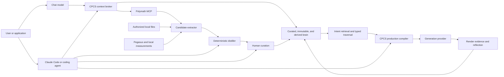
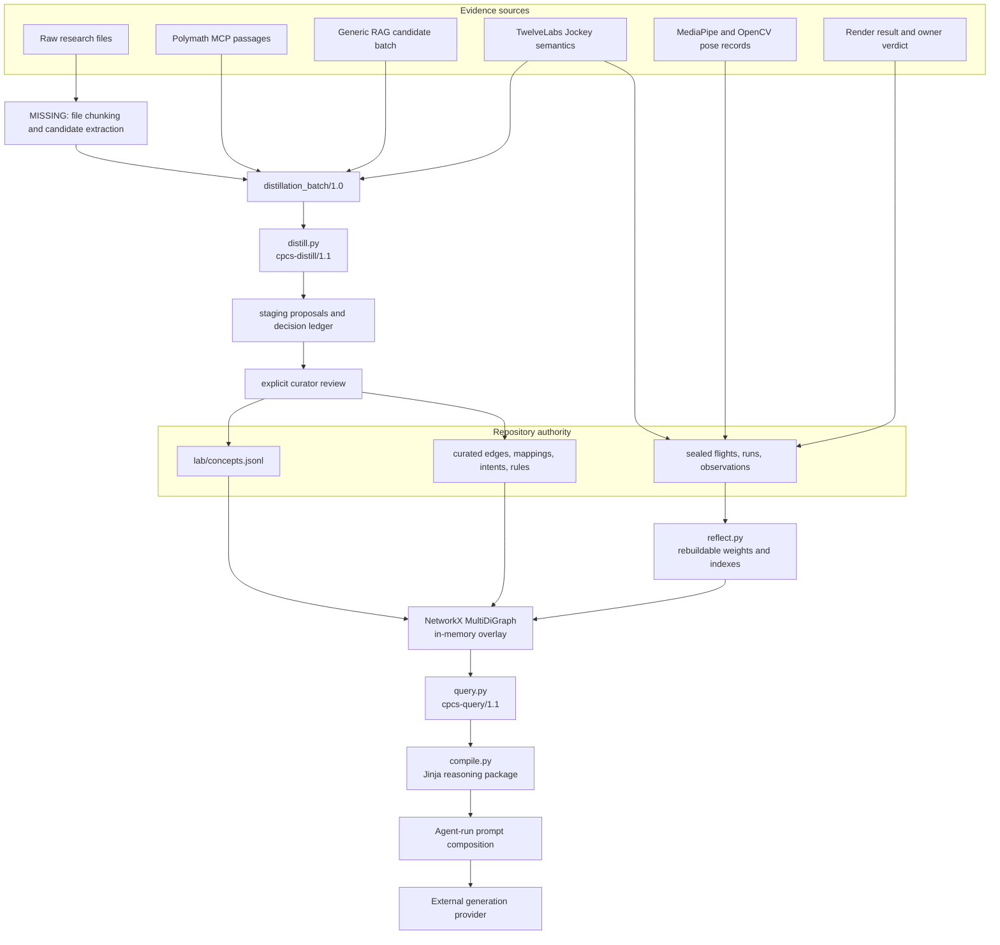
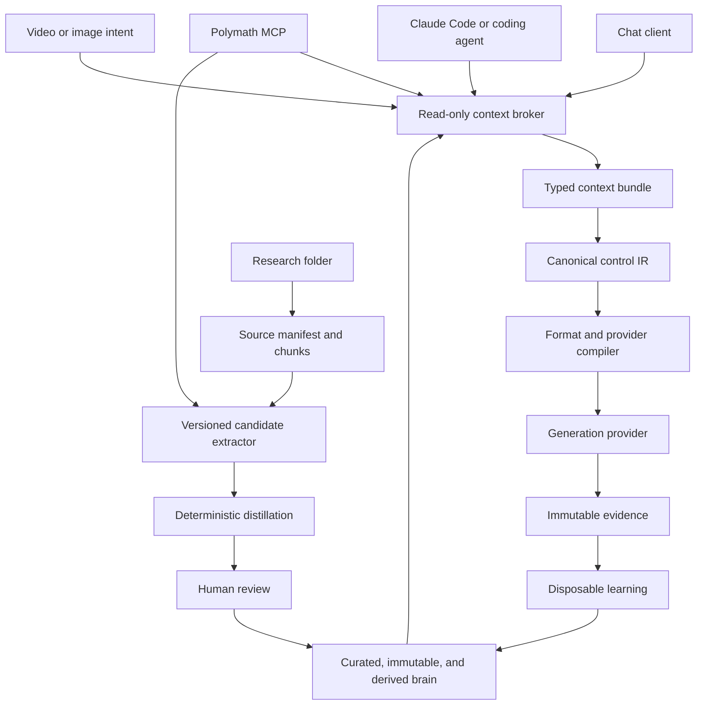

# Codebase Intent Gap Analysis: CPCS Production Architecture

**Verdict:** FAIL
**Repository:** `/Users/king/Documents/New project`
**Plan:** owner request for one production architecture, end-to-end pipeline, dependency map, gap review, and future alignment
**Revision:** `3db5dcef5f4902ac7343b79a3d9bdae7dc17fc7e` on `codex/second-brain`; the baseline implementation was uncommitted at audit time
**Audited at:** 2026-08-02T11:37:12-06:00

The repository gate is green, but the stated product loop is not yet an end-to-end production
system. The highest-impact fault is traversal drift: a query for `Laban effort decimal spatial
movement` compiled an unrelated VFX color control because every traversable neighbor can enter the
selection after the initial root match. The second major gap is before distillation: the repository
accepts already-structured candidate batches but has no owned path from a folder of Markdown, JSON,
YAML, or XML to source chunks and candidate records. The repository also has no read-only context
broker, stable `cpcs` command, or MCP server, so chat and coding agents cannot yet consume one shared
trust-preserving interface.

This file is the architecture source of truth. Root and subsystem `AGENTS.md` files govern how an
agent edits the repository. Runbooks govern procedures. Frozen `research/` packages supply upstream
evidence. `lab/second_brain/IMPLEMENTATION_PLAN.md` remains a dated audit of the control-plane slice.

## Intent Contract

### Product intent

CPCS is intended to behave as a research-backed video direction system. It should turn a creative
goal and a growing body of research into a source-traceable control package for an image or video
model. Render results should feed back into later selection without allowing an LLM, retrieval
provider, or learned association to silently rewrite curated truth.

CPCS is Claude Code-first, but not Claude Code-dependent. The core remains headless and owns the
knowledge, reasoning, compilation, and evidence contracts. Claude Code is the primary repository
operator. Chat models, Codex, other coding agents, local models, and applications are clients of the
same CLI or MCP boundary rather than alternate knowledge authorities.

The intended loop has five outcomes:

1. Accept authorized research files, RAG passages, video semantics, measurements, and render
   verdicts with source identity and content hashes.
2. Extract atomic concepts and proposed relationships, detect duplicates, place each new concept
   under existing knowledge, and reject orphan knowledge.
3. Retrieve relevant concepts for a creative goal, traverse only useful typed hops, explain every
   selection, and return a token-budgeted context bundle or ask for more research when coverage is
   missing.
4. Compile the selected knowledge into provider-aware prose, YAML, JSON, XML, or a layered package
   where each format has a declared control role.
5. Record exact experiments and provider observations, derive disposable learned associations, and
   use those associations only as evidence-weighted ordering signals.

### Primary users and decisions

| User or actor | Decision | Required output |
|---|---|---|
| Repository owner | Accept, merge, refine, or reject new knowledge | review record and durable IDs |
| Claude Code or repository operator | Implement, validate, curate, compile, test, and maintain CPCS | verified changes through stable CPCS contracts |
| Chat or directing client | Choose performance, motion, camera, format, and realism controls | read-only context or explainable prompt package |
| Research and distillation agent | Fill a named knowledge or graph gap | hashed candidate batch |
| Experiment and media operator | Extract or compare controlled media evidence | typed observations, sealed runs, metrics, and verdicts |

### Acceptance criteria

The production path is accepted only when one command or service job can ingest an authorized
folder, produce reviewable candidate bundles, promote an approved bundle, retrieve it for a matching
goal, compile a provider-ready package, record a render, and rebuild learned outputs. Every stage
must support replay, bounded failure, durable lineage, and a verifier through the same public path.
The same headless core must also return read-only chat context without changing curated, immutable,
derived, or staging stores. Claude-specific code cannot own business rules or be required at runtime.

### Constraints and non-goals

| Constraint | Architectural consequence |
|---|---|
| `research/` is frozen | new findings enter staging and curated lab stores, never upstream files |
| Human authority owns truth | retrieval and extraction may propose; only curation may promote |
| IDs survive refactors | fingerprints aid deduplication but never replace durable curated IDs |
| Semantic evidence is not measurement | Pegasus output cannot claim exact joints, force, contact, or FACS intensity |
| Learned data is disposable | derived files must rebuild byte-identically from curated and immutable inputs |
| The repository is file-backed | current persistence is JSONL, JSON, YAML, CSV, Git, and ignored `work/` artifacts |
| Clients do not own knowledge | Claude Code, chat models, and MCP hosts call CPCS contracts but cannot redefine authority |
| Read and write surfaces differ | ordinary chat receives read tools; curation and immutable writes require an explicit operator boundary |
| LLM extraction is bounded | models receive selected passage packets, never an entire large source file as one prompt |

The system is not currently a hosted service, a vector database, a production graph database, a
general chat-memory product, or an autonomous truth authority. TwelveLabs analyzes media; it is not
the video-generation backend. Claude Code is not the second brain, and query-time Polymath results
are not repository knowledge.

### System boundary



### Agent, Polymath, and chat operating surfaces

CPCS is a headless directing and knowledge-control system. It has three interfaces with different
authority: Polymath supplies evidence, chat consumes temporary context, and Claude Code operates the
repository. They share one CPCS core and cannot promote themselves into competing knowledge stores.

Polymath supports two paths. The query-time path is read-only and ephemeral:

```text
user question
-> CPCS intent and domain classification
-> curated second-brain retrieval
-> Polymath retrieval when coverage is incomplete
-> typed graph expansion with path-level relevance checks
-> conflict, prerequisite, and duplicate resolution
-> evidence reranking and token-budget packing
-> context bundle for the requesting client
```

The governed distillation path proposes a knowledge write:

```text
named knowledge gap
-> Polymath passages with source IDs, locators, hashes, and retrieval metadata
-> bounded LLM candidate extraction
-> distillation_batch/1.0
-> deterministic duplicate, placement, reference, and dependency checks
-> staged proposals
-> explicit human review
-> curated promotion
```

### Bounded LLM distillation contract

Large documents never enter an LLM request as one payload. CPCS owns the source boundary and uses
the model as a bounded interpretation worker:

1. Deterministic discovery and format parsing produce a heading tree, stable locators, chunk IDs,
   byte hashes, media types, and normalized text.
2. Whole-document orientation sends only title, metadata, table of contents, heading tree, a short
   summary, and current CPCS coverage. The model returns section references, not knowledge records.
3. Section-level retrieval selects a configurable packet, initially 4 to 12 passages within a hard
   token and byte budget, for one named research goal.
4. Structured LLM extraction proposes atomic records and cites only passage IDs present in the
   request.
5. Schema validation, deterministic admission, review, and curation decide whether a proposal can
   enter repository authority.

The extractor request carries existing concept references and closed output instructions. A packet
has this logical shape before the adapter builds `distillation_batch/1.0`:

```json
{
  "research_goal": "How does Laban Flow affect restrained acting direction?",
  "existing_concepts": [
    "c_laban_flow",
    "c_restrained_performance"
  ],
  "source_passages": [
    {
      "source_id": "source_001",
      "locator": "section_12.3",
      "content_hash": "sha256:...",
      "text": "..."
    }
  ],
  "allowed_outputs": [
    "concept",
    "edge",
    "intent",
    "mapping",
    "rule"
  ]
}
```

The response is an extraction proposal, not a curated record:

```json
{
  "proposals": [
    {
      "proposal_type": "mapping",
      "concept_ref": "c_laban_flow",
      "control_target": "performance.motion_restraint",
      "claim": "Bound Flow can support restrained or contained movement direction.",
      "evidence_refs": ["source_001#section_12.3"],
      "extractor_confidence": 0.78,
      "limitations": [
        "This is a directorial application, not a universal psychological inference."
      ]
    }
  ]
}
```

`extractor_confidence` is a diagnostic ranking hint. It cannot become curated evidence confidence.
The adapter resolves every evidence reference against the request packet, maps accepted fields into
the current candidate schema, and rejects unknown fields or types. A proposed contradiction becomes
a typed `conflicts_with` or `invalid_for` edge; `contradiction` is not a batch proposal type.

Responsibility remains split at a checkable boundary:

| Owner | May do | Must not do |
|---|---|---|
| Source adapter | discover files, parse formats, build headings and chunks, assign locators, hash bytes, retrieve passages | interpret a claim as true or write curated data |
| LLM extractor | propose concepts, definitions, relationships, mappings, rules, contradictions, limitations, merges, refinements, and compiler implications | assign durable IDs, establish truth, authorize numbers, or promote records |
| Deterministic control plane | validate schemas and allowed types, resolve existing IDs, detect duplicates, enforce references and placement, record provenance | invent unsupported meaning or waive review requirements |
| Human curator | verify sources, judge proposed identity and usefulness, assign durable IDs, and authorize promotion | erase immutable history or bypass repository validation |

Version one uses LLM-first extraction, deterministic parsing and chunking, strict structured output,
the existing deterministic control plane, and human promotion. It does not add an encoder-based
relation extractor. Reconsider an encoder only after measurement shows excessive extraction cost,
insufficient throughput, repeated span or offset errors, dominant simple relation types, or a privacy
requirement for a fully local first pass.

Similarity does not establish truth. A retrieved passage can help a chat model answer one request,
but it remains untrusted external evidence until the candidate, distillation, and review path accepts
it. Derived associations remain rebuildable ranking signals. Session context remains temporary.

The context broker must return a typed package rather than inject arbitrary retrieved chunks:

```json
{
  "schema": "cpcs.context_bundle/1.0",
  "request": {
    "query": "Create restrained fear that becomes physical urgency",
    "intent": "directorial_composition",
    "token_budget": 12000
  },
  "curated_knowledge": [
    {
      "concept_id": "c_example",
      "status": "proven",
      "reason_selected": "Matches restrained affect and escalating movement",
      "evidence_ids": ["e_example"],
      "path": ["intent", "requires", "concept"]
    }
  ],
  "retrieved_evidence": [
    {
      "origin": "polymath_mcp",
      "source_id": "source_123",
      "locator": "chapter_4.section_2",
      "content_hash": "sha256:...",
      "evidence_class": "source_passage",
      "passage": "..."
    }
  ],
  "derived_associations": [],
  "conflicts": [],
  "coverage": {
    "covered_terms": [],
    "uncovered_terms": [],
    "additional_retrieval_recommended": false
  },
  "compiler_candidates": [],
  "trust_boundary": {
    "curated_knowledge": "repository_authority",
    "retrieved_evidence": "untrusted_external_evidence",
    "derived_associations": "rebuildable_ranking_signal",
    "session_context": "ephemeral"
  }
}
```

Claude Code reads repository governance, identifies knowledge and implementation gaps, runs context
and traversal canaries, prepares candidate batches, inspects distillation decisions, performs
authorized promotion, changes adapters and compilers, and runs the repository gate. Those actions
must call stable CPCS contracts. Claude-specific business logic is forbidden.

The target MCP surface separates ordinary read access from controlled writes:

| Tool | Authority | Default client access |
|---|---|---|
| `cpcs.status` | read system and provider state | chat and operators |
| `cpcs.context.get` | build a token-budgeted, read-only context bundle | chat and operators |
| `cpcs.reason` | retrieve concepts and typed paths | chat and operators |
| `cpcs.compile` | produce an intermediate or production control package | chat and operators |
| `cpcs.distill.prepare` | retrieve evidence and construct a candidate batch | operators only |
| `cpcs.distill.run` | execute deterministic admission policy | operators only |
| `cpcs.curate.review` | display review requirements and decisions | operators only |
| `cpcs.curate.promote` | write only after explicit human authorization | controlled write |
| `cpcs.record.render` | append immutable render evidence | controlled write |
| `cpcs.reflect.rebuild` | rebuild derived learning state | operators only |

CLI and MCP adapters must call the same application functions and return the same versioned
contracts. Chat deployments normally expose only the first four tools.

## Actual Runtime

### Current state snapshot

The repository contains 132 concept cards, 236 curated authored edges, 45 mappings, one intent, one
rule, five sealed flights, five immutable runs, four distillation runs, and 111 historical proposal
rows. Provenance shows all 111 proposals as promoted, although their append-only staging rows remain
`pending`. The live second-brain graph contains 142 nodes and 241 edges. Derived reflection contains
zero learned edges, zero Pegasus observations, and zero measurement observations.

Of the 236 curated edges, 203 are legacy `pairs_with` associations. The remaining graph contains 21
`refines`, five `applies_to`, four `conflicts_with`, and three `alternative_to` edges. There are no
curated `is_a`, `part_of`, `requires`, `produces`, `valid_for`, or `invalid_for` edges.

The current public surfaces are Python module CLIs under `lab.second_brain.src`. There is no installed
`cpcs` command, MCP server, `cpcs.context_bundle/1.0` schema, token-budget packer, or query-time
Polymath adapter. `AGENT_PROMPT.md` guides coding agents, but guidance is not a runtime interface.
Because the current graph query admits unrelated connected concepts, it is not safe to expose it as
an authoritative chat-context source until the traversal gate and context broker are implemented.

### Runtime topology



Solid arrows exist in code or governed data. The raw-file extractor and provider-generation edges
remain missing or manual.

### Pipeline A: research to curated knowledge

#### A1. Source discovery and retrieval

`lab/second_brain/src/ingest.py` owns two implemented inputs. `inventory` upserts verified corpus
rows into `staging/corpus_manifest.jsonl`; `batch` accepts a JSON object that already satisfies
`distillation_batch.schema.json`. Registered external origins are `polymath_mcp`, `pegasus`, and
`rag_pipeline`. Those origins cannot call the manual proposal route.

The batch pins four classes of lineage:

| Contract area | Required data |
|---|---|
| Retrieval | adapter, corpus ID, query, tool, parameters, retrieval timestamp |
| Extractor | agent, model, prompt hash |
| Candidate | candidate ID, proposal type, suggested ID, proposed record, creator, timestamp |
| Evidence | source ID, locator, claim, SHA-256 content hash |

No repository code currently opens an arbitrary research folder, extracts text from each supported
format, chunks it, calls an extraction model, or assembles this batch. Polymath and prior agents did
that work outside the repository boundary.

#### A2. Deterministic distillation

`lab/second_brain/src/distill.py:728` validates and normalizes the batch. Candidate and evidence
order are sorted before hashing. The run ID is derived from the normalized input hash, policy hash,
and curated-snapshot hash. Replaying the same batch against the same snapshot returns the same run.

Policy `cpcs-distill/1.1` applies these decisions in order:

1. Preserve an existing proposal or curated identity when provenance matches.
2. Reject unhashed evidence and exact record duplicates.
3. Compare concepts by normalized token overlap. A score at least `0.92` is treated as exact; a
   score at least `0.55` requires merge review.
4. Reject references that resolve to neither curated concepts nor same-batch proposed concepts.
5. For each new concept, require a typed structural path to a curated concept plus at least one
   operational edge or executable mapping.

The structural proof accepts `is_a`, `part_of`, or `refines`. The operational bridge accepts
`requires`, `applies_to`, `produces`, or a mapping. `pairs_with` cannot satisfy placement. If a
concept or structural member fails admission, dependent records are rejected in the same run.

This distiller is a deterministic admission policy, not an LLM research reader. It evaluates
structured candidates supplied by another actor. Its similarity function is token-based Jaccard
over name, definition, use case, triggers, and layer. NetworkX supplies graph and shortest-path
operations.

#### A3. Staging and review

Admitted candidates become pending proposals in `staging/proposals.jsonl`; every decision, including
rejections and possible duplicates, remains in `staging/distillation_runs.jsonl`. The current
`staging/rejected.jsonl` file is not used by `distill.py`; rejection lineage lives inside the run.

`lab/second_brain/src/curate.py` requires explicit true values for source verification, source
locator resolution, duplicate review, operational usefulness, relationship validation, and numeric
precision support. The curator assigns durable IDs. External proposals also need an admissible
distillation-run reference.

Bundle promotion writes concepts and intents before dependent edges, mappings, and rules. It takes
byte snapshots of every target file and restores them if a later member fails in the same process.
There is no journal or lock for power loss, process termination, or concurrent writers.

#### A4. Curated ownership

| Record | Authority | Meaning |
|---|---|---|
| Concept | `lab/concepts.jsonl` | atomic vocabulary, triggers, status, evidence, source |
| Edge | `lab/second_brain/curated/edges.jsonl` | authored semantic relationship |
| Mapping | `lab/second_brain/curated/mappings.jsonl` | concept to provider-independent control |
| Rule | `lab/second_brain/curated/rules.jsonl` | data bound to one named Python evaluator |
| Intent | `lab/second_brain/curated/intents.jsonl` | normalized recurring goal |

JSON Schema Draft 2020-12 validates all five stores. Curated IDs must be unique across stores, edge
endpoints must exist, mappings must resolve, and rule evaluator names must exist in Python.

### Pipeline B: goal to traversal and compiled output

#### B1. Live graph assembly

`lab/second_brain/src/graph.py:150` creates a NetworkX `MultiDiGraph` in memory. It overlays curated
concepts and authored edges, immutable flights and evidence nodes, and optional derived learned
edges. It does not persist the live graph.

This live reasoning graph is different from `lab/graph.json`. The latter is a repository-wide
derived index containing research packages, blocks, variants, experiments, runbooks, evidence, and
second-brain records. `lab/scripts/build_graph.py` builds that index and
`lab/scripts/sync_repo.py` checks it for drift. `query.py` does not query `lab/graph.json`.

#### B2. Root retrieval

`lab/second_brain/src/query.py:396` tokenizes the goal, scores every concept from its natural-language
triggers, name, definition, use case, and layer, and chooses at most five roots. Multi-term queries
normally need two overlapping terms, a complete name match, or a one-word trigger match.

Root eligibility filters concept status, excluded layers, and declared encodings. There are no text
embeddings, vector index, BM25 index, reranker, or LLM call in this path. The Marengo embedding
wrapper in the TwelveLabs adapter is not connected to concept retrieval.

#### B3. Hop semantics

The authored edge policy is versioned as `cpcs-edge-policy/1.0`:

| Edge family | Types | Traversal behavior |
|---|---|---|
| Structural | `is_a`, `part_of`, `refines` | bidirectional with named generalize, specialize, part, and whole transitions |
| Operational | `applies_to`, `produces` | bidirectional connection between knowledge and use |
| Dependency | `requires` | bidirectional relation, plus admissibility check for prerequisites |
| Contextual | `alternative_to` | traversable choice |
| Constraint | `conflicts_with`, `valid_for`, `invalid_for` | selection filter, never an expansion hop |
| Legacy | `pairs_with` | low-priority hop, at most one per path and three globally |

Derived learned edges rank below authored hops. Every accepted path row records direction,
transition, family, tier, depth, edge ID, and policy version.

#### B4. Selection behavior and observed drift

After root retrieval, the engine expands every traversable concept neighbor. Candidate priority
considers rules, conflicts, domain validity, encoding, prerequisites, edge rank, depth, and learned
weights. It does not include continuing semantic relevance to the original goal.

The audited command was:

```bash
python3 -m lab.second_brain.src.query reason \
  "Laban effort decimal spatial movement" \
  --minimum-status ingested --include-unproven --maximum-depth 5
```

It selected 11 concepts and reached `c_dual_view_color_integration` through a structural chain. The
compiler then emitted `color.vfx.dual_view_integration` for a Laban spatial-motion query. This is
valid graph connectivity but invalid retrieval precision.

The same request covered three of five query terms. Because coverage equals the `0.6` completion
threshold, `knowledge_gap.status` was `none` and `should_retrieve` was false even though `decimal`
and `spatial` remained uncovered. The result still supplied `decimal spatial` as a suggested query,
creating contradictory control output.

A separate isolated canary confirmed dependency ordering failure. If root concept A `requires`
concept B and B is not also a semantic root, A is rejected for a missing requirement. Rejected nodes
do not expand, so the traversal never visits B and can never retry A.

#### B5. Compilation

`lab/second_brain/src/compile.py:17` resolves mappings for selected concepts, filters provider and
model-specific mappings, runs three named deterministic evaluators, and renders one of four Jinja
templates. `hybrid` currently aliases to JSON.

The output is a reasoning package containing goal, selected concepts, mappings, control IDs, rule
results, paths, evidence, sources, rejections, alternatives, and the knowledge-gap decision. It is
not the full CPCS production compiler described by `lab/FORMAT_CONTROL_MAP.md` and
`lab/UNIVERSAL_MOTION_SKELETON.md`. It does not merge profiles, resolve YAML scope overrides, build
joint or camera tracks, assemble prompt blocks, enforce a provider input budget, or submit a render.

The practical generation workflow remains agent-driven: an agent reads `lab/registry.yaml`,
`lab/blocks.yaml`, profiles, assets, and runbooks, then composes the final prompt. That path is
governed but not implemented as one deterministic program.

### Pipeline C: media analysis, experiments, and learning

#### C1. TwelveLabs transport and Pegasus semantics

`lab/second_brain/src/providers/twelvelabs.py` isolates the provider SDK. It pins API `v1.3`, SDK
`1.3.1`, Jockey for structured responses, and Marengo 3.0 for embeddings. It supports knowledge-store
creation, direct or URL asset upload, bounded asset and item polling, paginated search, strict Jockey
responses, and embeddings.

`lab/second_brain/src/pegasus.py:317` is the governed semantic path. A job binds an authorized asset
reference to a ready knowledge-store item and source interval. The adapter saves canonical request,
raw SDK response, normalized payload, and run snapshots under ignored `work/twelvelabs/`. It sends
the same strict JSON Schema to Jockey and to the local validator.

Semantic items are limited to `inferred` or `interpreted`. One hash-chained immutable observation is
appended before any proposed knowledge enters the shared distiller. Current production execution is
blocked: the SDK, API key, knowledge-store ID, and authorized provider asset are absent.

#### C2. Measurement lane

`lab/scripts/extract_pose_tier2.py` uses optional MediaPipe and OpenCV imports to read an analysis
proxy, detect 2D pose landmarks, associate actors by nearest centroid, keyframe tracks, and write
schema-checked observation records. Its stated evidence class is `detected`, not `measured`, because
camera and subject motion remain entangled.

MediaPipe, OpenCV, and the pose model are not installed or declared in the main second-brain
requirements. No measurement observation has entered the immutable control plane. The wider
reference-video workflow still requires separate frozen research scripts for manifest creation,
observation merging, and graph validation, followed by manual reverse compilation and regeneration.

#### C3. Experiment recording

`lab/second_brain/src/record.py` seals a flight by hashing selected concept contents and locking the
intent, arms, provider, model, seed, and compiler version. A run must match the sealed flight and
include its output hash. Runs and observations form independent append-only hash chains.

The older lab workflow still records five result rows in `lab/runs/results.csv`. Migration created
five immutable flights and five runs, but those legacy records do not link concepts. As a result,
reflection currently reports zero concepts with immutable evidence.

#### C4. Reflection

`lab/second_brain/src/reflect.py` deletes and rebuilds `derived/` from immutable data. It creates
co-occurrence associations for success, failure, and confounded runs. A positive `promotes` edge
requires a seed-controlled pair that differs by one declared control. Provider and measurement
observations create zero-weight `confounded_with` edges.

The reflector also writes coverage, concept-to-evidence indexes, and insights. Two consecutive
rebuilds produce byte-identical files. This mechanism works, but the live dataset produces zero
learned edges because current immutable records contain no usable concept-linked evidence.

### Storage and write authority

| Tier | Store | Writer | Mutation model | Read consumers |
|---|---|---|---|---|
| Frozen | `research/` | none in normal operation | SHA-protected upstream package | agents, build scripts |
| Curated | concepts and `curated/` | `curate.py` or reviewed Git edit | append or reviewed edit | graph, query, compiler, recorder |
| Immutable | `immutable/` | `record.py`, governed Pegasus path | append-only hash chain | graph, reflector, validator |
| Derived | `derived/` | `reflect.py` | delete and rebuild | graph, query, coverage review |
| Staging | `staging/` | inventory adapter and distiller | resumable, non-authoritative | curator, validator, status |
| Temporary | `work/` | query and provider adapters | ignored and disposable | operator and replay diagnostics |

`validate.py:55` enforces these actor-to-path boundaries before programmatic writes. It is a local
path check, not an operating-system permission boundary. Direct manual file edits remain possible.

### Direct dependencies and module roles

Versions below come from `lab/second_brain/requirements.txt`; installed versions were checked on
2026-08-02.

| Module | Declared or observed version | Where used | Actual responsibility | License and primary source |
|---|---|---|---|---|
| NetworkX | `>=3.2,<4`; installed `3.2.1` | `graph.py`, `query.py`, `distill.py` | in-memory `MultiDiGraph`, neighbors, paths, parallel typed edges | BSD-3-Clause, [networkx/networkx](https://github.com/networkx/networkx) |
| jsonschema | `>=4.18,<5`; installed `4.25.1` | `validate.py`, optional pose validation | checks 16 second-brain schemas with `Draft202012Validator` | MIT, [python-jsonschema/jsonschema](https://github.com/python-jsonschema/jsonschema) |
| Jinja2 | `>=3.1,<4`; installed `3.1.6` | `compile.py`, four templates | strict rendering of reasoning packages | BSD-3-Clause, [pallets/jinja](https://github.com/pallets/jinja) |
| PyYAML | `>=6,<7`; installed `6.0.3` | migration, registry and experiment validation, frozen compilers | safe parsing of YAML control data | MIT, [yaml/pyyaml](https://github.com/yaml/pyyaml) |
| MediaPipe | optional; not installed | `extract_pose_tier2.py` | on-device 2D pose landmarks | Apache-2.0, [google-ai-edge/mediapipe](https://github.com/google-ai-edge/mediapipe) |
| OpenCV Python | optional; not installed | `extract_pose_tier2.py` | video decode, frame access, color conversion | Apache-2.0 for current releases, [opencv/opencv](https://github.com/opencv/opencv) |
| TwelveLabs Python SDK | pinned `1.3.1`; not installed | `providers/twelvelabs.py` | vendor API transport | public source at [twelvelabs-io/twelvelabs-python](https://github.com/twelvelabs-io/twelvelabs-python); no root license file was present during this audit, so this document does not classify it as open source |

The second brain is custom CPCS code. It does not use LangChain, LlamaIndex, Mem0, Microsoft
GraphRAG, Neo4j, Qdrant, Chroma, FAISS, Weaviate, or a relational database.

### Open-source systems considered for future slices

These projects are references, not current dependencies:

| Project | Relevant capability | Fit decision |
|---|---|---|
| [Microsoft GraphRAG](https://github.com/microsoft/graphrag) | LLM extraction of entities and relationships from raw text, local and global graph search | study its extraction and evaluation contracts; do not import its graph as curated truth |
| [LlamaIndex](https://github.com/run-llama/llama_index) | document readers, transformations, cached ingestion pipelines, property-graph adapters | candidate for the missing raw-folder adapter behind CPCS batch schemas |
| [Qdrant](https://github.com/qdrant/qdrant) | persistent dense and sparse retrieval with metadata filters | defer until corpus scale or latency proves file-backed retrieval inadequate |
| [Mem0](https://github.com/mem0ai/mem0) | conversational and agent memory with multi-signal retrieval | poor primary fit for evidence-governed research truth; useful only for user/session preferences outside curated knowledge |

Any adoption must remain behind the existing versioned batch or query boundary. No external module
may become a second curated authority.

### Operational and security model

The current runtime is a set of Python CLIs. There is no package build metadata, lockfile, container,
service process, HTTP API, MCP server, context broker, scheduler, queue, database migration system,
CI workflow, telemetry, or deployment definition. Installation uses `pip` against bounded
requirement ranges.

Provider secrets are read from environment variables and the doctor command returns booleans rather
than values. Provider request and response bodies are saved under ignored `work/`. Source authorization
is represented by a job's asset reference and content hash; the repository does not implement user
authentication, access control, encryption, secret rotation, data retention, or remote artifact
deletion.

## Gap Matrix

| ID | Requirement | Expected evidence | Observed evidence | Status | Impact | Dependency | Smallest remediation | Verifier |
|---|---|---|---|---|---|---|---|---|
| REQ-001 | Governed repository routing and validation | one routed source of truth plus executable drift and integrity gates | entrypoint: `python3 lab/scripts/validate_repo.py`; wiring: root and lab routes call sync, control-plane validation, and tests; outcome: derived graph and registered artifacts remain aligned; verification:PASS gate green with 23 behavioral tests and zero warnings | WORKING | prevents file and authority drift | none | preserve the gate and route this document | `python3 lab/scripts/validate_repo.py` |
| REQ-002 | Frozen research package boundary | sync detects additions, removals, aliases, cards, and index coverage | entrypoint: `python3 lab/scripts/sync_repo.py`; wiring: research directories map through `PAPER_ALIASES` to cards and index entries; outcome: frozen packages remain source evidence rather than writable authority; verification:PASS `SYNC GREEN` | WORKING | protects upstream evidence | REQ-001 | keep package admission in the sync contract | `python3 lab/scripts/sync_repo.py` |
| REQ-003 | Versioned structured RAG intake | public command accepts lineage-complete batches and blocks direct external proposals | entrypoint: `python3 -m lab.second_brain.src.ingest batch`; wiring: batch schema calls shared distiller and write-boundary checks; outcome: four durable distillation runs and 111 proposal rows; verification:PASS ingest, distill, and bypass tests | WORKING | gives all retrieval providers one contract | REQ-001 | retain the batch schema as the only external knowledge port | `python3 -m unittest lab.second_brain.tests.test_distill lab.second_brain.tests.test_curate` |
| REQ-004 | Raw file or Polymath passage to candidate batch | one command parses MD, JSON, YAML, and XML, creates stable heading-aware chunks and hashes, or accepts retrieved passages; it selects a bounded evidence packet, invokes structured LLM extraction, and emits the batch schema | targeted searches of non-research source found no document reader, heading-aware chunker, orientation pass, evidence-packet selector, extractor-model port, folder CLI, or raw-source ledger; `ingest.py` accepts only prebuilt JSON batches | MISSING | the requested growing knowledge base cannot turn supplied research into candidates without an out-of-repository agent | REQ-003 | add one source adapter and extractor port that persist source hashes, normalized chunks, passage selection, model and prompt identity, then emit `distillation_batch/1.0`; never send a complete large file to the model | canary ingests a large fixture twice, proves each LLM request stays within passage and token budgets, resolves every cited locator, and produces one identical batch and run ID |
| REQ-005 | Deterministic deduplication, placement, and bundle decisions | normalized replay, exact and probable dedup, connected placement, dependency reconciliation, and decision lineage | entrypoint: `run_distillation`; wiring: policy `cpcs-distill/1.1` hashes input, policy, and curated snapshot then checks duplicates and connectivity; outcome: 225 durable candidate decisions; verification:PASS distillation and Laban decimal tests | WORKING | prevents orphan and duplicate concepts | REQ-003 | version thresholds and retain decision fixtures | `python3 -m unittest lab.second_brain.tests.test_distill` |
| REQ-006 | Explicit reviewed promotion with rollback | exact bundle assignments, source review, durable lineage, dependency order, and failure rollback | entrypoint: `curate bundle`; wiring: concepts and intents precede dependent members and byte snapshots restore touched stores; outcome: 111 proposals resolve through curated provenance; verification:PASS promotion and rollback tests | WORKING | keeps retrieval separate from truth authority | REQ-005 | add a journal before claiming crash recovery | `python3 -m unittest lab.second_brain.tests.test_curate` |
| REQ-007 | Typed graph coverage | operational knowledge uses structural, dependency, operational, contextual, and constraint edges rather than loose associations | 203 of 236 curated edges are `pairs_with`; six declared edge types have zero curated instances; current traversal therefore depends mainly on legacy associations | PARTIAL | nesting and use-specific hops are too sparse for stable director reasoning | REQ-006 | migrate high-use clusters from `pairs_with` into evidence-backed typed edges without deleting historical IDs until queries are equivalent | edge-distribution gate plus domain query fixtures |
| REQ-008 | Goal-relevant traversal | every selected non-root concept remains relevant to the goal and compiled controls do not cross domains without an explicit bridge | command for Laban spatial movement selected dual-view VFX color integration and compiled `color.vfx.dual_view_integration`; neighbor priority has no goal-relevance term after roots | PARTIAL | connected but unrelated concepts contaminate prompts | REQ-007 | add path-level relevance and intent or domain gating, then require a minimum marginal contribution before selection | regression test asserts the Laban query excludes color controls while retaining Laban mappings |
| REQ-009 | Dependency-correct traversal | a concept with `requires` causes prerequisite selection before dependent admission | isolated public-query canary rejected a matching root for missing prerequisite and returned zero selected concepts because rejected nodes do not expand or retry | PARTIAL | future dependency edges can make valid concepts unreachable | REQ-007 | schedule prerequisites ahead of dependents and retry the dependent after requirement closure | public-query test with A `requires` B selects B then A |
| REQ-010 | Honest knowledge-gap feedback | any material uncovered term produces a retrieval request with consistent fields | Laban decimal query covered 3 of 5 terms; status was `none` and `should_retrieve=false` while `uncovered_terms` and suggested query contained `decimal spatial` | PARTIAL | missing research can be silently treated as covered | REQ-008 | make required or high-information uncovered terms trigger `partial`; test field consistency | query test asserts nonempty uncovered terms cannot return contradictory no-retrieval state under the selected policy |
| REQ-011 | Explainable reasoning package compiler | public command emits controls and preserves selection, path, rule, source, evidence, and gap trace | entrypoint: `python3 -m lab.second_brain.src.compile`; wiring: query results feed curated mappings, evaluators, and strict Jinja templates; outcome: JSON, YAML, XML, or prose reasoning package on stdout; verification:PASS compile path exercised by curation test and live audit command | WORKING | makes control selection inspectable | REQ-008 | preserve as an intermediate representation, not the final provider compiler | `python3 -m unittest lab.second_brain.tests.test_curate` |
| REQ-012 | Provider-ready CPCS prompt compiler | one production path merges profiles, blocks, mappings, precedence, timed motion truth, format ownership, budgets, and provider constraints | searches found only the intermediate reasoning renderer plus frozen or agent-run authoring procedures; no live compiler consumes `blocks.yaml`, profiles, and second-brain mappings together | MISSING | the repository cannot deterministically produce the final video-model request it describes | REQ-008 and REQ-011 | define one canonical control IR and compile it through profile resolution, blocks, format serializers, and provider adapters | golden fixtures for UGC, cinematic ad, fight, dance, image prompt, and mixed-format package |
| REQ-013 | Evidence-driven learning loop | production runs link concepts and isolated deltas, then reflection produces evidence-backed learned edges | reflection entrypoint and byte-identical rebuild work, but five migrated runs link no concepts; coverage reports zero concepts with immutable evidence and zero learned edges | PARTIAL | the second brain does not yet learn from current renders | REQ-012 | record the next real experiment through sealed flight and run contracts with concept IDs and one tested delta | rebuild yields expected learned edge and query trace cites its run IDs |
| REQ-014 | Production TwelveLabs semantic analysis | installed pinned SDK, credentials, authorized asset, completed Jockey response, immutable observation, and distillation lineage | provider and Pegasus code have fake-client tests; doctor reports SDK absent, API key false, store false, and no production observations | BLOCKED | video semantics cannot yet enter the live repository | credential, store, authorized media | install the pinned SDK, configure a dedicated store, and run one authorized job | `python3 -m lab.second_brain.src.pegasus extract work/twelvelabs/job.json` |
| REQ-015 | Measured reference-video lane | installed local pose dependencies, validated observation output, immutable measurement handoff, reverse compile, regenerate, and round-trip comparison | MediaPipe and OpenCV script exists, but dependencies are absent, immutable measurements are zero, and reverse compilation plus regeneration remain manual | PARTIAL | exact movement reconstruction is not a closed loop | approved test clip and REQ-012 | declare optional pose dependencies, add a measurement adapter, and automate one low-risk round-trip fixture | authorized short-clip run produces observation, compiled score, regenerated artifact, and diff record |
| REQ-016 | Operable end-to-end production job | one idempotent job owns state transitions, retries, resume, cancellation, locking, metrics, and failure recovery | no service, orchestrator, job ledger, lock, queue, deployment unit, CI workflow, telemetry, or cross-process transaction exists | MISSING | operators must coordinate every stage manually and concurrent writers can corrupt JSONL | REQ-004, REQ-012, REQ-013, and REQ-018 | add one local job runner with a journal and file lock before considering a hosted service | kill-and-resume canary finishes exactly once without duplicate curated or immutable records |
| REQ-017 | Read-only context broker with query-time Polymath evidence | versioned context bundle combines curated concepts, relevant typed paths, external passages, conflicts, coverage, trust labels, deduplication, and token-budget accounting without persistent writes | targeted searches found no context-bundle schema, broker, token counter, query-time Polymath adapter, or mutation canary; current query can return unrelated connected concepts | MISSING | chat clients cannot safely consume CPCS and may confuse retrieved evidence with curated truth | REQ-008 and REQ-010 | add `cpcs.context_bundle/1.0` and one broker that calls reason, retrieves external evidence only for a declared gap, reranks, deduplicates, and packs within budget | identical `git status --short` before and after `cpcs context get`, plus schema and forbidden-concept assertions |
| REQ-018 | Shared headless CLI and MCP interfaces | one application service backs a stable `cpcs` CLI and versioned MCP tools with read-only defaults and explicit write authorization | Python module CLIs exist, but searches found no `cpcs` executable, MCP server registration, transport-neutral application facade, tool authorization policy, or contract parity tests | MISSING | Claude Code, chat, and future clients would need client-specific orchestration and could drift into separate authorities | REQ-017 and REQ-011 | expose existing status, reason, and compile behavior plus the new context broker through one application facade, then add CLI and MCP adapters | CLI and MCP contract tests return equivalent normalized payloads; chat profile cannot invoke promotion or immutable writes |
| REQ-019 | Time-aware validity and supersession | concepts and relationships can declare validity intervals and replacement links; queries can retrieve current or historical knowledge as of a named time | schema and source searches found timestamps in provenance and immutable events but no `valid_from`, `valid_until`, `supersedes`, replacement traversal, or as-of query parameter | MISSING | refactors and changing provider guidance cannot be queried without losing historical meaning or serving stale controls | REQ-007 and REQ-006 | add one versioned temporal policy and schema fields, preserve durable IDs, and make current plus as-of traversal deterministic | fixtures prove current selection follows the replacement while an earlier as-of query returns the prior concept and source trace |

## Directory Contract

### Current ownership

| Capability | Current owner | Public contract | Test owner |
|---|---|---|---|
| Repo governance and architecture | `AGENTS.md`, `ARCHITECTURE.md` | routing and validation commands | `sync_repo.py`, `validate_repo.py` |
| Prompt authoring knowledge | `lab/registry.yaml`, `blocks.yaml`, profiles, assets | agent procedures and record schemas | repo gate and experiment files |
| Curated concepts and relations | `lab/concepts.jsonl`, `lab/second_brain/curated/` | 16 JSON Schemas and curation CLI | `lab/second_brain/tests/` |
| Evidence and learned state | `immutable/`, `derived/` | recorder, reflector, query CLIs | record, reflect, query tests |
| External semantic transport | `providers/twelvelabs.py`, `pegasus.py` | provider functions and job schemas | fake-client provider tests |
| External agent guidance | `AGENT_PROMPT.md` | pasteable operating instructions | repository gate only; no runtime contract test |

### Target ownership for missing slices

| Missing capability | Target owner | Boundary rule |
|---|---|---|
| Raw research ingestion | `lab/second_brain/src/sources/` or one equivalent adapter module | emits batches only; cannot stage or curate directly |
| Extraction model | provider-neutral extractor port under the source adapter | receives only bounded passage packets; returns candidate records plus model and prompt hashes; never assigns durable IDs or evidence confidence |
| Context broker | one application service under `lab/second_brain/src/` | read-only; returns a versioned context bundle and cannot write any tier |
| CLI and MCP adapters | thin adapters over the same application service | transport code contains no traversal, authority, or compilation rules |
| Temporal knowledge policy | second-brain schemas, query policy, and curation migration | preserves durable IDs and source history; current and as-of reads are deterministic |
| Canonical prompt compiler | `lab/compiler/` only after a routed vertical slice is admitted | consumes curated query output, profiles, and blocks; no knowledge writes |
| Job orchestration | one `lab/jobs/` owner only after local runner behavior is specified | journals state and calls public CLIs or functions; no second data authority |
| Generation providers | adapters behind the compiler job boundary | submit and retrieve artifacts; immutable recorder owns evidence |

Forbidden dependencies remain: external adapters to curated files, reflector to curated writes,
query to persistent graph mutation, compiler to staging, provider transport to repository authority,
and generated output to `research/`.

Current mismatches are the manual bridge between prompt lab and second brain, optional pose
dependencies outside a declared extra, hard-coded Polymath capability metadata in `ingest.py`, and
two separate graph products whose names do not make their different purposes obvious. Agent guidance
also describes procedures that have no matching transport-neutral application contract.

## Remediation Order

### Slice 1: make traversal precise before adding more knowledge

Add goal relevance at every hop, correct prerequisite scheduling, and make knowledge-gap fields
consistent. Exit when the audited Laban query selects Laban and motion controls without VFX color,
and a `requires` fixture selects prerequisites before dependents. Rollback is the query-policy code
and version plus new tests; curated data does not change.

### Slice 2: own raw-source and Polymath candidate preparation

Implement one local adapter for Markdown, JSON, YAML, and XML. Persist a source manifest with byte
hash, media type, normalized chunks, extractor identity, prompt hash, and emitted candidate IDs.
Build deterministic heading-aware chunks, run an orientation pass over document structure, and send
only selected section packets through the same extractor port used for source-traceable Polymath
passages. Enforce passage-count, byte, and token budgets before each model call. Output the existing
batch schema and call the existing distiller. Exit when replay is byte-identical, every evidence
reference resolves to a hashed passage, no request contains a whole large fixture, and a Laban
decimal fixture reaches reviewable staging with its structural and operational bundle. Rollback
deletes staging rows created by the fixture and ignored source artifacts.

### Slice 3: add the read-only context broker and shared client contracts

Define `cpcs.context_bundle/1.0` and a transport-neutral application facade. The broker classifies
intent and domain, calls curated retrieval, requests Polymath passages only for declared gaps,
applies typed expansion and path relevance, resolves conflicts and prerequisites, reranks and
deduplicates evidence, then packs the result within a declared token budget. Expose status, context,
reason, and compile through one `cpcs` CLI and MCP read profile. Exit when CLI and MCP outputs match
and a context request leaves every repository tier byte-identical. Rollback removes the adapters and
schema without changing curated data.

### Slice 4: deepen typed and temporal knowledge, then build the production compiler

Use query logs and domain fixtures to replace high-use `pairs_with` routes with sourced structural,
dependency, operational, alternative, and constraint edges. Add versioned validity and supersession
semantics with current and as-of traversal. Then define a provider-neutral control IR with intent,
profile inheritance, scope precedence, timed motion tracks, performance, camera, audio, format
ownership, constraints, source trace, and loss notes. Connect second-brain mappings and prompt-lab
blocks to that IR. Compile to prose, YAML, JSON, XML, and declared combinations. Exit with temporal
query fixtures and golden provider-ready outputs for representative video and image goals. Rollback
keeps prior records and the current reasoning package readable.

### Slice 5: connect providers, evidence, and operations

Add generation-provider adapters behind the compiler boundary and a journaled local job runner with
locking and resume. Run one authorized experiment through compilation, provider submission, artifact
hash, metrics, verdict, reflection, and a later query. Configure TwelveLabs only after the job runner
can preserve request, response, and failure state. Exit when interruption and replay produce one
immutable outcome and the learned trace names its evidence. Rollback stops at the last immutable
record; immutable history is never deleted.

The target production flow is:



## Verification Record

| Check | Result | Evidence and limit |
|---|---|---|
| Repository gate | exit 0 | 13 gate groups, 23 second-brain tests, zero warnings; integrity gate does not measure retrieval quality |
| Control-plane validator | exit 0 | 16 schemas, curated and immutable references, staging lineage, two byte-identical reflection rebuilds |
| Current data | observed | 132 concepts, 236 curated edges, 45 mappings, five flights, five runs, zero learned edges |
| Ingestion status | observed | 80 corpus items, four distillation runs, 225 decisions, 111 effectively promoted proposals |
| Laban query canary | semantic failure reproduced | selected unrelated VFX color concept and suppressed retrieval for two uncovered terms |
| Dependency canary | semantic failure reproduced | public `reason()` path rejected A requiring B, selected neither, and produced no path |
| Pegasus doctor | blocked | SDK not installed, API key absent, knowledge-store ID absent |
| Optional pose runtime | blocked | `mediapipe` and `opencv-python` not installed; no immutable measurement rows |
| Deployment search | absent | no container, service, job queue, API framework, CI workflow, lockfile, or package build metadata outside frozen research |
| Client-interface search | absent | no `cpcs` executable, MCP server, context-bundle schema, token packer, or query-time Polymath broker |

Commands used:

```bash
python3 /Users/king/.codex/skills/codebase-intent-gap-analysis/scripts/inventory.py \
  --repo "/Users/king/Documents/New project"
python3 lab/scripts/validate_repo.py
python3 -m lab.second_brain.src.validate control-plane
python3 -m lab.second_brain.src.ingest status
python3 -m lab.second_brain.src.distill status
python3 -m lab.second_brain.src.graph stats
python3 lab/scripts/concepts.py stats
python3 -m lab.second_brain.src.pegasus doctor
```

### Required acceptance canaries for the missing client interfaces

These commands define the contract for REQ-017 and REQ-018. They do not run in the current
repository because the `cpcs` CLI and MCP adapter are `MISSING`.

Read-only context must not mutate repository authority:

```bash
git status --short
cpcs context get --query "restrained fear escalating into urgent movement"
git status --short
```

The two Git outputs must be identical. Polymath evidence must remain external until review:

```bash
cpcs distill prepare --source polymath --gap "body connectivity"
cpcs distill run work/distillation_batch.json
```

This may append staging decisions and proposals. It must not modify curated concepts or immutable
history. Traversal precision must exclude unrelated controls:

```bash
cpcs reason "Laban effort decimal spatial movement"
```

The result must exclude VFX color controls. Deterministic replay must return the same distillation
run ID when the batch, policy, and curated snapshot are unchanged:

```bash
cpcs distill run work/distillation_batch.json
cpcs distill run work/distillation_batch.json
```

The repository gate remains the final integrity check:

```bash
python3 lab/scripts/validate_repo.py
```

## Residual Unknowns

| Unknown | Why unresolved | Exact next check |
|---|---|---|
| Production TwelveLabs response compatibility | no SDK, credentials, store, or authorized asset in this environment | run one bounded authorized Jockey job and archive its request and response artifacts |
| Generation-provider prompt acceptance | no generation provider adapter or contract exists | choose one target model and validate one canonical IR serializer against its current API |
| Retrieval precision across the whole corpus | tests cover policies and canaries, not a labeled benchmark | create at least one expected-concept and forbidden-concept set per priority domain |
| Concurrency behavior | file-backed writers have no lock and tests are single-process | run two competing staging, curation, and recorder processes against an isolated repository |
| Scale limit for NetworkX and JSONL | 132 concepts are too small to expose latency or memory pressure | benchmark ingest, build, query, and rebuild at 10x and 100x cloned-but-uniquely-IDed fixtures |
| Two Polymath records with zero chunks | upstream retrieval returned no content | reingest those source records and repeat the corpus manifest pass |
