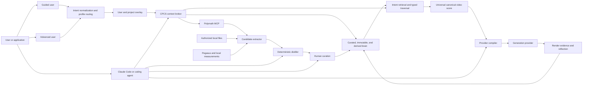
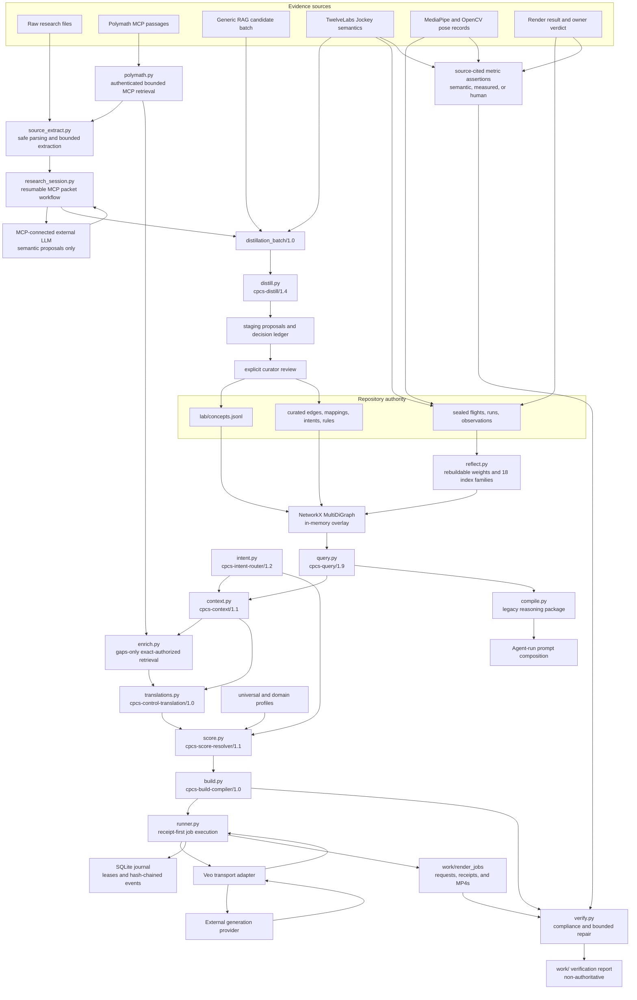
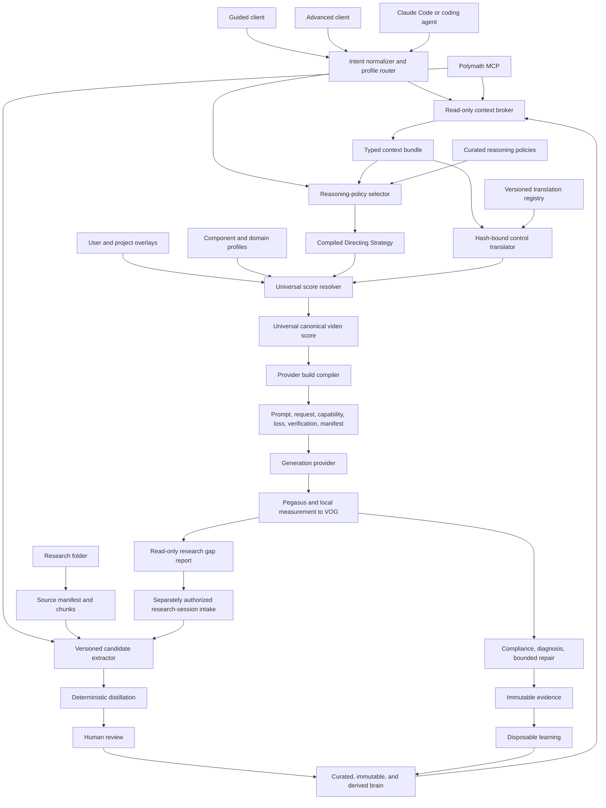

# Codebase Intent Gap Analysis: CPCS Creative Reasoning Operating System

**Verdict:** FAIL
**Repository:** `/Users/king/Documents/New project`
**Normative target:** owner-approved CPCS Creative Reasoning Operating System plan, technical stack, implementation sequence, and production acceptance contract
**Plan:** one universal creative-reasoning kernel, one canonical score, one evidence-governed learning loop, many research domains, reasoning policies, prompt formats, providers, and model harnesses
**Revision:** `codex/reference-side-by-side` at `7f3fa2e0314a779ec78ae63b1a5167f6ce86ae2c` plus the current Research-to-Reasoning Qualification working slice
**Audited at:** 2026-08-07

## Normative Target Architecture

CPCS is not primarily a prompt library or prompt generator. It is a universal, provider-neutral
creative-reasoning and directorial-compilation system. Its primary intellectual artifact is the
**Compiled Directing Strategy**. The fully resolved canonical JSON score is the semantic authority.
Natural language, YAML, JSON, XML, their hybrid combinations, reference prompts, control media, and
provider requests are authoring inputs or execution projections. None may silently become another
semantic authority.

The target loop is:

```text
ordinary user or project intent
→ persisted project context
→ normalized intent and domain routing
→ source-grounded retrieval and typed graph reasoning
→ creative-mechanism and reasoning-policy selection
→ Compiled Directing Strategy
→ universal canonical score
→ provider capability and format negotiation
→ journaled provider execution
→ Pegasus semantic analysis plus local measurement
→ verification, contradiction preservation, diagnosis, and bounded repair
→ immutable session and experiment evidence
→ derived working-pattern and failure-card discovery
→ reviewed strategy qualification
→ future evidence-informed retrieval and compilation
```

One kernel owns project, intent, entities, scenes, shots, beats, actions, performance, motion,
interaction, camera, editing, audio, marketing, style, continuity, constraints, assets, provenance,
provider realization, and verification. Domain profiles configure this kernel. They cannot introduce
parallel root schemas, ontologies, authority stores, scores, or compilers. The knowledge graph stores
reusable concepts, claims, equations, methods, reasoning policies, creative mechanisms, compiler
recipes, provider knowledge, and strategy evidence. A Video Observation Graph describes one media
asset. Bridges between them are explicit and evidence traceable.

The target data plane keeps Git-versioned repository JSONL and schemas as durable knowledge
authority. MongoDB projects source, metadata, and extraction-session documents; Qdrant projects
multi-resolution retrieval candidates; Neo4j projects the full typed reasoning graph; Redis carries
ephemeral coordination only; S3-compatible storage carries dense media. Neo4j is not the reasoning
policy and no database becomes repository truth. Python still owns goal relevance, prerequisite
closure, conflicts, temporal validity, applicability, ranking, and deterministic admission. Every
database view must be deletable and rebuildable from repository authority plus admitted immutable
records. These are target deployment responsibilities, not claims about the current file-backed
local release. Existing owners must be extended behind stable ports without creating simultaneous
old and new business logic.

Implementation priority is categorical:

1. Complete the no-manual-mapping Pegasus observation-to-verification bridge.
2. Build the Research Intelligence Plane with first-class claims, equations, methods, mechanisms,
   structured-block preservation, and complete source-unit dispositions.
3. Migrate high-value production paths from generic associations to typed relationships.
4. Add immutable session traces, compiler recipes, working-pattern and failure-card derivation,
   reviewed strategy promotion, and later retrieval.
5. Complete persisted project context and asset-reference portability.
6. Complete the governed local measurement and authored-versus-generated comparison lane.
7. Qualify all intended TwelveLabs surfaces with authorized live evidence.
8. Run controlled natural-language, YAML, JSON, XML, and hybrid compiler-format experiments from
   identical canonical meaning.
9. Qualify the no-manual-bridge live end-to-end loop.

Priority 6 now has an executable operational slice: `cpcs.verify.reference.compare` binds two exact
authorized local videos, detects and aligns cuts, compares hash-bound ASR pace and 2D pose speed,
preserves declared review lanes, and renders a time-normalized left/right contact sheet. It remains
partial until these diagnostics feed a build-bound generated-artifact qualification with reviewed
identity, product, text, and higher-tier measurement evidence.

The owner-supplied plan reported an older Slice 15/16 state. That report is historical context, not
the current repository state. The audited implementation and gap matrix below control current-state
claims. Production authority remains disabled until every categorical gate in the Production
Authority Contract passes with exact revision-bound evidence.

The repository gate is green, but the stated product loop is not yet an end-to-end production
system. Query safety, intent normalization, profile routing, the read-only context broker, and one
universal score resolver, hash-bound research-to-control translator, and non-submitting provider
build compiler now provide a governed ordinary-language-to-provider-request path. The end-user
path now reaches a journaled, transport-only Veo execution boundary and a deterministic local
render-verification boundary and a controlled immutable-evidence and derived-calibration loop, but
still lacks live-provider qualification. The
owned source extractor now turns authorized local folders and typed Polymath passages into hashed,
bounded, reviewable candidate bundles without promoting knowledge. Its bounded worker packets name
relevant existing concepts and a closed output vocabulary, preserve explicit equation blocks, and
can carry first-class claim, equation, method, and creative-mechanism proposals through the same
distillation, review, promotion, indexing, reasoning, and context path. Curated records now support
validated validity intervals and supersession, current and historical reads share one temporal
policy, and reflection rebuilds a schema-checked retrieval catalog that now includes typed-object
lexical and cross-object link views. A source-bounded
TwelveLabs cascade now separates Analyze, Segment, Batch, Search, Jockey, and Marengo; normalizes
semantic and local-measurement evidence into a contradiction-preserving Video Observation Graph;
and reverse-compiles through the same universal score kernel before immutable handoff. This path is
contract- and fake-client-qualified, but no live provider asset was supplied, so production response
compatibility remains blocked. The render runner validates exact build bytes, leases one SQLite
writer, captures a provider request and operation receipt, resumes polling without duplicate
submission, quarantines ambiguous submissions, retrieves hash-bound artifacts, and redacts
credentials. Its Veo adapter has not run against live credentials, and the provider exposes no
documented request idempotency key or remote-cancel method. The verifier now prepares hash-bound
artifact-upload and score-closed Pegasus analysis jobs, converts normalized score-compliance
observations into assertions without caller-authored mapping, locally checks media identity and
metadata, keeps semantic, measured, and human-review lanes distinct, preserves
disagreements, executes closed product-visibility and per-hand 2D-curvature comparators, and can only reassert an existing
canonical control. Verified renders can now enter a content-addressed run that binds the sealed
experiment, canonical build, score, request, provider, profiles, concepts, blocks, assets, seed,
artifact, compliance report, metrics, and human review. Reflection permits a causal `promotes`
signal only when two evidence-complete arms isolate one predeclared control and its target is an
explicitly sealed outcome concept; bundled observations remain noncausal and provider/model filters
survive into query-time ranking. One shared application service now exposes deterministic request
and response envelopes through the installed `cpcs` command, MCP stdio, loopback HTTP, headless
clients, and a session-bound `cpcs-ui` graphical surface. Ordinary language can reach a
materialized build in one call. Guided users can review detected profiles, conflicts, missing
inputs, references, score controls, and build identity; advanced users submit compiler-validated
overlays and use the same role-filtered operation catalog. The same
service now reaches the real TwelveLabs surface dispatcher, journaled render runner, and compliance
verifier. Every public TwelveLabs surface execution now claims one local attempt and writes a
content-bound completion receipt over the exact job, result, request, response, and normalized
artifacts. Exact retries replay locally without constructing a provider client; changed jobs,
tampered artifacts, and incomplete attempts fail closed before resubmission. Chat, operator, and
curator catalogs are distinct. External provider calls, cancellation,
reconciliation, curated writes, and immutable writes require authorization bound to the exact
request. A bounded local
single-worker release now adds a wheel and installed command, exact dependency locks, CI definition,
versioned journal migrations, hash-verified backup and non-overwriting restore, request limits,
content-free telemetry, security scans, parser fuzzing, and a categorical qualification report.
External gate evidence now requires a revision-bound `2.0` bundle, a policy-registered evaluator
whose HMAC secret fingerprint and allowed gate scope are committed, and exact verification of every
relative artifact path, byte size, and SHA-256. The default evaluator registry is empty, so no agent
can self-approve a release by supplying status text and arbitrary hash strings.
Every versioned second-brain writer now enters one repository-wide nonblocking POSIX transaction
lock before reading authority. Staging, curation, immutable recording, migrations, reflection, and
the cross-tier Pegasus handoff therefore reject a competing local process before mutation. Nested
roles reuse one owner, and process death releases the kernel lock without stale-lock deletion.
Supported multi-file reasoning, context, compiler, graph, index, status, reflection, and
source-coverage reads now hold the same transaction in shared mode. Readers may coexist across
processes, while a writer remains exclusive, so one supported read sees a before-or-after snapshot.
Every curated promotion now also prepares a content-bound before/after journal before atomic target
replacement. Missing commit markers roll back on the next curation; committed markers preserve the
after state. Hard-kill canaries cover death during preparation, after one member, and after all
members, while journal or target tampering fails closed.
These controls are locally qualified, but the release is deliberately not production-qualified:
closed-world annotation, calibration, held-out evaluation, live generation and analysis providers,
graph-write promotion, and authenticated remote deployment remain absent. Networked Polymath MCP
retrieval now works through an exact-authorized operator boundary. The context-enrichment operation
runs local retrieval first, makes no external call when coverage is complete, and retrieves only the
broker's exact declared gap query when an operator authorizes the complete request.
An MCP-connected external LLM can now operate the bounded semantic extraction boundary through a
resumable session. The application registers exact source bytes or typed Polymath passages, exposes
packet list and read operations, captures one schema-constrained result per packet, rejects source
or response drift, assembles a content-hashed response, validates proposals without mutation,
stages through the existing deterministic distiller, and prepares the existing human review. These
records remain private ignored operational state; curated authority changes only through the
separate curator-only promotion operation.

This file is the architecture source of truth. Root and subsystem `AGENTS.md` files govern how an
agent edits the repository. Runbooks govern procedures. Frozen `research/` packages supply upstream
evidence. `lab/second_brain/IMPLEMENTATION_PLAN.md` remains a dated audit of the control-plane slice.

## Intent Contract

### Product intent

> **CPCS is a universal AI video-intent generator and creative-direction compiler that turns a
> user's goal into an evidence-informed, provider-ready video production plan.**

The end user should not need to understand graphs, FACS, Laban, Pegasus, schemas, retrieval policy,
serialization formats, or provider adapters. The visible product accepts ordinary language,
references, duration, platform, constraints, and preferences. The internal system normalizes that
input, selects or blends domain profiles, retrieves relevant knowledge, reasons through conflicts
and prerequisites, builds one canonical score, negotiates provider capabilities, emits a production
package, and verifies the render.

UGC, advertising, cinema, dialogue, action, anime, VFX, music video, education, social content, and
custom projects are specialized interpretations of one video-intent language. They are not separate
products, ontologies, canonical schemas, or compilers.

FACS and Laban are the first researched control domains and regression fixtures, not the product
boundary, privileged ontology roots, or a fixed vocabulary ceiling. VAD, Bartenieff, BML,
time-varying affect, uncertainty, multimodal disagreement, expression versus internal state,
individual style, posture, gaze, movement, voice, context, emotion blends, dominance or submission,
and future research frameworks must enter through the same generic concept, edge, mapping,
translation, profile, experiment, and evidence contracts. A framework earns operational influence
only when its claims have source lineage, reviewed placement, an explicit canonical-score target,
declared limitations, and a verifier. No framework may bypass the universal score, evidence tiers,
conflict policy, or curation gate.

CPCS is Claude Code-first, but not Claude Code-dependent. The core remains headless and owns the
knowledge, reasoning, compilation, and evidence contracts. Claude Code is the primary repository
operator. Chat models, Codex, other coding agents, local models, and applications are clients of the
same CLI or MCP boundary rather than alternate knowledge authorities.

The intended user path has seven outcomes:

1. Normalize an ordinary-language request into domain, task, audience effect, workflow, hard
   constraints, soft preferences, and missing inputs.
2. Apply user and project context without turning preferences into curated knowledge.
3. Select or blend domain profiles that configure one universal score contract.
4. Retrieve relevant concepts, prior evidence, provider observations, and external passages through
   the governed knowledge path.
5. Resolve prerequisites, conflicts, locks, alternatives, unsupported controls, and allowed creative
   variation into one canonical score.
6. Compile provider requests, prompts, reference instructions, capability and loss reports, and a
   verification plan from that score.
7. Record renders and verdicts, verify outputs, and rebuild evidence-backed recommendations without
   letting learned data rewrite curated truth.

The knowledge-growth path remains separate. It accepts authorized research, RAG passages, media
semantics, measurements, and experiment records; extracts atomic proposals; performs deterministic
deduplication and placement; and requires explicit curation before promotion. New research may
extend the vocabulary and graph without creating a parallel ontology or silently treating a model's
interpretation as scientific truth.

### Primary users and decisions

| User or actor | Decision | Required output |
|---|---|---|
| Guided end user | Describe a video, provide references, choose duration or platform, and review detected intent | canonical score summary and provider-ready build |
| Advanced end user | Edit beats, performance, motion, camera, timing, contacts, profile blend, and verification thresholds | the same canonical score with explicit overrides and conflicts |
| Repository owner | Accept, merge, refine, or reject new knowledge and product contracts | review record and durable IDs |
| Claude Code or repository operator | Implement, validate, curate, compile, test, and maintain CPCS | verified changes through stable CPCS contracts |
| Research and distillation agent | Fill a named knowledge or graph gap | hashed candidate batch |
| Experiment and media operator | Extract or compare controlled media evidence | typed observations, sealed runs, metrics, and verdicts |

### Acceptance criteria

The product path is accepted only when an ordinary-language request can travel through the same
public runtime used by guided and advanced clients: normalized intent, profile resolution, governed
knowledge context, canonical score, provider build, render record, verification, and later learning.
Representative UGC, cinematic dialogue, action or anime, product demonstration, and blended-profile
fixtures must share one score schema and differ only through typed data and rules. Every stage must
support replay, bounded failure, durable lineage, and a verifier through the same public path.

The knowledge-growth acceptance path remains: authorized folder or passage input, bounded candidate
extraction, deterministic distillation, explicit promotion, later retrieval, and source trace. The
same headless core must return read-only client context without changing curated, immutable, derived,
or staging stores. Claude-specific code cannot own business rules or be required at runtime.

### Constraints and non-goals

| Constraint | Architectural consequence |
|---|---|
| `research/` is frozen | new findings enter staging and curated lab stores, never upstream files |
| Human authority owns truth | retrieval and extraction may propose; only curation may promote |
| IDs survive refactors | fingerprints aid deduplication but never replace durable curated IDs |
| Semantic evidence is not measurement | Pegasus output cannot claim exact joints, force, contact, or FACS intensity |
| Learned data is disposable | derived files must rebuild byte-identically from curated and immutable inputs |
| The repository is file-backed | current persistence is JSONL, JSON, YAML, CSV, Git, and ignored `work/` artifacts |
| Clients do not own knowledge | Claude Code, chat models, and MCP hosts call CPCS contracts but cannot redefine authority |
| Read and write surfaces differ | ordinary chat receives read tools; curation and immutable writes require an explicit operator boundary |
| LLM extraction is bounded | models receive selected passage packets, never an entire large source file as one prompt |
| One universal score owns video meaning | profiles and providers configure or project that score; none may fork it |
| User and project context is an overlay | preferences affect selection and compilation but do not become curated research truth |
| Automatic routing is the default | clients show detected profiles and allow correction; they do not require domain expertise |
| Guided and advanced modes share data | advanced editing exposes more fields but never changes the underlying score contract |

The system is not currently a hosted service, a vector database, a production graph database, a
general chat-memory product, or an autonomous truth authority. TwelveLabs analyzes media; it is not
the video-generation backend. Claude Code is not the second brain, and query-time Polymath results
are not repository knowledge.

### System boundary



### Universal kernel and domain profiles

The universal score owns the stable video language:

```text
project, intent, entities, shots, beats, actions, performance, motion, interaction,
camera, editing, audio, marketing function, style, continuity, constraints, assets,
provenance, provider disposition, verification
```

Domain profiles extend that contract with required layers, defaults, composition rules, conflicts,
preferred workflows, serialization preferences, and verification metrics. A domain profile may
blend existing component profiles such as movement, capture, camera, performance, screen action,
and style. It cannot add a parallel canonical schema or knowledge authority.

The intended profile contract has this logical shape:

```json
{
  "profile_id": "profile://ugc/product_demo/1.0",
  "extends": ["profile://universal/video/1.0"],
  "required_layers": [
    "marketing",
    "performance",
    "product_interaction",
    "camera"
  ],
  "defaults": {},
  "composition_rules": [],
  "conflicts": [],
  "preferred_workflows": [],
  "verification_metrics": []
}
```

Merge precedence is deterministic:

```text
universal defaults
-> domain profiles
-> user defaults
-> project profile
-> scene overrides
-> shot overrides
-> event locks
```

Later defaults may override earlier defaults. Hard constraints and event locks never silently drop.
A named dominance rule resolves each conflict; unresolved conflicts become explicit user decisions.
Automatic routing is the default, but the detected profile set remains visible and editable.

### User build contract

Guided and advanced clients operate on the same canonical score. Guided clients show the original
request, detected intent and profiles, missing inputs, major constraints, and a render action.
Advanced clients expose score fields and provider projections without creating a second authoring
format.

A successful build is intended to produce:

```text
build/
├── canonical_score.json
├── provider_request.json
├── prompt.txt
├── reference_still_prompt.txt
├── capability_report.json
├── loss_report.json
├── verification_plan.json
└── build_manifest.json
```

`canonical_score.json` preserves provider-neutral meaning. `provider_request.json` and `prompt.txt`
are projections. `capability_report.json` names supported controls. `loss_report.json` records what
the selected provider cannot represent. `verification_plan.json` defines observable checks.
`build_manifest.json` binds every artifact to intent, profiles, concepts, evidence, compiler policy,
provider, model, assets, and hashes.

### Product surfaces

The intended product hierarchy has seven surfaces over one kernel:

| Surface | Responsibility |
|---|---|
| Intent Studio | ordinary-language planning, detected intent, missing inputs, and score editing |
| Reference Intelligence | Pegasus and measurement analysis, segmentation, and recreation inputs |
| Creative Compiler | canonical score, merge policy, capability negotiation, and provider builds |
| Domain Profiles | UGC, advertising, cinema, dialogue, action, anime, VFX, music, education, and custom configuration |
| Knowledge Brain | research, concepts, graph reasoning, provenance, and evidence |
| Render Lab | controlled alternatives, provider comparisons, and experiment records |
| Verification and Learning | output checks, verdicts, immutable evidence, and rebuildable recommendations |

### Agent, Polymath, and chat operating surfaces

CPCS is a headless directing and knowledge-control system. It has three interfaces with different
authority: Polymath supplies evidence, chat consumes temporary context, and Claude Code operates the
repository. They share one CPCS core and cannot promote themselves into competing knowledge stores.

Polymath supports two paths. The query-time path is read-only and ephemeral:

```text
user question
-> CPCS intent and domain classification
-> curated second-brain retrieval
-> Polymath retrieval when coverage is incomplete
-> typed graph expansion with path-level relevance checks
-> conflict, prerequisite, and duplicate resolution
-> evidence reranking and token-budget packing
-> context bundle for the requesting client
```

The governed distillation path proposes a knowledge write:

```text
named knowledge gap
-> Polymath passages with source IDs, locators, hashes, and retrieval metadata
-> bounded LLM candidate extraction
-> distillation_batch/1.0
-> deterministic duplicate, placement, reference, and dependency checks
-> staged proposals
-> explicit human review
-> curated promotion
```

### Bounded LLM distillation contract

Large documents never enter an LLM request as one payload. CPCS owns the source boundary and uses
the model as a bounded interpretation worker:

1. Deterministic discovery and format parsing produce a heading tree, stable locators, chunk IDs,
   byte hashes, media types, and normalized text.
2. Whole-document orientation sends only title, metadata, table of contents, heading tree, a short
   summary, and current CPCS coverage. The model returns section references, not knowledge records.
3. Section-level retrieval selects a configurable packet, initially 4 to 12 passages within a hard
   token and byte budget, for one named research goal.
4. Structured LLM extraction proposes atomic records and cites only passage IDs present in the
   request.
5. Schema validation, deterministic admission, review, and curation decide whether a proposal can
   enter repository authority.

The extractor request carries existing concept references and closed output instructions. A packet
has this logical shape before the adapter builds `distillation_batch/1.0`:

```json
{
  "research_goal": "How does Laban Flow affect restrained acting direction?",
  "existing_concepts": [
    "c_laban_flow",
    "c_restrained_performance"
  ],
  "source_passages": [
    {
      "source_id": "source_001",
      "locator": "section_12.3",
      "content_hash": "sha256:...",
      "text": "..."
    }
  ],
  "allowed_outputs": [
    "concept",
    "edge",
    "intent",
    "mapping",
    "rule",
    "claim",
    "equation",
    "method",
    "mechanism"
  ]
}
```

The response is an extraction proposal, not a curated record:

```json
{
  "proposals": [
    {
      "proposal_type": "mapping",
      "concept_ref": "c_laban_flow",
      "control_target": "performance.motion_restraint",
      "claim": "Bound Flow can support restrained or contained movement direction.",
      "evidence_refs": ["source_001#section_12.3"],
      "extractor_confidence": 0.78,
      "limitations": [
        "This is a directorial application, not a universal psychological inference."
      ]
    }
  ]
}
```

`extractor_confidence` is a diagnostic ranking hint. It cannot become curated evidence confidence.
The adapter resolves every evidence reference against the request packet, maps accepted fields into
the current candidate schema, and rejects unknown fields or types. A proposed contradiction becomes
a typed `conflicts_with` or `invalid_for` edge; `contradiction` is not a batch proposal type.

Responsibility remains split at a checkable boundary:

| Owner | May do | Must not do |
|---|---|---|
| Source adapter | discover files, parse formats, build headings and chunks, assign locators, hash bytes, retrieve passages | interpret a claim as true or write curated data |
| LLM extractor | propose concepts, definitions, relationships, mappings, rules, contradictions, limitations, merges, refinements, and compiler implications | assign durable IDs, establish truth, authorize numbers, or promote records |
| Deterministic control plane | validate schemas and allowed types, resolve existing IDs, detect duplicates, enforce references and placement, record provenance | invent unsupported meaning or waive review requirements |
| Human curator | verify sources, judge proposed identity and usefulness, assign durable IDs, and authorize promotion | erase immutable history or bypass repository validation |

Version one uses LLM-first extraction, deterministic parsing and chunking, strict structured output,
the existing deterministic control plane, and human promotion. It does not add an encoder-based
relation extractor. Reconsider an encoder only after measurement shows excessive extraction cost,
insufficient throughput, repeated span or offset errors, dominant simple relation types, or a privacy
requirement for a fully local first pass.

Similarity does not establish truth. A retrieved passage can help a chat model answer one request,
but it remains untrusted external evidence until the candidate, distillation, and review path accepts
it. Derived associations remain rebuildable ranking signals. Session context remains temporary.

The context broker must return a typed package rather than inject arbitrary retrieved chunks:

```json
{
  "schema": "cpcs.context_bundle/1.1",
  "request": {
    "query": "Create restrained fear that becomes physical urgency",
    "intent": "directorial_composition",
    "token_budget": 12000
  },
  "curated_knowledge": [
    {
      "concept_id": "c_example",
      "status": "proven",
      "reason_selected": "Matches restrained affect and escalating movement",
      "evidence_ids": ["e_example"],
      "path": ["intent", "requires", "concept"]
    }
  ],
  "retrieved_evidence": [
    {
      "origin": "polymath_mcp",
      "source_id": "source_123",
      "locator": "chapter_4.section_2",
      "content_hash": "sha256:...",
      "evidence_class": "source_passage",
      "passage": "..."
    }
  ],
  "derived_associations": [],
  "conflicts": [],
  "coverage": {
    "covered_terms": [],
    "uncovered_terms": [],
    "additional_retrieval_recommended": false
  },
  "compiler_candidates": [],
  "trust_boundary": {
    "curated_knowledge": "repository_authority",
    "retrieved_evidence": "untrusted_external_evidence",
    "derived_associations": "rebuildable_ranking_signal",
    "session_context": "ephemeral"
  }
}
```

Claude Code reads repository governance, identifies knowledge and implementation gaps, runs context
and traversal canaries, prepares candidate batches, inspects distillation decisions, performs
authorized promotion, changes adapters and compilers, and runs the repository gate. Those actions
must call stable CPCS contracts. Claude-specific business logic is forbidden.

The target MCP surface separates ordinary read access from controlled writes:

| Tool | Authority | Default client access |
|---|---|---|
| `cpcs.status` | read system and provider state | chat and operators |
| `cpcs.intent.normalize` | normalize user input and detect editable profiles | chat and operators |
| `cpcs.context.get` | build a token-budgeted, read-only context bundle | chat and operators |
| `cpcs.reason` | retrieve concepts and typed paths | chat and operators |
| `cpcs.score.build` | resolve one provider-neutral canonical video score | chat and operators |
| `cpcs.build.compile` | project a validated score into provider build artifacts | chat and operators |
| `cpcs.distill.prepare` | retrieve evidence and construct a candidate batch | operators only |
| `cpcs.distill.run` | execute deterministic admission policy | operators only |
| `cpcs.curate.review` | display review requirements and decisions | operators only |
| `cpcs.curate.promote` | write only after explicit human authorization | controlled write |
| `cpcs.experiment.prepare` | validate exact application builds and construct an experiment draft | operators only |
| `cpcs.experiment.seal` | append an authorized immutable flight | controlled write |
| `cpcs.record.testimonial.capture` | bind exact human wording to verified artifact bytes | controlled write |
| `cpcs.record.testimonial.review` | append source-spanned normalization and correction lineage | controlled write |
| `cpcs.testimonial.inspect` | read raw and reviewed correction heads | operators only |
| `cpcs.record.render` | append immutable render evidence | controlled write |
| `cpcs.experiment.accept` | accept every complete isolated arm, invoke existing reflection, and record the diff and unreviewed candidates | controlled write |
| `cpcs.reflect.rebuild` | rebuild derived learning state | operators only |

CLI and MCP adapters must call the same application functions and return the same versioned
contracts. Chat deployments normally expose only the read-only product and reasoning tools above
the distillation boundary.

## Actual Runtime

### Current state snapshot

The repository contains 132 concept cards, 288 curated authored edge records with 195 current heads,
45 mappings, one intent, one rule, six reasoning policies, five sealed flights, five immutable runs, four distillation runs,
and 111 historical proposal
rows. Provenance shows all 111 proposals as promoted, although their append-only staging rows remain
`pending`. The live second-brain graph contains 148 nodes and 207 edges. The all-version Neo4j
projection plan contains 148 nodes and 300 edges. Derived reflection contains
zero learned edges, zero Pegasus observations, and zero measurement observations.
This snapshot is the dirty `codex/reference-side-by-side` working tree on remote-matching base
`7f3fa2e0314a779ec78ae63b1a5167f6ce86ae2c`. Thirty-three tracked files are modified and six files
are untracked. Local green results do not establish a reproducible remote baseline for this slice.

### Research-to-Reasoning Qualification Slice

The research-to-strategy boundary is implemented. The strategy-to-score admission boundary is not.
The current public production path computes the canonical score before compiling the selected
strategy, then returns that strategy beside an already resolved score and build:

```text
current
research and curated graph
→ cpcs.reason and context bundle
→ canonical universal score
→ compiled directing strategy sidecar
→ provider build from the unchanged score
```

The target path remains:

```text
target
research and curated graph
→ cpcs.reason and context bundle
→ selected reasoning policy
→ compiled directing strategy
→ compiler-owned strategy admission
→ canonical universal score
→ provider build
```

`lab/second_brain/curated/reasoning_policies.jsonl` is the Git authority for six selectable
policies. `rp_direct` maps to `DirectExecutor`, `rp_algorithm_of_thoughts` to `AoTExecutor`,
`rp_atom_of_thoughts` to `AtomExecutor`, `rp_chain_of_code` to `CodeExecutor`,
`rp_tree_of_thoughts` to `ToTExecutor`, and `rp_graph_of_thoughts` to `GoTExecutor`.
`reasoning_policy.py` classifies the request, checks required inputs, selects one status-gated
record, executes fixed bounded operations, and emits a hash-bound provider-neutral strategy.
`cpcs.strategy.compile` exposes this path read-only through the shared application and MCP service;
`cpcs.production.prepare` includes the same strategy in its response, but `_score_build()` runs
before `compile_directing_strategy()` and no compiler consumer admits the strategy selections into
the score. None of these
executors performs a model call, arbitrary code execution, or authority write. Their traces contain
operation and evidence IDs rather than private chain-of-thought.

The policies are operationally available at `partial` status. The research methods are marked
`unverified` for CPCS video-output effects, so selection is not a claim that a provider will improve.
Provider, model, task, cost, and quality effects still require controlled experiments and human
verdicts before qualification.

Three graph products remain separate. The research knowledge graph stores reusable concepts,
typed research objects, mappings, reasoning-policy grounding, provenance, and admitted evidence.
The reasoning execution graph exists only inside one compiled-strategy response. The Video
Observation Graph describes one asset or comparison. Policy grounding is projected to Neo4j with
repository locators, while execution traces and VOG internals do not become research truth.

Source extraction policy `cpcs-source-extract/1.3` and parser
`cpcs-safe-document-parser/1.2` bind each processing identity to exact source bytes, parser version,
extraction policy, and structural extractor. Unquoted YAML dates remain safe strings. The closed
semantic proposal vocabulary now includes `reasoning_policy`; `cpcs-distill/1.4` applies the same
schema, deduplication, concept-reference, staging, and explicit-promotion boundary. A no-write
canary over the frozen FACS/Laban package inventoried 39 files, parsed 29 supported files,
dispositioned 7,868 sections, emitted 7,931 located chunks, selected 18 bounded packets, and created
256 structural candidates. It did not call an LLM, stage proposals, promote knowledge, or claim
semantic coverage; the bounded MCP extraction worker and human review remain required for those
steps.

The bounded Bartenieff extraction canary also passed the current public contract. Batch
`batch_dc0eeba65d2781c8257af811` contains two concept proposals and leaves authority unchanged. The
Basic Six inventory is authored concept knowledge with proposed durable ID
`c_bartenieff_basic_six_exercises`; the number six is a taxonomy count, not a measured result, so a
`metric_id` is neither required nor appropriate. Semantic response contract
`cpcs.semantic_extraction_response/1.1` now closes the former empty-result gap. Every new packet
must contain one or more source-cited candidates with `no_candidate: null`, or an explicit
no-candidate reason whose evidence and assessed-chunk coverage exactly equal the bounded packet.
Historical `1.0` captures remain readable but cannot accept another write. The public coverage view
surfaces candidate, no-candidate, pending, and legacy-empty dispositions without changing authority.

### Live ontology, graph, and reasoning bridge plan (2026-08-07)

**Categorical status:** FAIL against the complete target reasoning loop. The control plane safely
separates authority and proposals, and a canonical classification registry now enforces the
current corpus. Strategy-to-score admission remains absent. Ontology placement and graph-growth
planning now exist as staging-only gates, with selective rebuild and automatic Neo4j delta
submission still open.

#### Current ontology contract

CPCS currently owns a Git-authored, schema-validated property ontology. `lab/concepts.jsonl` is the
sole concept-node authority. Curated edges, mappings, policies, rules, intents, and first-class
research objects live under `lab/second_brain/curated/`. `graph.py` builds the NetworkX reference
graph, while Neo4j remains an optional incremental, idempotent, rebuildable read model.

| Semantic class | Current authority | Current state |
|---|---|---|
| reusable concepts | `lab/concepts.jsonl` | 132 records with durable `c_*` IDs |
| concept relationships | `curated/edges.jsonl` | 195 current heads; 148 are legacy `pairs_with` |
| concept-to-control mappings | `curated/mappings.jsonl` | 45 records across prose, YAML, JSON, XML, numeric, and hybrid encodings |
| reasoning policies | `curated/reasoning_policies.jsonl` | six `partial` policies with deterministic executors |
| claims, equations, methods, and mechanisms | four curated JSONL stores | schemas and runtime path exist; the checked-in stores contain one source-closed record of each type |

Relationship types are closed. `cpcs.ontology_registry/1.2` now registers all current concept
kinds, semantic layers, mapping target families, control namespaces, representation roles, and
intentional alias ambiguities. Curated validation rejects unknown classifications, duplicate
normalized names or semantic fingerprints, undeclared alias collisions, and edges outside the
registered family, directionality, endpoint-kind, and layer-root combinations. New research
`pairs_with` candidates fail before staging; existing authored records remain migration-only legacy.
An interpreted Pegasus observation edge may be quarantined in staging for typed reclassification,
but the curation boundary rejects it while its compatibility report is false.
The registry also owns one canonical identifier rule and two initial homonym records. The same
resolver now annotates extraction candidates, controls placement, crosses context-bundle handoff,
and is recomputed at directing-strategy and universal-score admission. Unresolved senses pause or
block instead of being guessed. The current slice still lacks typed control value definitions,
ontology parents, reviewed durable terminology-change promotion, and complete domain inventories.

#### Canonical semantic spine

One governed classification spine must connect broad user intent to exact production controls.
Levels one through five own meaning. Level six owns provider and format projection only.

| Level | Canonical responsibility | Examples |
|---|---|---|
| 1. Intent | desired audience or story effect | believable fear, luxury reveal, readable action |
| 2. Directorial domain | production dimension | affect, performance, movement, camera, lighting, audio, editing |
| 3. Theory or mechanism | source-grounded explanation of the effect | VAD trajectory, Laban effort, Bartenieff connectivity, FACS |
| 4. Technique or operator | directorial action | Bound Flow, AU06 plus AU12, slow head turn, diffused key |
| 5. Canonical control | machine-resolvable score path and value contract | `performance.affect.valence`, `face.facs.AU12`, `camera.motion.dolly_in` |
| 6. Provider projection | loss-accounted serialization | natural language, YAML, JSON, XML, numeric track, provider field |

The implemented `cpcs.ontology_registry/1.2` closes the current concept kinds, layer IDs, mapping
target families, control namespace prefixes, representation roles, reviewed alias ambiguity, and
edge-family compatibility over current endpoint kinds and layer roots. The next registry versions
must add parent links, exact control paths and value types, broader identifier coverage,
deprecations, and reviewed expansion of cross-domain bridge purposes. The registry must not create
another score or ontology. Existing
human-readable concept names and research terminology remain aliases around canonical IDs.

For example, research claiming that decimal spatial coordinates improve directed Laban movement
must be placed and traversed as:

```text
controlled spatial movement intent
→ movement domain
→ Laban Space mechanism
→ decimal spatial-path technique
→ motion.spatial_path.keyframes
→ YAML, JSON, XML, numeric, or prose provider projection
```

Its graph links must explain why each hop exists: `refines` Laban Space, `applies_to` character
blocking, `requires` a coordinate frame and time interval, `conflicts_with` deliberately unstable
movement, and `produces` a reproducible trajectory. A generic `pairs_with` edge cannot admit a
production-critical hop.

#### Time-aware knowledge substrate for LLM use

The graph is an LLM-facing semantic substrate, not a bag of document chunks. Durable identity,
typed meaning, source evidence, operational use, and time remain separate fields so an agent can
answer what a concept means, why it is connected, how it affects video direction, which evidence
supports it, and when that answer was valid or known.

| Record family | Owns | Does not own |
|---|---|---|
| canonical term or concept | stable identity, preferred name, aliases, domain path | whether every claim about it is true |
| claim | one source-grounded proposition, support, contradiction, limitations | durable concept identity |
| method, mechanism, equation, or rule | procedure, explanation, calculation, or enforced relation | source authority or provider behavior |
| control and mapping | canonical score path, value type, admissible translation | the provider projection itself |
| source, evidence, and review | exact bytes, locator, epistemic class, reviewer decision | reusable directing meaning without promotion |
| derived association | disposable ranking signal scoped to evidence and policy | truth, identity, or promotion |

The projection may expose these records as one connected read graph, but Git stores preserve their
authority class. Relationships use closed families: structural, operational, dependency,
epistemic, contextual, temporal, and projection. Every returned path carries edge type, direction,
source, validity, scope, policy version, and admission reason. The context broker packs the selected
subgraph into a bounded contract; an LLM never receives arbitrary Cypher authority or treats graph
reachability as relevance.

Time requires separate axes:

1. `source_time` records publication, observation, or authored effective time when the source gives
   one.
2. `valid_time` records when CPCS considers a concept, claim, relationship, mapping, or rule
   applicable to the represented world or provider scope.
3. `system_time` records when CPCS registered, reviewed, promoted, superseded, or retired the record,
   bound to the promotion transaction and repository revision.
4. `media_time` belongs only to an asset timeline, VOG observation, generated artifact, or timed
   canonical control.

Current `cpcs-temporal/1.0` implements active heads, inclusive `valid_from`, exclusive
`valid_until`, reciprocal supersession, `current`, `historical`, and `all_versions` views. It does
not implement a `known_at` system-time query. That means a source backfilled in 2026 with a 2024
valid date could appear in a 2025 historical-validity query even though CPCS had not ingested it.
The target `cpcs-temporal/2.0` is bitemporal: `valid_at` answers what applies at a represented time;
`known_at` answers what the repository knew at a system time; both together reproduce the exact
knowledge available to an earlier agent. Existing version-one records remain readable through
explicit migration defaults rather than rewritten history.

Corrections append successors. They do not mutate old claims or edges. Contradictory current claims
may coexist when sources disagree; query-time conflict policy chooses neither silently. Provider,
model, task, duration, and evidence scopes remain additional validity dimensions rather than being
folded into confidence.

#### First-class knowledge maintenance and anti-decay

The second brain must maintain itself through an explicit, bounded control loop. This does not mean
that an LLM can rewrite the graph. An agent initiates and explains maintenance; deterministic code
measures health, computes diffs, enforces state transitions, validates repair proposals, rebuilds
derived views, and blocks promotion until an authorized reviewer accepts the exact change.

The current repository has separate pieces of this loop: repository and control-plane validation,
temporal version-one filtering, stable source locators and hashes, source-unit coverage findings,
query gap reporting, reflection rebuilds, index catalogs, Neo4j incremental synchronization, and
projection parity. It does not have one public brain-health operation, a semantic domain-inventory
contract, an exact graph-gap-to-source-answer trace, or a checkpointed maintenance workflow. Those
gaps remain `PARTIAL` or `MISSING` below.

The target loop is a typed state graph:

```text
inspect authority and projections
-> classify decay and coverage gaps
-> produce a bounded repair plan
-> retrieve exact source evidence when the graph cannot answer
-> validate proposals and affected neighborhoods
-> wait for explicit review
-> journal an authorized promotion
-> rebuild only affected derived views
-> qualify retrieval, compilation, and projection parity
-> seal a revision-bound health report
```

Each transition stores input and output hashes, policy versions, allowed next states, and a closed
disposition. Interrupted execution resumes from the last verified checkpoint. A LangGraph adapter
may schedule these nodes and expose resumability, but the framework is not the authority. CPCS
schemas, application operations, journals, guards, and repository records own the state machine so
CLI, MCP, Hermes, Codex, and future clients use the same rules.

Core memory is the concise, repeatedly loadable layer: atomic concepts, claims, controls, rules,
typed relationships, limitations, and source anchors. Whole documents, raw passages, long model
interpretations, provider responses, and asset observations stay in their source, immutable, or
work lanes. Core memory gives the agent a usable summary and a deterministic path back to exact
evidence.

One `cpcs.brain_health_report/1.0` must cover five independent health dimensions:

| Dimension | Required check | Fail-closed behavior |
|---|---|---|
| temporal | current eligibility by valid time, system-known time, supersession, provider, model, task, and policy scope | exclude stale or inapplicable records before ranking and report why |
| provenance | every durable statement, mapping, and edge resolves to registered evidence and exact locators | quarantine the record from current authoritative context |
| semantic coverage | registered domain catalogs compare expected, extracted, staged, curated, mapped, and retrieval-qualified items | return an explicit coverage gap rather than claiming completeness |
| graph and retrieval | no orphans, illegal types, alias collisions, missing prerequisites, unreachable required concepts, or unexplained hops | block affected traversal and produce a repair plan |
| derived parity | indexes and Neo4j match the Git authority snapshot and projection policy | use the qualified reference backend or fail closed according to policy |

Structural extraction coverage cannot prove domain completeness. The target
`cpcs.domain_coverage_manifest/1.0` accounts for every item in a registered vocabulary or
source-declared catalog as expected, extracted, staged, curated, compiler-mapped,
retrieval-qualified, ambiguous, excluded, or missing. Completeness is scoped to the named source,
catalog version, and authorized interval; CPCS must not pretend that one paper enumerates an entire
discipline.

FACS is the first domain-completeness canary, not the ontology boundary or the expected shape of all
research. Given an authorized FACS catalog, the manifest lists
each canonical AU identifier and checks its concept identity, exact definition source, methods and
constraints, `performance.facs.events` mapping, and retrieval fixtures. If a query asks about an AU
that is absent from the graph, the reasoner returns a typed `coverage_gap`. If the source library
contains the answer, a bounded source fallback emits `cpcs.source_answer_trace/1.0` with the original
question, source ID, locator, content hash, exact answer span, evidence class, uncertainty, and the
unanswered graph slot. It may start a proposal, but the passage remains external evidence until
distillation and review promote it.

#### Outcome-aware memory, negative knowledge, and deterministic events

Runs already retain verdicts, human-review rationale, controls, tested deltas, metrics, and evidence
lineage. Testimonial reviews retain the exact human statement, quote-spanned normalization,
dimension findings, strengths, failures, metric findings, attribution candidates, and limitations.
Reflection classifies runs as success, failure, or confounded; creates scoped success, failure,
confounded, and isolated `promotes` edges; and query ranking consumes positive and negative weights.
The accepted-experiment operation stages working patterns and failure cards without promotion.

The missing bridge is explanation. A learned edge exposes the run, artifact, compliance, review ID,
and verdict, but not the review rationale, exact remarks, failed dimensions, limitations, or reason a
result should be avoided. Generic failure associations downrank a candidate by `0.25` per derived
edge and isolated successes can produce a causal positive edge, but there is no typed outcome view
that tells an LLM which specific behavior worked, failed, remained mixed, or became a reviewed
no-go. Derived negative evidence also has no threshold for becoming a blocking curated rule.

The target `cpcs.outcome_memory/1.0` is a derived projection over existing immutable evidence. It
does not duplicate runs or testimonials. Each record binds the tested concepts and controls,
provider, model, intent, task, duration, seed, asset and score hashes, outcome class, passed and
failed dimensions, metrics, exact remark references, reviewed rationale, limitations, causal
status, validity, and evidence threshold. Outcome classes are `success`, `failure`, `mixed`,
`inconclusive`, and `no_go`.

Outcome direction changes traversal under closed rules:

| Outcome | Retrieval and traversal effect | Authority limit |
|---|---|---|
| success | raise rank inside matching provider, model, task, duration, and evidence scope | cannot bypass rules, conflicts, prerequisites, or validity |
| failure | lower rank and return exact failed dimensions and remarks | one failure cannot become a universal rejection |
| mixed | expose tradeoffs and alternative paths without directional weight | requires another controlled test before preference |
| inconclusive | preserve uncertainty and produce an evidence or research gap | cannot influence rank as success or failure |
| no_go | reject only in its reviewed scope and explain the rule, failure card, and evidence | requires curated promotion or another explicit deterministic hard rule |

Every selected, downranked, or rejected path must list the outcome evidence that affected it and the
out-of-scope evidence ignored. This gives the agent positive reasons for good hops, negative reasons
for avoided hops, and exact evidence for no-go decisions.

Knowledge maintenance uses deterministic state folding rather than hidden agent memory. The target
`cpcs.knowledge_maintenance_event/1.0` is append-only and hash chained. Each event records sequence,
prior event hash, actor, operation, state before and after, input and output hashes, policy version,
evidence references, authorization reference, timestamp, disposition, and event hash. The current
state is reproduced by folding events from the registered start state. Retry requires the same
expected state and event head; stale input, skipped state, changed output, or duplicate effect fails.
The event ledger records what happened, while the curation journal remains the only authority-write
mechanism.

FACS and Laban remain seed domains and regression fixtures. The same outcome and event contracts
must support cinematography, lighting, editing, sound, dialogue, VFX, animation, marketing,
provider behavior, future research domains, and cross-domain mechanisms without adding parallel
graphs or domain-specific workflow engines.

#### Graph ownership and use cases

| Graph | Lifetime and authority | Use cases | Forbidden effect |
|---|---|---|---|
| Research knowledge graph | durable Git authority plus rebuildable projections | placement, deduplication, provenance, contradiction, supersession, knowledge gaps, concept-to-control mapping, provider-scoped evidence | cannot contain one asset's raw timeline or promote model output |
| Reasoning execution graph | ephemeral per request | intent decomposition, policy selection, alternatives, conflict resolution, prerequisite closure, cross-domain synthesis, selected and rejected concept trace | cannot become curated knowledge or a second canonical score |
| Video Observation Graph | immutable per asset or comparison | source-bounded observations, measurements, segments, disagreements, and verification evidence | cannot create or modify reusable concepts |
| Video-to-concept bridge | staged or reviewed, explicit and source traceable | candidate support, contradiction, qualification, rejection, and supersession evidence between one observation and one concept | cannot be traversed as reusable concept truth before review |

The VOG schema correctly restricts nodes to source, observation, measurement, and segment types, and
concept traversal rejects non-concept nodes. Raw VOG nodes and edges are absent from the reusable
Neo4j projection. The remaining bridge gap is semantic: model-proposed `candidate_concepts` can
currently become generic `evidenced_by` associations without a complete candidate, reviewed,
rejected, contradicted, or superseded lifecycle.

#### Pegasus analysis-to-research gap loop

Pegasus and local measurement must serve as a governed sensor for the Research Intelligence Plane.
They do not create research truth. A completed content-bound analysis should enter a read-only gap
operation through its exact VOG, source hash, provider request and response hashes, analysis profile,
and authorized interval:

```text
completed Pegasus and local analysis
→ validated Video Observation Graph
→ deterministic observation normalization and salience filter
→ canonical ontology and existing-concept lookup
→ bounded research-graph query and typed path check
→ cpcs.video_research_gap_report/1.0
   ├── matched concepts and supporting observations
   ├── partial matches and missing prerequisites
   ├── contradiction candidates
   ├── uncovered observations and missing control mappings
   └── source-bounded research questions and suggested retrieval queries
→ optional existing research-session intake under separate authorization
→ deterministic distillation, human review, and curated promotion
```

Every research-relevant VOG observation receives one disposition: `matched`, `partial_match`,
`contradicts`, `uncovered`, or `irrelevant_to_research`. Similarity ranks possible anchors but cannot
assign durable identity. The operation must distinguish a missing concept from a known concept that
lacks a method, mechanism, equation, mapping, verification metric, provider qualification, or typed
edge. An LLM may interpret only bounded unmatched or disputed observation packets and may return
proposals; deterministic code owns VOG identity, source closure, canonical IDs, deduplication,
placement, bridge state, and promotion eligibility.

This loop supports two directions without collapsing graph authority:

| Direction | Use case | Output |
|---|---|---|
| research to analysis | test whether a researched control or mechanism appears in a video | expected concept and control coverage compared with source-bound observations |
| analysis to research | detect observed techniques, failures, contradictions, or visual mechanisms missing from current knowledge | gap report, candidate bridge, and bounded research questions |

For example, Pegasus may describe a performer initiating motion from the pelvis while the current
research graph contains Bartenieff Basic Six but no reviewed pelvis-initiation mechanism or control
mapping. The report should preserve the observation, match the broader Bartenieff anchor, mark the
mechanism and control mapping as uncovered, and propose a source-bounded research question. It must
not invent or promote a pelvis-initiation concept from one interpreted video.

#### Governed new-research graph growth

New research grows the graph only through a deterministic placement and admission plan. The LLM
interprets bounded evidence and proposes semantics; it does not decide durable identity, graph
position, edge admission, or promotion.

```text
authorized source bytes or exact retrieved passages
→ byte hashes, source manifest, and stable locators
→ deterministic structural parsing and complete source-unit inventory
→ bounded semantic extraction packets
→ schema-valid concepts, claims, equations, methods, mechanisms, constraints, failures,
  reasoning policies, mappings, and explicit no-result dispositions
→ cpcs.ontology_placement/1.0 for every proposal
→ exact, alias, probable-duplicate, parent, control, and cross-domain resolution
→ cpcs.research_graph_growth_plan/1.0
→ deterministic schema, referential, edge-compatibility, placement, and coverage checks
→ staging and explicit human review
→ journaled curated promotion
→ affected-index rebuild and incremental Neo4j synchronization
→ labeled retrieval, traversal, compiler, and no-regression qualification
```

`cpcs.ontology_placement/1.0` must name the canonical namespace, object class, primary path, secondary
domains, existing matches, proposed typed relationships, canonical control and metric references,
source evidence, disposition, alternatives, and unresolved gaps. Its closed dispositions are
`merge`, `refine`, `extend`, `contradict`, `supersede`, `new`, `no_candidate`, and `needs_review`.
One primary placement prevents duplicate identities; reviewed secondary typed edges preserve
cross-domain meaning.

Current implementation: `lab/second_brain/src/placement.py` now consumes one exact distillation run,
the curated ontology registry, the complete curated snapshot, the local source-unit registry, and
the curator's exact durable-ID assignments. It emits one content-addressed staging-only
`cpcs.research_graph_growth_plan/1.0` with a closed placement for every candidate. The plan records
classification roots, parents and anchors, typed structural and operational members, mappings,
control namespaces, metrics, source units, affected authority stores and derived indexes, plus the
incremental Neo4j projection delta. Exact replay is idempotent. Bundle promotion fails before any
curated write when the plan is missing, stale, blocked, or assignment mismatched, and promoted
provenance retains the plan and placement hashes. The public curation path rebuilds the canonical
derived catalog after promotion. It currently uses the existing full deterministic rebuild for the
declared invalidation scope; automatic selective file rebuild and automatic Neo4j synchronization
remain follow-on work.

Vertical growth adds source-supported depth under an existing path, such as Bartenieff framework to
mechanism to technique to control. Horizontal growth adds a typed bridge between existing domains,
such as breath support affecting performance timing. Neither form may overwrite an existing record,
invent an unsupported parent, introduce an unregistered root namespace, or use `pairs_with` as the
only path for a production-critical control.

Promotion invalidates only derived records whose source record hashes or incident graph
neighborhoods changed. Lexical, alias, vector, typed-adjacency, prerequisite, conflict, source,
object-link, control, and policy indexes rebuild from authority. Neo4j upserts and retires by durable
ID and record hash, while unchanged nodes and edges remain untouched. The same authority snapshot
and policy version must produce the same graph, index catalog, and query results.

#### Query-context adaptive traversal and hop policy

The intent router and project context should produce one derived `cpcs.retrieval_frame/1.0`. It does
not become knowledge authority. It carries normalized intent, task class, primary and secondary
domains, required coverage slots, entities and assets, hard constraints, provider and model scope,
valid-at and known-at temporal views, requested outputs, token budget, root budget, hop budget, and
excluded layers.

```text
user query plus project and session context
→ normalized retrieval frame
→ global lexical, alias, and semantic root retrieval
→ canonical-ID resolution and exact duplicate collapse
→ domain-masked typed local expansion
→ prerequisite closure and stable dependency order
→ conflict, validity, provider, model, and evidence-scope gates
→ path-level relevance scoring after every hop
→ required-slot coverage and explicit gap detection
→ evidence and research-object reranking
→ token-budgeted context bundle with selected and rejected paths
```

| Hop family | Query-time behavior | Budget rule |
|---|---|---|
| direct root | admitted only after lexical, alias, semantic, status, term, and domain gates | bounded root set with semantic-duplicate collapse |
| structural | traverse `is_a`, `part_of`, and `refines` when the next node improves required-slot coverage or specificity | low cost, bounded depth |
| operational | traverse `applies_to`, `produces`, and registered concept-to-control mappings when the target supports requested output | medium cost and control-path validation |
| dependency | close `requires` in stable topological order or reject the dependent | automatic closure inside a separate prerequisite budget |
| cross-domain | traverse only an explicit source-supported bridge when the retrieval frame requires the destination domain | higher cost and continuing relevance check |
| constraint | evaluate `conflicts_with`, `valid_for`, and `invalid_for`; do not use them as expansion paths | no expansion budget |
| legacy association | never admits a production-critical node by itself | maximum one per path during migration |

Traversal stops when required coverage is satisfied and remaining candidates fall below the
relevance threshold, or when root, hop, and token budgets are exhausted. Missing required slots
produce explicit gap queries instead of silent omission. Cached results bind the normalized
retrieval frame, ontology snapshot, index policy, traversal policy, valid-at view, and known-at
view; any relevant hash change invalidates that cache entry.

Efficient traversal depends on precomputed adjacency and constraint indexes, domain masks,
best-first bounded expansion, stable representative deduplication, and separate evidence packing
after concept selection. Embeddings nominate roots and rank evidence; they cannot create identity,
bypass a conflict, satisfy a missing prerequisite, or establish a cross-domain bridge.

#### Action Unit coding placement and retrieval canary

Action Unit terminology exposes a concrete failure in the current runtime. On 2026-08-07, the
public reasoner returned `c_action_atoms` and `c_phase_landmarks` for `action units coding`; it did
not return `c_facs_events`. Adding `facial expression control` returned the FACS anchor but still
admitted the unrelated physical-action concept. A query naming `AU1 AU2 AU4 AU5` reached
`c_facs_events`, but reported every AU identifier plus coding and timing as uncovered. The collision
comes from `c_action_atoms` owning the literal trigger `action units`, while the FACS concept owns
only facial-expression and `facs` triggers. Source-packet concept anchoring and query roots both use
token overlap and have no shared homonym or canonical AU-identifier resolver.

The ontology registry must therefore own one term-resolution contract used by source extraction,
placement, query, context, and compiler admission:

```text
AU1, AU01, au-1, and facial AU 1
→ canonical identifier AU01
→ knowledge.performance.face.facs.action_unit

action unit + FACS, face, facial, coding, intensity, onset, apex, offset, brow, eye, lip, or muscle
→ facial Action Unit sense

action unit + choreography, body, step, strike, grab, locomotion, or physical phase
→ physical action-atom sense

unresolved bare homonym
→ explicit alternatives and missing context; never a silent winner
```

For example, source-supported research about AU04 must resolve as one bundle rather than one loose
concept:

```text
FACS coding framework
→ FACS Action Unit family
→ AU04 canonical term and visible-action definition
→ temporal event method: onset, apex, offset, and curve
→ intensity, side, asymmetry, and calibration constraints
→ canonical control mapping: performance.facs.events
→ compatibility projection: performance.facs_action_units
→ provider and format projections with declared loss
→ semantic or measured verification according to observability
```

An AU catalogue entry is a canonical control-vocabulary concept. A statement about its validity or
meaning is a claim. A coding procedure is a method. A physiological explanation is a mechanism. A
co-activation requirement is a rule. A score-path connection is a mapping. A detector output is an
observation or measurement, not a concept or source claim. Existing identity receives `merge`,
`refine`, or `contradict`; only a source-supported missing term receives `new`.

The minimum typed path for a newly admitted AU term is `is_a` the FACS Action Unit family, which is
`part_of` the FACS coding framework, plus a registered mapping to `performance.facs.events`.
Temporal, intensity, side, asymmetry, visibility, and calibration records attach through typed
method, constraint, and prerequisite references. Promotion fails if the bundle has only a
`pairs_with` edge, lacks a canonical control mapping, confuses interpreted video evidence with
formal coding, or leaves the facial-versus-choreographic sense unresolved.

The initial FACS retrieval profile uses four root positions, structural depth three, four
prerequisite positions, one cross-domain bridge only when the request asks for affect, camera, or
another domain, and zero legacy-association hops for production admission. These are qualification
bounds, not claims of universal optimality. Traversal stops on coverage, not depth alone:

| Request class | Required coverage slots |
|---|---|
| definition or research | framework, canonical AU identity, visible-action meaning, evidence, limitations |
| directorial authoring | AU identity, actor, timing, intensity, side or asymmetry, control mapping, projection loss |
| video detection or verification | detector or coding method, calibration, observability, source locator, measurement class, uncertainty |

Acceptance requires opposing canaries. `Action units coding` must select the facial coding sense and
reject physical action atoms. `Physical action units for fight choreography` must select action
atoms and reject FACS. `AU4 brow lowering with B-level onset, apex, and offset` must normalize AU04,
retrieve its framework, temporal and intensity dependencies, and canonical control mapping without
unrelated motion or VFX. A newly ingested AU term must replay to the same placement, atomic
promotion bundle, derived-index change set, Neo4j delta, and query result.

#### Strategy-to-score blocking canary

One public `cpcs.production.prepare` replay used the same educational-product intent, assets,
project context, and provider settings while forcing two policies. `rp_direct` produced strategy
`strategy_cdad75e69bb7c8913179f87625f66fb5`; `rp_graph_of_thoughts` produced
`strategy_3c3f276ac3dfb8d77c2bd6059372e620`. Both returned score
`score_396ca736c3172702e9e5dbbcd16803a5` with SHA-256
`9f5f80e7fcbc17526306c395dbd784526e7093f6b0f72aa185c3fdbc5c241bff` and build
`build_c005fd9084e7dbe713c6f269ea60931b`. The selected policy changes the sidecar trace but not the
provider execution package.

The bridge must remain compiler-owned. A strategy may select or reject only concept and mapping IDs
already admitted by the context bundle. The compiler validates those IDs, resolves conflict and
prerequisite dispositions, records the strategy ID, policy ID, version, hash, and evidence paths in
score provenance, and then resolves the canonical score. Provider projections continue to consume
only that score.

#### Acceptance canaries for the bridge

1. Every semantic packet returns one or more candidates or an evidence-linked `no_candidate`
   disposition; every candidate receives a deterministic placement and graph-growth disposition;
   equivalent packets replay to the same result without an authority write.
2. Bartenieff Basic Six remains a concept inventory with `concept_id`; a `metric_id` appears only in
   generated-video verification contracts.
3. A decimal Laban spatial-path query builds one retrieval frame, covers its movement, coordinate,
   timing, and output slots, closes prerequisites, reports missing slots, and excludes unrelated VFX
   or color controls inside declared root, hop, and token budgets.
4. Action Unit spellings normalize to one FACS identity; facial coding and physical action atoms
   pass opposing retrieval canaries; one new AU term survives placement, atomic promotion,
   bitemporal replay, index and Neo4j update, and bounded typed traversal to its control mapping.
5. A designed Direct-versus-GoT fixture changes admitted controls, score, and build, or returns an
   explicit equivalence disposition explaining why both policies resolve identically.
6. VOG nodes remain absent from reusable concept traversal; the gap report dispositions every
   research-relevant observation, only a reviewed bridge can qualify or contradict a concept, and
   accepted experiments may update derived ranking without rewriting curated truth.

The profile library contains eight component profiles, eight domain configurations, one universal
profile, and one router-only policy. `src/intent.py` returns normalized intent, profile labels,
conflicts, missing inputs, and a safe context handoff. `lab/compiler/score.py` consumes that pair,
adapts current component profiles, applies typed field operators and transient overlays, retains
per-field provenance and hard locks, and returns `cpcs.universal_score/1.0`. Three active,
hash-bound translations now convert gated FACS, Laban curvature, and dramatic-camera mappings into
declared canonical fields with loss, limitation, disposition, and verification trace. Other
retrieved mappings remain explicit `no_translation` dispositions. `lab/compiler/build.py` validates
a ready score and emits the declared eight-artifact Veo 3.1 build directory without network
submission or authority-store writes.

`lab/runtime/runner.py` revalidates that build and owns the local operational path through a
single-writer SQLite journal and the transport-only Veo adapter. It has a module CLI for create,
run, resume, reconcile, cancel, show, and events. Offline tests prove receipt-first recovery and
artifact normalization, but no live provider request has been authorized.

`lab/verification/verify.py` revalidates the build, runtime result, exact MP4 bytes, local `ffprobe`
metadata, and a self-contained evidence bundle. It emits `cpcs.compliance_report/1.0` with artifact
and score-control checks, source hashes, evidence lanes, conflicts, deviations, locations, and a
bounded repair plan. Product-visibility duty cycle and per-hand average 2D path curvature are the
closed deterministic measurement comparators. Other declared methods require source-cited
assertions from Pegasus semantics, local measurements, or human review and remain unobservable
when their required lane is absent.

Of the 195 current authored edges, 148 remain legacy `pairs_with` associations. A journaled
migration consolidated 41 reciprocal groups by superseding 82 directional predecessor records with
41 symmetric current heads. It preserved every predecessor ID and the union of each pair's source
references without assigning unsupported edge semantics. Four source-backed high-use associations
use operational or dependency semantics without changing their durable edge IDs. Separate exact
reviews superseded four format-mixing associations with source-preserving typed heads, then
corrected the resolution-order head without overwriting history. A second source review nests
camera keyframes, contact solving, and effort vectors under numeric kinematic truth, while hard
constraints apply to that truth. A third review nests FACS events and Laban efforts inside the
tested scored-performance composition. The current graph contains 21 `refines`, eight `applies_to`, four
`conflicts_with`, three `alternative_to`, five `requires`, five `part_of`, and one `produces`
edge. There are no curated `is_a`, `valid_for`, or `invalid_for` edges. Policy
`cpcs-typed-edge-distribution/1.3` rejects repeated current symmetric relationships, caps
`pairs_with` at 148, and caps its share at `0.76` when at least 195 current
edges exist.

The temporal policy is `cpcs-temporal/1.0`. Curated concepts, edges, mappings, intents, and rules
may declare inclusive `valid_from`, exclusive `valid_until`, reciprocal replacement links, and an
active, superseded, or deprecated status. Current reads choose open-ended active heads without
using the wall clock; historical reads require an offset-aware `as_of`; `all_versions` is an audit
view. The current dataset contains 82 superseded edge predecessors and 41 current successors from
the reciprocal-association consolidation, plus 11 reviewed supersessions resolving to 10
current typed heads. Historical queries before `2026-08-04T00:00:00Z` return the predecessor
directions; current queries and the repository-derived graph return one symmetric head per group.

Reflection now emits five derived files, including `derived/indexes/catalog.json`. Policy
`cpcs-derived-indexes/1.4` builds 23 index families. The catalog
contains lexical, alias, deterministic hashed-TF-IDF semantic, typed-adjacency, prerequisite,
conflict, temporal, supersession, concept-source, concept-evidence, intent-concept,
concept-research-object, research-object lexical, research-object link, control-provider,
provider-performance, experiment, video-observation, reasoning-policy lexical,
reasoning-policy-to-concept, and task-class-to-policy families. Retrieval
diagnostics expose lexical, alias, vector, and fused candidate lists; vector similarity is ranking
evidence only and cannot override a hard conflict or create a root that failed query eligibility.

The domain modules retain their Python CLIs, while `lab/application/service.py` is now the stable
shared client surface. The
`cpcs.context_bundle/1.1` broker now packages the `cpcs-query/1.9` safe query result, temporal
replacement lineage, validity-matched mappings, curated lineage, and typed external evidence under
deterministic full-envelope token accounting. There is
also a `cpcs.normalized_intent/1.0` module CLI, an in-process intent-to-context function, and a
`cpcs.universal_score/1.0` resolver CLI, a `cpcs.build_request/1.0` provider-build CLI, and a
`cpcs.render_job/1.0` journaled runtime CLI, and a `cpcs.compliance_report/1.0` verifier CLI.
`cpcs.application_request/1.0` and `cpcs.application_response/1.0` now wrap status, intent, context,
reason, score, inline provider build, distillation, review, curation, render evidence, and reflection
operations. `bin/cpcs`, MCP `tools/call`, loopback HTTP `/v1/invoke`, and guided or advanced Python
clients all call the identical dispatcher. This facade is packaged with installed `cpcs` and
`cpcs-ui` commands but is not an authenticated remote service. Exact-authorized networked
Polymath retrieval now returns typed context and distillation evidence. Exact-authorized gap-only
context enrichment is wired through the same application service. Silent chat-triggered external
spending, live-qualified generation, and a learned retrieval reranker remain absent.
`cpcs.agent.brief` now gives an unfamiliar agent one task-scoped, source-hashed operating contract
through the same CLI, MCP, HTTP, and in-process boundary. It selects existing governance routes and
live operation names, reports role and authorization stops, defines environment-only credential
handling, and separates canonical JSON from natural-language, YAML, and XML projections. The brief
does not grant authority or create a second workflow engine. `AGENT_PROMPT.md` remains deeper
operator guidance rather than a separate runtime authority.

### Runtime topology



Solid arrows exist in code or governed data. Local-folder extraction, typed-passage extraction, and
exact-authorized networked Polymath retrieval now exist. `cpcs.context.enrich` connects them under
one exact operator approval; ordinary chat context still does not silently make an external request.
Live generation and analysis
provider qualification remain missing. The legacy reasoning-package composition path remains
agent-operated.

### Pipeline A: research to curated knowledge

#### A1. Source discovery and retrieval

`lab/second_brain/src/source_extract.py` owns the raw-source bridge. Its `folder` command inventories
authorized Markdown, text, JSON, JSONL, YAML, and XML, hashes bytes before parsing, rejects links and
unsafe syntax, creates content-addressed locators and bounded passage packets, audits every section,
and emits `cpcs.source_extraction_bundle/1.0` under ignored `work/`. Its `passages` command accepts a
typed Polymath envelope with source IDs, locators, content hashes, retrieval metadata, and rights.
An optional extractor-neutral semantic response can cite only chunks in its packet; the adapter
replaces those references with source-owned hash and locator records before candidate admission.

`lab/second_brain/src/research_session.py` owns resumability around that existing bridge. Public
`cpcs.research.*` operations register a source bundle, expose exact bounded packets, capture one
external-LLM result per packet, report extraction and coverage status, list and validate untrusted
proposals, call the shared distiller, and delegate promotion preparation to the shared curator.
The session binds source, agent, model, prompt hash, response hash, schema versions, and distillation
policy. A new model call may differ; deterministic replay begins only after the exact response is
captured. `cpcs.research_session_contract/1.0` closes public result and packet-capture shapes. The
runtime revalidates packet and session bindings and recomputes capture hashes before reuse. All
session files are mode `0600` beneath ignored `work/application/research_sessions/`. MCP exposes only
this 11-operation semantic-worker route; legacy direct-batch distillation is not discoverable or
callable through MCP.

`lab/second_brain/src/providers/polymath.py` owns authenticated network retrieval. It accepts HTTPS
or exact loopback HTTP, reads bearer credentials only from the process environment, tries current
MCP discovery before a narrowly admitted legacy session fallback, discovers the live tool catalog,
allowlists only read search tools, caps query, response, passage, count, corpus, and timeout bounds,
and converts provider chunks into `cpcs.polymath_retrieval/1.0`. The application exposes this as
operator-only `cpcs.polymath.retrieve` with authorization bound to the exact query and options.
Its context view is explicitly untrusted, and its extraction view must still pass source extraction,
deterministic distillation, and human promotion.

`lab/second_brain/src/ingest.py` inventories the Polymath corpus and accepts a JSON object that
satisfies `distillation_batch.schema.json`. Registered external origins are `local_source`,
`polymath_mcp`, `pegasus`, and `rag_pipeline`. Those origins cannot call the manual proposal route.

The batch pins four classes of lineage:

| Contract area | Required data |
|---|---|
| Retrieval | adapter, corpus ID, query, tool, parameters, retrieval timestamp |
| Extractor | agent, model, prompt hash |
| Candidate | candidate ID, proposal type, suggested ID, proposed record, creator, timestamp |
| Evidence | source ID, locator, claim, SHA-256 content hash |

The extractor deliberately does not call a provider-specific model. It produces bounded semantic
packets and validates typed responses carrying extractor, model, and prompt identity. Structural
proposals without both connected placement and operational use are expected to be rejected by the
distiller rather than silently entering staging.

#### A2. Deterministic distillation

`lab/second_brain/src/distill.py:728` validates and normalizes the batch. Candidate and evidence
order are sorted before hashing. The run ID is derived from the normalized input hash, policy hash,
and curated-snapshot hash. Replaying the same batch against the same snapshot returns the same run.

Policy `cpcs-distill/1.4` applies these decisions in order:

1. Preserve an existing proposal or curated identity when provenance matches.
2. Reject unhashed evidence and exact record duplicates.
3. Compare concepts and typed research objects by normalized token overlap. Concept scores at least
   `0.92` are exact and at least `0.55` require merge review. Claim, equation, method, and mechanism
   scores at least `0.72` require merge, support, contradiction, or separate-identity review without
   discarding independent source lineage.
4. Reject references that resolve to neither curated records nor same-batch proposed records.
5. For each new concept, require a typed structural path to a curated concept plus at least one
   operational edge or executable mapping.

The structural proof accepts `is_a`, `part_of`, or `refines`. The operational bridge accepts
`requires`, `applies_to`, `produces`, or a mapping. `pairs_with` cannot satisfy placement. If a
concept or structural member fails admission, dependent records are rejected in the same run.

This distiller is a deterministic admission policy, not an LLM research reader. It evaluates
structured candidates supplied by another actor. Its similarity function is token-based Jaccard
over name, definition, use case, triggers, and layer. NetworkX supplies graph and shortest-path
operations.

#### A3. Staging and review

Admitted candidates become pending proposals in `staging/proposals.jsonl`; every decision, including
rejections and possible duplicates, remains in `staging/distillation_runs.jsonl`. The current
`staging/rejected.jsonl` file is not used by `distill.py`; rejection lineage lives inside the run.

`lab/second_brain/src/curate.py` requires explicit true values for source verification, source
locator resolution, duplicate review, operational usefulness, relationship validation, and numeric
precision support. The curator assigns durable IDs. External proposals also need an admissible
distillation-run reference.

Bundle promotion validates all assigned durable IDs and same-batch references before one
`cpcs.curated_transaction/1.0` transaction replaces any target. The repository-wide POSIX authority
lock excludes competing supported writers and readers. A content-bound before/after journal is
fsynced before activation; recovery rolls an uncommitted transaction back after process death and
preserves a committed transaction. Target or journal tampering fails closed.

#### A4. Curated ownership

| Record | Authority | Meaning |
|---|---|---|
| Concept | `lab/concepts.jsonl` | atomic vocabulary, triggers, status, evidence, source |
| Edge | `lab/second_brain/curated/edges.jsonl` | authored semantic relationship |
| Mapping | `lab/second_brain/curated/mappings.jsonl` | concept to provider-independent control |
| Rule | `lab/second_brain/curated/rules.jsonl` | data bound to one named Python evaluator |
| Intent | `lab/second_brain/curated/intents.jsonl` | normalized recurring goal |
| Claim | `lab/second_brain/curated/claims.jsonl` | source-grounded statement, support, contradiction, and method links |
| Equation | `lab/second_brain/curated/equations.jsonl` | exact expression, solved quantity, terms, variables, assumptions, and control mappings |
| Method | `lab/second_brain/curated/methods.jsonl` | purpose, procedure, inputs, outputs, applicability, limits, equations, and mechanisms |
| Mechanism | `lab/second_brain/curated/mechanisms.jsonl` | evidence-bounded causal hypothesis, prerequisites, conflicts, controls, and verification metrics |

JSON Schema Draft 2020-12 validates all nine stores. Curated IDs must be unique across stores, edge
endpoints must exist, mappings must resolve, and rule evaluator names must exist in Python.

### Pipeline B: goal to traversal and compiled output

#### B1. Live graph assembly

`lab/second_brain/src/graph.py:build_live_graph` creates a NetworkX `MultiDiGraph` in memory. It
validates one `current`, `historical`, or `all_versions` temporal view, overlays only visible curated
concepts and authored edges with immutable flights, evidence nodes, and optional derived learned
edges, and records the temporal policy in graph metadata. It does not persist the live graph.

This live reasoning graph is different from `lab/graph.json`. The latter is a repository-wide
derived index containing research packages, blocks, variants, experiments, runbooks, evidence, and
second-brain records. `lab/scripts/build_graph.py` builds that index and
`lab/scripts/sync_repo.py` checks it for drift. `query.py` does not query `lab/graph.json`.

#### B2. Root retrieval

`lab/second_brain/src/query.py:reason` tokenizes the goal, filters the selected temporal view, and
scores each visible concept from its natural-language triggers, name, definition, use case, and
layer. Multi-term queries normally need two overlapping terms, a complete name match, or a one-word
trigger match. At most six roots are admitted. An optional schema-checked `query_term_gate` requires
at least one or every declared disambiguating term before a specialized concept can become a root
or goal-relevant traversal hop. Failed gates remain visible in the root-selection trace.

Root eligibility still owns admission: concept status, excluded layers, declared encodings, and
lexical eligibility are hard gates. `indexes.py` supplies inspectable lexical, alias, deterministic
hashed-TF-IDF vector, and fused diagnostics, but those scores may only reorder concepts that already
passed root eligibility. There is no learned encoder, BM25 dependency, external vector database,
opaque reranker, or LLM call in this path. The Marengo embedding wrapper remains separate from
curated concept retrieval.

#### B3. Hop semantics

The authored edge policy is versioned as `cpcs-edge-policy/1.0`:

| Edge family | Types | Traversal behavior |
|---|---|---|
| Structural | `is_a`, `part_of`, `refines` | bidirectional with named generalize, specialize, part, and whole transitions |
| Operational | `applies_to`, `produces` | bidirectional connection between knowledge and use |
| Dependency | `requires` | bidirectional relation, plus admissibility check for prerequisites |
| Contextual | `alternative_to` | traversable choice |
| Constraint | `conflicts_with`, `valid_for`, `invalid_for` | selection filter, never an expansion hop |
| Legacy | `pairs_with` | low-priority hop, at most one per path and three globally |

Derived learned edges rank below authored hops. Every accepted path row records direction,
transition, family, tier, depth, edge ID, and policy version.

#### B4. Selection safety and prerequisite closure

After root retrieval, policy `cpcs-query/1.9` requires every selected non-root concept to declare
one admission reason: `structural_term_support`, `operational_bridge`, or
`required_prerequisite`. Roots declare `direct_match`. A neighbor with no term support,
operational bridge, or dependency role is rejected with `connectivity_only`; graph reachability
alone cannot import it.

Exact semantic signatures now gate both root selection and frontier enqueue. Duplicate records
retain a hash and bounded suppression preview in the reasoning trace but cannot consume the six-root
or 25-concept traversal budgets. Durable IDs remain authoritative for prerequisites; semantic
deduplication does not substitute one ID for another inside a `requires` closure.

Relevant candidates resolve their complete `requires` closure before selection. A stable
concept-ID topological order places prerequisites before dependents. Missing prerequisites reject
the dependent with `missing_prerequisite`; cycles reject every cycle member with
`dependency_cycle`. Prerequisites inherit relevance only from their dependent and are not expanded
as traversal roots unless another path independently establishes relevance.

The Slice 1 canary is:

```bash
python3 -m lab.second_brain.src.query reason \
  "Laban effort decimal spatial movement" \
  --minimum-status ingested --include-unproven --maximum-depth 5
```

It selects seven Laban or motion concepts, excludes `c_dual_view_color_integration`, and compiles no
VFX color control. `decimal` and `spatial` remain uncovered, so centralized gap policy
`cpcs-gap-policy/1.1` returns `status: partial`, `should_retrieve: true`, and reason
`material_query_terms_uncovered`. Isolated fixtures prove transitive prerequisite ordering,
missing-prerequisite rejection, cycle termination, and byte-equivalent replay of selected order,
paths, rejections, and gap output.

#### B5. Read-only context broker

`lab/second_brain/src/context.py:build_context_bundle` calls `reason()` and never traverses the graph
itself. It enriches only the admitted concept IDs with provider/model mappings visible in the same
temporal view, replacement traces, and aggregated source and evidence references. Typed external
passages must name the declared knowledge-gap query,
carry a SHA-256 that matches their UTF-8 text, and remain labelled
`untrusted_external_evidence`. Duplicate passage hashes are retained once with an omission reason.

Policy `cpcs-context/1.1` sorts direct matches before prerequisites, operational bridges, and
structural support. It reserves an omission row for every packable item, then admits items while the
canonical UTF-8 bundle estimate remains within the requested budget. The estimate includes the
request, trust boundary, policies, knowledge gap, selected content, and omission report. Replay with
the same repositories, request, evidence, and budget is byte-identical. The CLI writes only stdout;
tests compare curated, immutable, derived, and staging bytes before and after both function and CLI
calls.

#### B6. Compilation

`lab/second_brain/src/compile.py:compile_result` accepts only `cpcs-query/1.9` results whose selected
rows carry an allowed admission reason. It rejects unsafe policy versions, connectivity-only rows,
and any concept present in both selected and rejected sets. It then resolves mappings for the
already-gated selection, filters provider and model-specific mappings, runs three named
deterministic evaluators, and renders one of four Jinja templates. `hybrid` currently aliases to
JSON.

The output is an intermediate reasoning package containing goal, selected concepts, mappings,
control IDs, rule results, paths, evidence, sources, rejections, alternatives, and the knowledge-gap
decision. It does not merge profiles, resolve overlays, negotiate provider capabilities, or submit a
render. The universal score and provider build paths now own those later deterministic boundaries.

#### B7. Canonical score to provider build

`lab/compiler/build.py` accepts `cpcs.build_request/1.0`, verifies the embedded score schema and
content-derived score ID, rejects unresolved scores, checks score-bound reference assets, and loads
the source-linked `veo-3.1-generate-001` capability profile. It projects canonical control paths and
values into a measured prompt carrier, preserves hard locks or fails the build, assigns exactly one
capability disposition per control, and records unsupported or evaluation-only controls instead of
silently dropping them.

The public `compile` command writes exactly eight files into an empty output directory. Seven
artifact hashes, the canonical score hash, profile and current concept content hashes, an explicit
empty block-hash set, capability hash, seed,
creative mode, repository commit, and compiler version feed a deterministic build ID and build hash.
The resulting `provider_request.json` validates against the declared Vertex AI Veo 3.1 REST shape.
The module performs no authentication, request submission, polling, artifact retrieval, or authority
write.

#### B8. Journaled provider execution

`lab/runtime/runner.py` revalidates the complete eight-file build before registering a
`cpcs.render_job/1.0`. `journal.py` uses SQLite `BEGIN IMMEDIATE`, a unique idempotency key, one
expiring worker lease, and per-job hash-chained events. Requests, operation receipts, numbered poll
responses, final provider envelopes, downloaded MP4 files, and the normalized
`cpcs.render_result/1.0` stay under ignored `work/render_jobs/`; none are knowledge or experimental
authority.

Every adapter implements the same `validate`, `prepare`, `submit`, `poll`, `retrieve`, `normalize`,
and `cancel` lifecycle. The initial `google_vertex_ai.veo/1.0` adapter submits the compiler-owned
REST payload to `predictLongRunning`, polls only the matching operation through
`fetchPredictOperation`, retrieves GCS or inline MP4 bytes, and hashes each artifact. Application
Default Credentials are loaded only inside the transport call. Secret-shaped job fields are
rejected. The prepared request preserves compiler-owned content; provider responses and journal
payloads are recursively redacted.

The runner provides the strongest guarantee the provider contract permits. A receipt is fsynced
before the journal advances to `submitted`; kill and resume recover that receipt and do not submit
again. If the provider might have accepted a request but no receipt reached disk, the state becomes
`submission_unknown` and automatic resubmission is forbidden until an operator reconciles a known
operation. This is deliberately not described as universal exactly-once delivery: Veo documents no
server-side idempotency key or lookup by client request ID. Veo also documents polling but no remote
cancel method, so cancellation reports `unsupported` and warns that local polling cessation may not
stop work or charges. Live authentication, submit, poll, and retrieval remain unqualified.

#### B9. Render compliance, diagnosis, and bounded repair

`lab/verification/verify.py` accepts only a complete validated build, a matching
`cpcs.render_result/1.0`, the exact selected MP4, and
`cpcs.verification_evidence_bundle/1.0`. It resolves the artifact below the render-result directory,
rejects links and hash or size drift, and uses the existing local `ffprobe` boundary to check the
compiler's artifact identity, duration, aspect-ratio, resolution, and frame-rate requirements.

Evidence sources are embedded and content-hashed. Normalized Pegasus or local-measurement records
must validate against the second-brain schema and cite the exact artifact hash; human reviews use a
separate typed record. The required observability lane decides each metric. Another lane remains
supplemental, a missing lane produces `unobservable` or `review_required`, and opposing semantic and
measured verdicts produce `preserved_for_review` instead of confidence averaging.

The closed `product_visibility_duty_cycle` metric verifies measured visible time, interval duration,
and duty-cycle arithmetic, then compares nonzero visibility with the existing boolean canonical
control. `measured_average_hand_path_curvature` validates paired left and right wrist tracks for
every supplied actor and calculates total absolute turn in radians divided by normalized 2D path
length. It verifies that the canonical measurement procedure completed; it does not infer creative
quality, depth-axis curvature, or camera-separated subject motion. A caller cannot replace either
comparator with a supplied verdict. Other metric methods currently consume source-cited assertions;
the verifier does not pretend to calculate gaze, action order, or human performance quality without
the required tool or review.

`cpcs.compliance_report/1.0` identifies every failed metric, canonical control, evidence source,
interval, and deviation. The repair planner can only emit `reassert_existing_control` for the
already-authored canonical value and lists every unrelated control as preserved. Artifact failures,
conflicts, missing lanes, and review requirements block repair. Reports remain ignored diagnostics
under `work/`; recording them as experimental evidence belongs to Slice 12.

### Pipeline C: media analysis, experiments, and learning

#### C1. TwelveLabs transport and Pegasus semantics

`lab/second_brain/src/providers/twelvelabs/` isolates the provider SDK and pins API `v1.3`, SDK
`1.3.1`, Pegasus 1.5, Jockey, and Marengo 3.0. Assets, synchronous exact or clipped Analyze,
asynchronous Segment, same-mode Batch, item-filtered knowledge-store Search, selected-item Jockey
Responses, and embeddings have distinct modules and strict job contracts. The transport has no
curated, staging, or immutable write authority.

`lab/second_brain/analysis_profiles.yaml` is a closed 14-profile catalog. `pegasus.py` verifies local
source bytes and `ffprobe` timing, saves exact requests before external calls, runs a broad source
map, deterministic segmentation, and clipped deep passes, then normalizes semantic rows through
`video_observation.py`. Optional local measurements remain typed separately. Fusion creates a
source-bounded, content-hashed VOG; support and contradictions remain explicit and confidence is not
averaged. `lab/compiler/reverse.py` projects only declared VOG fields through the existing canonical
score resolver. One hash-chained semantic observation is appended only after VOG and optional score
validation succeed; proposed knowledge still enters the shared distiller.

The offline contract is working: fake-client tests cover upload through exactly-once immutable
handoff, raw-response renormalization without provider access, surface isolation, failure atomicity,
VOG replay, contradiction retention, and canonical score identity. The public dispatcher also
creates `cpcs.twelvelabs_surface_completion/1.0`, whose job, execution, result, request, response,
and normalized hashes must all validate before a completed job can replay. One exclusive attempt
marker prevents concurrent local entry; any request or response without a valid completion receipt
is quarantined instead of being submitted again automatically. Live production qualification is
blocked because the SDK, API key, and authorized provider asset are absent. Quarantined remote
attempts still require provider-specific operator reconciliation because CPCS cannot infer whether
an interrupted provider call committed remotely.

#### C1a. Dual-video comparison modes

CPCS uses one comparison workflow with two modes. Both modes bind the exact reference and candidate
bytes, selected intervals, rights scope, provider asset IDs, analysis-profile versions, local-tool
versions, and a fixed provider-call budget before an external call. Each asset receives the same
Pegasus lens schedule unless a declared capability disposition makes a lens unavailable. Results
normalize into separate source-bounded VOGs before comparison. A comparison report is operational
evidence, not reusable research truth, a canonical score, or promotion authority.

| Mode | Lens source | Comparison behavior | Required output |
|---|---|---|---|
| `pegasus_direct` | fixed comparison baseline covering edit timing, speech, performance, camera, subject and product continuity, identity, audio, spatial movement, and visible effects | run equivalent Pegasus and optional local-measurement passes on both assets, align source-normalized time and declared subjects, then report matching, diverging, conflicting, and unobservable evidence | base differences, source refs, interval alignment, evidence classes, limitations, left-reference and right-candidate samples, and unreviewed control candidates |
| `knowledge_lens` | a frozen context bundle and typed paths selected before analysis from the current research graph for the user's comparison goal | compile graph-selected concepts into observable lens slots, run the same paired analysis, and compare only evidence that maps to each slot; unsupported or missing observations stay explicit | every selected and rejected concept path, lens-to-observable mapping, matched and missing evidence, difference diagnosis, research-coverage gaps, and the same base report |

The knowledge graph tells the workflow what to inspect and why. Pegasus supplies interpreted
observations. Local tools supply declared detected or measured evidence. Deterministic code binds
identity, time, evidence class, alignment, difference status, and replay. An LLM may summarize the
report or propose a repair, but it cannot silently invent an observation, metric, concept edge, or
promotion.

The direct application workflow is implemented as
`cpcs-video-comparison-workflow/1.0`, exposed through the shared CLI, HTTP, and MCP adapters as
`cpcs.video.compare.prepare`, `.status`, `.advance`, `.inspect`, and `.cancel`. Preparation performs
no provider call. Each external advance requires exact request-bound authorization and advances at
most one persisted step. The application journal composes existing atomic-analysis, cascade,
local-measurement, and verifier handlers; it cannot duplicate their business rules. Exact replay
returns the stored child receipt, interruption resumes after the last verified receipt, and
cancellation never claims a remote provider call stopped unless its transport proves that state.
The implemented `pegasus_direct` mode validates identical paired profiles, enforces the sealed
provider-call ceiling, keeps both VOGs separate, aligns declared subjects and normalized intervals,
and writes only mode-`0600` operational evidence under ignored `work/`. The `knowledge_lens` mode
remains planned and must reuse this state machine after REQ-055 and REQ-059 are complete.

#### C2. Measurement lane

`lab/second_brain/src/measurement.py` owns exact-byte `cpcs.pose_measurement_job/1.0` requests and
reviewable `cpcs.measurement_batch/1.0` results. It verifies the authorized video and MediaPipe
Tasks model before decoding, calls the detector once per selected frame, associates actors by
deterministic nearest-centroid tracking, keyframes visible 2D joints, and writes request, raw-frame,
and batch artifacts under ignored `work/`. Every track is `detected`, not `measured`, because camera
and subject motion remain entangled and actor identity may swap across cuts or occlusion.

`cpcs.measure.pose.prepare` and `.run` cannot write authority. After review,
`cpcs.record.measurement` requires exact request-bound curator authorization and atomically appends
the batch to immutable measurement evidence. `cpcs.measure.normalize` projects selected records
through the current observation contract. `cpcs.analyze.cascade` then uses those immutable IDs in
the existing semantic fusion, VOG, and optional reverse-score path without a manually rewritten
record. Exact optional versions are declared in `requirements-measurement.lock`; they and a pose
model are not installed in the audited environment, and no approved real-clip detector evidence or
checked-in immutable measurement exists.

#### C3. Experiment recording

`lab/second_brain/src/record.py` seals a flight by hashing selected concept contents and locking the
intent, arms, provider, model, seed, compiler version, experiment classification, metric set, and
per-arm delta. An isolated design requires at least two arms that vary one shared concept/control
and seals explicit non-delta outcome concepts so background context cannot become a causal claim;
a bundled design cannot claim a tested delta. `record experiment` validates the exact compiler
build, runtime result, selected artifact bytes, compliance-report identity, and human review before
creating a content-derived, retry-idempotent run. The evidence lineage binds request, intent,
context, profile, concept, block, asset, build, score, provider response, artifact, verification,
and review hashes. Before that receipt, `cpcs.record.testimonial.capture` verifies the selected
render artifact and preserves the exact UTF-8 human statement in its own immutable chain.
`cpcs.record.testimonial.review` accepts human-authored or externally proposed normalization only
when every finding cites an exact checked codepoint span. Corrected wording and corrected review
append successors without overwriting history or branching a chain. Attribution is stored only as
an `unverified_candidate`. A render receipt may select the current review only when artifact,
verdict, reviewer, and review time agree, making both raw and reviewed hashes part of run identity.
The generic raw-run append is legacy-only, so a new run cannot bypass exact
evidence admission. Runs and observations form independent append-only hash chains.

The shared application service now owns the formerly hidden precondition. `cpcs.experiment.prepare`
accepts application build IDs rather than paths, revalidates every build and current concept hash,
and returns `cpcs.experiment_flight_preparation/1.0` only when the declared isolated pair differs on
exactly one canonical control. It performs no authority write. `cpcs.experiment.seal` requires exact
curator authorization; exact retries return the existing flight while changed content under the
same ID fails closed. The public Layer O fixture first promotes a source-traceable concept,
relationship, and mapping from an authorized MD and JSON folder, rebuilds the index, then exercises
both arms through production build, journaled fake-provider render, Pegasus score-compliance
analysis, local pose measurement, verification, sealing, immutable receipts, reflection, and a
later query whose learned trace cites both run IDs. Curated bytes change only during authorized
promotion and remain unchanged throughout rendering and learning.

The older lab workflow still records five result rows in `lab/runs/results.csv`. Migration created
five immutable flights and five runs, but those legacy records do not link concepts. As a result,
reflection currently reports zero concepts with immutable evidence.

#### C4. Reflection

`lab/second_brain/src/reflect.py` deletes and rebuilds `derived/` from curated and immutable data. It
creates co-occurrence associations for success, failure, and confounded runs. A positive `promotes`
edge requires an evidence-complete, provider- and model-matched, seed-controlled pair that differs
by one predeclared control while intent, context, profiles, concepts, blocks, assets, compiler, and
all other controls match. Its trace retains both build, artifact, compliance, and human-review
identities. Bundled and single-run associations are explicitly noncausal and use a smaller ranking
weight. Provider and measurement observations create zero-weight `confounded_with` edges.

The reflector also writes coverage, compatibility concept-to-evidence and weight files, insights,
and the schema-validated `cpcs.derived_indexes/1.1` catalog. The provider-performance and experiment
families expose controlled, bundled, causal-run, artifact, compliance, and causal-effect lineage.
The catalog is an optimization and
diagnostic projection, not authority: current, historical, or all-version views can be rebuilt in
memory from curated and immutable inputs. Two consecutive rebuilds produce byte-identical files.
This mechanism and its score-to-query canary work. The checked-in dataset still produces zero
learned edges because its five immutable runs are explicit legacy migrations with no concept-linked
render evidence; the test fixture is not promoted into production history.

### Storage and write authority

| Tier | Store | Writer | Mutation model | Read consumers |
|---|---|---|---|---|
| Frozen | `research/` | none in normal operation | SHA-protected upstream package | agents, build scripts |
| Curated | concepts and `curated/` | `curate.py` or reviewed Git edit | append or reviewed edit | graph, query, compiler, recorder |
| Immutable | `immutable/` | `record.py`, governed Pegasus path | append-only hash chain | graph, reflector, validator |
| Derived | `derived/` | `reflect.py` | delete and rebuild | graph, query, coverage review |
| Staging | `staging/` | inventory adapter and distiller | resumable, non-authoritative | curator, validator, status |
| Temporary | `work/` | query, render journal, provider adapters, and compliance reports | ignored; render jobs are resumable but non-authoritative | operator and replay diagnostics |

`validate.py:55` enforces these actor-to-path boundaries before programmatic writes. It is a local
path check, not an operating-system permission boundary. Direct manual file edits remain possible.

### Direct dependencies and module roles

Versions below come from `lab/second_brain/requirements.txt`; installed versions were checked on
2026-08-05.

| Module | Declared or observed version | Where used | Actual responsibility | License and primary source |
|---|---|---|---|---|
| NetworkX | `>=3.2,<4`; installed `3.2.1` | `graph.py`, `query.py`, `distill.py` | in-memory `MultiDiGraph`, neighbors, paths, parallel typed edges | BSD-3-Clause, [networkx/networkx](https://github.com/networkx/networkx) |
| jsonschema | `>=4.18,<5`; installed `4.25.1` | `validate.py`, compiler, measurement and application contracts | checks 74 second-brain schemas with `Draft202012Validator` | MIT, [python-jsonschema/jsonschema](https://github.com/python-jsonschema/jsonschema) |
| Neo4j Python driver | `>=5.28.4,<6`; installed `5.28.4` | `neo4j_projection.py` | bounded Bolt connection, transactional projection synchronization, status, and readback | Apache-2.0, [neo4j/neo4j-python-driver](https://github.com/neo4j/neo4j-python-driver) |
| Neo4j Community server | pinned container `2026.06.0`; running locally | `neo4j.compose.yaml` | isolated persistent CPCS property-graph projection on named `/data` and `/logs` volumes | GPLv3 Community Edition, [neo4j/neo4j](https://github.com/neo4j/neo4j) |
| Jinja2 | `>=3.1,<4`; installed `3.1.6` | `compile.py`, four templates | strict rendering of reasoning packages | BSD-3-Clause, [pallets/jinja](https://github.com/pallets/jinja) |
| PyYAML | `>=6,<7`; installed `6.0.3` | migration, registry and experiment validation, frozen compilers | safe parsing of YAML control data | MIT, [yaml/pyyaml](https://github.com/yaml/pyyaml) |
| defusedxml | `>=0.7,<1`; installed `0.7.1` | `source_extract.py` | rejects DTDs, entities, and unsafe XML before bounded tree extraction | Python Software Foundation License, [tiran/defusedxml](https://github.com/tiran/defusedxml) |
| MediaPipe | optional pinned `0.10.35`; not installed | `measurement.py` | MediaPipe Tasks multi-person 2D pose landmarks | Apache-2.0, [google-ai-edge/mediapipe](https://github.com/google-ai-edge/mediapipe) |
| OpenCV Python | optional pinned `4.13.0.92`; not installed | `measurement.py` | authorized-interval video decode, frame access, and color conversion | Apache-2.0 for current releases, [opencv/opencv](https://github.com/opencv/opencv) |
| TwelveLabs Python SDK | pinned `1.3.1`; not installed | `providers/twelvelabs/` | assets, Pegasus Analyze/Segment/Batch, store Search, Jockey, and Marengo transport | public source at [twelvelabs-io/twelvelabs-python](https://github.com/twelvelabs-io/twelvelabs-python); no root license file was present during this audit, so this document does not classify it as open source |
| SQLite | Python standard library `sqlite3` | `lab/runtime/journal.py` | single-writer leases, idempotency binding, resumable job state, and hash-chained operational events | Public domain SQLite, [sqlite/sqlite](https://github.com/sqlite/sqlite) |
| google-auth | `>=2.40,<3`; not installed | `lab/runtime/adapters/veo.py` | lazily loads Application Default Credentials and refreshes an OAuth access token only inside transport calls | Apache-2.0, [googleapis/google-auth-library-python](https://github.com/googleapis/google-auth-library-python) |

The second brain is custom CPCS code. It does not use LangChain, LlamaIndex, Mem0, Microsoft
GraphRAG, Qdrant, MongoDB, Chroma, FAISS, or Weaviate. Neo4j is now one optional rebuildable read
model, never a curated, immutable, derived-file, or staging authority. SQLite remains limited to
ignored operational render and local-context state.

The graph boundary now has three explicit modes:

1. `networkx` remains the default reference. `query.reason()` requests a `GraphBackend` and Python
   continues to own retrieval, relevance, conflicts, prerequisites, ranking, paths, and gaps.
2. `neo4j_shadow` reads both backends, compares their complete logical graph digest, and returns the
   NetworkX reference only after parity passes.
3. `neo4j` reconstructs the same `MultiDiGraph` from the active content-hashed generation. A stale,
   absent, or mismatched projection fails closed unless the process explicitly selects the
   `networkx` fallback policy.

`cpcs.graph.projection.plan`, `.status`, `.sync`, and `.parity` are the only public projection
operations. None accepts Cypher or credentials. A real local integration canary created, updated,
retired, restored, deleted, and rebuilt an isolated namespace, observed the update through one
already-created backend object, and matched three full `cpcs.reason` responses against NetworkX.
The permanent `cpcs` namespace retained generation `generation_5ed1aa5f82782d2aa0248a06`, 142
nodes, 293 directed edges, and logical digest
`sha256:abd8a502c4a6d9018c6c22c7588e8e12bc18e18e02cb8c404f23f8502af32acb` across a container
restart. Polymath data and namespaces were not read or written.

### Open-source systems considered for future slices

These projects are references, not current dependencies:

| Project | Relevant capability | Fit decision |
|---|---|---|
| [Microsoft GraphRAG](https://github.com/microsoft/graphrag) | LLM extraction of entities and relationships from raw text, local and global graph search | study its extraction and evaluation contracts; do not import its graph as curated truth |
| [LlamaIndex](https://github.com/run-llama/llama_index) | document readers, transformations, cached ingestion pipelines, property-graph adapters | candidate for the missing raw-folder adapter behind CPCS batch schemas |
| [Qdrant](https://github.com/qdrant/qdrant) | persistent dense and sparse retrieval with metadata filters | defer while the 13,200-concept local benchmark remains inside its declared envelope; reconsider for lower-latency or hosted multi-worker targets |
| [Neo4j](https://github.com/neo4j/neo4j) | persistent typed property-graph projection and indexed neighborhood reads | adopted as the isolated rebuildable CPCS read model; Python remains the relevance-policy owner |
| [MongoDB](https://github.com/mongodb/mongo) | source, metadata, packet, and extraction-session document projection | target operational projection behind the research-session port; current mode-`0600` files remain the qualified local implementation |
| [Mem0](https://github.com/mem0ai/mem0) | conversational and agent memory with multi-signal retrieval | poor primary fit for evidence-governed research truth; useful only for user/session preferences outside curated knowledge |

Any adoption must remain behind the existing versioned batch or query boundary. No external module
may become a second curated authority.

### Operational and security model

The current runtime includes domain Python CLIs, one shared application dispatcher, installable
`cpcs` and `cpcs-ui` commands and wheel, an MCP stdio server, a loopback HTTP adapter, a read-only context broker,
a local typed-context SQLite store, a local single-worker SQLite render runner, and a read-only
render verifier. Exact core and provider
locks, a GitHub Actions validation workflow, a versioned SQLite migration journal, a content-free
telemetry stream, and hash-verified backup and non-overwriting restore support the declared
`local_single_worker` release class. One pinned Compose file now owns the isolated local Neo4j
projection with loopback ports, health checks, and named persistence. There is still no
authenticated or TLS-enabled CPCS service, scheduler, distributed queue, remote secret manager, or
multi-user deployment definition. The eventual portable Compose topology is `cpcs-mcp`, `cpcs-api`, `cpcs-worker`,
`cpcs-bootstrap`, MongoDB, Qdrant, Neo4j, Redis, and MinIO, with health checks, named volumes,
internal networks, and secret-file injection. OrbStack may run that standard file on macOS but must
not become a repository dependency. Containers will be added only with real application callers
and integration canaries, not as unused service scaffolding. The lock
files pin distributions but do not yet carry distribution hashes; the workflow remains unproven
until it passes against the integrated remote revision.

Provider secrets are read from environment variables or Application Default Credentials and doctor
commands return booleans rather than values. The render job contract rejects credential-shaped
fields, and runtime capture redacts secrets. Provider request and response bodies are saved under
ignored `work/`. Source authorization is represented by a job's asset reference, content hash, and
explicit rights contract. The local release enforces payload, token, evidence, sample, duration, and
generation-cost limits, and its telemetry allowlist excludes user text, prompts, evidence, provider
bodies, and artifacts. The graphical surface exchanges one single-use bootstrap secret for an
HttpOnly SameSite cookie, binds the session identity to the launching operating-system account,
requires exact loopback Host and Origin plus CSRF for POSTs, and derives request-bound
authorization server-side only after a visible approval. Exact-byte references are signature
checked, capped at 32 MiB, stored mode `0600` in one ignored session workspace, and deleted on
clean process exit. This is a local single-account possession boundary, not a remote identity
provider. The repository does not implement verified remote roles, encryption, secret rotation,
remote retention enforcement, or remote artifact deletion.
Local profile records contain compiler-validated overlays only, use mode-`0600` SQLite bytes under
ignored work state, bind project profiles to one project ID, require explicit as-of selection, and
delete expired revisions on each access. They are not included in second-brain authority backups.

### V2 continuity execution ledger (2026-08-05)

This ledger maps the workstreams in `REPO_CONTINUITY_IMPLEMENTATION_PLAN.md` to executable evidence.
It uses the plan's categorical state vocabulary. The implementation worktree is intentionally dirty
on remote-matching baseline `eb0fc359de4bb61075db49ca0dad08d4d6ed5114`; that is an active slice,
not frozen release evidence.

| V2 slice | State | Current executable evidence | Next acceptance boundary |
|---|---|---|---|
| 0. Continuity freeze and inventory | in_progress | The adopted plan is routed by root governance and the registry; the owner matrix, gap report, graph rebuild, concept validation, and sync gate execute. The active worktree is not yet a clean frozen revision. | Complete the admitted slice, run the final gate, then freeze one intentional commit scope. |
| 1. Retrieval and traversal preservation | qualified | `cpcs-query/1.9`, the reviewed retrieval benchmark, typed prerequisite closure, unrelated-concept rejection, exact replay, and 10x/100x local scale canaries pass. | Retain the labeled and scale fixtures as regression gates. |
| 2. High-value typed graph migration | qualified | Reviewed edge reclassification and reciprocal consolidation preserve source-complete lineage; priority FACS, Laban, motion, format, and performance paths do not require an unrelated generic hop. | Add new typed relations only through reviewed semantics, never topology inference. |
| 3. Owned raw research ingestion | qualified | Safe Markdown, text, JSON, JSONL, YAML, XML, and Polymath passages reach bounded external-LLM packets, source-exact proposals, deterministic staging, and separate promotion review. | Preserve packet, coverage, hash, replay, and no-curated-write canaries. |
| 4. Research Delta Compiler | implemented_unqualified | Two planning operations resolve completed claim candidates into source-bound owners, contract snapshots, tests, and impact paths. Four additional MCP operations capture an exact proposal-scoped unified diff, require request-bound curator authorization for detached-worktree execution and cleanup, run only fixed owner plus repository gates, rehash logs and recovery state, and emit a no-merge, no-push, no-promotion receipt. Seven public canaries include real Git apply, denial, path and hash rejection, replay, interruption recovery, exact cleanup, and unchanged authority. | Qualify one real Pegasus research claim through this reviewed patch path. A passing isolated patch remains operational evidence and must not auto-integrate or auto-promote. |
| 5. Canonical production compiler | qualified | One universal score and `cpcs-build-compiler/1.0` emit the exact eight-file provider package with locks, capability dispositions, loss, lineage, and golden fixtures. | Re-run semantic hashes after every mapping, profile, or provider change. |
| 6. Provider strategies and live qualification | implemented_unqualified | A version-pinned Veo 3.1 capability profile, build backend, runtime adapter, journal, retries, and artifact lineage pass offline. | Complete one authorized live generate, poll, retrieve, and verification path. |
| 7. Pegasus and measurement verification | implemented_unqualified | One exact source clip has live Pegasus and local 2D measurement evidence; score-bound generated-artifact verification and reference round-trip contracts pass offline. A separate exact-media side-by-side operation now detects cuts, compares ASR pace and selected 2D pose speed, preserves review lanes, and renders aligned reference-left/candidate-right frames. | Bind the same comparison evidence to one authorized generated artifact and preserve semantic, measured, and human conflicts. |
| 8. Testimonials, metrics, and attribution | implemented_unqualified | Exact UTF-8 testimonials bind to verified artifact bytes; reviewed normalizations cite checked spans and optional metric findings; corrections append one successor; current review hashes enter controlled runs; attribution remains an unverified candidate. New `cpcs-controlled-evidence/1.1` runs derive one closed `metric_evidence` row per sealed scalar. Compliance-owned values resolve authored requirements and controls to assertion and source hashes; human-owned values resolve exact testimonial spans to a sealed concept or control. Missing, extra, duplicated, mismatched, unobservable, and ungrounded values fail before append. Historical `1.0` runs remain readable. | Run the same path on one authorized live generated artifact; local fixture evidence does not qualify provider output or production authority. |
| 9. Governed improvement orchestration | implemented_unqualified | `cpcs.experiment.accept` rejects partial or unreviewed arms, checkpoints admission, invokes the existing reflector once, records derived diffs and later evidence citations, stages six unreviewed candidate families, and leaves curated hashes unchanged. | Qualify the same path with one authorized live generated A/B. |
| 10. Neo4j projection | qualified | Four bounded application and MCP operations own a content-hashed all-version plan, request-authorized transactional sync, active generation, incremental create/update/retire/restore, exact replay, polling hot-load, fail-closed backend selection, and complete reasoning parity. A real local Neo4j 2026.06.0 canary passed delete/rebuild, persistent restart, and three production-query comparisons without touching Polymath. | Keep NetworkX as default until the full no-manual-bridge qualification selects a release backend policy. |
| 11. Journaled end-to-end runner | implemented_unqualified | `cpcs-render-evidence-workflow/1.0` carries one sealed experiment arm through the existing render, Pegasus, optional measurement, verification, testimonial, and immutable-run handlers. Its mode-`0600` operational journal hashes every state, event, request, and fixed child step; exact authorization advances one step; child results are fsynced before state transitions; human review is an explicit stop; public canaries pass interruption recovery, cancellation, tamper rejection, exact replay, single-run admission, agent routing, and MCP discovery. | Run the same public workflow against one authorized live generated artifact. Local fake-provider qualification cannot establish provider behavior, cost, output quality, or production authority. |
| 12. Qualification and retirement | in_progress | Release, recovery, migration, security, and external-evidence gates execute, but provider, calibration, held-out, graph-promotion, and no-manual-bridge gates remain unqualified. | Pass every categorical production gate before retiring a legacy path or enabling authority. |

### Slice completion audit

| Slice | Capability | Status | Evidence or blocking gap |
|---|---|---|---|
| 0 | Governance and validation baseline | WORKING | Repository routing, sync, integrity, and architecture-report gates execute locally. |
| 1 | Safe, goal-relevant knowledge query | WORKING | `cpcs-query/1.9` enforces relevance, registry-backed identifier and homonym resolution, source-backed exact-query agent choices, explicit term gates, query-score conflict ordering, exact-semantic root/frontier diversity, dependencies, temporal views, gaps, write denial, and concept-linked first-class research-object retrieval. |
| 2 | Read-only context broker | WORKING | `cpcs-context/1.1` token-budgets selected concepts, mappings, first-class research objects, and external evidence without authority mutation. |
| 3 | Intent normalization and profile routing | WORKING | `cpcs.normalized_intent/1.0` passes the required routing canaries. |
| 4 | Universal score and typed profile resolution | WORKING | `cpcs.universal_score/1.0` passes merge, conflict, lock, provenance, and replay canaries. |
| 5 | Typed research-to-control translation | WORKING | Three hash-bound FACS, Laban, and camera translations apply only gated mappings; every other selected mapping receives an explicit disposition. |
| 6 | Provider build compiler | WORKING | `cpcs-build-compiler/1.0` emits the exact eight-file, capability-accounted Veo 3.1 build contract without submission or authority writes. |
| 7 | Raw research ingestion | WORKING | `cpcs-source-extract/1.3` emits replay-stable, coverage-audited candidate bundles from six safe local formats or typed Polymath passages; `cpcs.research.*` now gives an MCP-connected external LLM resumable bounded packet work with exact response capture. Typed object sources are deterministically replaced with the exact cited evidence tuple, and source processing identity includes byte, parser, policy, and structural-extractor versions. |
| 8 | Temporal and self-indexing knowledge | WORKING | `cpcs-temporal/1.0` and `cpcs-derived-indexes/1.4` include typed-object and reasoning-policy indexes beside concept links while preserving current, historical, lineage, replay, conflict-precedence, distribution, and latency behavior. |
| 9 | Full Pegasus and TwelveLabs integration | PARTIAL | The seven-surface contracts, 14-profile catalog, content-bound completion replay, incomplete-attempt quarantine, source-bounded cascade, VOG fusion, reverse compiler, and failure-atomic immutable handoff pass offline. One Keychain-authorized exact 10.01-second clip is now live-qualified for direct asset upload, two Segment passes, seven accepted Analyze lenses plus one focused action-truth pass, 147 semantic observations, 59 operational measurements, and a 207-node VOG with seven preserved conflicts. The live run remains under ignored `work/`, has not been immutably admitted, and does not qualify Jockey, Search, Batch, Marengo, generated-render compliance, or no-manual-bridge production authority. |
| 10 | Job runner and generation providers | PARTIAL | The local single-writer journal, shared adapter lifecycle, receipt-first resume, ambiguity quarantine, retries, timeout, cancellation dispositions, redaction, and hash-bound Veo result path pass offline. Live ADC, submit, poll, and retrieval are absent, and Veo exposes neither documented request idempotency nor remote cancellation. |
| 11 | Verification, diagnosis, and repair | WORKING | Hash-bound render upload, score-closed Pegasus analysis, deterministic observation-to-evidence conversion, exact media checks, source-cited lanes, closed product-visibility and per-hand 2D curvature comparators, source-versus-generated pose round-trip comparison, and exact reference-versus-candidate cut, ASR, 2D-speed, and left/right visual diagnostics pass locally without authority writes. |
| 12 | Learning and calibration | WORKING | `cpcs-controlled-evidence/1.1` binds verified render lineage and one server-derived authored-to-observed evidence row per sealed metric into idempotent immutable runs while preserving historical `1.0` records; `cpcs.experiment.accept` requires all isolated arms, conclusive evidence, and current testimonial reviews before it checkpoints admission, invokes the existing reflector, records the derived diff and later query trace, and stages six closed candidate families without promotion. Exact replay returns one immutable orchestration receipt. The checked-in dataset still contains only five legacy runs and therefore no learned edge. |
| 13 | Stable CLI, MCP, API, and user surfaces | WORKING | `cpcs-application/1.27` dispatches one 96-operation catalog through the installed CLI, MCP stdio, loopback HTTP, headless clients, and the session-bound `cpcs-ui` graphical client. The catalog includes the five journaled dual-video comparison operations, complete semantic packet-result contract, ontology placement, source closure, terminology, brain maintenance, reviewed VOG bridges, research gaps, and comparison lenses; all external calls, authority writes, research sessions, projection, render-to-evidence, and evaluator-stability operations retain their existing role and authorization boundaries. |
| 14 | Hardening and release qualification | PARTIAL | Packaging, exact locks, curated write-ahead recovery, CI definition, local limits, privacy-safe telemetry, backup/restore, migrations, security scans, parser fuzzing, and categorical qualification work locally. External evidence cannot pass without scoped policy trust, runtime HMAC verification, and exact artifact bytes. The report remains `not_qualified` until the annotation, calibration, held-out, provider, and graph-promotion gates receive that evidence. |
| 15 | Stable application runtime completion | WORKING | `cpcs.production.prepare` reaches intent, context, score, and atomic build materialization; operator operations reach the real TwelveLabs dispatcher, render journal, and verifier; external side effects require exact authorization and emit authorization-linked content-free telemetry. |
| 16 | Verification evidence completion | WORKING | Verifier-owned operations prepare the exact render upload and score-bound Pegasus jobs; the provider response schema rejects undeclared metric targets, and normalized observations become a deterministic evidence bundle without manual mapping. |
| 17 | Local measurement adapter completion | WORKING | Exact video and model jobs produce replay-stable candidate batches under `work/`; explicit curator admission appends immutable detected tracks, selected records normalize into VOG observations, the authorized cascade reaches fusion and optional reverse scoring, and `cpcs.verify.reference.roundtrip` compares an exact generated artifact with an authorized source batch under identical detector settings. Real detector quality and real-clip round-trip qualification remain external evidence gaps. |
| 18 | Public controlled-learning acceptance | WORKING | Exact application build IDs prepare a validated experiment draft; authorized sealing is append-only and retry-idempotent; exact human statements and reviewed corrections remain separate immutable evidence; the accepted-experiment operation rejects partial or unreviewed arm sets, binds all selected current reviews, invokes reflection, records the derived delta, and returns one exact immutable replay receipt. |
| 19 | Layer O offline acceptance | WORKING | One public-contract canary now runs authorized folder extraction, semantic candidates, deterministic distillation, reviewed promotion, index rebuild, ordinary-language intent, profile and context resolution, universal scores, provider builds, journaled fake renders, artifact retrieval, fake Pegasus score compliance, source and generated fake-detector pose extraction, hash-bound round-trip comparison, deterministic verification, exact testimonial review, accepted-experiment orchestration, immutable runs, reflection, manual byte-identical replay, and evidence-cited later retrieval. Live provider and detector qualification remain external gates. |
| 20 | External analysis completion replay | WORKING | All seven TwelveLabs surface jobs create one content-bound completion receipt. Exact retries return saved results without a provider-client call; changed input, modified artifacts, concurrent or partial attempts, and missing completion identity fail closed. The Layer O canary repeats both upload and score-compliance analysis through the public application operation. |
| 21 | External qualification evidence integrity | WORKING | `cpcs.external_qualification_evidence/2.0` binds revision, evaluator, gate status, scalar metrics, artifact identities, and HMAC. Policy scopes each trusted evaluator to named gates. Qualification verifies the runtime secret fingerprint, MAC, containment, symlinks, existence, size, hash, count, and total bytes before reading any status. The empty default registry prevents self-promotion. |
| 22 | Authority writer transactions | WORKING | One mode-0600 POSIX `flock` serializes staging, curation, immutable, migration, reflection, and cross-tier Pegasus writers. Nested roles reuse the outer claim; competing processes fail before authority reads; forced owner death releases the kernel lock; symlinked lock paths fail closed. Multi-host locking remains outside the local release. |
| 23 | Curated transaction recovery | WORKING | `cpcs.curated_transaction/1.0` activates exact before/after recovery data before atomic curated replacement. Missing commit markers roll back, committed markers preserve after hashes, orphan preparations are archived, and hard-kill plus tamper canaries pass. |
| 24 | Authority read snapshot isolation | WORKING | Shared POSIX readers coexist and reject overlapping supported writers before runtime bodies execute. |
| 25 | Labeled retrieval qualification | WORKING | Thirteen reviewed domain and research cases require 45 concepts, forbid 41 unrelated concepts, replay exactly, and leave authority unchanged. |
| 26 | Reciprocal edge consolidation | WORKING | Forty-one legacy reciprocal groups have one current symmetric head with journaled supersession and preserved historical source union. |
| 27 | Local scale qualification | WORKING | The real reasoning path passes deterministic 10x and 100x corpus fixtures inside declared single-worker limits. |
| 28 | Local user and project context | WORKING | Typed, revisioned, project-bound, retention-limited overlays enter the canonical score without entering knowledge authority. |
| 29 | Session-bound local UI | WORKING | Installed guided, advanced, and operations views use one local session and the shared application dispatcher. |
| 30 | Authenticated Polymath MCP retrieval | WORKING | Dynamic MCP discovery, environment-only credentials, read-tool allowlisting, transport and evidence bounds, exact application authorization, typed untrusted output, fake modern and legacy servers, and a live Polymath 1.29.0 probe pass. |
| 31 | Gap-only context enrichment | WORKING | `cpcs.context.enrich` runs the safe local broker first, makes zero external calls without a declared gap, retrieves only the exact suggested gap query under request-bound operator authorization, validates and packs untrusted evidence under the complete context budget, and writes no authority. |
| 32 | Reviewed typed-edge governance | WORKING | `cpcs.edge_retype_review/1.0` binds exact predecessor hashes, endpoints, types, rationales, and complete source lists; the migration journal supersedes old associations with typed heads, preserves historical traversal, replays exactly, and refuses topology-derived or stale decisions. |
| 33 | Query-score conflict ordering | WORKING | `cpcs-query/1.6` preserves hard constraint precedence but uses deterministic retrieval relevance before stable IDs when two eligible roots conflict; primary-profile knowledge terms keep UGC capture intent explicit. |
| 34 | Long-form research-control disambiguation | WORKING | `cpcs-query/1.7` recognizes explicit VAD coordinates inside dense direction, records failed per-concept term gates, and prevents lighting, depth-of-field, and natural-performance homonyms from activating unrelated specialized controls. |
| 35 | Normative Creative Reasoning OS alignment | WORKING | The detailed owner plan is represented as the target architecture without confusing its historical Slice 15/16 report for current runtime state. |
| 36 | Reference-video round-trip verification | WORKING | Exact source and generated measurement batches compare under identical detector settings with artifact-bound replay and explicit 2D limitations. |
| 37 | First-class Research Intelligence Plane | WORKING | One canary preserves an equation, stages and atomically promotes a claim, equation, method, and mechanism, attaches all four to a curated concept, retrieves them through `reason()`, and token-packs them through `cpcs.context_bundle/1.1` with byte-identical replay. |
| 38 | Research Intelligence completion hardening | WORKING | XML governance is parsed by the repository sync gate; the four object schemas carry complete source, evidence, confidence, operational, and cross-object fields; typed source references are adapter-owned; semantic duplicates receive deterministic review; promotion retains extraction, decision, validation, deduplication, review, and promotion lineage; and public typed search returns trust-labelled Claim-to-Method-to-Equation-to-Mechanism-to-Control paths with explicit relevance rejections. |
| 39 | Resumable MCP semantic extraction | WORKING | An operator can register exact local or Polymath evidence, inspect sources, list and read bounded packets, capture one external-LLM result per packet, inspect coverage and proposals, validate without mutation, stage through the shared distiller, and prepare the shared curator review. Exact replay, response collision, source mutation, mode-`0600` storage, staging-only effects, and unchanged curated authority pass through fake MCP calls. |
| 40 | Task-aware agent bootstrap | WORKING | `cpcs.agent_brief/1.0` under `cpcs-agent-brief/1.17` turns one repository task into routed owner files, live operation metadata, ordered execution phases, role availability, exact-authorization stops, environment-only TwelveLabs credential rules, atomic extraction modes and cost disclosure, complete candidate-or-no-candidate packet guidance, paired direct-video comparison routing, knowledge-conditioned lenses, brain maintenance, source-backed terminology resolution, Research Delta planning, reasoning-policy selection, epistemic controls, outcome guidance, FACS-as-canary scope, canonical JSON ownership, YAML/XML projection rules, and replay checks without reading secrets or mutating authority. |
| 41 | Local AI-harness bridge | WORKING | `bin/cpcs-mcp` is the stable checkout-relative stdio entrypoint for local coding harnesses. Hermes Agent 0.20.0 is configured through a Keychain-backed local launcher; the last external canary discovered the then-current 45-tool operator catalog and completed a real Qwen-backed `cpcs.agent.brief` call. The current operator view contains 81 operations, 79 MCP-exposed, and passes local MCP tests, including brain-maintenance and video-reasoning discovery; the external Hermes-version canary still needs repetition for the expanded catalog. Filesystem, terminal, Git, browser, and editor actions remain harness-owned; CPCS exposes only governed domain operations. |
| 42 | Deterministic atomic video-analysis planning | WORKING | `cpcs.analyze.atomic.prepare` binds one exact completed asset to fixed fast, standard, or research coverage, exact call count, full authorized interval, bounded workers, and the existing replay-safe cascade. |
| 43 | Proposals-only Research Delta Compiler | WORKING | `cpcs.research.delta.prepare` and `.inspect` turn completed source-bound claim candidates into content-addressed operational claims, existing-owner paths, contract snapshots, fixed tests, placement decisions, and isolated patch boundaries under ignored mode-`0600` work state. Public MCP canaries prove exact replay, closed nested inputs, unverified-claim refusal, tamper rejection, and byte-identical curated, immutable, staging, and derived authority. |
| 44 | Approval-bound Research Delta patch runner | WORKING | `.patch.prepare` binds a strict text unified diff to one clean Git-backed plan, fixed owner registry, exact hash, and allowed paths. Request-authorized curator `.patch.execute` rebuilds or resumes a detached worktree, disables Git hooks, strips secret-bearing environment values, runs only fixed tests, and emits hash-checked state, logs, file hashes, and a terminal receipt. `.patch.inspect` rehashes evidence; separately authorized `.patch.discard` removes only the exact worktree. Seven public canaries use real Git and prove denial, scope and hash rejection, replay, interruption recovery, cleanup, and no authority mutation. No operation merges, pushes, promotes, or modifies the live checkout. |
| 45 | Governed research-to-reasoning policy execution | PARTIAL | Six curated partial policies select direct, Algorithm of Thoughts, Atom of Thoughts, Chain of Code, Tree of Thoughts, or Graph of Thoughts through a deterministic request classifier and bounded Python executor registry. `cpcs.strategy.compile` emits one provider-neutral, source-traceable strategy, the production response carries it beside the canonical score, and policy nodes enter the reusable research graph without entering the per-asset VOG. The production service computes the score before the strategy, so policy selection cannot yet change admitted controls or the provider build. Published video-quality effects remain unverified until controlled experiments support them. |

## Gap Matrix

| ID | Requirement | Expected evidence | Observed evidence | Status | Impact | Dependency | Smallest remediation | Verifier |
|---|---|---|---|---|---|---|---|---|
| REQ-001 | Governed repository routing and validation | one routed source of truth plus executable drift and integrity gates | entrypoint: `python3 lab/scripts/validate_repo.py`; wiring: root and lab routes call sync, control-plane validation, labeled retrieval and scale qualification, application and release contracts, security checks, packaging canaries, and tests; outcome: derived graph, ten curated stores, registered artifacts, router, temporal indexes, retrieval labels, reviewed edge lineage, reasoning policies, Polymath MCP, Research Delta, provider surfaces, verification, controlled evidence, clients, local context, and release controls remain aligned; verification:PASS repository gate | WORKING | prevents file, authority, retrieval-quality, scale, external-evidence, UI, and local-context drift | none | preserve the gate and route this document | `python3 lab/scripts/validate_repo.py` |
| REQ-002 | Frozen research package boundary | sync detects additions, removals, aliases, cards, and index coverage | entrypoint: `python3 lab/scripts/sync_repo.py`; wiring: research directories map through `PAPER_ALIASES` to cards and index entries; outcome: frozen packages remain source evidence rather than writable authority; verification:PASS `SYNC GREEN` | WORKING | protects upstream evidence | REQ-001 | keep package admission in the sync contract | `python3 lab/scripts/sync_repo.py` |
| REQ-003 | Versioned structured RAG intake | public command accepts lineage-complete batches and blocks direct external proposals | entrypoint: `python3 -m lab.second_brain.src.ingest batch`; wiring: batch schema calls shared distiller and write-boundary checks; outcome: four durable distillation runs and 111 proposal rows; verification:PASS ingest, distill, and bypass tests | WORKING | gives all retrieval providers one contract | REQ-001 | retain the batch schema as the only external knowledge port | `python3 -m unittest lab.second_brain.tests.test_distill lab.second_brain.tests.test_curate` |
| REQ-004 | Raw file or Polymath passage to candidate batch | one command parses MD, text, JSON, JSONL, safe YAML, and XXE-disabled XML into stable chunks, or accepts retrieved passages; it selects bounded evidence packets, validates structured semantic extraction, audits coverage, and emits the batch schema | entrypoint: `python3 -m lab.second_brain.src.source_extract`; wiring: `cpcs-source-extract/1.4` binds source bytes plus parser and extraction versions, preserves front matter, nested headings, tables, equations, YAML, JSON, XML, JSONL, and ordinary code, gives every section a disposition, exposes a closed vocabulary that includes reasoning-policy proposals, and records one recomputable canonical terminology control per candidate; outcome: the frozen FACS/Laban package parses without YAML-date coercion into 7,868 dispositioned sections, 7,931 chunks, 18 packets, and 256 structural candidates without staging or promotion; verification:PASS extraction, terminology-control tamper, parser, replay, and authority canaries | WORKING | supplied research reaches the governed admission gate without whole-file model context, unresolved terminology loss, or silent promotion | REQ-003 | retain exact locators, processing identities, hashes, packet bounds, output closure, terminology coverage, replay, and no-authority-write canaries | `python3 -m unittest lab.second_brain.tests.test_source_extract lab.second_brain.tests.test_terminology_consumers` |
| REQ-005 | Deterministic deduplication, placement, and bundle decisions | normalized replay, exact and probable dedup, connected placement, dependency reconciliation, record validation, and decision lineage | entrypoint: `run_distillation`; wiring: policy `cpcs-distill/1.5` validates every proposed record with its suggested durable ID, hashes input, policy, and the ten-store curated snapshot, then checks exact and semantic duplicates, source evidence, concept and cross-object references, same-batch dependencies, canonical terminology state, edge-family compatibility, and reasoning-policy identity; outcome: malformed objects fail before staging, unsupported research endpoint combinations and new generic research `pairs_with` edges are rejected; interpreted Pegasus observation edges may remain quarantined but cannot promote, duplicates require review, contradictions remain separate, and reasoning policies use the same explicit promotion boundary; verification:PASS distillation, edge compatibility, source-ingestion, reasoning-policy, duplicate, contradiction, and replay canaries | WORKING | prevents malformed, orphaned, duplicate, or ontology-incompatible knowledge from entering authority while preserving disagreement | REQ-003 | version thresholds and retain decision fixtures | `python3 -m unittest lab.second_brain.tests.test_distill lab.second_brain.tests.test_edge_compatibility_contract lab.second_brain.tests.test_source_extract lab.second_brain.tests.test_reasoning_policy` |
| REQ-006 | Explicit reviewed crash-recoverable promotion | exact bundle assignments, source review, durable lineage, dependency order, and all-or-none target state | entrypoint: `curate bundle` and `curate recover`; wiring: concepts and intents precede dependent members, then a schema-valid content-bound journal fsyncs before/after images before atomic target replacement; outcome: 111 proposals resolve through curated provenance, live failures roll back, hard kills before commit recover exact before hashes, committed markers preserve exact after hashes, and tampering blocks recovery; verification:PASS nine curation canaries | WORKING | keeps retrieval separate from truth authority without leaving partial curated bundles after process death | REQ-005 and REQ-030 | preserve the journal schema, target allowlist, recovery bounds, and hard-kill canaries | `python3 -m unittest lab.second_brain.tests.test_curate` |
| REQ-007 | Typed graph coverage | operational knowledge uses structural, dependency, operational, contextual, and constraint edges rather than loose associations | four source-backed high-use edges retained their durable IDs while migrating to `applies_to`, `produces`, and `requires`; a journaled migration retained 82 reciprocal predecessor IDs and source unions while replacing them with 41 symmetric heads; exact reviews retained four format-mixing predecessor records, created three source-complete `requires` heads, and resolved the resolution-order relationship to one `applies_to` head through a preserved correction chain; the kinematic review retained four predecessors and created three `part_of` heads plus one `applies_to` head; the scored-performance review retained two predecessors and created `part_of` heads for FACS and Laban; 148 of 195 current authored edges remain `pairs_with`; `cpcs.ontology_registry/1.2` closes every runtime type to one family, directionality, admitted endpoint-kind set, and cross-layer-root set, validates all authored edges, rejects incompatible research proposals, and forbids incompatible promotion | PARTIAL | new incompatible hops cannot expand the graph, but source evidence is still insufficient to reclassify the 148 migration-only associations or populate three unused relationship types | REQ-006 and REQ-037 | continue exact evidence-backed reviews cluster by cluster and expand a contract only through reviewed evidence; never infer an edge type from reciprocity, centrality, or connectivity | `python3 -m unittest lab.second_brain.tests.test_edge_compatibility_contract lab.second_brain.tests.test_edge_retype lab.second_brain.tests.test_temporal` |
| REQ-008 | Goal-relevant traversal | every selected non-root concept remains relevant to the goal and compiled controls do not cross domains without an explicit bridge | entrypoint: `python3 -m lab.second_brain.src.query reason`; wiring: `cpcs-query/1.9` retains all 1.8 relevance and research-object gates, then resolves registered identifiers, pauses unresolved homonyms, admits one current source-backed agent sense, and rejects its competing roots; outcome: existing retrieval safety remains intact, the IK fixture returns exactly its linked research objects, AU spellings reach the FACS family, and bare Action Unit ambiguity selects nothing; verification:PASS query-term, terminology, 16-case retrieval, typed-object, and scale qualification | WORKING | keeps first-class research reachable without letting object text or ambiguous language bypass traversal relevance | REQ-001, REQ-038, and REQ-060 | retain admission, terminology, term-gate, duplicate, conflict, and object-link fixtures | `python3 -m lab.second_brain.src.retrieval_eval && python3 -m unittest lab.second_brain.tests.test_query lab.second_brain.tests.test_terminology lab.second_brain.tests.test_source_extract` |
| REQ-009 | Dependency-correct traversal | a concept with `requires` causes prerequisite selection before dependent admission | entrypoint: `reason()`; wiring: stable transitive dependency plan validates and topologically orders prerequisites before the relevant candidate; outcome: C then B then A for A-requires-B-requires-C, explicit missing rejection, and deterministic cycle termination; verification:PASS three dependency fixtures | WORKING | makes future dependency edges executable instead of self-blocking | REQ-008 | retain stable-ID ordering and cycle fixtures | `python3 -m unittest lab.second_brain.tests.test_query.QueryTests.test_prerequisites_close_transitively_and_precede_dependents lab.second_brain.tests.test_query.QueryTests.test_missing_prerequisite_rejects_dependent_with_stable_code lab.second_brain.tests.test_query.QueryTests.test_dependency_cycle_is_rejected_and_terminates` |
| REQ-010 | Honest knowledge-gap feedback | any material uncovered term produces a retrieval request with consistent fields | entrypoint: `reason()`; wiring: `cpcs-gap-policy/1.1` produces status, retrieval decision, covered and uncovered terms, suggested query, and reason together; outcome: three of five covered Laban terms returns `partial`, `should_retrieve=true`, and `decimal spatial`; verification:PASS Laban and unknown-goal fixtures | WORKING | exposes missing research without contradictory fields | REQ-008 | retain the invariant that any material uncovered term requests retrieval | `python3 -m unittest lab.second_brain.tests.test_query` |
| REQ-011 | Explainable reasoning package compiler | public command emits controls and preserves selection, path, rule, source, evidence, temporal, object, and gap trace | entrypoint: `python3 -m lab.second_brain.src.compile`; wiring: compiler accepts only `cpcs-query/1.9` rows with allowed admission reasons and filters mappings and rules through the identical temporal view; first-class research objects remain reasoning context and do not silently become score controls; outcome: the IK context contains four typed research records while the compiler admits only separately governed mappings; verification:PASS compiler and typed-object retrieval canaries | WORKING | makes research and control selection inspectable without creating a research-to-provider shortcut | REQ-008 and REQ-019 | preserve as an intermediate representation, not the final provider compiler | `python3 -m unittest lab.second_brain.tests.test_query lab.second_brain.tests.test_temporal lab.second_brain.tests.test_source_extract` |
| REQ-012 | Provider-ready CPCS build compiler | one production path projects the universal score into provider requests, prompts, reference instructions, capability and loss reports, verification plans, and a hash-bound manifest | entrypoint: `python3 -m lab.compiler.build compile`; wiring: `build.py` validates `cpcs.build_request/1.0` and score identity, loads the source-linked Veo 3.1 capability profile, binds only score assets, projects canonical controls under a measured prompt budget, validates all report and provider schemas, and hashes every artifact; outcome: exactly eight deterministic files with one capability disposition per score control and explicit unsupported loss, without provider submission or authority mutation; verification:PASS 10 build canaries cover eight golden domains, replay, hashes, budget, locks, score tampering, assets, creative modes, CLI output, and authority safety | WORKING | the repository can deterministically produce a traceable provider request while preserving unsupported controls and canonical meaning | REQ-021 and REQ-011 | preserve the non-submitting boundary and update provider claims only with source-linked capability-profile changes | `python3 -m unittest lab.compiler.tests.test_build` |
| REQ-013 | Evidence-driven learning loop | production runs link concepts and isolated deltas, then reflection produces evidence-backed learned edges | entrypoint: `cpcs experiment.prepare`, `cpcs experiment.seal`, and `cpcs experiment.accept`; wiring: exact materialized builds prove one isolated canonical delta before an authorized flight seals its arms and allowed outcome concepts, the accepted-experiment gate preflights every complete reviewed arm, the recorder appends content-derived runs, and the existing reflector derives provider-scoped associations and causal promotions only toward sealed outcomes; outcome: partial and unreviewed triggers fail without run admission, exact acceptance replays one immutable receipt, a public A/B changes the later query trace with both run IDs, manual reflection is byte-identical, bundled evidence stays noncausal, and curated bytes remain identical; verification:PASS record, controlled-evidence, reflection, facade, and universal application-acceptance tests | WORKING | closes the governed render-to-ranking feedback path without hidden build-path construction, a second weight engine, or promotion from derived candidates | REQ-012, REQ-025, and REQ-047 | preserve isolated-vs-bundled, complete-arm, current-testimonial, declared-outcome, provider isolation, idempotency, tamper, replay, and no-curated-write canaries; record live experiments only after provider qualification | `python3 -m unittest lab.second_brain.tests.test_record lab.second_brain.tests.test_evidence_learning lab.second_brain.tests.test_reflect lab.application.tests.test_universal_acceptance` |
| REQ-014 | Production TwelveLabs semantic analysis | installed pinned SDK, credentials, exact authorized asset, completed Analyze and Segment responses, normalized observations, VOG, reverse score, immutable observation, and distillation lineage | entrypoints: seven modules under `providers/twelvelabs/`, `pegasus.py`, `video_observation.py`, and `compiler/reverse.py`; wiring: exact source registration to broad Analyze to Segment to clipped deep Analyze to optional measurement fusion to VOG to canonical score to final append, plus hash-bound generated-render upload to a score-closed compliance response schema and a completion receipt around every public surface call; outcome: one Keychain-backed wrapper uploaded SHA-256 `0966acef...d029` as asset `6a72c23898d2fc7223926aca`, completed nine accepted source-bounded semantic passes with 147 normalized observations, retained exact request/raw/result artifacts, fused 59 operational measurements into VOG `vog_5250b8be1843b26feceb7ddafb93a839`, preserved seven review conflicts, and replayed byte-identically. Live execution also proved that sync Analyze rejects numeric, string-length, item-count constraints and the documented timestamp pseudo-type in the submitted schema, so the transport now strips unsupported validation keywords while CPCS retains full local validation | PARTIAL | exact-clip Analyze and Segment compatibility are proven for this account and asset, but the run is operational rather than immutable, exact contact remains unresolved, and Jockey, Search, Batch, Marengo, generated-render compliance, reverse-score admission, and complete no-manual-bridge production flow remain unqualified | reviewed immutable admission, generated artifact, and remaining surface authority | review the work artifacts, admit only selected evidence, then run one generated-render compliance and reference round trip; configure a store only for Search or Jockey | `work/bin/cpcs-live cpcs.analyze.run --role operator --input <exact-job.json> --authorize-as <owner> --authorization-reason <reason>` |
| REQ-015 | Measured reference-video lane | installed local pose dependencies, validated observation output, immutable measurement handoff, reverse compile, regenerate, and round-trip comparison | entrypoints: `cpcs measure.pose.*`, `record.measurement`, `measure.normalize`, `analyze.cascade`, `verify.reference.compare`, and `verify.reference.roundtrip`; wiring: exact video and Tasks model hashes to deterministic actor tracks and reviewable detected records, plus an exact-media operational comparator that runs FFmpeg scene detection, hash-bound ASR timing, selected 2D track-speed comparison, declared semantic/local-visual/human lanes, and a time-normalized contact sheet before the stricter build-bound round trip; outcome: reference asset `6a5ba6b3c0e10f1551c3e967` and candidate asset `6a72b29fa7df2b5ec2bee7e9` replay as report `reference_candidate_5c3730050960319f4cf98d9d`, exposing 10 versus 5 shots, 245.7338 versus 149.5422 WPM, slower selected candidate motion tracks, and separate identity/product/text review failures. The report derives unreviewed 20.064667-second control candidates with nine cut times and an 82-word target without writing authority | PARTIAL | the operational comparison works on one real pair, but it is not build-bound qualification, detector accuracy is not calibrated, immutable production rows remain zero, and masks, face, gaze, 3D pose, exact contact, force, camera calibration, and isolated audio stems remain absent | reviewed source batch, generated artifact, explicit actor map, and REQ-012 | carry the measured targets through the canonical score and provider build, render once, then execute the stricter exact-build round trip and human review | authorized source and generated runs produce an evidence-class-correct passing or diagnostically failing report without silently resolving swap, identity, text, or contact ambiguity |
| REQ-016 | Operable end-to-end production job | one idempotent job owns state transitions, retries, resume, cancellation, locking, metrics, and failure recovery | entrypoint: `python3 -m lab.runtime.runner`; wiring: exact build validation to SQLite idempotency and lease to prepared request to receipt-first submit to matching-operation poll to artifact retrieval and normalized result; outcome: one ignored, hash-chained operational journal with no authority writes, no automatic ambiguous retry, explicit reconciliation, safe poll or retrieval retries, persisted deadline, cancellation disposition, secret redaction, and content-hashed artifacts; verification:PASS eight runtime canaries including kill after receipt capture, active-lease denial, expired-lease takeover, and one submission, but live Veo transport is unqualified and remote cancellation is unsupported | PARTIAL | local jobs are recoverable without duplicate automatic submission, but provider compatibility and universal exactly-once delivery are not established | REQ-012; credentials for live qualification | run one authorized live Veo build through ADC, submission, polling, retrieval, and result validation; retain ambiguity quarantine because the provider has no documented idempotency key | `python3 -m unittest discover -s lab/runtime/tests -p "test_*.py"` then one approved `python3 -m lab.runtime.runner run <job-id>` |
| REQ-017 | Read-only context broker with typed external evidence | versioned context bundle combines curated concepts, relevant typed paths, external passages, conflicts, coverage, trust labels, deduplication, and token-budget accounting without persistent writes | entrypoint: `python3 -m lab.second_brain.src.context build`; wiring: `build_context_bundle()` calls `reason()`, expands only admitted concepts and mappings, validates external passage hashes against the declared gap query, and packs the complete schema-valid envelope; outcome: stdout bundle differentiates curated authority from external evidence and all repository tiers remain byte-identical; verification:PASS five context canaries cover forbidden controls, gaps, deduplication, malformed evidence, provider/model filters, replay, budgets, and mutations | WORKING | gives chat and coding clients one safe in-process read contract | REQ-008 and REQ-010 | preserve the versioned schema and keep network retrieval outside this broker | `python3 -m unittest lab.second_brain.tests.test_context` |
| REQ-018 | Shared CLI, MCP, HTTP, and local UI interfaces | one application service backs stable `cpcs` and `cpcs-ui` commands, versioned MCP tools, and authority-safe transport defaults with explicit side-effect authorization | entrypoint: installed `cpcs`, installed `cpcs-ui`, `python3 -m lab.application.mcp`, and `python3 -m lab.application.http`; wiring: every transport constructs `cpcs.application_request/1.0`, calls the 96-operation `invoke()` catalog, and returns `cpcs.application_response/1.0` under policy `cpcs-application/1.27`; read-only reasoning delegates to second-brain owners; outcome: ordinary text reaches task-scoped orientation, terminology resolution, intent, adaptive retrieval, context, strategy-bound canonical scores and builds, paired video comparison, knowledge lenses, brain health, resumable maintenance, complete research packet capture, and authority-safe operational diagnostics while external and authority-changing operations retain their authorization boundaries; verification:PASS application transport suites | WORKING | chat, coding agents, local applications, and an ordinary local browser share one governed runtime boundary | REQ-017, REQ-011, REQ-014, REQ-015, REQ-016, REQ-022, REQ-023, REQ-025, REQ-035, REQ-036, REQ-038, REQ-039, REQ-040, REQ-041, REQ-043, REQ-044, REQ-045, REQ-046, REQ-047, REQ-048, REQ-049, REQ-050, REQ-051, REQ-052, REQ-057, REQ-059, REQ-060, REQ-062, REQ-067, REQ-072, and REQ-073 | retain transport parity, context isolation, exact authorization, replay, and authority canaries | `python3 -m unittest discover -s lab/application/tests -p "test_*.py"` |
| REQ-019 | Time-aware validity and supersession | concepts, relationships, first-class research objects, and reasoning policies can declare validity intervals and replacement links; queries can retrieve current or historical knowledge as of a named time | entrypoint: `lab/second_brain/src/temporal.py` with `indexes.py`, `query.py`, `context.py`, and `reasoning_policy.py`; wiring: ten curated schemas share one strict validity object, reciprocal replacement validation, current, historical, and all-version views; outcome: replacement traces preserve predecessors, successors, and current heads while the policy-expanded catalog rebuilds byte-identically; verification:PASS temporal and reasoning-policy suites | WORKING | changing knowledge can retain history without serving stale controls, research, or policies | REQ-007, REQ-006, REQ-038, and REQ-051 | admit real supersession records only with source-backed changes; preserve deterministic head and boundary rules | `python3 -m unittest lab.second_brain.tests.test_temporal lab.second_brain.tests.test_reasoning_policy` |
| REQ-020 | Ordinary-language intent normalization and automatic profile routing | one public contract converts a user goal and constraints into domain, task, audience effect, workflow, hard constraints, soft preferences, missing inputs, and an editable detected profile set | entrypoint: `python3 -m lab.second_brain.src.intent normalize`; wiring: `cpcs.normalized_intent/1.0` loads the router-only YAML policy, reports blends and conflicts, and `build_intent_context()` passes its query and layer gates to `cpcs-context/1.1`; outcome: five domain canaries and an ambiguity fixture replay byte-identically without authority writes or provider output; verification:PASS 9 intent tests plus full repository gate | WORKING | ordinary user language now reaches governed knowledge through a stable machine boundary | REQ-001 and REQ-017 | keep directing controls and score resolution out of the router; expand labels only with fixtures | `python3 -m unittest lab.second_brain.tests.test_intent` |
| REQ-021 | Universal canonical video score and typed profile merge | one versioned score owns project, intent, entities, shots, beats, action, performance, motion, interaction, camera, editing, audio, marketing, style, continuity, constraints, assets, provenance, provider disposition, and verification; all profiles extend it through deterministic precedence | entrypoint: `python3 -m lab.compiler.score resolve-context`; wiring: the CLI consumes the public intent-context envelope, then `score.py` validates both contracts, adapts eight CPCS-MX component profiles, selects eight domain configurations, applies 53 field policies, gated research translations, and transient or persisted overlays, retains locks and provenance, and validates `cpcs.universal_score/1.0`; outcome: one provider-neutral score with explicit unresolved conflicts or a deterministic ready state, including typed platform, aspect ratio, duration, budget, brand rules, approved claims, and reference-role project fields; verification:PASS 17 compiler canaries plus four persisted-context canaries cover the public intent-to-score CLI, UGC, cinematic UGC, dialogue, anime action, profile order, merge operators, locks, provenance, research translation, replay, authority mutation, and project settings flowing into production build settings | WORKING | domain work now shares one canonical score instead of agent-only profile interpretation | REQ-011, REQ-017, and REQ-020 | preserve the closed field-policy table and keep provider compilation outside this resolver | `python3 -m unittest discover -s lab/compiler/tests -p "test_*.py"` |
| REQ-022 | User and project context overlays | preferences, brand rules, approved claims, references, platform defaults, aspect ratios, realism choices, budgets, and durations apply through a separate versioned overlay without entering curated research authority | entrypoint: `cpcs context.profile.put|get|list|delete`, `cpcs score.build`, and `cpcs production.prepare`; wiring: `cpcs.context_profile/1.0` to compiler-owned field validation to a mode-0600 SQLite revision store under ignored work state to explicit as-of selection, project-ID binding, 30-day retention pruning, revision-specific score provenance, and normal typed overlay precedence; outcome: exact retries return one profile, changes chain the prior hash, expired rows are deleted, unknown fields, tampering, symlinks, cross-project reuse, and unauthorized deletion fail closed, two persisted project fixtures produce intentionally different scores, and production preparation consumes the same profile without changing any knowledge tier; verification:PASS four context-profile canaries inside the 29-test application suite | WORKING | the admitted local operating-system-account store is persistence-complete for the declared single-user release but is not encrypted, synchronized, remotely authenticated, or multi-user | REQ-021 and REQ-027 | retain typed-only content, explicit validity, project isolation, byte limits, source refs, and authority immutability; introduce another storage adapter only with a new authenticated privacy contract | `python3 -m unittest lab.application.tests.test_context_profiles` |
| REQ-023 | Guided and advanced end-user surfaces over one score | guided flow accepts description, references, duration, and platform; advanced flow edits typed controls; both call the same application service and produce the same score contract | entrypoint: installed `cpcs-ui`; wiring: the session-bound UI consumes the role-filtered 96-operation service catalog, whose production response includes the score-bound directing strategy without adding UI-owned semantics; outcome: guided and advanced clients still share one score and build contract; verification:PASS UI suite | WORKING | the local client can display the same strategy result as any chat or MCP client while remaining presentation-only | REQ-012, REQ-016, REQ-018, REQ-020, REQ-021, REQ-022, and REQ-051 | preserve presentation-only ownership, session isolation, compiler validation, exact side-effect approval, media bounds, accessibility, and responsive browser canaries | `python3 -m unittest lab.application.tests.test_ui` |
| REQ-024 | Typed research-to-control translation | every compiler-used concept or mapping has a versioned translation into declared score fields, operators, scope, limits, evidence, and provider-neutral loss semantics | entrypoint: `python3 -m lab.compiler.score resolve-context`; wiring: `translations.py` validates `cpcs.control_translation_registry/1.0`, pins each source mapping hash, rejects provider-specific or tampered records, enforces declared field operators and preconditions, then applies translations below user overlays; outcome: gated Duchenne FACS, Laban hand-path curvature, and dramatic-action camera mappings change canonical fields with mapping, concept, source, loss, limitation, disposition, and verification trace while every untranslated mapping is reported and ignored; verification:PASS six translation canaries cover exact values, profile gating, overlay precedence, untranslated disposition, undeclared-field and tamper rejection, replay, and authority immutability | WORKING | researched directing knowledge now has one governed path into the canonical score without a curated-to-provider shortcut | REQ-005, REQ-011, and REQ-021 | add new translations only when a mapping has a declared canonical target, operational limit, and verifier | `python3 -m unittest lab.compiler.tests.test_translations` |
| REQ-025 | Render compliance, diagnosis, and repair | a rendered artifact is measured against score-linked verification criteria, producing per-control pass or fail evidence and a bounded repair plan | entrypoint: `python3 -m lab.verification.verify verify` and `cpcs verify.*`; wiring: exact build, render, and artifact bytes to a hash-bound TwelveLabs upload job, compiler-declared semantic criteria to a closed Pegasus response schema, normalized observations to deterministic source-cited assertions, and then local probe, lane-aware checks, conflict-preserving diagnosis, existing-control-only repair, or explicit source-versus-generated pose comparison; outcome: `cpcs.compliance_report/1.0` records score compliance and `cpcs.reference_round_trip_report/1.0` records exact render lineage, detector identity, declared thresholds, phase-aligned 2D trajectory diagnostics, missing tracks, swap suspicion, and limitations without a manual observation-mapping bridge; verification:PASS 11 verifier canaries plus the public Layer O canary cover job binding, response closure, replay, authority safety, deterministic product visibility, per-hand 2D curvature, render-bound round-trip pass and failure, detector drift, missing-track handling, incomplete-pair rejection, interval-bounded failure, lane conflict, wrong-lane rejection, metadata failure, tampering, detached evidence, and verdict-bypass prevention; initiation-order diagnostic: entrypoint python3 -m lab.verification.verify compare-initiation; wiring: closed declared chain and same-actor/beat interval plus exact measurement-batch/declaration hashes through existing pose validators; outcome: explicit calibration produces ordered, reversed, indistinguishable or unobservable coordinate-change windows, unset calibration stays uncalibrated, supplied verdicts and detached inputs reject; verification:PASS 20 new synthetic comparator/CLI tests; no pose extraction or real-render efficacy | WORKING | generated-render semantics and source comparison can reach deterministic diagnostics without collapsing evidence classes, inventing repair values, or trusting undeclared targets | REQ-012, REQ-014, REQ-015, and REQ-016 | add deterministic comparators only when the metric has a measurable input contract; record reports through the controlled experiment path | `python3 -m unittest discover -s lab/verification/tests -p "test_*.py"` |
| REQ-026 | Controlled provider calibration | isolated score deltas, provider versions, seeds, artifacts, measurements, and verdicts update derived effectiveness estimates without changing curated truth | entrypoint: reflection's `provider_performance` and `experiments` indexes; wiring: nonlegacy runs carry compliance and human-review hashes, causal grouping requires equal flight, provider, model, seed, compiler, concepts, intent, context, profiles, blocks, assets, and all controls except one declared delta, each target must be a predeclared outcome concept, and query filters learned signals by provider and model; outcome: the offline isolated experiment yields `causal_signal_available`, both run/build/artifact/report traces, and provider-isolated ranking; bundled evidence yields `noncausal_only`; verification:PASS end-to-end controlled-evidence canary | WORKING | future experiments can adjust disposable provider-specific ranking without modifying curated truth | REQ-013, REQ-025, and REQ-012 | populate calibration with live-qualified provider runs and keep fixture evidence out of the checked-in immutable store | `python3 -m unittest lab.second_brain.tests.test_evidence_learning` |
| REQ-027 | Hardened and qualified release | pinned reproducible environments, concurrent read/write safety, crash recovery, CI, authorization, observability, backup and restore, and measured acceptance evidence | entrypoints: `python3 -m lab.release.security`, `.backup`, `.migrations`, `.evidence`, and `.qualification`; wiring: exact locks and wheel metadata to CI, one policy-declared POSIX shared-reader/exclusive-writer authority transaction, policy-declared curated write-ahead rollback, policy-bound rights and context, build, analysis, batch, and render quotas, authorization-linked content-free telemetry, versioned SQLite migration, hash-verified authority backup, non-overwriting restore, hostile-input fuzzing, trusted external-evidence verification, and ten categorical release gates; outcome: competing local authority writers fail before reads, supported authority readers cannot overlap a writer, incomplete curation is recovered or blocks security qualification, release canaries and the public application runtime pass locally, while the report fails closed until a clean matching remote and policy-trusted, artifact-verified annotation, calibration, held-out, provider, and graph-promotion bundle exists | PARTIAL | the declared local single-worker boundary is recoverable, inspectable, and bounded for provider work, but no multi-user, authenticated, live-provider, distributed-lock, or externally qualified production release is claimed | REQ-016, REQ-018, REQ-026, REQ-029, REQ-030, REQ-031, and REQ-032 | publish the exact revision, prove its CI run, then register a human evaluator fingerprint and scope and supply the exact external evidence without weakening the policy | `python3 -m unittest discover -s lab/release/tests -p "test_*.py"` then `python3 -m lab.release.qualification --check-remote --external-evidence work/qualification/evidence.json --output work/release/qualification.json` |
| REQ-028 | Recoverable TwelveLabs surface completion | every public surface call is content-bound, completed calls replay locally, and ambiguous prior calls never resubmit automatically | entrypoint: `execute_surface_job()` through `cpcs.analyze.run`; wiring: strict job validation to an exclusive attempt marker to the seven existing executors to exact request, response, and normalized artifacts to `cpcs.twelvelabs_surface_completion/1.0`; outcome: the receipt binds job, normalization source, result, and all artifact hashes, exact retry does not construct a provider client, changed content and artifact tampering fail, and an incomplete or concurrent attempt is quarantined; verification:PASS all-surface replay, collision, tamper, partial-attempt, real Analyze replay, and public Layer O upload plus compliance replay canaries | WORKING | process interruption after an external call cannot silently cause an automatic duplicate charge through the supported dispatcher | REQ-014 and REQ-018 | add provider-specific status reconciliation only when a durable remote request ID exists; never infer remote non-submission from a missing local receipt | `python3 -m unittest lab.second_brain.tests.test_twelvelabs lab.application.tests.test_universal_acceptance` |
| REQ-029 | Trusted external qualification evidence | no evaluator or agent can make a categorical external gate pass with a self-reported status or unverifiable hashes | entrypoint: `python3 -m lab.release.evidence` and `.qualification`; wiring: committed `cpcs.release_policy/1.9` evaluator fingerprints and per-gate scope to runtime-only 32-byte secrets to canonical HMAC over `cpcs.external_qualification_evidence/2.0` to exact safe artifact verification; calibration and held-out gates derive complete gate-specific closures from the eligible evaluator-stability request and report; outcome: missing trust, wrong key, gate-scope escalation, altered status, changed size, same-size content tamper, traversal, symlink, missing file, item or byte excess, and omission of any report, request, suite, evaluator, case, human-review, evaluator-output, or optimization artifact fail before statuses enter the report; the default empty evaluator registry blocks all external promotion; verification:PASS trusted-evidence, complete-closure, and hostile-input canaries | WORKING | release authority can no longer be forged by writing plausible JSON; external quality is still only as credible as the human evaluator and supplied measurements | REQ-027 and REQ-050 | keep secrets outside Git, register the narrowest evaluator gate scope, and replace shared-secret HMAC with KMS or public-key identity before a hosted multi-party release | `python3 -m unittest lab.release.tests.test_release lab.release.tests.test_stability` |
| REQ-030 | Process-safe authority transaction | every local staging, curated, immutable, migration, and derived writer plus authority backup shares one fail-closed process boundary | entrypoint: `lab.second_brain.src.authority.authority_transaction`; wiring: decorator-rooted full writer and backup calls to one mode-0600 nonblocking exclusive POSIX `flock` under ignored work state; nested staging, curation, immutable, Pegasus, migration, reflection, and backup roles reuse one owning thread while another process is rejected before domain validation, snapshot, or mutation; outcome: multiprocessing canaries prove every tier and backup contend on one lock, holder PID and actor are diagnosable, forced process death releases kernel ownership, exact nested reuse does not deadlock, and a symlinked lock path cannot redirect writes; verification:PASS authority multiprocessing suite | WORKING | separate local agent or CLI processes can no longer race JSONL hash chains, dedup decisions, curated IDs, derived rebuilds, or authority backups | REQ-003, REQ-006, REQ-013, and REQ-027 | never unlink the lock path while active; replace this boundary for multi-host or network-filesystem deployment | `python3 -m unittest lab.second_brain.tests.test_authority` |
| REQ-031 | Crash-recoverable curated transaction | every reviewed promotion, relationship consolidation, typed-edge reclassification, or research-object bundle has a durable all-or-none disposition across process death | entrypoint: `lab.second_brain.src.curation_journal.apply_curated_transaction` and `recover_curated_transactions`; wiring: a nine-target allowlist to exact before/after sizes and hashes to schema-valid content identity to fsynced pre-activation blobs to atomic target replacement to a durable commit marker and archived receipt; outcome: existing hard-kill and tamper canaries pass, and the typed research fixture promotes four owners in one transaction; verification:PASS curation, typed-edge, and typed-research transaction canaries | WORKING | supported curation and security qualification cannot accept a partial curated transaction left by local writer death | REQ-006, REQ-027, and REQ-030 | retain exact recovery blobs until receipt retention is automated; do not generalize this local file transaction into a distributed or concurrent-reader claim | `python3 -m unittest lab.second_brain.tests.test_curate lab.second_brain.tests.test_source_extract` |
| REQ-032 | Authority reader snapshot isolation | every supported multi-file authority read sees one before-or-after snapshot and cannot interleave with a supported writer | entrypoint: `lab.second_brain.src.authority.authority_reader`; wiring: query, context, reasoning compiler, graph, index, ingest status, distillation status, application status, reflection materialization, and source-coverage calls acquire nonblocking shared POSIX `flock`; shared readers coexist across processes, exclusive writers reject while readers hold authority, exclusive owners may nest readers, and shared owners cannot upgrade; outcome: cross-process canaries prove two readers coexist, a writer fails before mutation, every decorated surface fails before its body during an exclusive transaction, and process death releases ownership; verification:PASS shared-reader and exclusive-writer canaries | WORKING | supported query operations no longer mix authority file generations during local mutation | REQ-002, REQ-003, REQ-017, REQ-027, and REQ-030 | keep direct file reads out of public runtime paths; this snapshot covers one decorated call only and does not claim distributed or network-filesystem coordination | `python3 -m unittest lab.second_brain.tests.test_authority` |
| REQ-033 | Labeled whole-corpus retrieval qualification | priority-domain ordinary requests and research questions must retrieve named required concepts, reject named unrelated concepts, retain exact profile/conflict routing, replay identically, and leave authority unchanged | entrypoint: `python3 -m lab.second_brain.src.retrieval_eval`; wiring: schema-valid `cpcs.retrieval_benchmark/1.0` cases execute twice through production `reason()` or `build_intent_context()` under one shared snapshot, validate every concept/profile/conflict label, and emit `cpcs.retrieval_benchmark_report/1.0`; outcome: 16 cases search the live 132-concept corpus across UGC, product, education, dialogue, cinematic restraint, anime action, identity, contact, numeric kinematics, scored performance, VAD, FACS, Laban, format ownership, and research reasoning with 58/58 required concepts, 0/54 forbidden concepts, exact replay, and no authority mutation; verification:PASS public CLI, including the owner's long-form luxury close-up direction | WORKING | traversal, homonym, conflict-order, and profile regressions now fail before a commit instead of relying on anecdotal spot checks | REQ-008, REQ-017, REQ-020, and REQ-032 | grow labels with owner-reviewed intents and never weaken a failing case merely to accept current output; this is a regression benchmark, not a statistical relevance estimate for arbitrary language | `python3 -m lab.second_brain.src.retrieval_eval --output work/retrieval/qualification.json` |
| REQ-034 | Local 10x and 100x scale qualification | file-backed ingest, graph build, index build, real query replay, and reflection rebuild remain correct, deterministic, bounded, and authority-safe as the concept corpus grows | entrypoint: `python3 -m lab.second_brain.src.scale_eval`; wiring: `cpcs.scale_benchmark/1.0` clones every concept and mapping to unique fixture IDs under ignored work state, adds fixture-only typed `refines` reachability, executes four research queries twice through production `reason()`, measures each phase with `tracemalloc`, and rebuilds derived state twice; outcome: 1,320 and 13,200 concept fixtures pass 8/8 query replays with no forbidden selections, exact rebuilds, unchanged authority, 100x p95 9.835 seconds, 430,785,701-byte peak Python allocation, and 53.711-second slower rebuild under the declared local limits; verification:PASS schema-valid `work/scale/qualification-0.27.0-slice27.json` with file SHA-256 `b3a703d01884939dba096946421788b74467c2151e80a31b71aa58b3d891a99e` and the repository gate | WORKING | corpus growth can no longer silently exhaust root/hop budgets or exceed the declared local single-worker envelope | REQ-008, REQ-009, REQ-027, and REQ-033 | keep the benchmark heavyweight and deterministic; reconsider cached catalogs or an external retrieval backend only when a lower-latency, larger, hosted, or multi-worker target is declared | `python3 -m lab.second_brain.src.scale_eval --output work/scale/qualification.json` |

| REQ-035 | Authenticated bounded Polymath MCP retrieval | an operator can retrieve source-located passages from the live research service without persisting credentials, exceeding declared bounds, bypassing trust labels, or mutating authority | entrypoint: `cpcs polymath.retrieve` and `python3 -m lab.second_brain.src.providers.polymath`; wiring: exact authorization to HTTPS or loopback-only Streamable HTTP to current `server/discover` or narrowly allowed legacy initialize/session fallback to dynamic `tools/list` to two read-search tools to deterministic corpus and passage scope enforcement to `cpcs.polymath_retrieval/1.0`; outcome: credentials remain environment-only, endpoints are hashed, query and response bytes, passage count and bytes, corpora, tools, and timeout are capped, over-return is deterministically truncated, every passage has a source locator and exact content hash, context evidence is labeled `untrusted_external_evidence`, and no authority tier changes; verification:PASS modern JSON/SSE, legacy session, header binding, auth, collision, duplication, scope, bound, source-extractor handoff, application-role, exact-authorization, and live Polymath 1.29.0 canaries | WORKING | closes the owned network bridge from Polymath retrieval to context or governed distillation without making similarity authoritative | REQ-003, REQ-004, REQ-017, REQ-018, and REQ-027 | retain explicit operator authorization and transport bounds; route query-time use only through REQ-036 | `python3 -m unittest lab.second_brain.tests.test_polymath lab.application.tests.test_polymath_surface` plus one credentialed `doctor` and exact-authorized live retrieval |
| REQ-036 | Exact-authorized gap-only context enrichment | external retrieval occurs only when the safe local broker declares a gap, uses only its exact suggested query, returns budgeted untrusted evidence, and writes no authority | entrypoint: `cpcs context.enrich`; wiring: exact application authorization to initial `build_context_bundle(... include_external_evidence=False)` to `knowledge_gap.should_retrieve` to one bounded Polymath call using `suggested_query` to full packet validation to a second build through the same broker; outcome: complete local coverage returns `no_gap` with `network_contacted=false`, declared gaps return `cpcs.context_enrichment/1.0` with one packet hash and source-located context evidence, omitted bytes do not escape the complete bundle budget, the gap remains non-authoritative, and curated, immutable, staging, and derived bytes remain unchanged; verification:PASS four kernel and four application canaries cover zero-call no-gap behavior, exact query forwarding, replay from a fixed packet, hash and trust checks, token omission, packet-count rejection, role denial, exact request binding, and MCP open-world disclosure | WORKING | closes the query-time research expansion bridge without silently spending an external budget or promoting similarity into truth | REQ-010, REQ-017, REQ-018, REQ-027, and REQ-035 | retain operator consent and the two-pass broker policy; add a guided UI toggle only through the same exact authorization contract | `python3 -m unittest lab.second_brain.tests.test_context_enrichment lab.application.tests.test_context_enrichment_surface` |
| REQ-037 | Reviewed typed-edge reclassification | a semantic relationship change or correction preserves the exact predecessor, complete source list, review identity, current and historical traversal, and crash-safe all-or-none authority state | entrypoint: `python3 -m lab.second_brain.src.migrate reclassify-reviewed-edges`; wiring: `cpcs.edge_retype_review/1.0` to predecessor content hash, unchanged endpoint pair and source objects, closed non-legacy target type, positive source and relationship checks, semantic-change enforcement, stable decision order, curation journal, reciprocal supersession, and distribution ratchet; outcome: format mixing resolves through three `requires` heads and one corrected `applies_to` chain; numeric kinematics resolves through three `part_of` heads and one `applies_to` head; scored performance resolves through FACS and Laban `part_of` heads; exact replay makes no write, stale hashes, forged evidence, changed endpoints, semantic no-ops, unsorted batches, identity mismatch, and journal failure fail closed; verification:PASS six focused canaries plus temporal, curation, 15-case retrieval, and live query suites | WORKING | makes typed graph growth and correction governed and reversible without treating topology or an LLM proposal as truth | REQ-006, REQ-030, and REQ-031 | preserve exact review and source equality; expand only with source-explicit cluster reviews | `python3 -m unittest lab.second_brain.tests.test_edge_retype lab.second_brain.tests.test_temporal lab.second_brain.tests.test_curate` |
| REQ-038 | First-class research claims, equations, methods, and mechanisms | research workers emit schema-valid typed candidates; deterministic code owns exact sources, validation, deduplication, cross-object references, reviewed promotion, derived indexes, and retrieval | entrypoint: `source_extract.py`, `distill.py`, `curate.py`, `indexes.py`, `query.py`, and `context.py`; wiring: four closed `1.1` schemas and four curated stores share source evidence, evidence status, confidence basis, dependency, review, transaction, temporal, derived-index, reason, and context contracts; outcome: the rich inverse-kinematics fixture preserves every required source structure, rejects a malformed equation, sends a semantic duplicate to review, retains a contradiction and an unverified claim, stages the valid cross-object bundle, promotes it in one transaction, and retrieves exact object fields with byte-identical replay; verification:PASS the focused end-to-end completion canary plus all second-brain tests | WORKING | research remains structurally distinct, source traceable, and traversable instead of collapsing into generic concept prose | REQ-004, REQ-005, REQ-006, REQ-008, and REQ-032 | expand to reasoning policies, prompt operators, compiler recipes, failure cards, and qualified strategy cards only through this same typed pipeline | `python3 -m unittest lab.second_brain.tests.test_source_extract.SourceExtractionTests.test_typed_research_objects_distill_promote_and_retrieve_through_one_pipeline` |
| REQ-039 | Independent typed research retrieval and cross-object traversal | ordinary wording, canonical ID, source, evidence class, and concept filters retrieve first-class objects; explicit links produce a bounded source-cited path and irrelevant expansion is rejected | entrypoint: `cpcs knowledge.search` or `cpcs.knowledge.search`; wiring: `cpcs.knowledge_search/1.0` over current or historical curated objects to deterministic lexical selection and explicit object references; `cpcs-derived-indexes/1.4` adds reasoning-policy lexical, policy-to-concept, and task-class-to-policy views without treating them as query truth; outcome: typed objects remain independently searchable and policy selection remains concept-grounded and status-gated; verification:PASS source-extraction and reasoning-policy suites | WORKING | typed research and reasoning policy are reachable without graph-connectivity admission or curation bypass | REQ-019, REQ-032, REQ-038, and REQ-051 | retain bounded relevance gates and rebuild policy indexes after any curated policy change | `python3 -m unittest lab.second_brain.tests.test_source_extract lab.second_brain.tests.test_reasoning_policy` |
| REQ-040 | Resumable MCP-connected semantic extraction | an external LLM can consume bounded packets and return typed proposals through MCP while exact source, response, model, prompt, schema, policy, coverage, staging, and promotion boundaries remain visible | entrypoint: 11 `cpcs.research.*` operations; wiring: role-filtered MCP discovery and invocation to closed nested request contracts to `research_session.py` result and capture validation to existing `source_extract.py`, read-only batch validation, shared `distill.py`, and shared `curate.py`; outcome: exact source registration and replay, packet list/read, server-side packet, response, session, and bundle rehashing, partial-capture tamper rejection, closed request and result objects, no-write validation, staging-only distillation, and review preparation pass while curated bytes remain unchanged; operator MCP cannot discover or guess-call legacy direct distillation or curator promotion; verification:PASS fake MCP research-session, tamper, nested-unknown-field, and role-catalog canaries | WORKING | closes the owned bridge between bounded evidence packets and deterministic candidate admission without embedding a model provider, using a skill as enforcement, or creating another truth store | REQ-003, REQ-004, REQ-005, REQ-006, REQ-018, and REQ-038 | add production MCP-host compatibility and operational retention before hosted use; keep model calls external and promotion separate | `python3 -m unittest lab.application.tests.test_research_extraction_surface` |
| REQ-041 | Task-aware agent operating contract | one read-only call turns an unfamiliar repository task into bounded owner context, current tool names, ordered phases, role gates, secret policy, evidence rules, output-format ownership, and replay checks | entrypoint: `cpcs.agent.brief` through CLI, MCP, HTTP, or `invoke()`; wiring: `cpcs-agent-brief/1.17` resolves source-hashed routes against the live 96-operation catalog and includes semantic packet guidance, terminology and source fallback, `cpcs.strategy.compile`, paired and knowledge-lens video comparison, brain health, and resumable maintenance in applicable tasks; outcome: agents discover governed policy steps without a skill becoming their enforcement boundary or identity authority; verification:PASS facade and focused surface suites | WORKING | an agent can orient itself without copying stale prompts, guessing tool names, exposing credentials, or creating a second workflow engine | REQ-001, REQ-014, REQ-018, REQ-040, REQ-043, REQ-044, REQ-045, REQ-046, REQ-047, REQ-048, REQ-049, REQ-050, REQ-051, REQ-052, REQ-057, REQ-060, REQ-062, REQ-067, REQ-072, and REQ-073 | keep routing policy operational rather than semantic and validate every recommended operation against the live catalog | `python3 -m unittest lab.application.tests.test_facade lab.application.tests.test_brain_video_surface lab.application.tests.test_reasoning_policy_surface` |
| REQ-042 | Local coding-harness connection | a local coding agent can start CPCS through one tracked stdio command, discover role-filtered tools, call the task-aware brief, and keep provider credentials outside repository and harness configuration | entrypoint: `bin/cpcs-mcp` or an untracked secret-loading wrapper that delegates to it; wiring: checkout-relative `PYTHONPATH` and optional `CPCS_PYTHON` to the existing MCP adapter and shared `invoke()` service; outcome: Hermes Agent 0.20.0 connected locally, discovered the then-current 45 operator tools, and a real Qwen-backed turn called `mcp__cpcs__cpcs_agent_brief`; the current operator view contains 81 operations, 79 MCP-exposed, and local MCP canaries cover terminology, Research Delta, projection, render-to-evidence, evaluator stability, brain maintenance, and video reasoning, but the external Hermes-version canary has not been repeated for the expanded catalog; verification:PASS local facade and role-discovery canaries plus the recorded earlier Hermes session | WORKING | Hermes can use CPCS beside its native file, shell, Git, browser, and editor tools without duplicating business rules or persisting provider or graph credentials in Git or Hermes YAML | REQ-018 and REQ-041 | repeat `hermes mcp test cpcs` and one brief call before claiming the current catalog externally qualified; qualify other harness versions separately | `python3 -m unittest lab.application.tests.test_facade lab.application.tests.test_brain_video_surface lab.release.tests.test_stability` plus `hermes mcp test cpcs` and one real `cpcs.agent.brief` model turn |
| REQ-043 | Deterministic atomic video-analysis planning and replay | an agent can bind one exact registered video to a fixed cost-visible extraction mode, cover the full authorized interval with multiple typed lenses, execute independent calls with bounded concurrency, and replay completed work without another provider call | entrypoint: `cpcs.analyze.atomic.prepare` followed by exactly authorized `cpcs.analyze.cascade`; wiring: strict `cpcs.atomic_video_analysis_request/1.0` to closed fast, standard, and research policies to content-addressed plan and existing cascade, multi-Segment and full-interval jobs, per-surface completion receipts, canonical VOG ordering, and existing immutable admission; outcome: the live 10.01-second registered clip prepares replay-identical research plan `atomic_plan_75d010658256b4eb4d7e1fd2` with nine declared calls and no authority mutation, while fake-client canaries prove whole-interval bounded execution and zero extra provider calls on exact cascade replay; verification:PASS 26 focused planner, cascade, provider, CLI, MCP, agent-brief, and schema tests | WORKING | the successful atomic experiment is now a governed workflow instead of ignored one-off orchestration; provider quality, billing, and concurrency remain account scoped | REQ-014, REQ-028, REQ-041, and REQ-042 | qualify worker counts two and three with bounded live account canaries before changing the default from one; keep prompt serialization downstream of the canonical score | `python3 -m unittest lab.second_brain.tests.test_pegasus_cascade lab.second_brain.tests.test_twelvelabs lab.application.tests.test_facade` and `./bin/cpcs analyze.atomic.prepare --role operator --input work/twelvelabs/atomic-plan-request-69ae83842.json` |
| REQ-044 | Proposals-only Research Delta Compiler | completed source-bound research claims resolve current owners, affected contracts, fixed tests, source-to-impact paths, placement, and isolated patch boundaries without direct code, staging, curated, immutable, or derived writes | entrypoint: `cpcs.research.delta.prepare`, `cpcs.research.delta.inspect`, and `python3 -m lab.second_brain.src.research_delta`; wiring: a closed `cpcs.research_delta_request/1.0` selects only completed claim candidates from `research_session.py`, validates evidence and change classes plus compatible target categories, reuses exact session and candidate hashes, resolves one fixed owner table, snapshots affected contracts and Git state, and persists `cpcs.research_delta_plan/1.0` mode `0600` under ignored work; outcome: one decimal-spatial Pegasus-style research claim produces a source-exact verification impact plan, current claim and verifier owners, contract and test lineage, content-addressed impact paths, and a proposal-only patch boundary; exact replay is byte-identical, unverified executable proposals, unknown nested fields, tampering, unresolved concepts, non-claim candidates, and identity collisions fail closed; verification:PASS public fake-MCP canaries with unchanged curated, immutable, staging, and derived snapshots | WORKING | closes automatic research-to-implementation planning without making research, an LLM, or MCP a code or knowledge authority | REQ-003, REQ-004, REQ-018, REQ-040, and REQ-041 | keep the plan content-addressed and require REQ-045 for every executable attempt | `python3 -m unittest lab.application.tests.test_research_delta_surface` |
| REQ-045 | Approval-bound isolated Research Delta patch execution | a proposal-scoped patch is exact-hash captured, separately authorized, applied only at a clean sealed baseline, qualified with fixed commands, recoverable after interruption, inspectable, and exactly discarded without integration or authority mutation | entrypoint: `cpcs.research.delta.patch.prepare`, `.patch.execute`, `.patch.inspect`, and `.patch.discard`; wiring: four closed runtime schemas to `research_delta_patch.py` to the fixed target registry, Git top-level and clean-revision checks, strict text-diff parser, detached worktree, hooks-disabled apply, restricted environment, fsynced command cursor, mode-`0600` logs, terminal receipt, and exact cleanup; outcome: real Git canaries prove operator denial, request-bound curator authorization, unknown-field and hash rejection, path confinement, fixed verification plus repository gates, exact replay, missing-worktree recovery from hash-complete state, unchanged authority and live Git status, and preserved evidence after worktree removal; verification:PASS seven public canaries | WORKING | lets agents test research-driven code proposals without making the LLM, patch, or passing test run authoritative | REQ-018, REQ-041, and REQ-044 | qualify one real Pegasus-derived claim and retain explicit human review before any separately managed integration | `python3 -m unittest lab.application.tests.test_research_delta_surface` |
| REQ-046 | Exact testimonial and reviewed-attribution evidence | exact human wording remains immutable and artifact-bound; human or LLM normalization cites exact spans; corrections preserve both versions; attribution cannot claim causality; selected review lineage reaches the experiment record | entrypoint: `cpcs.record.testimonial.capture`, `cpcs.record.testimonial.review`, `cpcs.testimonial.inspect`, and `cpcs.record.render`; wiring: four closed schemas to verified render bytes, two independent hash-chain stores, codepoint quote and content-hash checks, non-branching supersession, role-filtered MCP operations, and optional current-review run lineage; outcome: focused and public Layer O canaries replay capture and review, reject a mismatched span, retain corrected raw and reviewed versions, expose current heads, and bind testimonial hashes to both controlled runs without changing curated authority; verification:PASS recorder, facade, and universal-acceptance tests | WORKING | closes the deterministic human-evidence contract while live generated-render quality remains unqualified | REQ-018, REQ-041, and REQ-047 | use the existing operations on one authorized live generated artifact, then add metric-level authored-versus-observed coverage through the verifier | `python3 -m unittest lab.second_brain.tests.test_record lab.application.tests.test_facade lab.application.tests.test_universal_acceptance` |
| REQ-047 | Accepted-experiment improvement orchestration | automatic reflection begins only from one explicitly accepted, complete, conclusive, current-testimonial isolated experiment and produces one exact outcome | entrypoint: `cpcs.experiment.accept`; wiring: closed request to application-owned preflight and mode-`0600` recovery cursor to existing recorder to existing reflector to derived diff and reason trace to append-only `improvement_orchestrations.jsonl`; outcome: partial-arm and unreviewed requests admit zero runs, the complete A/B appends both content-derived runs, exact replay returns one byte-identical orchestration record without rebuilding, later reasoning cites both run IDs, manual reflection matches the recorded output hashes, six typed candidate families remain unreviewed, and curated hashes stay identical; verification:PASS facade and public Layer O canaries plus control-plane validation | WORKING | activates self-analysis without allowing an individual render, raw measurement, Pegasus completion, LLM diagnosis, or candidate to become knowledge authority or a second weight system | REQ-013, REQ-018, REQ-025, and REQ-046 | qualify one authorized live generated A/B, retain crash-resume and tamper canaries, and keep manual promotion separate | `python3 -m unittest lab.application.tests.test_facade lab.application.tests.test_universal_acceptance` |
| REQ-048 | CPCS-owned Neo4j projection and shadow parity | validated Git authority produces one isolated persistent read model with durable IDs, source locators, full rebuild, incremental synchronization, idempotent replay, hot-load, bounded reads, and complete NetworkX parity | entrypoint: `cpcs.graph.projection.plan`, `.sync`, `.status`, `.parity`, and `cpcs.maintenance.prepare` plus exactly authorized `.advance`; wiring: clean revision `4f22aa0584fd79e1c8225b6d09f53ed2b1e824ae` to snapshot `sha256:74a6f3e9b0cbba31a2551c4177c474219877544a0f7e6337a393f87e27a2695b` to the isolated `cpcs_second_brain` namespace in the pinned CPCS-owned container and named persistent volumes; outcome: 148 nodes and 300 edges synchronize to digest `sha256:fa4feb040fb9cca885c760b28d784f7ed37a35f7dfabb826c898c0b05e4dd34b`, exact replay returns the same checkpoint, three bounded reason requests match NetworkX, maintenance `maintenance_3d6baff586e6afb3aa743ba3` completes with five hash-chained events, and the checkpoint survives container restart; verification:PASS seven live integration and policy tests plus public sync, status, parity, maintenance, and restart canaries | WORKING | the local persistent projection is qualified without changing Git authority, exposing arbitrary Cypher, or touching Polymath; NetworkX remains the default backend | REQ-001, REQ-008, REQ-018, REQ-041, and REQ-051 | rerun exact-authorized synchronization and parity after each admitted authority change; qualify hosted, clustered, or multi-user operation separately if adopted | `CPCS_NEO4J_INTEGRATION=1 python3 -m unittest lab.second_brain.tests.test_reasoning_policy lab.second_brain.tests.test_neo4j_projection` plus public exact-authorized sync, maintenance, restart, status, and parity |
| REQ-049 | Journaled render-to-evidence workflow | one sealed arm advances through render, generated-artifact Pegasus analysis, optional local measurement, verification, exact human review, and one immutable run with deterministic interruption recovery | entrypoint: `cpcs.workflow.render.prepare`, `.status`, `.advance`, `.review`, and `.cancel`; wiring: three closed application schemas to `render_evidence_workflow.py` to a fixed child-operation allowlist and the existing registered handlers; every request, state, event, step, arguments object, and child result is hashed, mode `0600`, and fsynced before transition; outcome: public fake-provider canaries prove content-derived preparation replay, one-step exact authorization, crash after durable child receipt, resume without child re-execution, state tamper rejection, stale cancellation rejection, exact cancellation replay, redacted status, explicit human-review stop, one provider submission, and one immutable run; task-aware agent and MCP catalogs expose the five operations without credentials or arbitrary child selection; verification:PASS focused workflow and facade canaries | WORKING | closes local deterministic cross-system orchestration without claiming live provider qualification or creating a second compiler, adapter, verifier, evidence store, or learning path | REQ-006, REQ-007, REQ-010, REQ-013, REQ-018, REQ-041, REQ-043, REQ-046, and REQ-047 | run the same public workflow against one separately authorized live generated artifact and preserve cost, provider, analysis, measurement, and owner-review evidence | `python3 -m unittest lab.application.tests.test_render_evidence_workflow lab.application.tests.test_facade` |
| REQ-050 | Evaluator stability and recursive-optimization preflight | evaluator replacement and optimization against the evaluator cannot silently pass while human held-out judgments regress | entrypoint: `cpcs.qualification.stability.evaluate`, `.inspect`, and `python3 -m lab.release.qualification --stability-report`; wiring: two closed release schemas to versioned evaluator identities, source-located human and interpreted scores, exact optimization manifest, disjoint held-out IDs, deterministic drift and delta checks, source revision plus dirty-byte fingerprint, mode-`0600` canonical work records, exact replay, complete gate-specific artifact closure, application/MCP discovery, and a local supporting-evidence gate; outcome: passing fixtures remain non-authoritative, while drift, recursive collapse, sign disagreement, held-out leakage, dirty source, identity mismatch, unknown fields, stored tamper, incomplete external artifact closure, and closure item-limit overflow fail closed; verification:PASS focused release, facade, and packaging canaries | WORKING | gives automated improvement a deterministic anti-metric-gaming boundary without creating a second evaluator authority or self-passing release gate | REQ-018, REQ-027, REQ-029, REQ-041, REQ-047, and REQ-049 | collect real human-labeled calibration and held-out generated artifacts on a clean revision, then obtain narrowly scoped trusted external attestations | `python3 -m unittest lab.release.tests.test_stability lab.release.tests.test_release lab.application.tests.test_facade` |
| REQ-051 | Research-to-reasoning policy selection and compiled-strategy emission | reviewed research can define selectable, status-gated reasoning behavior that consumes the existing safe context and emits one provider-neutral strategy trace | entrypoint: `cpcs.strategy.compile`; wiring: six closed curated policy records to deterministic task classification to one executor registry to structured operation and evidence traces to `cpcs.compiled_directing_strategy/1.0`; outcome: direct, AoT, AOT, CoC, ToT, and GoT execute replay-stably, fixed CoC calculates 5 seconds at 60 fps as 300 frames and 9:16 as 0.5625 without arbitrary code, and public compilation mutates no authority; verification:PASS focused policy and public-surface suites | WORKING | research can govern a traceable strategy proposal without LangGraph, a competing ontology, hidden chain-of-thought storage, or automatic truth promotion | REQ-004, REQ-005, REQ-008, REQ-018, REQ-039, and REQ-048 | preserve the read-only strategy boundary and close execution impact through REQ-054 | `python3 -m unittest lab.second_brain.tests.test_reasoning_policy lab.application.tests.test_reasoning_policy_surface` |
| REQ-052 | Semantically complete extraction response | every packet must return candidates or an evidence-linked no-candidate disposition with reason and coverage | entrypoint: `cpcs.research.packet.read`, `cpcs.research.extraction.submit`, and `cpcs.research.coverage.inspect`; wiring: new sessions advertise `cpcs.semantic_extraction_response/1.1`, the shared service schema requires candidates plus `no_candidate: null` or a closed no-candidate object, and deterministic source extraction requires its assessed and cited chunk sets to equal the exact packet passages; outcome: public replay captures reason, evidence, unresolved questions, limitations, and packet coverage without candidates or authority mutation, while historical `1.0` response and session captures validate for reads and reject further writes; verification:PASS source-extraction, public MCP replay, detached-evidence, historical-read, input-closure, tamper, and all-tier authority canaries | WORKING | semantic completeness is explicit at the bounded-packet contract; held-out extraction recall and domain-catalog completeness remain separate qualification work | REQ-004 and REQ-040 | preserve backward reads and require future response versions to keep explicit packet dispositions | `python3 -m unittest lab.second_brain.tests.test_source_extract lab.application.tests.test_research_extraction_surface lab.application.tests.test_research_delta_surface` |
| REQ-053 | Canonical ontology and control registry | one governed registry closes canonical concept kinds, layer IDs and parents, control paths and value types, aliases, edge-family compatibility, and projection ownership | entrypoint: `validate_curated()`, terminology resolution, placement, distillation, context, directing-strategy, and score admission; wiring: closed `cpcs.ontology_registry/1.2` to curated concepts, mappings, identifier rules, term senses, query roots, graph-growth plans, and one contract for every runtime edge type; outcome: 132 concepts across 14 registered kinds and 64 registered layers, 45 mappings constrained to registered target families and namespaces, one declared alias ambiguity, one identifier rule, two homonym records, deterministic duplicate rejection, all-consumer terminology gating, authored-edge validation, candidate endpoint compatibility, and no incompatible candidate promotion; verification:PASS focused validation, terminology-consumer, edge-compatibility, placement, distillation, extraction, curation, context, strategy, and compile tests. Parent hierarchy, typed control values, durable terminology-change review, and broad inventories remain absent | PARTIAL | current classifications, identifiers, exact duplicates, initial homonyms, and graph-edge combinations fail closed, but semantically equivalent findings and new parent or control-path placement still require reviewed judgment | REQ-007, REQ-038, REQ-058, and REQ-060 | extend the same registry with parents, value contracts, reviewed terminology promotion, and broader domain entries without renumbering durable IDs | migration replay, equivalent-packet placement, cross-store validation, broader domain homonyms, durable-registry review, and held-out traversal tests |
| REQ-054 | Compiler-owned strategy admission | the selected strategy controls admitted concepts and mappings before canonical score resolution; score provenance binds policy and strategy identity | entrypoint: `resolve_score()` and `cpcs.production.prepare`; wiring: the compiler validates or compiles one complete `cpcs.compiled_directing_strategy/1.0` against the exact normalized intent and context, admits only its selected concept and mapping IDs into research translation, embeds the trace in `cpcs.universal_score/1.0`, binds its ID and hash in score provenance, and carries both into the provider build manifest; outcome: score and build identity prove which reasoning execution informed them, and a graph-selected mapping cannot affect the canonical score unless the strategy admits it; verification:PASS compiler, production, terminology, strategy, and knowledge-conditioned video strategy suites | PARTIAL | strategy dispositions now gate translation admission, but designed policy-specific provider-effect divergence or explicit equivalence is not yet experimentally qualified | REQ-051 and REQ-053 | qualify a designed policy pair without assuming different strategy IDs must change provider output | policy-effect replay, explicit equivalence disposition, unchanged authority, and provider-scoped evidence |
| REQ-055 | Explicit Video Observation Graph to concept bridge | source-bound observations link to concepts through candidate, reviewed, rejected, contradicted, or superseded bridge states without entering reusable traversal | entrypoint: `cpcs.video.bridge.promote`; wiring: `cpcs.video_concept_bridge/1.0` validates the exact VOG and observation, curated concept, relation, evidence class, source reference, reviewer, timestamp, remarks, content-derived ID, and hash; reviewed bridges live in their own curated store and project as non-traversing bridge nodes rather than reusable concept edges; outcome: exact replay is idempotent and VOG bytes remain separate; verification:PASS video-reasoning and public role/authorization canaries | PARTIAL | an approved reviewed bridge is governed, but rejected, contradicted, and superseded lifecycle records are not implemented | REQ-043, REQ-046, and REQ-053 | extend the same typed store with closed negative and supersession states before allowing bridge evidence to affect qualification | VOG isolation, rejected/contradicted/superseded lifecycle, provenance, and non-promotion tests |
| REQ-056 | Populated live Research Intelligence Plane | checked-in curated authority contains source-reviewed claims, equations, methods, and mechanisms used by retrieval and strategy selection | entrypoint: public extraction, distillation, source-unit admission, curation, and knowledge search paths; wiring: one source-closed temporal FACS corpus was normalized through the shared batch, distiller, and bundle promotion path; outcome: `claims.jsonl`, `equations.jsonl`, `methods.jsonl`, and `mechanisms.jsonl` each contain one ingested, unverified record linked to `c_facs_events` and exact source unit `source_unit_b42019e2f68113f28c0f5f41`; the equation preserves `F_i(t) = (u_i^L(t), u_i^R(t), c_i(t))` and maps conservatively to evaluation scope because the current score control stores AU identities rather than full curves | PARTIAL | the first golden corpus proves live typed depth without inventing confidence, but broad research coverage and strategy-selection impact remain incomplete | REQ-052, REQ-053, and REQ-075 | expand only source-supported high-value objects through the same governed path, then qualify their retrieval and strategy effects | source-unit coverage, promotion, retrieval, strategy-use, and authority-replay canary |
| REQ-057 | Pegasus analysis-to-research gap discovery | one completed content-bound Pegasus or fused VOG run is compared with the canonical ontology and research graph, dispositions every research-relevant observation, and emits matched concepts, partial coverage, contradictions, missing object or control classes, and bounded research questions without authority mutation | entrypoint: `cpcs.video.research_gaps`; wiring: `video_reasoning.py` validates the exact VOG, derives an observation-layer retrieval frame, calls the governed reasoner, joins reviewed bridges, preserves contradictions, and emits `cpcs.video_research_gap_report/1.0` with selected concepts, unbridged observations, and the exact knowledge gap; outcome: Pegasus output can open a bounded research question without staging, promotion, or graph mutation; verification:PASS replay, VOG validation, public discovery, and authority-isolation canaries | PARTIAL | the read-only gap report works, but per-observation known, partial, irrelevant, and missing-control classifications remain coarse until more reviewed bridges and domain inventories exist | REQ-052, REQ-053, REQ-055, and REQ-056 | refine dispositions from reviewed bridge evidence and complete domain manifests without letting Pegasus establish truth | exact known, partial, contradiction, unknown, irrelevant, source-tamper, and no-authority-write canaries |
| REQ-058 | Deterministic ontology placement and governed research-graph growth | every new research proposal receives one closed placement disposition and one source-complete graph-growth plan before reviewed promotion, with durable identity, parent, edge, control, metric, coverage, and affected-index decisions | entrypoint: `cpcs.research.placement.plan` and `cpcs.research.placement.inspect`; wiring: `placement.py` joins exact distillation input, curated snapshot, ontology registry, source-unit registry, explicit durable-ID assignments, source-backed terminology proposal IDs, edge compatibility, closed candidate dispositions, affected authority and index sets, and incremental projection delta through `cpcs.ontology_placement/1.0` and policy `cpcs-ontology-placement/1.1`; outcome: replay returns one plan, exact duplicates merge, explicit refinement extends the typed parent path, unresolved or stale terminology blocks, incompatible edge combinations block, source-unit IDs resolve, missing or mismatched plans prevent bundle promotion, promoted records retain plan and placement hashes, and the public promotion path rebuilds derived state; verification: PASS placement, terminology-consumer, edge-compatibility, public application, agent-brief, distillation, curation, extraction, and facade canaries. The ontology registry still lacks a full parent hierarchy and typed values; rebuild is currently full for the declared invalidation set, and the projection delta is not automatically submitted to Neo4j | PARTIAL | new source-derived promotion now has deterministic registry-bound identity, terminology, and edge controls, while unsupported parent semantics still stop for review | REQ-052, REQ-053, and REQ-056 | add parent and value contracts, selective derived materialization, and governed automatic consumption of the existing Neo4j projection delta | equivalent-packet replay plus contradict, supersede, new, no-candidate, selective-rebuild, incremental-sync, and domain-identifier canaries |
| REQ-059 | Query-context adaptive traversal with coverage and bounded hops | one derived retrieval frame converts normalized intent and project context into required coverage slots, domain masks, root, hop, prerequisite, and token budgets, typed path gates, selected and rejected reasons, and explicit gaps | entrypoint: intent normalization, `cpcs.reason`, and `cpcs.context.get`; wiring: `cpcs.retrieval_frame/1.0` is built from normalized profiles and constraints or accepted explicitly, then gates domain masks, required and excluded layers, requested outputs, root, hop, prerequisite, and token budgets through the existing reasoner, context broker, index, NetworkX, and Neo4j paths; outcome: frame identity and selected/rejected/gap traces replay without authority mutation; verification:PASS intent, query, context, temporal, and backend suites | PARTIAL | the adaptive control plane is executable, but broad multi-domain held-out qualification and migration of generic `pairs_with` edges remain open | REQ-053 and REQ-058 | qualify required and forbidden coverage across broader domains and migrate only evidenced high-value edge families | multi-domain held-out queries, exact path reasons, explicit missing-slot gaps, deterministic replay, mutation checks, and measured scale bounds |
| REQ-060 | Homonym-safe terminology and canonical identifier resolution | source packets, ontology placement, query roots, context bundles, and compiler admission use one versioned resolver for domain terms, aliases, identifier patterns, and explicit ambiguity; `AU1`, `AU01`, and `au-1` resolve to one facial Action Unit domain identifier while choreographic action atoms remain separate | entrypoint: `cpcs.terminology.resolve`, `.propose`, `.inspect`, extraction, placement, context, strategy, score, and `cpcs.reason`; wiring: `cpcs.ontology_registry/1.2` to deterministic identifier normalization and unique context selection to a closed agent task to exact source-unit and hash checks to staging-only proposal to candidate annotation, placement admission, context handoff, compiler recomputation, root forcing, and competing-sense exclusion; outcome: the three AU spellings replay as canonical `AU1` with `inventory_status:not_registered`; facial and physical Action Unit contexts resolve oppositely; bare `action units coding` pauses traversal with zero selected concepts; extraction dispositions every candidate; a source-backed agent proposal admits exactly one sense through query, context, or placement with interpreted trust; unresolved or stale handoffs fail strategy and score admission; `follow through` is likewise split between action phase and secondary overlap; verification:PASS resolver, consumer, placement, context, compiler, and application canaries | PARTIAL | one resolver now governs every named consumer, but durable terminology-change review, the complete FACS inventory, and broader domain terminology remain open | REQ-053, REQ-058, and REQ-059 | add reviewed registry-change promotion and domain coverage without letting the agent establish durable identity | opposing FACS/action-atom canaries, AU zero-padding replay, source-hash tamper, exact replay, query pause, agent selection, authority immutability, equivalent research-packet placement, context handoff, durable atomic promotion, and broader identifier tests |
| REQ-061 | Bitemporal knowledge history | every durable concept, research object, edge, mapping, rule, and review can be queried by represented validity time and by the system time at which CPCS knew or accepted it, while media timeline remains separate | entrypoint: reason, context, graph, indexes, and Neo4j accept `valid_at` plus `known_at`; wiring: `temporal.py` now enforces represented validity separately from system-known intervals, retrieval frames carry both timestamps, every backend applies the same predicate, and legacy records without a known interval remain explicitly visible for compatibility; outcome: valid-time and knowledge-time replay are distinct and VOG media time remains separate; verification:PASS temporal, query, context, index, and Neo4j suites | PARTIAL | the read contract is bitemporal, but older durable promotions rely on the explicit legacy-open migration default rather than a backfilled journaled system interval | REQ-053 and REQ-058 | stamp system-known intervals in every future promotion transaction and backfill only from authoritative Git or journal evidence | backfilled-source, supersession, contradiction, provider-version, combined bitemporal, backend parity, and exact context replay tests |
| REQ-062 | Revision-bound brain health and maintenance state graph | one public operation checks authority, freshness, provenance, semantic coverage, graph reachability, retrieval regressions, derived freshness, and projection parity, then advances repair work through typed resumable states without direct promotion | entrypoint: `cpcs.brain.health` plus `cpcs.maintenance.prepare`, `.status`, and exactly authorized `.advance`; wiring: `maintenance.py` validates curated, immutable, and staging authority, source closure, domain coverage, graph reachability, and Neo4j projection identity; persists closed state and append-only hash-chained events under ignored work; selectively rebuilds declared derived views; optionally calls the existing validated Neo4j synchronizer only for the sealed snapshot; and requalifies health; outcome: interruption resumes from a verified checkpoint and no state can promote authority; verification:PASS state, replay, selective rebuild, tamper, application role, and authorization canaries | PARTIAL | inspect, rebuild, project, and qualify are executable; source repair planning, review, promotion, cancellation, retrieval-benchmark execution, and live configured Neo4j parity remain separate owners or open states | REQ-053, REQ-058, REQ-059, and REQ-061 | extend the same event contract only when one of the missing promotion-spanning states is implemented; keep any LangGraph adapter transport-only | interrupted restart, cancellation, denied promotion, retrieval regression, and live NetworkX/Neo4j parity canaries |
| REQ-063 | Domain semantic-completeness accounting | every registered vocabulary or source-declared catalog has one manifest that distinguishes expected, extracted, staged, curated, mapped, retrieval-qualified, ambiguous, excluded, and missing items | entrypoint: curated `domain_coverage_manifests.jsonl`, derived `domain_coverage.json`, and `cpcs.brain.health`; wiring: `cpcs.domain_coverage_manifest/1.0` compares the registered expected set with curated concepts, operational mappings, retrieval eligibility, and explicit missing IDs; outcome: one honest FACS seed-subset canary is measured without claiming the complete Action Unit catalog or making FACS the ontology root; verification:PASS schema, rebuild, and maintenance canaries | PARTIAL | the accounting mechanism works, but the first manifest deliberately covers only the admitted seed subset and does not prove a complete FACS or future-domain inventory | REQ-052, REQ-053, REQ-058, and REQ-060 | register owner-reviewed source-declared inventories as research is admitted and close their ambiguous, excluded, and missing dispositions | missing-AU, duplicate spelling, ambiguous sense, source version, mapped-but-unreachable, and full-accounting canaries |
| REQ-064 | Exact source-answer fallback for graph gaps | when curated context cannot answer a bounded question, the system returns an authorized exact source passage with source identity, locator, content hash, answer span, evidence class, uncertainty, and the unresolved graph slot, without promotion | entrypoint: `cpcs.context.get` and `cpcs.source.resolve`; wiring: a graph `knowledge_gap` enters `source_answer_trace()` over hash-verified local source units, sentence candidates require every uncovered term, and the result is validated as `answered_local`, `not_found`, `ambiguous`, or `not_required`; outcome: exact local answers and closed no-result dispositions return without authority mutation; verification:PASS exact-answer, unknown-query, tamper, replay, and context no-mutation canaries. The disposition does not yet feed a domain-coverage repair plan | PARTIAL | local source inspection is source closed, but semantic domain-completeness accounting and automated repair-state feedback remain incomplete | REQ-052, REQ-059, REQ-063, and REQ-075 | feed the existing trace into the future domain coverage and maintenance state owners without creating another retrieval path | coverage-feedback, repair-state, authorization, and replay tests |
| REQ-065 | Concise core-memory lifecycle | agents receive a bounded reviewed semantic memory whose entries retain source anchors, temporal scope, supersession, and drill-down paths while verbose source and observation material remains outside core memory | entrypoint: derived `core_memory.json`; wiring: `cpcs.core_memory_view/1.0` rebuilds only reviewed concepts, rules, mappings, and typed research-object identities with source anchors, excluding passages, model responses, and VOG observations; outcome: byte-identical selective and full rebuilds give agents a concise semantic layer with source drill-down; verification:PASS maintenance and control-plane rebuild tests | PARTIAL | the view boundary is executable, but explicit size accounting, compaction receipts, refresh triggers, and direct context-broker consumption remain open | REQ-061, REQ-062, and REQ-063 | add measured size and refresh policy only when the broker consumes the view | bounded-size, stale exclusion, VOG isolation, compaction receipt, and context-equivalence canaries |
| REQ-066 | Outcome-aware positive, negative, mixed, and no-go memory | accepted evidence produces a scoped derived outcome view with tested delta, passed and failed dimensions, exact remark and rationale references, limitations, causal status, temporal scope, and a closed traversal effect; every changed rank or rejection explains the evidence used | entrypoint: accepted experiments, reflection, and derived `outcome_memory.json`; wiring: `cpcs.outcome_memory/1.0` rebuilds immutable runs into success, failure, mixed, or inconclusive records with concepts, provider, model, intent, tested delta, verdict, remarks, and exact run reference, while existing learned weights retain scoped positive and negative rank effects; outcome: good and bad evidence is visible without turning one failure into a universal no-go; verification:PASS reflection, accepted-experiment, and maintenance tests | PARTIAL | exact testimonial dimension findings, limitations, out-of-scope explanations, reviewed no-go cards, and direct per-hop outcome explanations are not yet folded into the view | REQ-046, REQ-047, REQ-050, REQ-059, and REQ-062 | enrich the existing view from current testimonial and failure-card stores, then expose exact outcome reasons in traversal | mixed, no-go, out-of-scope, exact-remarks, dimension-reason, query-explanation, and no-universalization canaries |
| REQ-067 | Deterministic knowledge-maintenance state and event ledger | knowledge inspection, repair planning, source fallback, proposal validation, review, promotion, rebuild, qualification, failure, cancellation, and recovery advance through a closed state machine whose append-only hash-chained events reproduce current state and reject stale or duplicate effects | entrypoint: `cpcs.maintenance.prepare`, `.status`, and `.advance`; wiring: `cpcs.maintenance_state/1.0` plus `cpcs.knowledge_maintenance_event/1.0` seal request, authority snapshot, current stage, receipts, event count and head; every event is sequence-checked and hash-chained, every state revalidates its content and event head, and exact replay returns the same terminal state; outcome: inspect, selective rebuild, optional exact-snapshot projection, qualification, failure, and restart are deterministic; verification:PASS state, event-chain, replay, selective rebuild, and public authorization tests | PARTIAL | repair planning, source retrieval, proposal review/promotion, cancellation, and supersession are not yet joined to this first closed workflow | REQ-062, REQ-063, REQ-064, and REQ-066 | extend only through existing source, curation, and promotion owners and record their exact receipts | cancellation, denied promotion, source repair, stale review, partial rebuild, failed qualification, and one-final-state canaries |
| REQ-068 | Skill and runtime authority parity | every repository skill routes agents through the current application contracts, treats FACS and Laban as optional domain mechanisms, preserves the universal score as meaning, records outcomes through evidence operations, and never instructs direct curated edits or unqualified provider claims | entrypoint: root `SKILL.md`, `AGENT_PROMPT.md`, and public `cpcs.agent.brief`; wiring: the UGC skill now identifies itself as a profile, calls the typed brief and public intent-to-build path, treats FACS and Laban as optional seed mechanisms, uses provider capability negotiation, and routes exact outcomes through testimonial and accepted-experiment operations; static Kitchen and Compose prompts no longer instruct direct concept or confidence edits; agent-brief policy `1.13` routes paired comparison, maintenance, outcome, failure-card, no-go, and remarks tasks and states that unified outcome-memory operations remain planned; outcome: an agent receives corrected bounded guidance without new authority; verification:PASS skill quick validation and focused facade tests. The repository gate does not yet parse static skills for operation existence, forbidden direct-write instructions, policy drift, or behavior on UGC-without-FACS and non-UGC prompts | PARTIAL | prose guidance can drift again without a deterministic parity check even though the inspected skill and prompt are now aligned | REQ-038, REQ-042, REQ-047, REQ-051, and REQ-066 | add a deterministic skill audit to the repository gate that checks live operations, authority phrases, product-scope language, provider claims, and task fixtures without treating the skill as enforcement | skill trigger, UGC without FACS, UGC with FACS, non-UGC exclusion, no-direct-curation, provider-neutral build, negative-outcome capture, static-operation discovery, and policy-version canaries |
| REQ-069 | Typed multi-format representation strategy | one canonical score meaning may be projected into natural language, YAML, JSON, and XML with typed technical roles, loss, limitations, and provider-effect evidence that never becomes a universal ontology claim | entrypoint: mapping `1.1`, bounded semantic extraction, context bundle, and intermediate second-brain compiler; wiring: optional `representation_strategy` survives extraction, validation, distillation, curation, selection, and format-specific rendering; outcome: exact format and role enums, unique projections, legacy prose compatibility, natural-language target support, and qualified-effect scope requirements; verification:PASS focused schema, source-extraction, curation, and compilation canaries. No checked-in mapping yet uses the record, provider build negotiation does not consume it, and no controlled format experiment has qualified a provider effect | PARTIAL | CPCS can preserve representation hypotheses without semantic duplication, but cannot yet select a proven provider-specific format strategy | REQ-053 and REQ-068 | review one golden camera strategy, promote it through the existing curation path, negotiate projections in the provider build, and qualify effects through controlled format experiments | four-projection semantic-equivalence, loss, scope, provider-build, prompt-budget, A/B evidence, and no-universalization canaries |
| REQ-070 | Repository implementation work ledger and execution skill | implementation, repair, refactor, and goal-mode work starts from the live architecture requirements, follows one dependency-ready slice, records append-only state transitions and fresh verification, and cannot create a second implementation-plan authority | entrypoint: `skills/cpcs-repo-control/SKILL.md` and `python3 lab/repo_control/src/control.py ready`; wiring: the rooted skill routes agents through `check`, `ready`, `impact`, and `log`, while the closed implementation-event schema, server-derived Git identity, POSIX lock, hash chain, and transition guards protect `implementation_events.jsonl`; outcome: the skill validates, the real slice advances through its guarded event lifecycle, the ready queue exposes active work and unmet dependencies, and the repository gate owns the control tests; verification:PASS three focused tests, skill validation, control-plane sync, and all 18 repository-gate groups with zero warnings | WORKING | agents now have one repo-native implementation workflow and audit trail without another roadmap, task database, source authority, automatic commit, or production-authority bypass | none | preserve the closed schemas and architecture ownership; expose this same service through the public application boundary only if a non-shell client later requires it | event transition, tamper, unknown requirement, deterministic ready queue, skill validation, sync, and full repository-gate tests |
| REQ-071 | Deterministic repository map and refactor-impact graph | one Python-owned, reproducible, disposable graph maps files, directories, routed owners, architecture requirements, Python imports, test links, dirty WIP, and bounded change impact without becoming a source-code or planning authority | entrypoint: `python3 lab/repo_control/src/control.py rebuild`, `check`, and `impact`; wiring: Git-readable inventory, nearest-owner routing, Markdown requirement parsing, Python AST imports, deterministic sorting, content hashes, closed map schema, and a read-only Git dirty overlay; outcome: exact rebuild and freshness checks cover 537 files, 95 directories, nine owners, 76 requirements, and 2,081 typed edges, while a real second-brain query impact stays bounded to its related files, owners, requirements, and visible WIP; verification:PASS deterministic rebuild, stale-map, Markdown-pipe, file and directory impact, owner, requirement, import, test, WIP, sync, and full-gate canaries | WORKING | agents can organize and refactor from the actual dependency neighborhood while the map remains disposable, reproducible, and separate from both the research graph and Video Observation Graph | REQ-070 | add tree-sitter definitions and references plus PageRank only when measured multi-language precision or context-budget needs justify the extra dependency | identical rebuild, stale-map, file and directory impact, owner, requirement, import, test, WIP, and full sync tests |
| REQ-072 | Journaled dual-video Pegasus comparison through MCP | one exact reference and candidate pair advances through equivalent Pegasus analysis, optional same-tool local measurement, separate VOG normalization, deterministic temporal and subject alignment, difference reporting, visual review, interruption recovery, and explicit completion without manual artifact rewrites | entrypoint: `cpcs.video.compare.prepare`, `.status`, `.advance`, `.inspect`, and `.cancel` through the shared application service and MCP; wiring: the application journal calls only registered atomic-plan, operational-only cascade, pose-measurement, and verifier handlers, persists a child receipt before each state transition, binds exact media, intervals, profiles, plan hashes, and actor mapping, and refuses profile drift or a provider-call plan above the sealed maximum; outcome: completed reports retain separate source-bound VOGs, interpreted provenance, matching, diverging, conflicting, and unobservable rows, optional same-tool measurement IDs, visual-review lineage, and zero curated, immutable, staging, or derived mutation; verification:PASS workflow, verifier, cascade, facade, role-discovery, exact-authorization, crash-resume, receipt replay, cancellation, tamper, actor-mapping, paired-profile, fixed-budget, no-duplicate-call, VOG-isolation, and authority-immutability canaries | WORKING | `pegasus_direct` is executable and provider-neutral; a governed pre-comparison knowledge lens now exists through REQ-073, while live provider behavior and automatic workflow attachment remain separately unqualified | REQ-043 and REQ-049 | preserve operational-only authority, closed schemas, one-step authorization, and child-handler reuse while live qualification proceeds | `python3 -m unittest lab.application.tests.test_video_comparison_workflow lab.verification.tests.test_verify lab.second_brain.tests.test_pegasus_cascade` |
| REQ-073 | Knowledge-conditioned video comparison lenses | a user comparison goal retrieves a bounded current knowledge context before analysis, turns source-traceable selected concepts into typed observable lens slots, runs the paired workflow, and explains differences, conflicts, rejected paths, missing evidence, and research gaps against the frozen knowledge snapshot | entrypoint: `cpcs.video.comparison.lens`; wiring: `video_reasoning.py` validates two separate VOGs, derives one bounded retrieval frame from their observation layers and the user goal, freezes the full token-budgeted context bundle and relevant authority snapshot, preserves selected and rejected paths plus knowledge gaps, and reports reviewed-bridge coverage and unreviewed observations per side under `cpcs.knowledge_comparison_lens/1.0`; outcome: an agent can reason through research lenses before comparison and later compile the same source-traceable snapshot through REQ-076 without manufacturing evidence or merging graphs; verification:PASS direct-versus-lensed replay, current-snapshot validation, VOG isolation, schema, and MCP discovery canaries | PARTIAL | the lens is frozen and compilation-ready, but the five-step paired workflow does not yet attach its hash during preparation or project lens slots into the final aligned report automatically | REQ-055, REQ-059, and REQ-072 | add the lens hash to paired preparation and map only observable slots onto existing verifier evidence rows | paired-workflow attachment, unobservable slots, report alignment, and zero graph-write canaries |
| REQ-074 | Human-readable generated repository layer map | agents and humans can open one derived Markdown page that names each governed directory, its responsibility, owner contract, file count, implementation-state source, operational entrypoints, and exact commands for deeper graph or impact inspection | entrypoint: `python3 lab/repo_control/src/control.py rebuild` and `check`; wiring: the same Git inventory and repository graph combine with the root XML directory contract and live architecture requirements, then emit both JSON and Markdown projections while excluding both outputs from their own identity; outcome: `REPOSITORY_LAYER_MAP.md` lists 16 governed layers, nine owner contracts, status counts, dependency-ready requirements, authority questions, entrypoints, and deeper impact commands, and stale Markdown fails the control check; verification:PASS three focused map and ledger tests, skill validation, architecture validation, sync, and all 18 repository-gate groups with zero warnings | WORKING | agents now have a compact repo wiki generated from existing authorities, so it cannot drift into a competing hand-written architecture | REQ-071 | keep the projection concise and add new sections only from an existing governed source | deterministic Markdown rebuild, directory-contract coverage, routed owners, status counts, ready work, control commands, stale projection, sync, and full repository-gate tests |
| REQ-075 | Polymath-independent source-closed lineage | every curated concept and promoted proposal resolves through one immutable local source-unit registry to exact authorized bytes or an explicit quarantine; context retrieval returns hash-verified bounded passages and unanswered graph questions receive an exact local source-answer disposition | entrypoint: `cpcs.source.status`, `cpcs.source.resolve`, `cpcs.research.source.units.admit`, `cpcs.context.get`, and existing curation; wiring: `source_registry.py` owns an append-only hash chain with embedded passages or byte spans into hash-bound preserved files, curation requires typed evidence resolution, context dereferences selected concepts within its token budget, and reflection emits `source_closure.json`; outcome: 131 source units classify 132 concepts as 79 source closed, 11 partial, and 42 quarantined; all 37 Polymath-dependent concepts are explicit quarantines; one live claim, equation, method, and mechanism resolve to exact local unit `source_unit_b42019e2f68113f28c0f5f41`; verification:PASS four focused source-registry canaries, control-plane validation, context hashes, MCP role discovery, and agent-brief routing | WORKING | coding agents can traverse and inspect admitted research offline; external-only and three unresolved local references remain visible rather than being treated as support | REQ-052 | admit future completed source bundles before promotion and preserve quarantine until exact authorized bytes exist | `python3 -m unittest lab.second_brain.tests.test_source_registry` plus full second-brain, application, sync, map, and repository gates |
| REQ-076 | Knowledge-conditioned video strategy compilation | one hash-verified comparison lens freezes its graph context, then the existing strategy, canonical score, and provider build apply only its admitted source-traceable concepts and mappings without treating VOG observations as reusable graph truth | entrypoint: `cpcs.strategy.compile`, `cpcs.score.build`, and `cpcs.production.prepare`; wiring: `video_reasoning.py` freezes and revalidates the exact current context, `intent.py` binds it to the ordinary-language request, `reasoning_policy.py` emits a source-complete lens trace, and `score.py` admits only the strategy-selected concepts and mappings before the unchanged provider build serializes the canonical score; outcome: one public FACS canary selects reviewed `c_duchenne` mapping `mapping_000001`, adds AU06 and AU12 to `performance.facs_action_units`, and emits the same coded prompt control while the direct path does not; verification:PASS replay, exact-lens score admission, tamper, stale-snapshot, source-lineage, graph-separation, and four-tier immutability canaries | WORKING | researched graph concepts can now condition the provider-neutral score and coded prompt through one canonical path without promoting video observations | REQ-011, REQ-012, REQ-017, and REQ-018 | preserve exact lens validation, strategy-only mapping admission, and source trace while future domains are populated through governed research promotion | `python3 -m unittest lab.application.tests.test_knowledge_conditioned_video_strategy` plus full second-brain, compiler, application, and repository gates |
| REQ-077 | LLM-directed scene decisions reach the canonical score | Python gives an external LLM pass-scoped packets; the LLM proposes scene decisions per layer and sublayer; deterministic validation accepts them into one sealed session ledger with inputs, relative anchor, brief justification, and source status; accepted decisions compile reproducibly into the universal score and provider build; a requested duration the provider cannot render is reported, never shortened | entrypoint: five operator-only `cpcs.direct.*` operations, with `mode: complete` and explicit build settings; wiring: registry to sealed session packets and revision captures, compiler-injected stack checks to ordinary overlays and the sole score/build owners; outcome: public jail-fight and independently authored wizard fight produce canonical scenes, per-shot camera stacks, 15-second Seedance manual prompt exports plus reference stills, replayable JSON/prose carriers and explicit unsupported Veo fit; declared numeric qualities retain their scale and emit authored visible wording; verification:PASS public CLI jail score `score_b5e8d611292bae748b9cc2100318cd64` and wizard score `score_c5e749477e39804147d57a11bd9b887e`, source-bound creative camera revision with dependent rechecks, 29 new acceptance cases, 34 unchanged first-slice cases, full owner suites (162 second-brain, 51 compiler, 215 application), runtime/verification/release checks, and full repository gate GREEN with zero warnings; test fixtures run under ignored work so build manifests bind the real checkout revision; no existing tests or gate code changed; no provider render; documentation verification:PASS consolidated repository PLAN and handoff instruction checks, unchanged tests/reference/champion bytes, full gate GATE GREEN with zero warnings under documented TMPDIR; this corrects planning, not runtime coverage or render efficacy; prop/hand subset verification:PASS declared initial states and ordered needs/changes are replayed by decisions.prop_hand_ledger at proposal acceptance and every build carrier; public atomic rejection, NL fragment carryover and same-score JSON replay, phone-hand release and bottle-open preconditions; 16 new cases, 67 compiler tests, unchanged application regressions and full gate GREEN with zero warnings; no original test or provider call; cross-clip carryover and inference from prose remain unimplemented; labelled projection slice: operator direct.finish with prompt_layout labelled_skeleton_v1 uses compiler.skeleton over accepted canonical fields, text-free recipes and existing materialized builds; bound authored champion fixture, default second-scene layout, hash-bound owner wording, optional withdrawal and explicit losses, emitted-byte attribution and timing carrier-choice audit are covered by new compiler acceptance tests; exact champion preservation and rail/hand replay are software checks, not model efficacy; verification:PASS 32 new acceptance tests and 99 compiler tests in the full gate; real public CLI score score_772a2fd090fe0b6bb9d2a448261714d9 emits the 13775-byte champion hash exactly, with protected withdrawal rejected and ledger unchanged; GATE GREEN with zero warnings; all 87 base-tracked test files unchanged; no render/provider/analysis call; manual evidence slice: entrypoint cpcs.record.render with capture_kind manual_render delegates to the existing render_evidence_workflow and immutable recorder; verifier reads container facts only, null frame-rate comparisons are unobservable, source prompts are owner-attributed and all submission fields remain unknown; exactly three media references are appended with separated owner and Claude feedback, no fake flight, scores, provider support or causal learning; verification:PASS 10 new contract tests, 162 second-brain, 99 compiler, 16 verification and 222 application tests in the full gate; exactly three immutable manual captures, original test/run bytes unchanged, GATE GREEN with zero warnings; source-prompt attribution is not render efficacy; Round 2 closed-selection software: entrypoint cpcs.direct.start movement_sets=true in complete mode reuses directing preferences, source-closed concept/coverage metadata, compiler movement_checks and prose/JSON projection; exact code/version/card hashes and visible wording are checked, A6 signatures/adjacency/phases/recipes reject while uniform spacing reports; labelled projection audits closed-code bytes as a subset of typed-bound bytes; verification:PASS 95 targeted owner tests plus the menu-citation test using synthetic source-admitted fixtures; a new manifest test checks the selected concept ID/hash snapshot; the second accepted scene pins its prompt and 17 closed-code bytes, and champion preservation remains covered; verification:PASS full gate GREEN with zero warnings, 171 second-brain, 114 compiler, 36 verification and 232 application tests; all 94 base-tracked test/fixture hashes preserved for this software slice. Atomic fixed-set admission software: existing cpcs.curate.promote review.fixed_set_manifests binds complete set declarations to exactly the promoted member cards; source closure and fresh placement remain required, and one existing journal transaction writes concepts plus coverage with rollback. No new registry store or higher transaction limit; five new synthetic governed-path cases prove public request-bound admission, complete membership and refusal/rollback for missing inventories or stale source hashes. Owner SD-14 resolves the health acceptance hold: compare new movement admission against the preserved attention_required baseline and reject new or worsened findings; unrelated historical findings stay unchanged. Round 2 live admission: source-unit owner captured exact B1/B2/B3 Markdown and unchanged A6 passages; ingest, fresh growth_1126daef67bfd66e1f2a88d7 and request-bound cpcs.curate.promote transaction curation_tx_c133092c42f66e6a6d09eee0 admitted exactly 35 section-6 members in nine complete 1.0 inventories, with 35 required structural placement edges and 35 operational mappings. Definitions remain research_summary; scientific facets and seven project conventions are distinct; all model support is untested. B3 Upper-Lower preserves its source world reference. SD-14 comparison preserves all 132 historical closure statuses (11 partial, 42 quarantined), the same c_render_negatives orphan and unconfigured Neo4j; no new or worsened findings, source-closed concepts rise 79 to 114, source-complete inventories 0 to 9 and missing coverage stays zero. Source store contains 381 new raw passages, not additional curated members. Public CLI accepted breath scene score_acc8b4c7fac61aac5ab67e29334b9915 compiles with a default recipe from real admitted research: 119 emitted bytes, typed_bound 59, authored_clause 25, layout 35, closed_code 49 (41.1764705882 percent); same scene JSON preserves its canonical score and selected code. Champion remains 13775 identical bytes, 1235 typed_bound / 10393 authored_clause / 2147 layout and zero closed-code bytes; near-matching authored wording is not relabelled. tests/test_live_closed_movement.py pins the exact real inventory and accepted public output. Public CLI complete-mode movement_sets=true jail-fixture replay accepts all eight passes with real source-bound Weight/Time/Space/Flow, advancing Shape and Upper-Lower connectivity, then emits code-bearing JSON without a provider call. Synthetic tests explicitly isolate their own catalogs rather than depending on an empty production registry. The first full gate exposed an existing context regression under the unchanged 12000-token test budget: the larger catalog crowded out a 94-token explicitly retrieved gap passage. Context policy1.3 packs such untrusted gap evidence ahead of optional traversal/mapping/source detail while preserving selection, conflict and budget checks; context and enrichment schemas retain1.2 capture compatibility. No base test changes. The second full gate found six legacy fixture errors because their repositories copied curated inventory metadata without declaring or copying source units. Curated metadata validation now follows the existing source_registry_required declaration rule; operational read_catalog/closed selection still requires exact closure in every root, and the real repository remains strict. A new case proves valid legacy metadata cannot enable an unclosed selection. Live admission verification:PASS full repository gate GATE GREEN with zero warnings (179 second-brain, 114 compiler, 36 verification and 234 application tests, plus repository-control, runtime and release owners); all 94 Round 2 base-tracked test/fixture hashes are unchanged. Real public accepted-scene and complete-pass replays, baseline-relative SD-14 health comparison, source/version closure and exact champion bytes are verified; the independent REQ-025 comparator remains synthetic visible-onset software proof only. Build code-revision provenance: compile_build bound manifest repository_commit by running git in the caller's data root, so directing builds from a non-Git fixture root failed with exit 128 (the PLAN's known ordinary-temp failure) and a separate Git data root replaced the compiler's revision. build._repository_commit now resolves the executing compiler checkout from REPO_ROOT and fails closed with a clear error when the code is outside a Git checkout; data-root authority stays hash-bound through concept, profile and capability hashes. In the real checkout the recorded commit is unchanged. verification:PASS new compiler tests/test_build_code_revision.py (non-Git data root, separate Git data root, fail-closed) red before and green after under both ordinary and work temp; unchanged lab.application.tests.test_directing_pipeline 16/16 under the ordinary temp directory (previously 2 failures); no existing test or setUp changed; full gate GATE GREEN with zero warnings (179 second-brain, 117 compiler, 234 application, 36 verification, 8 runtime, 12 release tests). Prose reference resolution (PLAN Slice D independent repair): the default prose carrier labelled declarations by order and dropped their IDs but printed beat, end_beat, action and caused_by references as raw scene IDs (act_2, beat_3) that no line declared; unordered contacts were declared as Contact int_1 and colliding orders printed two identical labels. build._reference_labels now builds one label map from the score (order, else position; ID-qualified on collision) used by both declarations and those reference fields; entities stay referenced by display name; JSON and canonical IDs are unchanged and the labelled skeleton layout is untouched. verification:PASS new compiler tests/test_prose_references.py red first (dangling beat_1, duplicate Action 6) then green: jail fixture references resolve to printed labels with no raw IDs, JSON keeps act_2/int_1, colliding orders become Action 6 (act_5)/Action 6 (act_6) with resolvable references; compiler suite 120/120 and the REQ-077 verifier set 27/27; no existing test changed; full gate GATE GREEN with zero warnings (179 second-brain, 120 compiler, 234 application, 36 verification, 8 runtime, 12 release tests). Action-scoped coverage (PLAN Slice A, first vertical part): entrypoint cpcs.direct.start action_coverage=true with mode complete, translated into the existing directing preference. directing_session.action_needs derives needs only from accepted authored actions: a body pathway for each action whose actor is not a declared object, resolved by a performance body choice targeted at that action whose inputs cite the action's current decision, and a camera need resolved by a shot whose beat..end_beat span includes the action's beat. A targeted not_applicable (sublayer, action target, reason) in the pass's own proposal answers one need; an unmatched one is unknown_need. Performance and camera packets list needs with open/resolved/not_applicable status read from unsuperseded choices; their submits reject unresolved_need against the candidate accepted state; finish re-checks against accepted state. Revising an action changes its current decision, so the old body choice no longer resolves it. Default sessions keep slot-level coverage; no genre adds compulsory events. The proposal and packet contracts gain optional target and needs fields. verification:PASS new application tests/test_action_coverage.py 8/8 red first then green under both ordinary and work temp: needs follow the jail fixture's six actions, slot-only performance is rejected for five open body needs, a wrong citation leaves its need open, creative and targeted not_applicable resolutions are accepted, a beat_1..beat_2 shot leaves four camera needs open and beat_1..beat_5 lets all passes and finish complete, a revised action reopens exactly its body need until a revised cited body choice is accepted, and a non-combat bottle scene yields body needs only for its person's three actions (none for the prop actor); 94 affected owner tests pass; no existing test changed; full gate GATE GREEN with zero warnings (179 second-brain, 120 compiler, 242 application, 36 verification, 8 runtime, 12 release tests). Guided clarification reuse and need-bound strategy trace (Slice C) remain separate. Shot spans in prose (PLAN Slice D): the default prose carrier printed every shot before the beat timeline, so a shot starting at beat 3 read before beat 1; _prose_prompt now prints each shot whose beat names a declared beat directly under that beat's line, keeps shots without a declared start beat before the timeline, and leaves layouts without beats and JSON unchanged. verification:PASS new case in compiler tests/test_prose_references.py red first (Shot 1 at line 4 instead of after Beat 1) then green: Shot 1 under Beat 1, Shot 2 under Beat 3 before Action 3 with resolved Beat 3..Beat 5 references, unanchored Shot 3 before the timeline; compiler suite and 5 application directing suites plus prop/hand green; no existing test changed; full gate GATE GREEN with zero warnings (179 second-brain, 121 compiler, 242 application, 36 verification, 8 runtime, 12 release tests). Tracked timing T1+T2 (owner-approved 2026-10-04, SD-15 to SD-17, handoff/direct_scene/TIMING_AND_KINEMATICS.md): score.derive_timeline adds a canonical timeline to every score with beats, resolved only when one scene duration exists, beat orders are 1..n and complete beat lengths at or above min_s fill the scene exactly with Decimal sums, giving per-beat start/end and windows for beat-bound actions, contacts and shots; otherwise unresolved with a typed reason; authored beats and prompts are unchanged and no frame rate is inferred. decisions.validate_decisions rejects complete lengths that miss the scene (beat_durations_mismatch) or undercut a minimum (beat_duration_below_minimum). build._timing_projection records in every scene build's capability report the carrier, layout, printed timing form (timestamps, lengths, minimums, order_only, none) and planned schedule as carrier_choice with provider_adherence_claim false; the eight-artifact contract is unchanged. verification:PASS new compiler tests/test_timeline.py 6/6 red first then green: champion lengths resolve to exact starts 0/2.5/3.5/5.5/6.2/7.7/10/11/11.7/14 ending at 15 with champion bytes unchanged; skeleton build records lengths beside the plan; jail minimums stay unresolved with Seedance prose order_only and JSON minimums; even lengths give act_3 [6,9], int_2 [9,12] and a beat_2..beat_4 shot [3,12] deterministically; directing rejects a 14 s total and a length under its minimum; scores without beats carry neither record. Compiler suite 127/127 and 77 application directing tests green; no existing test changed; full gate GATE GREEN with zero warnings (179 second-brain, 127 compiler, 242 application, 36 verification, 8 runtime, 12 release tests). Observed timing (T3) and calibration (T4-T5) remain open. Coordinate validator (owner request 2026-10-04, TIMING_AND_KINEMATICS.md K1-K2): entrypoint read-only chat operation cpcs.kinematics.validate over compiler kinematics.check_plan, which schema-checks a cpcs.kinematic_plan/1.0 (frame, body hip baselines, tracks, SD-16 support tokens, force events, approved contact modes, swings, camera as position plus look_at) and returns a cpcs.kinematic_report/1.0 under the versioned cpcs-kinematics/1.0 policy with plan-level threshold overrides. Checks: frame declaration, time order, teleport, unexplained speed change, support coverage, tokens and height, flight bounds, forbidden-flight contradiction, contact modes and reach, swing extent, tangent release, camera aim and density. It measures the plan, not a render, and never edits it; the directing session and score do not consume it yet (K3 critic and score integration remain separate). verification:PASS new compiler tests/test_kinematics.py 9/9 red first (module and operation absent) then green under both ordinary and work temp: the owner's water-duel v2, converted with stated assumptions, fails with CAMERA_YAW_ONLY, CONSTRAINT_CONTRADICTION, DENSITY, FRAME_UNDECLARED, REACH, RELEASE, SPEED_JUMP, SUPPORT_UNDECLARED, SWING_EXTENT and TELEPORT (1.82 m at 3.2 s); the authored v3 with absolute hip heights passes; skid hips above standing, missing landings, unapproved tokens, an off-tangent release, a mis-aimed camera and a density override are each caught; reports are deterministic and plans unchanged; the public operation returns the same report and errors on a schema-invalid plan; full gate GATE GREEN with zero warnings (179 second-brain, 136 compiler, 242 application, 36 verification, 8 runtime, 12 release tests). Kinematic repair loop (owner decision 2026-10-04: deterministic validator loop instead of a free-form LLM critic): the staging pass gains an optional kinematics slot (kinematic_plan); cpcs.direct.start kinematics=true in complete mode makes a plan required in the staging stack (kinematic_plan_missing) and adds plan steering; compiler validate_decisions schema-checks every submitted plan, returns each validator finding as kinematic_<code> and rejects kinematic_scene_mismatch when the plan's duration or bodies differ from the accepted scene, so the author LLM repairs and resubmits. Accepted plans ride in the scene into the score; build._kinematic_status re-validates, refuses a failing plan (KINEMATIC_PLAN_FAILED), records plan_id, policy and status in the capability report, keeps the plan out of prose pending the owner's A/B decision and JSON carries it. Changing the pass registry invalidates previously opened directing sessions under work, as sessions are sealed to their registry. verification:PASS new application tests/test_kinematic_directing.py 5/5 red first then green: opted-in staging without a plan is rejected and its packet names the policy; a teleport and an unapproved support token return as kinematic_teleport and kinematic_support_unknown, then the repaired plan is accepted; a wrong duration and an undeclared body are kinematic_scene_mismatch; an accepted plan reaches the score and JSON but not prose, the capability report records a pass, a tampered score is refused by identity and a resolved score carrying a failing plan is refused with KINEMATIC_PLAN_FAILED TELEPORT; default sessions keep the slot optional; 112 affected owner tests green; no existing test changed; full gate GATE GREEN with zero warnings (179 second-brain, 136 compiler, 247 application, 36 verification, 8 runtime, 12 release tests). Kinematics always on and facing/landing checks (owner 2026-10-04, SD-18): the staging kinematics slot is required in the pass registry and the kinematics start option is removed, so every complete directing session carries a validated plan; scene-action-only sessions are unchanged. Policy cpcs-kinematics/1.1 adds facing headings with marked spins (TURN_RATE above 540 deg/s), relations toward, away_from or travel forward/backward/sideways (FACING_RELATION within a 45 deg cone), and landings that declare their parts (LANDING_PART_UNDECLARED), match the next support (LANDING_SUPPORT_MISMATCH), land with hips near standing (LANDING_HEIGHT) and fall at most 8 m/s (LANDING_SPEED). With the owner's permission two protected test flows that complete staging now carry plans: test_directing_pipeline's shared stacks (jail_fight_plan fixture, reused by invariants, closed movement and coverage tests) and test_prop_hand_ledger's public flow (corridor_rail_plan fixture); their assertions are unchanged. verification:PASS test_kinematics 13/13 and test_kinematic_directing 4/4: v3 now declares facing, relations and landing parts and still passes; v2 fails as before; a backflip relation toward Brawler at landing is FACING_RELATION at 5.4 s, an unmarked half turn in 0.1 s is TURN_RATE, removed or wrong landing parts, a high landing and a 11 m/s drop are each caught; staging without a plan is rejected, the slot is required and a kinematics start option errors; 131 affected owner tests green; full gate GATE GREEN with zero warnings (179 second-brain, 139 compiler, 246 application, 36 verification, 8 runtime, 12 release tests). Closed movement sets always on (owner 2026-10-04, SD-19): the movement_sets start option is removed; complete-mode scene_action and performance packets always carry the admitted menus and validate_decisions always requires admitted Effort, Shape and connectivity selections for complete-mode packets, while body and verb wording stay free; scene-action-only sessions and direct unit validation are unchanged. Numeric Effort quantities are no longer accepted in complete sessions. With the owner's permission test_directing_pipeline's shared performance stack now uses admitted selections (strong, sudden, direct, bound, advancing, upper-lower) and test_closed_directing drops the removed option, its opt-in test now proving the option cannot be passed. verification:PASS 131 affected owner tests green | PARTIAL | ask-to-prompt software path is implemented; render/taste efficacy, broad research and ontology coverage, Seedance live transport, and any-LLM equivalence remain unqualified | REQ-012, REQ-018, REQ-021, REQ-040, and REQ-051 | follow handoff/direct_scene/PLAN.md for scoped decision coverage, local admitted vocabularies, accepted strategy trace and faithful NL/structured projections; NL content receives creative reasoning, not merely layout; preserve existing callers/tests and reviewed admission; separately authorize render qualification; TwelveLabs refresh is outside this slice | `TMPDIR="$PWD/work" python3 -m unittest lab.application.tests.test_directing_pipeline lab.application.tests.test_directing_invariants.DirectingInvariantTests lab.compiler.tests.test_directing_build lab.compiler.tests.test_directing_quantities` plus owner suites and the full repository gate |

## Directory Contract

### Current ownership

| Capability | Current owner | Public contract | Test owner |
|---|---|---|---|
| Repo governance and architecture | `AGENTS.md`, `ARCHITECTURE.md` | routing and validation commands | `sync_repo.py`, `validate_repo.py` |
| Repository implementation control | `lab/repo_control/AGENTS.md`, `skills/cpcs-repo-control/SKILL.md` | dependency-ready work selection, hash-chained implementation events, generated repository map, and bounded refactor impact | `lab/repo_control/src/control.py`, `lab/repo_control/derived/repository_map.json`, `lab/repo_control/implementation_events.jsonl` |
| Stable client boundary | `lab/application/`, `bin/cpcs`, and `bin/cpcs-mcp` | application request/response, operation catalog, local roles, CLI, MCP, HTTP, and a checkout-relative local-harness launcher | `lab/application/tests/` plus gate group 16 |
| Local user and project profiles | `lab/application/context_store.py` + `lab/release/policy.yaml` | `cpcs.context_profile/1.0`, four lifecycle operations, and context-aware score and production inputs | `test_context_profiles.py` plus application and security gates |
| Local release control plane | `lab/release/`, root packaging files, and `.github/workflows/validate.yml` | release policy, six JSON Schemas, exact locks, wheel, backup, migration, security, trusted external-evidence, evaluator stability, telemetry, and qualification commands | `lab/release/tests/` plus gate group 17 |
| Prompt authoring knowledge | `lab/registry.yaml`, `blocks.yaml`, profiles, assets | agent procedures and record schemas | repo gate and experiment files |
| Component and domain profiles | `lab/profiles/` | eight component profiles, eight domain configurations, one universal profile, and one router policy | profile schema, compiler configuration gate, and score canaries |
| Intent normalization | `lab/second_brain/src/intent.py` | `cpcs.normalized_intent/1.0` | `test_intent.py` |
| Reasoning-policy authority and execution | `lab/second_brain/curated/reasoning_policies.jsonl`, `schemas/reasoning_policy.schema.json`, and `src/reasoning_policy.py` | `cpcs-reasoning-policy/1.0`, executor registry `1.0`, `cpcs.compiled_directing_strategy/1.0`, and read-only `cpcs.strategy.compile` | `test_reasoning_policy.py` and `test_reasoning_policy_surface.py` |
| Knowledge-conditioned video strategy | `lab/second_brain/src/video_reasoning.py`, `intent.py`, `reasoning_policy.py`, and `lab/compiler/score.py` | hash-bound comparison lens to source-traceable strategy admissions to canonical score and provider build | `test_knowledge_conditioned_video_strategy.py` plus second-brain and compiler owner suites |
| Universal score, merge policy, and provider build | `lab/compiler/` | score, capability, build-request, provider-request, report, and manifest schemas plus module CLIs | `lab/compiler/tests/` |
| External directing scene-action decisions | `lab/second_brain/directing_passes.yaml`, `src/directing_session.py`, directing session schemas, `lab/compiler/decisions.py` and thin `lab/application/service.py` handlers | sealed operational ledger, hash-bound research packet and typed rejection to existing canonical overlays; no model client or knowledge promotion | `test_directing_session.py`, `test_decisions.py`, `test_directing_surface.py` |
| Journaled generation execution | `lab/runtime/` | render-job and render-result schemas, shared adapter lifecycle, SQLite journal, and module CLI | `lab/runtime/tests/` |
| Journaled render-to-evidence orchestration | `lab/application/render_evidence_workflow.py` | three closed workflow schemas and five MCP-exposed operations over fixed registered child handlers | `lab/application/tests/test_render_evidence_workflow.py` plus facade discovery canary |
| Render verification and bounded repair | `lab/verification/` | verification-evidence and compliance-report schemas plus module CLI | `lab/verification/tests/` |
| Curated concepts, relations, and research objects | `lab/concepts.jsonl`, `lab/second_brain/curated/`, `lab/second_brain/src/migrate.py` | 80 second-brain JSON Schemas, exact reviewed edge reclassification, hash-bound transaction recovery, typed research-object stores, and curation CLI | `lab/second_brain/tests/` |
| Local 2D measurement | `lab/second_brain/src/measurement.py` | exact-byte pose job, candidate batch, explicit immutable admission, normalized VOG observation, and authorized cascade operations | `test_measurement.py`, cascade tests, and application runtime canary |
| Evidence and learned state | `immutable/`, `derived/` | recorder, reflector, query CLIs | record, reflect, query, and temporal tests |
| Temporal views and derived retrieval catalog | `lab/second_brain/src/temporal.py`, `indexes.py` | `cpcs-temporal/1.0`, `cpcs-derived-indexes/1.0`, and current, historical, or audit view parameters | `test_temporal.py` plus control-plane rebuild gate |
| Read-only client context | `lab/second_brain/src/context.py` | `cpcs.context_bundle/1.1` and module CLI | `test_context.py` and `test_source_extract.py` |
| Gap-only external context enrichment | `lab/second_brain/src/enrich.py` plus `lab/application/service.py` | `cpcs.context_enrichment/1.0` and exact-authorized `cpcs.context.enrich` | `test_context_enrichment.py` and `test_context_enrichment_surface.py` |
| Raw research extraction | `lab/second_brain/src/source_extract.py` | `cpcs.source_extraction_bundle/1.0`, retrieved-passage and semantic-response schemas, and module CLI | `test_source_extract.py` |
| Resumable semantic extraction | `lab/second_brain/src/research_session.py` plus `lab/application/service.py` | 17 operator-visible MCP `cpcs.research.*` operations, closed request, result, capture, replay, placement, and graph-growth contracts, shared distillation, and shared curation review | `test_research_extraction_surface.py` and `test_placement_surface.py` |
| Deterministic ontology placement and graph growth | `lab/second_brain/src/placement.py` plus existing distillation, curation, reflection, and Neo4j owners | two closed schemas, one staging plan store, exact registry and snapshot hashes, promotion gate, provenance binding, derived invalidation scope, and incremental projection delta | `test_placement.py`, `test_placement_surface.py`, and existing curation regressions |
| Proposals-only research impact planning | `lab/second_brain/src/research_delta.py` plus `lab/application/service.py` | `cpcs.research_delta_request/1.0`, `cpcs.research_delta_plan/1.0`, and two MCP-exposed prepare and inspect operations | `test_research_delta_surface.py` |
| Approval-bound isolated patch qualification | `lab/second_brain/src/research_delta_patch.py` plus `lab/application/service.py` | four closed schemas and four MCP operations for exact capture, curator execution, inspection, recovery, gate receipts, and cleanup without integration | `test_research_delta_surface.py` with real temporary Git worktrees |
| Task-aware agent bootstrap | `lab/application/agent_brief.py` plus `schemas/agent_brief.schema.json` | `cpcs.agent_brief/1.0`, source-hashed routes, live operation checks, authority stops, credential and serialization policy | `test_facade.py` across CLI, MCP, HTTP, and in-process calls |
| Local AI-harness bridge | `bin/cpcs-mcp` plus external per-harness configuration | standard MCP stdio, role-filtered CPCS domain tools, and optional `CPCS_PYTHON`; harness-native coding tools stay outside CPCS | tracked-launcher facade canary plus live Hermes discovery and agent-brief turn |
| External semantic transport | `providers/twelvelabs/`, `pegasus.py`, `video_observation.py`, `compiler/reverse.py` | seven surface jobs, closed profiles, normalized observations, VOG, cascade, and reverse score | fake-client surface, cascade, VOG, and reverse tests |
| External agent guidance | `AGENT_PROMPT.md` | detailed mode instructions selected after the typed agent brief | repository gate; enforcement remains in runtime contracts |

### Target ownership for missing slices

| Missing capability | Target owner | Boundary rule |
|---|---|---|
| Canonical ontology and control registry | `lab/second_brain/` owns concept kinds, layers, aliases, and edge compatibility; `lab/compiler/` owns canonical score paths and value contracts | extend the existing concept, mapping, validation, and score owners; do not create a second ontology, score, or compiler |
| Ontology placement and governed graph growth | existing `source_extract.py`, `research_session.py`, `distill.py`, `curate.py`, `indexes.py`, and Neo4j projection owners | every proposal receives one primary placement and closed disposition; an LLM may propose alternatives but deterministic code owns identity resolution, admission, reviewed promotion, selective invalidation, and projection synchronization |
| Canonical terminology and identifier resolution | ontology registry under `lab/second_brain/`, consumed by existing source extraction, query, context, and compiler owners | one resolver owns aliases, identifier patterns, normalization, domain senses, and ambiguity; clients may not implement private AU or domain synonym rules |
| Bitemporal knowledge views | existing `temporal.py`, curation journal, query, context, index, NetworkX, and Neo4j projection owners | valid time, system-known time, and media time remain distinct; corrections append successors and past agent context must be reproducible |
| Query-context adaptive traversal | existing intent, profile, `query.py`, `context.py`, index, and application owners | profiles declare required coverage slots; one derived retrieval frame governs typed expansion, hop budgets, gap reporting, and cache identity without becoming authority or a parallel retrieval engine |
| Brain health and maintenance state | existing second-brain validation, temporal, source, query, index, graph, reflection, curation-journal, Neo4j, and application owners | one derived health result and checkpointed workflow; no autonomous promotion, hidden daemon authority, or LangGraph-owned business rule |
| Domain completeness and source-answer fallback | existing source extraction, context enrichment, research session, ontology, mapping, and retrieval owners | catalog-scoped semantic accounting and exact source-span answers remain evidence until reviewed promotion |
| Concise core memory | derived view built by the existing index and context owners from curated authority | bounded semantic summaries with source drill-down; no copied source corpus, VOG payload, or second authority store |
| Outcome-aware memory | existing immutable run, testimonial, testimonial-review, verification, accepted-experiment, reflection, index, query, and context owners | one rebuildable directional view with exact remarks and scope; no duplicate feedback store and no hard no-go from derived evidence alone |
| Knowledge-maintenance events | existing application state-event pattern plus second-brain maintenance owners | one hash-chained fold over exact subsystem receipts; events record effects but never replace curation journals or authority stores |
| Skill and runtime parity | root `SKILL.md`, `AGENT_PROMPT.md`, typed agent brief, application catalog, and repository validator | guidance uses live public operations, provider-neutral score ownership, and evidence boundaries; static prose cannot grant authority or qualification |
| Semantic no-result contract | `lab/second_brain/schemas/semantic_extraction_response.schema.json` and `research_session.py` | historical captured responses remain readable; new packet submissions must provide candidates or an evidence-linked no-result disposition |
| Video-to-concept bridge | `lab/second_brain/` staging, review, immutable evidence, and derived ranking owners | VOG and concept nodes remain separate; only an explicit reviewed bridge may affect qualification, and no bridge promotes a concept |
| Pegasus analysis-to-research gap discovery | `lab/second_brain/` composes the existing VOG, canonical ontology, query, context, and research-session owners; `lab/application/` exposes transport only | accept only exact completed analysis identity, emit read-only coverage and gap proposals, and require separate authorization before external retrieval or research-session creation |
| Dual-video Pegasus comparison | `lab/application/` owns the workflow journal; existing Pegasus, measurement, VOG, and verifier modules own each child result | one request and paired analysis plan, same lens versions for both assets, exact authorization per external step, resumable receipts, and one operational difference report without authority mutation |
| Knowledge-conditioned comparison lenses | existing query and context owners select source-traceable concept paths; verification owns evidence alignment and difference status | freeze the knowledge snapshot before analysis, map concepts only to declared observable slots, preserve rejected paths and gaps, and never let graph connectivity or Pegasus prose establish truth |
| Live Research Intelligence corpus | existing claims, equations, methods, and mechanisms stores | populate through source registration, bounded extraction, distillation, review, and promotion; fixtures do not count as checked-in knowledge |
| Additional MCP-host qualification | transport qualification around the existing application catalog | Hermes Agent is locally qualified; each additional harness and version must prove discovery, role visibility, real invocation, replay, and credential isolation before receiving a compatibility claim |
| Persistent retrieval and graph projections | ports behind current source, index, and graph owners | repository JSONL remains durable authority; MongoDB, Qdrant, and Neo4j are deletable projections; Python owns reasoning policy |
| Authenticated remote API and installed CLI | packaging and identity adapters over `lab/application/service.py` | preserve application request/response parity; remote clients cannot assert a role without verified identity |

Forbidden dependencies remain: external adapters to curated files, reflector to curated writes,
query to persistent graph mutation, compiler to staging, provider transport to repository authority,
user overlays to curated knowledge, domain profiles to alternate canonical schemas, client interfaces
to business rules, and generated output to `research/`.

Current mismatches are an open concept and control classification vocabulary, a compiled strategy
that is returned after score resolution, an incomplete video-to-concept bridge lifecycle, two graph
products whose names do not make their different purposes obvious, a local role selector that is
not an authenticated identity boundary, and no guided UI toggle for the exact-authorized enrichment
operation exposed by the generic operator view.

## Remediation Order

### Slice 1: query safety, implemented

`cpcs-query/1.9` now gates every post-root admission by continuing relevance, resolves transitive
prerequisites in stable topological order, records stable rejection codes, and binds traversal to a
validated temporal view. Gap policy
`cpcs-gap-policy/1.1` requests retrieval whenever material terms remain uncovered. The compiler
accepts only a gated result. Exit evidence is the passing Laban, dependency, cycle, replay, and
compiler tests; curated, immutable, and derived data do not change. Rollback is limited to query
policy, compiler validation, tests, and this status record.

### Slice 2: context bundle and token-budgeted broker

`cpcs-context/1.1` now calls the gated query path, combines curated facts and concept-linked typed
research objects with explicitly untrusted
typed external passages, preserves conflicts, rejections, source trace, and knowledge gaps,
deduplicates evidence, and packs the complete canonical bundle within a declared token budget.
Provider and model filters share the compiler's mapping selector. Exit evidence is the passing
schema, Laban safety, trust, hash validation, deduplication, priority, replay, provider/model, CLI,
and byte-identical authority canaries. Networked Polymath transport remains outside this slice.

### Product contract: universal end-user kernel, governed

Root governance now defines CPCS as one end-user intent-to-video system. UGC, advertising, cinema,
dialogue, action, anime, VFX, music, education, social, and custom work share one future score
contract. The product documents name guided and advanced users, domain-profile constraints, merge
precedence, expected build artifacts, ownership, runtime gaps, and verifiers. This is an enforceable
architecture decision, not evidence that the corresponding runtime exists.

### Slice 3: intent normalization and automatic profile routing

`cpcs.normalized_intent/1.0` and `cpcs-intent-router/1.2` now route ordinary-language UGC product,
cinematic dialogue, action or anime, educational product, and blended-profile goals into domain,
task, audience effect, workflow, constraints, preferences, missing inputs, and an editable profile
set. `build_intent_context()` passes the resulting knowledge query and layer gates into the existing
context broker. Replay, override, provider-neutrality, ambiguity, schema, and no-mutation canaries
pass. Retrieval and directing knowledge remain outside the router.

### Slice 4: universal score and typed profile resolver

`cpcs.universal_score/1.0` now resolves normalized intent and matching context through one universal
profile, eight domain configurations, eight adapted CPCS-MX component profiles, 53 field policies,
and six transient overlay scopes. The public CLI emits a schema-valid score with deterministic ID,
per-field candidates and winners, explicit UGC/cinematic conflicts, hard-lock enforcement,
provider-neutral controls, verification requirements, and no provider prompt. Eleven score canaries
and the repository gate prove profile-order invariance, replay, authority safety, and the UGC,
dialogue, action or anime, education, and blended cases.

### Slice 5: typed control graph and research-to-control translation

`cpcs-control-translation/1.0` now pins curated mapping hashes and converts only registered, gated,
provider-neutral mappings into fields declared by the universal score. The initial FACS, Laban, and
camera records state preconditions, operators, loss, limitations, conflict handling, and verification.
Unregistered mappings are reported and ignored. Seventeen compiler canaries prove exact field changes,
profile gating, user precedence, tamper rejection, replay, provenance, and authority immutability.

### Slice 6: production compiler and build package

`cpcs-build-compiler/1.0` now projects a validated, ready universal score into
`canonical_score.json`, `provider_request.json`, `prompt.txt`, `reference_still_prompt.txt`, strict
capability and loss reports, a verification plan, and a hash-bound manifest. The first source-linked
capability profile targets Vertex AI `veo-3.1-generate-001`; it keeps prompt enhancement disabled,
validates text, image, and first/last-frame requests, and does not submit them. Every score control
receives exactly one disposition, unsupported controls remain in the loss report, and prompt
overflow fails if a hard lock would be lost. Ten build canaries cover UGC product, cinematic UGC,
restrained dialogue, multi-actor action, anime action, education, reference transfer, image-led
generation, deterministic replay, all six creative modes, asset bindings, tampering, output scope,
and authority immutability.

### Slice 7: owned raw-folder ingestion and deterministic extraction, implemented

`cpcs-source-extract/1.0` parses authorized Markdown, text, JSON, JSONL, safe YAML, and XXE-disabled
XML into hashed, locator-stable chunks. It runs deterministic structural extraction, selects bounded
semantic packets, validates packet-scoped semantic responses, accounts for every section, and emits
`distillation_batch/1.0` without staging or promotion. Seven focused tests reject hostile paths and
parsers, enforce file, tree, node, chunk, and packet limits, validate evidence ownership, replay
folder and Polymath inputs, and prove that only the existing distiller may mutate staging. The
owner-supplied 150-file motion-direction folder replayed byte-identically; its structural-only
candidates were rejected by the placement gate until semantic edges and mappings are supplied.

### Slice 8: temporal knowledge and self-indexing, implemented

`cpcs-temporal/1.0` validates optional validity intervals and reciprocal, acyclic supersession for
all ten curated record families. `cpcs-query/1.9`, the context broker, and the reasoning compiler
share current, historical `as_of`, and all-version audit semantics. Replacement traces preserve
lineage while deterministic current reads choose only open-ended active heads. Reflection emits a
schema-checked `cpcs.derived_indexes/1.0` catalog with 15 lexical, alias, semantic, graph,
prerequisite, conflict, temporal, lineage, control, experiment, and observation families.

Retrieval reports each lexical, alias, vector, and fused candidate list; its deterministic
hashed-TF-IDF signal may reorder only root-eligible concepts and cannot override conflicts. Four
source-backed associations were migrated to typed edges without changing durable IDs, and a hard
distribution floor prevents regression. Five focused canaries prove current and prior-date answers,
mapping-view agreement, lineage, invalid-chain rejection, byte-identical rebuilds,
conflict-over-vector precedence, exact migrations, and the local sub-second query budget.

### Slice 9: full-spectrum Pegasus and TwelveLabs integration

Route exact-video analysis, interval analysis, segmentation, batch work, store search, Jockey, and
Marengo through separate job contracts. Persist and hash requests and raw responses, retain semantic
evidence classes, fuse selected local measurements, and build a Video Observation Graph. Exit when
one authorized source completes upload, analysis, segmentation, normalization, measurement fusion,
reverse compilation, and immutable recording.

Implementation state: the complete local contract and fake-client cascade now pass. Exact-video
Analyze is isolated from stores; interval Analyze and Segment enforce the provider's four-second
minimum; Batch refuses non-ready or truncated members; Search filters explicit item IDs; Jockey uses
explicit selections; and Marengo is embedding-only. The VOG has a separate namespace from curated
knowledge, retains contradictions, and reverse compilation calls the existing universal score
kernel. Slice 9 remains `PARTIAL` until the same bounded cascade succeeds against one live,
authorized provider asset and the archived response shapes pass local schemas.

### Slice 10: journaled job runner and generation-provider adapters

`lab/runtime/` now owns one SQLite single-writer journal with unique idempotency binding, expiring
leases, safe retries, persisted deadlines, resume, cancellation dispositions, request and response
capture, artifact hashing, secret rejection or redaction, and hash-chained events. Generation
adapters implement one shared validate, prepare, submit, poll, retrieve, normalize, and cancel
contract. The initial Veo adapter executes only the byte-validated request emitted by the compiler.

Eight canaries prove one submission across a kill after receipt capture, active-lease exclusion and
expired-lease takeover, recovery from the receipt, ambiguous-submission quarantine and explicit
reconciliation, safe poll retry, timeout, supported and unsupported cancellation dispositions,
fail-closed provider statuses, complete build validation, journal tamper detection, artifact hashes,
idempotency conflict rejection, and OAuth-token non-persistence through the real Veo adapter. Slice 10
remains `PARTIAL`: no ADC credential or authorized live generation was supplied. The provider has no
documented idempotency key or Veo remote-cancel method, so the honest invariant is no automatic
duplicate submission, not universal exactly-once delivery.

### Slice 11: render verification, diagnosis, and repair planning

Compare the canonical score and verification plan with generated media through Pegasus semantics
and local measurements. Preserve unobservable values and semantic-measurement disagreements. Exit
when compliance reports identify the failed control, location, deviation, evidence, and smallest
repair scope without failing unrelated shots.

Implementation state: `lab/verification/` now validates the exact build, render result, selected
artifact, local media metadata, embedded source records, and content-derived assertions before
emitting one replay-stable compliance report. Six canaries prove an all-pass replay, read-only
authority, deterministic product-visibility duty-cycle evaluation, one interval-bounded repair of
an existing control, complete preservation of unrelated controls, conflict retention, wrong-lane
unobservability, artifact failure blocking, tamper rejection, and assertion-bypass denial. Slice 11
is `WORKING` locally. Live semantic or measurement quality remains bounded by the explicitly
partial provider and measurement lanes rather than being hidden inside this status.

### Slice 12: controlled evidence learning and provider calibration

Bind every render to flight, build, score, request, provider, profile, concept, block, asset, seed,
experiment arm, delta, predeclared outcome concepts, artifact, metrics, and human verdict. Permit
causal learned edges only for isolated comparisons and only toward those sealed outcomes; keep
bundled observations noncausal. Exit when a controlled experiment changes future ranking through a
rebuildable trace while curated hashes remain unchanged.

Implementation state: `cpcs-controlled-evidence/1.1` extends the existing sealed-flight and run
contracts rather than creating a second experiment store. The recorder admits only exact build,
render-result, artifact, compliance-report, and review lineage; derives a stable run ID; returns the
existing row on an exact retry; and rejects changed evidence. Every new sealed metric now carries
one server-derived authored-to-observed evidence row. Compliance-owned status metrics bind the
compiler requirement and canonical controls to verification assertion and source hashes. Other
scalars require an exact current testimonial finding with checked raw spans and a concept or control
sealed in the run. Historical policy `1.0` rows remain valid, but cannot claim the new lineage.
Reflection scopes every learned signal
to provider and model, gives bundled associations a noncausal weight, and emits a causal `promotes`
edge only when the complete isolated-comparison invariants hold and its target was declared before
the experiment. The provider-performance and
experiment indexes retain both control values and both artifact, compliance, build, and review
hashes. One end-to-end canary compiles two canonical scores with one control delta, verifies both
fixture renders, records them, rebuilds twice, changes the later query trace, rejects a tampered
report, blocks cross-provider reuse, and proves curated bytes are unchanged. Slice 12 is `WORKING`
locally; no live provider calibration claim is made, and the checked-in immutable store remains the
five explicit legacy runs.

Automatic activation now belongs to `lab/application/accepted_experiment.py` under policy
`cpcs-improvement-orchestrator/1.0`. `cpcs.experiment.accept` is one exact-authorized curator call.
It validates one receipt per sealed isolated arm, rejects inconclusive verification and missing or
stale testimonial review lineage, preflights every artifact before admission, and checkpoints a
mode-`0600` cursor under ignored work state. It calls the existing recorder, reflector, and reasoner
inside one authority transaction. The immutable `improvement_orchestrations.jsonl` receipt records
the accepted evidence snapshot, derived before/after hashes, later-query citations, curated
no-change proof, and closed working-pattern, failure-card, provider, compiler, profile, and research
candidate lists. These candidates remain `staged_unreviewed`; the workflow performs no promotion
and computes no alternate weight.

### Slice 13: stable CLI, MCP, API, and user surfaces

Expose one application service through thin CLI, MCP, HTTP, guided, and advanced clients. Read and
operator permissions remain separate. Persist user and project context only through explicit
privacy, retention, and access rules. Exit when every client produces equivalent score and build
payloads and no adapter contains business rules.

Implementation state: `cpcs-application/1.27` owns a 96-operation catalog and validates one request
and response envelope. Fourteen operations are visible to chat, including the read-only task-aware agent
brief and typed research search. Operators add source preparation,
atomic build materialization, authorized TwelveLabs analysis, journaled render control, verifier-owned
asset and score-compliance preparation, observation-derived compliance verification, hash-bound
source-versus-generated pose round-trip comparison, exact-media cut, ASR, 2D-speed, and
time-normalized contact-sheet diagnostics, staging distillation,
curation review, local typed-context lifecycle, local pose candidate extraction, measurement
normalization, build-bound experiment preparation, direct Polymath retrieval, exact-authorized
gap-only context enrichment, the resumable packet-based external-LLM research session, derived
reflection, and no-write Neo4j plan, status, and full-response parity checks. Exact-authorized
projection sync adds the isolated external read model without accepting Cypher or credentials. Five
render-to-evidence operations prepare, inspect, advance, review, or cancel one fixed cross-system
workflow without accepting a caller-selected child operation. Two evaluator-stability operations
delegate calibration drift, held-out disagreement, and recursive-optimization checks to the release
owner while writing only ignored operational state.
Read-only brain health and video research-gap operations expose maintenance and Pegasus-to-research
gaps. Resumable maintenance preparation, status, and exactly authorized advance selectively rebuild
derived views and may submit one sealed validated Neo4j snapshot. A knowledge-conditioned comparison
lens keeps two VOGs separate, and reviewed bridge promotion is curator-only.
Curators add promotion,
immutable experiment sealing,
testimonial capture and review, measurement and render evidence, and the external source cascade.
External calls and authority writes execute only when
`cpcs.explicit_authorization/1.0` matches the exact operation and arguments. The installed command,
checkout-relative `bin/cpcs-mcp`, MCP stdio, loopback HTTP, guided or advanced Python clients, and `cpcs-ui` all call `invoke()`;
transport adapters import no domain implementation. Application canaries prove deterministic replay, authority
immutability, score and build parity, guided preparation through render and verification, authorized
analysis, public controlled learning, one-submit replay, quotas, ambiguous-input rejection, MCP
shape, adapter thinness, role visibility, local context lineage, project isolation, and
authorization-linked telemetry. Slice 13 is `WORKING` locally. The UI is guarded by one
single-use bootstrap, an HttpOnly session cookie, exact local Origin, CSRF, server-derived
request authorization, and the launching OS-account identity. Hermes Agent 0.20.0 is locally
qualified for MCP discovery and one real task-aware brief call; its filesystem, terminal, Git,
browser, and editor capabilities remain harness-owned. Other harnesses and versions are not yet
live-qualified. The generic HTTP role is not authenticated, and no remote or multi-user interface
is claimed. Local context is filesystem-permission protected rather than encrypted or multi-user.

### Slice 14: production hardening and release qualification

Exact core, provider, and measurement locks, wheel metadata, an installed `cpcs` canary, a GitHub Actions workflow,
policy-bound quotas and rights checks, content-free telemetry, journal migrations, hash-verified
backup, non-overwriting restore, security scans, hostile-parser fuzzing, and a versioned categorical
qualification report are implemented. The release class is deliberately bounded to one local
worker; local roles are not remote identities and loopback HTTP is not a public deployment.

Implementation state: 12 release canaries prove wheel contents and installed entrypoint,
lock-to-package alignment, payload and rights denial, telemetry minimization and trace correlation,
backup integrity and tamper rejection, restore non-overwrite, migration backup requirements,
revision-bound external evidence, trusted evaluator and gate scope, HMAC integrity, exact artifact
bytes, categorical gate dependencies, and 24 hostile parser inputs. The qualification command never
converts missing, untrusted, forged, or detached evidence into success. Slice 14 remains `PARTIAL`
until a clean remote revision proves reproducibility and CI, and closed-world annotation,
calibration, held-out, provider, and graph-write-promotion evidence passes its own declared gate.

### Slice 15: application runtime completion

The shared application service now owns the previously missing bridge from a user-facing operation
to the existing analysis, generation, and verification runtimes. `cpcs.production.prepare` resolves
ordinary language through the intent, context, score, and provider-build owners, then atomically
materializes the exact build under ignored operational state. `cpcs.analyze.run` accepts only one of
the existing versioned TwelveLabs surface jobs. Render create, run, show, events, cancel, and
reconcile operations reuse the SQLite journal and registered Veo adapter. `cpcs.verify.run` consumes
the existing evidence contract and persists a content-addressed compliance report.

Provider analysis, submission, cancellation, and reconciliation require authorization bound to the
exact operation and arguments. The authorization ID is retained in content-free telemetry; prompt,
evidence, provider bodies, and media bytes are not. One canary traverses preparation, materialized
build, real render lifecycle with a fake transport, artifact retrieval, compliance verification,
one-submit replay, and authority immutability. A second traverses the real TwelveLabs dispatcher
with a fake client and retained request, response, normalized artifacts, and a content-bound
completion receipt. Exact public retries return that saved result without constructing a provider
client; partial attempts are quarantined. Live transport quality and provider-side reconciliation
remain separate provider-qualification work.

### Slice 16: verification evidence completion

The verifier now prepares the exact rendered artifact upload job after revalidating its runtime
result, relative path, byte count, and hash. Once TwelveLabs returns the asset ID, it prepares an
exact-video Pegasus job containing only the semantic metric, method, and canonical target tuples
declared by the compiler verification plan. The dedicated structured response admits pass, fail, or
unobservable assessments and rejects undeclared or duplicated target pairs and out-of-bounds
intervals. Generic batches and source-analysis cascades cannot use the score-compliance profile.

`cpcs.verify.run` can consume the normalized observations directly. It binds every record to the
rendered artifact hash, converts only score-compliance pass or fail claims into deterministic
assertions, preserves unobservable claims as evidence, and still computes closed measurement
methods locally. The application canary now crosses preparation, rendering, upload-job preparation,
score-compliance-job preparation, observation conversion, compliance, replay, and authority safety
without a caller-authored metric mapping. Live upload and analysis remain provider-qualification
work because no credentials or authorized media are present.

### Slice 17: local measurement adapter completion

The standalone Tier 2 pose script is now a thin wrapper over the second-brain measurement owner.
The owner creates content-addressed jobs from exact authorized source and PoseLandmarker bytes,
rejects symlinks or changed hashes, processes only the declared interval, calls the detector once
per selected frame, and emits deterministic actor tracks with explicit 2D, camera-motion, and
identity limitations. Operational output is a versioned candidate batch under ignored `work/`, not
repository truth.

The application separates `measure.pose.prepare`, `measure.pose.run`, `record.measurement`,
`measure.normalize`, and `analyze.cascade`. Recording and cascade execution require curator role
plus authorization bound to the exact arguments. Batch admission validates content identity,
concept references, every final immutable record, and the next hash-chain values before one append;
exact replay returns the existing records. Normalization binds each record to the cascade source,
hash, interval, actor, tool, model, and immutable record hash. The authorized cascade consumes the
selected immutable IDs through the existing VOG and reverse-score owners.

Five focused extraction canaries, three round-trip verifier canaries, and two public application
paths cover replay, one detector call
per frame, stable actor ordering, exact-byte denial, failure atomicity, candidate-only extraction,
idempotent admission, VOG normalization, role visibility, and authorization. The optional runtime is
pinned separately to MediaPipe 0.10.35 and OpenCV Python 4.13.0.92, but it is not installed here.
No approved clip, reviewed pose-model artifact, detector accuracy result, Tier 3 camera solve, live
Pegasus cascade, or real regeneration result is claimed. The local comparator proves exact artifact
and detector lineage plus deterministic 2D diagnostics, not empirical recreation quality.

### Slice 18: public controlled-learning acceptance

The application service now owns experiment preparation and sealing instead of requiring a caller
to hand-construct an immutable flight through an internal module. `cpcs.experiment.prepare`
resolves only materialized application build IDs, revalidates all build bytes, requires a shared
compiler, seed, concept set, and concept hashes, and proves an isolated pair differs on exactly one
canonical control with one sealed delta concept. Its versioned preparation record performs no
authority write. `cpcs.experiment.seal` requires exact curator authorization and is idempotent only
for identical content; a changed flight under the same ID is an immutable collision.

The original application acceptance canary used only public `invoke()` operations after fixture
setup. It started from ordinary action language, resolved two scores with one user-controlled
delta, materialized two builds, submitted each once through the journaled fake-provider adapter,
verified both artifacts, prepared and sealed the experiment, rejected partial and unreviewed
acceptance attempts, accepted both reviewed receipts through one call, replayed one immutable
orchestration record, matched a manual reflection rebuild, and proved a later provider-scoped query
cited both immutable runs.
Slice 19 extends that same canary across the previously missing research and media stages.

### Slice 19: Layer O offline acceptance

The continuous acceptance canary now begins with an authorized folder containing MD and JSON
research. `cpcs.distill.prepare` inventories and chunks the exact bytes, returns a bounded semantic
packet, and accepts a schema-closed extractor response that proposes one atomic decimal-curvature
sampling concept, one typed refinement edge, and one provider-neutral measurement mapping.
`cpcs.distill.run` replays byte-identically, `cpcs.curate.review` exposes every staged proposal, and
an exactly authorized `cpcs.curate.promote` is the only step that changes curated authority.
`cpcs.reflect.rebuild` then rebuilds the current index and the ordinary-language query selects the
new durable concept through the standard relevance gate.

The same test continues through two canonical scores differing on one camera-path control, two
eight-artifact builds, two journaled fake-provider renders, and exact artifact retrieval. The
verifier-owned upload and analysis-preparation operations create hash-bound TwelveLabs and Pegasus
jobs. A fake TwelveLabs client returns schema-valid score-compliance evidence for the compiler's
semantic FACS requirement. The public pose path hashes the exact render and model, produces both
wrist tracks, admits them through authorized immutable recording, and normalizes them back to the
render hash. The verifier computes total absolute 2D turning divided by path length for each hand,
refuses supplied verdicts for that closed method, and marks an incomplete hand pair unobservable.

Both verified renders enter a sealed isolated experiment. Exact run and measurement retries do not
duplicate immutable evidence. Exact upload and score-compliance retries also return the saved
surface results without constructing a provider client. Reflection replays byte-identically, and a later provider-scoped
query cites both immutable run IDs in its causal trace. Curated bytes remain identical to the
post-promotion snapshot. This proves the complete Layer O sequence with offline provider and
detector fakes. It does not qualify real TwelveLabs output, a real pose model, a live generation
provider, detector accuracy, calibration, held-out quality, or graph-write promotion.

### Slice 20: external analysis completion replay

`execute_surface_job()` now wraps Assets, Analyze, Segment, Batch, Search, Jockey, and Marengo with
one shared operational completion boundary. The dispatcher validates the versioned job before any
write, claims `attempt.json` exclusively, executes the existing surface owner, hashes the exact
request, response, normalized artifact, and returned result, and writes
`cpcs.twelvelabs_surface_completion/1.0`. The receipt also binds the optional normalization source
identity so replay cannot silently return observations under a different source reference.

An exact retry validates the receipt identity and every saved byte before returning the stored
result. It does not create a TwelveLabs client. A changed job under the same identity, missing or
modified artifact, malformed receipt, or directory containing an unfinished attempt fails before
provider contact. The exclusive attempt marker also prevents two local callers from entering the
external executor concurrently. This guarantees no automatic second charge through the supported
dispatcher after local interruption. It does not claim remote reconciliation when interruption
occurred after the provider committed but before CPCS captured a durable remote identifier; those
attempts remain quarantined for explicit operator handling.

### Slice 21: qualification-evidence integrity

The former `1.0` external-evidence shape accepted evaluator text, a claimed status, and arbitrary
hash strings without proving that the named artifacts existed or that the evaluator was trusted.
That contradicted the release message's claim of signed evidence and could allow a plausible JSON
file to promote categorical gates.

`cpcs.external_qualification_evidence/2.0` now binds one full source revision, one evaluator ID,
named gates, scalar metrics, relative artifact paths, byte sizes, hashes, summaries, and a canonical
HMAC. `cpcs.release_policy/1.1` introduced evaluator secret fingerprints and the exact gates each
evaluator may approve. Secrets are at least 32 bytes, arrive through evaluator-specific environment
variables, and never enter the repository, evidence, report, telemetry, or error output.
The current `1.5` policy retains that trust contract and declares the POSIX authority lock,
shared-reader isolation, curated write-ahead rollback, and bounded local typed-context runtimes.

Before qualification reads any status, `lab/release/evidence.py` validates policy trust and gate
scope, compares the runtime secret fingerprint, verifies the HMAC, rejects traversal and symlinks,
and checks every file's existence, size, and streamed SHA-256 under bounded artifact-count and total
byte limits; the manifest itself is rejected above 1 MiB before JSON parsing. Tests reject a wrong
secret, scope escalation, status forgery, appended data, same-size
tampering, traversal, symlinks, and an unregistered evaluator. The committed evaluator registry is
empty by default, so no external gate can pass until the owner deliberately registers a fingerprint
and scope. This is a local shared-secret integrity boundary, not public-key nonrepudiation; a hosted
release still needs KMS or identity-provider signing.

### Slice 22: process-safe authority transactions

The render runner already serialized its SQLite journal, but second-brain staging, curated,
immutable, migration, and derived writers previously performed independent file reads and appends.
Two local CLI or agent processes could therefore validate the same prior state and race a proposal
ID, durable concept ID, immutable hash-chain predecessor, or destructive reflection rebuild.

`lab/second_brain/src/authority.py` now owns one repository-wide, nonblocking POSIX `flock` at
`work/locks/second_brain_authority.lock`. Decorators acquire it around each complete writer before
authority reads. One outer Pegasus transaction spans immutable semantic admission and staging
distillation; nested tier roles reuse the same owning thread. A competing process receives
`AuthorityBusy` with the holder actor and PID, before any domain function can mutate a tier.

The lock file is mode `0600`, rejects symlink redirection, and stores diagnostic metadata only.
Kernel ownership, not that JSON, determines exclusion, so forced process death releases the lock
and the next process can acquire it without deleting stale state. Two multiprocessing canaries
exercise every writer tier, nested cross-tier reuse, forced termination, mode, and symlink safety.
The boundary is deliberately limited to the declared single-host POSIX release. Slice 24 adds
shared-reader isolation for supported operations, but no distributed coordination or
network-filesystem guarantee.

### Slice 23: crash-recoverable curated transactions

The authority lock prevents two supported writers from interleaving, but kernel lock release after
process death cannot undo bytes already written. The former bundle path appended one member at a
time and kept rollback snapshots only in memory. A hard kill could therefore leave a concept visible
without its reviewed edge or mapping.

`lab/second_brain/src/curation_journal.py` now owns one `cpcs.curated_transaction/1.0` state machine
for both single and bundled promotion. It snapshots each allowlisted target, constructs the exact
after image, writes bounded before/after blobs plus hashes, sizes, mode, operation identity, and a
content-bound manifest under `work/curation_transactions/preparing/`, fsyncs them, then atomically
moves the complete journal into `active/` before changing authority. Each target update uses a
same-directory atomic replacement and directory fsync. Only a durable `committed` manifest permits
the after images to survive; any `prepared` transaction restores every exact before image before the
next curator reads authority. Completed, recovered, and abandoned pre-activation journals move to
diagnostic receipt directories.

Multiprocessing canaries force uncatchable exits during preparation, after the first replacement,
and after every replacement but before commit. Recovery leaves no partial authority and the same
reviewed bundle can then commit once. Separate canaries prove that a post-commit receipt failure
cannot be reported as rollback and that altered target bytes or manifest identity block recovery
without overwriting unknown state. Security qualification now fails while any active or preparing
transaction remains. This is a local file transaction, not a distributed commit protocol; receipt
retention is not yet automated.

### Slice 24: authority-read snapshot isolation

Writer serialization and curated rollback prevent writer-to-writer corruption, but a query could
previously read concepts before a concurrent promotion and mappings after it. The result could be a
valid JSON response assembled from two different authority generations.

`lab/second_brain/src/authority.py` now exposes shared and exclusive modes. Supported multi-file
reasoning, context, reasoning compilation, graph, index, ingest status, distillation status,
application status, reflection materialization, and extraction-coverage operations acquire a shared
transaction before opening authority. Readers coexist across local processes; every supported
writer and backup remains exclusive. An exclusive owner may invoke nested readers without
deadlocking, but shared-to-exclusive upgrade is rejected rather than silently weakening isolation.

Multiprocessing canaries hold a shared transaction in one process, admit another reader, and reject
a writer before it creates a tier. A separate exclusive holder rejects every decorated read surface
before its body executes. Kernel ownership still disappears on process death. The lock is advisory,
single-host, and operation-scoped: it does not protect direct file reads, a sequence of independent
API calls, network filesystems, or distributed deployments.

### Slice 25: labeled retrieval qualification

Policy canaries previously proved individual traversal rules but did not measure the live
132-concept corpus against a reviewed cross-domain expectation set. Manual probes reproduced three
precision failures: identity continuity pulled reasoning-orchestration hops, product contact pulled
color/style-transfer concepts, and natural UGC pulled format-discipline knowledge. Format ownership
also missed the two-document architecture because five stronger roots exhausted the cap.

`lab/second_brain/src/retrieval_eval.py` now validates a bounded committed benchmark, holds one
shared authority snapshot, and executes each case twice through production `reason()` or
`build_intent_context()`. It verifies known, disjoint expected and forbidden concept labels, exact
profile and conflict routing, byte-identical replay, and no curated, immutable, staging, or derived
mutation. Its report is schema-valid and may be written only under ignored `work/`; the repository
gate invokes the same module entrypoint.

The first 13 cases cover UGC product recommendation, educational demonstration, restrained
dialogue, anime counterattack, cinematic UGC conflict, Laban decimal curvature, timed FACS,
YAML/JSON/XML ownership, graph reasoning for distillation, character identity, hand contact,
natural handheld UGC, and a cinematic product ad. The initial run passed 9/13, found 44/45 required
concepts, and selected 8/41 forbidden concepts. Query policy `cpcs-query/1.6` now ignores the
observed low-information tokens, raises root evidence from 0.8 to 1.2, permits six roots, removes
the generic `video intent` suffix, and maps product routing to exact research vocabulary. The same
labels passed 13/13 with 45/45 required, 0/41 forbidden, 13 deterministic replays, and unchanged
authority. Slice 33 adds precise numeric choreography as a four-hop typed-nesting canary. The full
benchmark now passes 14/14 with 50/50 required, 0/44 forbidden, 14 deterministic replays, and
unchanged authority. Slice 34 adds a scored FACS and Laban commercial plus conflict-order coverage.
The full benchmark now passes 15/15 with 53/53 required, 0/47 forbidden, 15 deterministic replays,
and unchanged authority. Slice 35 adds the owner's long-form VAD, FACS, performance, lighting, and
camera direction, including explicit negative labels for specialized homonyms. The full benchmark
now passes 16/16 with 58/58 required, 0/54 forbidden, 16 deterministic replays, and unchanged
authority. This is a deterministic regression contract, not a statistical relevance claim for all
possible natural language.

### Slice 28: governed local user and project context

Transient score overlays already had closed compiler fields and deterministic precedence, but no
owned persistence boundary. Repeated work therefore depended on caller-managed files, and project
preferences had no retention, privacy, access, project-isolation, or revision-lineage contract.

`lab/application/context_store.py` now owns `cpcs.context_profile/1.0` records in one mode-`0600`
SQLite store under ignored `work/application/contexts/` state. The release policy admits only typed
overlays for one local operating-system account, caps profile count, revisions, and bytes, and limits
every validity interval to 30 days. Each access prunes expired revisions. Exact puts replay one row;
changed content increments a revision, cites the prior profile hash, and adds a revision-specific
source reference. Compiler-owned validation rejects undeclared canonical fields before persistence.

Four role-gated application operations own put, get, list, and exact-authorized deletion.
`cpcs.score.build`, the guided and advanced clients, and `cpcs.production.prepare` resolve named
profiles at an explicit as-of time. Project profiles must match the requested production project;
normal overlay precedence still lets scene, shot, event-lock, and explicit corrections refine the
stored defaults. Canaries prove two stored projects produce intentionally different scores, the
production path consumes the same record, every field cites its context revision, tampered or
symlinked storage fails closed, expired rows disappear, and all second-brain authority bytes remain
unchanged. This completes local single-user persistence. It does not claim encryption, remote
identity, synchronization, or multi-user isolation.

### Slice 29: session-bound local guided and advanced UI

The working application boundary previously required a command, Python client, MCP host, or raw
HTTP request. That satisfied machine access but left the ordinary-user detected-mode review,
reference intake, score inspection, advanced control editing, visible side-effect approval, and
runtime control experience unimplemented.

`lab/application/ui.py` now owns a loopback-only browser session. The launching process generates
one bootstrap secret, exchanges it once for an HttpOnly SameSite cookie, binds the displayed
identity to the local operating-system account, expires idle sessions after 30 minutes, rejects
nonlocal Host and Origin values, and requires a separate CSRF token for every POST. The browser
cannot send an authorization object. When a catalog operation declares authorization, the UI
requires a visible confirmation and reason, then the server derives
`cpcs.explicit_authorization/1.0` from the exact operation, argument hash, and local account.

The packaged `web/` assets provide semantic Guided, Advanced, and Operations views. Guided mode
normalizes ordinary language, displays profiles, conflicts, missing inputs, and the knowledge
route, accepts platform, duration, aspect, resolution, profile overrides, and authorized
references, then presents the ready canonical score and materialized provider build. Advanced mode
passes JSON overlays, conflict resolutions, and asset bindings to the same compiler-owned
validation and shows the changed score and build identity. Operations mode is generated from the
role-filtered service catalog and exposes explicit approval only for declared side effects. It also
offers render create, approved run, show, and cancel shortcuts without implementing runner rules.

Reference bytes accept only signature-matched JPEG, PNG, MP4, MOV, or WebM, are capped by release
policy at 32 MiB per file, receive content-derived identities, use mode `0600`, remain under one
ignored session workspace, and are deleted on clean UI shutdown. A later UI start prunes abandoned
recognized session workspaces after the 30-day release-retention boundary without following
symlinks. The files become canonical score asset metadata only; local presence does not invent a
provider URI or curated evidence status.

Eight focused tests cover bootstrap replay, session timeout, CSP, CSRF, Origin, role catalog,
browser-forged authorization denial, server-derived exact approval, media typing, replay and
cleanup, semantic markup, keyboard focus and reduced motion, real intent-to-build dispatch, typed
platform flow, and a journaled fake-provider render that submits once across an approved replay.
A real in-app browser additionally completed detected-mode review, a ready canonical build, an
advanced locked camera overlay that changed both score and build identity, the read-only status
operation, approval-field disclosure for render submission, cookie-backed reload, and 390-pixel
plus 1280-pixel responsive checks with no horizontal overflow or console findings. This closes the
local graphical requirement. Remote identity, TLS, multi-user sessions, and live providers remain
separate gates.

### Slice 30: authenticated bounded Polymath MCP retrieval

CPCS previously accepted a typed Polymath passage envelope but did not own the authenticated
network request that produced it. Ingest status also embedded a historical endpoint, server
version, tool count, corpus count, and document count, allowing operational metadata to drift from
the live service.

`lab/second_brain/src/providers/polymath.py` now owns the retrieval boundary. It discovers the live
MCP contract, supports the current `2026-07-28` discovery flow and the deployed `2025-11-25`
session flow, mirrors current protocol metadata and declared header bindings, and restricts calls
to `polymath_search` or `polymath_cross_corpus_search`. HTTPS is required outside exact loopback.
Bearer credentials come from `POLYMATH_MCP_TOKEN` or `MCP_API_KEY`, never enter an artifact, and
are represented only by a non-secret configured or missing status.

The adapter caps query bytes, HTTP response bytes, passage count, per-passage and total passage
bytes, corpus scope, catalog size, and timeout. It rejects source-locator collisions and
out-of-scope corpora, omits exact duplicates, deterministically truncates provider over-return, and
produces both `cpcs.retrieved_passages/1.0` and trust-labeled context evidence inside one validated
`cpcs.polymath_retrieval/1.0` packet. `cpcs.polymath.retrieve` is operator-only, marked as an
open-world external operation, and requires authorization bound to the exact query and options.

Fake current and legacy MCP servers exercise JSON and SSE responses, session negotiation, current
metadata headers, tool-schema header binding, credential-safe errors, response limits, scope,
deduplication, collisions, source-extractor handoff, and application authorization. A local live
probe negotiated Polymath 1.29.0, discovered 27 tools and both admitted search tools, then returned
two content-hashed untrusted passages after deterministically truncating one upstream over-return.
The operation made no repository-authority write. Direct retrieval does not make automatic calls
from a normal chat query; Slice 31 adds a separate exact-authorized gap and budget policy.

### Slice 31: exact-authorized gap-only context enrichment

`lab/second_brain/src/enrich.py` now owns the missing orchestration boundary. It builds
`cpcs.context_bundle/1.1` with external evidence disabled, reads the resulting
`knowledge_gap.should_retrieve`, and returns immediately with `disposition=no_gap` when local
coverage is complete. It contacts Polymath only for the exact deterministic
`knowledge_gap.suggested_query`. The operator cannot substitute a broader retrieval query after the
gap decision.

The retrieved packet is schema-validated before a second context build. The context broker checks
every passage hash, requires the retrieval query to match the declared gap, accepts only the
`untrusted_external_evidence` trust label, deduplicates by content hash, and applies the requested
budget to the complete final bundle. `cpcs.context_enrichment/1.0` returns the initial gap, one
packet hash, a compact protocol and diagnostic trace, packing counts, and the final context. It does
not duplicate omitted passage text outside the context budget. A gap remains open after enrichment
because external similarity evidence does not become curated truth.

The application exposes this behavior as `cpcs.context.enrich`. It is hidden from the chat role,
marked `operational_external`, and requires `cpcs.explicit_authorization/1.0` over the exact context,
rights, corpus, tool, tier, rank, and search options. The committed release policy classifies it as
an exact-authorized, gap-only, ephemeral read. Four kernel canaries and four application canaries
cover zero-call no-gap behavior, exact suggested-query forwarding, fixed-packet replay, trust and
hash admission, token-budget omission, malformed count rejection, role separation, request-bound
authorization, and MCP open-world disclosure. The provider adapter's existing fake modern and
legacy MCP tests remain the transport proof.

### Slice 32: reviewed typed-edge governance

The graph still contains source-era `pairs_with` records whose symmetry does not prove a structural,
dependency, operational, contextual, or constraint meaning. CPCS therefore does not bulk-convert
them from topology. `cpcs.edge_retype_review/1.0` now owns the semantic-change boundary. Every
decision binds the exact current predecessor hash, the same two concept endpoints, one closed typed
relationship, a bounded rationale, the complete predecessor source objects, positive source and
relationship checks, a review identity, and one effective instant.

`reclassify-reviewed-edges` accepts only sorted, unique decisions and only when the command curator
matches `reviewed_by`. It rejects stale predecessors, forged or incomplete evidence, endpoint
substitution, legacy target types, semantic no-ops, mixed partial state, and altered replay. The curation journal
closes each predecessor, creates a new lineage-linked head, validates the whole curated store, and
records one content-bound transaction. Historical traversal keeps the predecessor before the
effective instant; current traversal sees only the typed successor. Exact replay returns
`no_change` without touching curated bytes.

The first governed cluster reclassifies four format-mixing relationships. Format ownership, the
universal layer stack, and no-natural-language-default discipline are admitted prerequisites.
Resolution order applies to format mixing, but is not a retrieval prerequisite while that concept
remains unexplored. A second review therefore corrects its first typed head through the preserved
chain `edge_000070` to `edge_000281` to `edge_000282`. Source references remain byte-for-byte
equal, raw edge history grows from 277 to 282 records, current edges remain 195, and current
`pairs_with` falls from 158 to 154. The live `format mixing compiler` canary selects its root and
three prerequisites instead of rejecting the root. The distribution ratchet now caps legacy
associations at 154 and their 195-edge ratio at `0.79`. The remaining 154 associations stay
untyped until equally specific source review exists.

### Slice 33: kinematic truth nesting

The numeric-motion sources define one owned composition: explicit camera keyframes, timed
contacts, Laban effort vectors, and hard constraints form the canonical kinematic truth used by
the combat variant and numeric composition rule. The exact review
`edge_review_kinematic_truth_nesting_20260804` binds those source objects and replaces four legacy
associations without changing either endpoint. Camera keyframes, the contact solver, and effort
vectors now use `part_of` toward `c_kinematic_truth`; hard constraints use `applies_to` toward the
same whole.

The journal retains `edge_000243`, `edge_000249`, `edge_000257`, and `edge_000264` as historical
predecessors and creates current heads `edge_000283` through `edge_000286`. Raw edge history grows
from 282 to 286 while current edges remain 195. Legacy `pairs_with` falls from 154 to 150,
`part_of` becomes an exercised structural relationship, and policy
`cpcs-typed-edge-distribution/1.2` prevents return above 150 or a `0.77` share. Before the review,
the numeric choreography canary selected kinematic truth but omitted the timed-contact solver.
After the review, the solver enters through `edge_000284` with `whole_to_part` admission. The
14-case qualification locks that behavior while rejecting unrelated color, marketing-graph, and
loose-performance concepts.

### Slice 34: scored-performance nesting and conflict order

The tested cinematic performance variant states that its authored result was compiled from a full
FACS, Laban, and body-movement score. Review
`edge_review_scored_performance_nesting_20260804` therefore replaces the two loose associations
without changing their endpoint sets. FACS events and Laban efforts now use `part_of` toward
`c_scored_performance`. The journal retains `edge_000149` and `edge_000151` as historical
predecessors and creates `edge_000287` and `edge_000288` as current heads. Raw history grows from
286 to 288, current edges remain 195, and the 1.3 distribution ratchet caps legacy associations at
148 and their share at `0.76`.

The new retrieval label exposed a separate ordering defect: all eligible roots had been placed in
the frontier by score, but the final candidate priority omitted that score. A lower-relevance
alphabetically earlier concept could therefore win an authored conflict. `cpcs-query/1.6` retains
rule, conflict, invalidity, encoding, and dependency checks first, then uses deterministic retrieval
score before traversal rank, depth, and stable ID. The explicit scored FACS/Laban query now selects
the scored composition and rejects incidental phone capture. UGC profile policy 1.2 adds exact
phone-capture vocabulary to its primary-profile query, so cinematic UGC still selects authentic
capture, reports the unresolved realism conflict, and rejects scored cinematic performance.

### Slice 35: long-form affect intent and explicit homonym gates

The owner's first research direction combines numeric valence and arousal, timed FACS actions,
anatomical facial language, head and breath performance, lighting, lens, depth of field, camera
movement, and mood in one ordinary-language request. The previous policy found FACS but missed
`c_vad_trajectory` because `valence` and `arousal` appeared only in its description. It also treated
`light`, `depth`, `lens`, `field`, and `natural` as support for unrelated Laban, stereoscopic,
multiplane, cross-key, locomotion, and repair concepts.

The VAD card now exposes its source-supported terminology as natural-language triggers while
preserving experienced and displayed affect as separate from visible FACS. Concept schema 1.0 now
admits an optional closed `query_term_gate` with `any` and `all` token sets. Query policy
`cpcs-query/1.7` applies that gate before a semantically matched concept becomes a root and again
before a traversal hop receives goal relevance. Required prerequisites still enter through their
separate typed dependency closure. Every blocked root is reported with required, matched, policy,
count, preview, and hash fields, so disambiguation is inspectable rather than hidden.

The owner-direction canary selects VAD trajectory, timed FACS, Duchenne facial action, scored
performance, and alive face motion. It rejects stereo interaxial depth, multiplane parallax,
cross-key paired-performer blocking, the repair map, Laban effort, locomotion, and unrelated VFX
color. A paired unit test proves that shallow depth of field does not activate stereo control while
an explicit stereoscopic interaxial request still does. The 16-case corpus and 10x/100x scale
replays remain deterministic and authority-preserving.

### Slice 36: reference-video round-trip verification and normative XML governance

The owner-approved Creative Reasoning Operating System plan makes the Compiled Directing Strategy
the primary intellectual artifact and the canonical JSON score its semantic authority. Root
`AGENTS.md` is now a well-formed XML agent contract that preserves the existing routing, editing,
validation, sync, commit, and authority laws while adding the one-kernel identity, target execution
loop, evidence classes, target data-plane distinction, categorical release gates, and implementation
priority order. This architecture file remains the single detailed target and current-state owner;
the plan's older Slice 15/16 report is historical rather than an instruction to regress verified
owners or public contracts.

The reference-video runbook previously required re-extraction and comparison but owned no executable
source-versus-generated diff. `cpcs-reference-round-trip/1.0` closes the offline Tier 2 gap through
the existing verification owner. It accepts two validated `cpcs.measurement_batch/1.0` records,
requires identical detector settings and an explicit one-to-one actor mapping, validates the exact
materialized build and runtime result, rehashes the selected artifact bytes, and refuses a generated
batch from different media. Requested 2D tracks are phase aligned on a fixed grid. The report exposes
absolute RMSE, translation-aligned RMSE, trajectory cosine similarity, path-length ratio, duration
error, caller-declared thresholds, missing tracks, actor-swap suspicion, and fixed epistemic
limitations. It never infers actor identity, promotes a candidate batch, calls a provider, or
relabels detected image-space tracks as motion-capture truth.

The public `cpcs.verify.reference.roundtrip` operation writes the content-addressed
`cpcs.reference_round_trip_report/1.0` only under ignored application work state. Focused canaries
cover deterministic replay, translation-aware shape comparison, failing trajectories, missing
tracks, artifact mismatch, detector drift, and authority immutability. The application runtime and
full offline Layer O canaries each re-extract an authorized source and exact fake render, compare
them through `invoke()`, replay the same report, and retain the existing authority boundaries. Real
detector accuracy, camera-separated motion, contact distance, face, gaze, optical flow, audio, and
authorized recreation quality remain unqualified.

### Slices 37 and 38: first-class research intelligence through the existing control plane

The raw-source bridge already preserved bytes, locators, bounded packets, and section coverage, but
its semantic vocabulary and curated owners stopped at concept, edge, intent, mapping, and rule.
Tables and code remained visible source sections, while equations had no distinct parser kind and
claims, equations, methods, and creative mechanisms could only be flattened into concept prose.
That state was lineage-safe but did not meet the owner plan's Research Intelligence Plane.

`cpcs-source-extract/1.3` recognizes explicit Markdown display equations as exact located
chunks. Every semantic packet includes the research goal, up to 12 deterministically selected
existing concepts, the closed nine-type candidate vocabulary, and bounded source passages. The
worker still returns proposals only. Deterministic extraction code replaces every proposed typed
object source with the exact cited source ID, locator, and content hash. `cpcs-distill/1.4` validates
each proposed record against its owned schema before staging, checks semantic duplicates within the
batch and curated store, and resolves concept plus cross-object references against curated or
admissible same-batch IDs.

Four new curated stores participate in the existing nine-target crash-recoverable journal. Human
review remains mandatory. Promotion provenance retains exact source evidence, extraction and
distillation identity, decision hashes, validation, deduplication, review, promoter, and time.
Derived index policy `cpcs-derived-indexes/1.4` records concept-to-research-object links, typed-object
lexical entries, explicit object links, and temporal lineage. Query policy `cpcs-query/1.9` retrieves an
object only after one of its concept anchors survives the existing relevance, dependency, conflict,
and temporal gates. Context policy `cpcs-context/1.1` then token-packs the typed object with its
concept dependency and trust label. Object text therefore cannot create a parallel retrieval root
or bypass graph relevance.

The separate `cpcs.knowledge.search` application operation implements `cpcs.knowledge_search/1.0`.
It retrieves claims, equations, methods, and mechanisms by ordinary wording, durable ID, source,
epistemic class, or concept. It traverses only explicit cross-object references, bounds paths at
eight hops, carries source and trust lineage, and rejects a hop unless it shares a root concept,
matches the query, or was explicitly requested. Canonical controls terminate typed paths.

The focused inverse-kinematics canary exercises the entire local path: YAML front matter, nested
headings, table, exact LaTeX, YAML, JSON, XML, and Python blocks, citations, duplicate and
contradictory claims, an unverified statement, an irrelevant section, bounded semantic response,
malformed-equation rejection, reviewed atomic promotion, independent object retrieval, typed
Claim-to-Control traversal, unrelated-hop rejection, derived linking, reasoning retrieval,
token-budgeted context, and byte-identical replay. This completes the defined file-backed local
Research Intelligence slice. Slice 39 adds an MCP-driven external-LLM session over that boundary,
including exact packet and response capture, but CPCS still does not embed or silently invoke a
model provider. It does not claim a populated production object corpus, cross-document or held-out
research qualification, or the target MongoDB, Qdrant, and Neo4j deployment.

### Slice 39: resumable MCP semantic extraction

The missing local bridge was not another parser or an embedded model SDK. It was a resumable public
session between source packets and the existing candidate-batch contract. Policy
`cpcs-application/1.27` exposes 11 research-session operator MCP operations backed by
`lab/second_brain/src/research_session.py`. An MCP-connected LLM registers its agent, model, and
prompt hash against one exact source bundle, reads bounded packets, and submits one typed packet
result at a time. The session records source and response hashes, schema and distillation policy
versions, packet status, coverage, completed bundle identity, and staged run identity under private
ignored operational state.

The session does not duplicate extraction, distillation, or curation. It calls `source_extract.py`
for packet and evidence closure, `validate_distillation_batch()` for read-only deterministic
validation, `run_distillation()` for staging, and `prepare_distillation_review()` for promotion
requirements. Exact registration and submission retries replay. Changed output for a captured
packet, mutated source bytes, path or symlink escapes, and mismatched completed artifacts fail
closed. The runtime also closes nested MCP inputs and every research result, rehashes stored partial
captures before assembly, and checks the captured aggregate response against those packet records.
MCP catalog membership is enforced for both discovery and invocation, so a semantic worker cannot
guess-call `cpcs.distill.prepare`, `cpcs.distill.run`, or curator promotion. The fake-MCP acceptance
canaries prove the full session through staging while curated bytes remain identical and graph-write
promotion remains unavailable to the operator.

This closes local MCP orchestration, not hosted deployment. The next infrastructure slices are a
graph backend port with a deterministic Neo4j projection, MongoDB and Qdrant projections behind
current owners, real Redis and MinIO consumers, and only then a portable Compose canary. No target
database is present or production-qualified in Slice 39.

### Slice 40: deterministic atomic video analysis

The live exact-clip qualification proved the TwelveLabs transports and local evidence lanes, but
its nine semantic passes were selected and fused by ignored experiment scripts. The application now
exposes `cpcs.analyze.atomic.prepare` as a read-only operator boundary. Its strict request binds an
existing exact-byte asset registration, authorized interval, fixed mode, explicit domain lenses,
candidate concept anchors, optional reviewed measurement IDs, and a one-to-three-worker limit. The
content-addressed plan reports the exact Analyze and Segment profile lists plus provider-call count
before any external spend.

`fast` fixes source-map, action, and camera coverage. `standard` adds shot, performance, and audio
coverage. `research` adds render-quality and contradiction review. UGC, product, anime/VFX, and
render-quality lenses are additive and deduplicated against the selected mode. Every atomic plan
uses the complete authorized interval. It does not infer a new ontology, promote knowledge, create
a parallel compiler, or turn Pegasus interpretation into measurement.

The existing cascade now accepts supplemental Segment profiles, an explicit analysis-window
policy, and bounded workers. Source-map remains the first pass. Segment calls then run as one
bounded group, followed by a bounded deep-Analyze group, and results are restored to canonical
profile order before VOG hashing. Every internal call now enters `execute_surface_job()` rather
than bypassing the completion owner. A completed cascade replay validates and returns each saved
surface result without constructing another provider client. The cascade also resolves asset
registrations produced by the public application work root, closing the previous mismatch between
`cpcs.analyze.run` and `cpcs.analyze.cascade`.

The task-aware brief recognizes “atomic extraction” and “rerun atomic,” routes the existing
Pegasus runbook, explains the three modes and concurrency limit, and stops an operator before the
curator-authorized immutable admission phase. The live registered 10.01-second clip produces the
replay-stable no-write plan `atomic_plan_75d010658256b4eb4d7e1fd2` with nine declared calls. This
does not rerun or rebill those calls, qualify concurrent requests for the owner account, or promote
the prior operational VOG into authority.

### Slices 41 and 44: Research Delta planning and isolated qualification

The bounded extraction session previously stopped at knowledge candidates and curation review. It
could not turn a research claim into a deterministic implementation-impact packet without relying
on an agent's conversation memory. `lab/second_brain/src/research_delta.py` now owns that boundary.
It accepts only completed claim candidates from one content-bound research session, then validates a
closed evidence class, change class, provider/model/domain/task scope, limitations, and proposed
implementation-target categories.

The runtime does not let the LLM name repository paths. A closed target registry resolves the
existing claim owner and the affected graph, mapping, score, provider, prompt, verification,
experiment, or application owner. It snapshots exact contract bytes and current Git state, retains
the source ID, locator, content hash, candidate hash, session hash, response hash, and bundle hash,
and emits stable Claim-to-Concept-to-Target-to-Owner-to-Contract-to-Test paths. Exact durable-ID
overlap and concept-anchored new placement remain explicit.

`cpcs.research.delta.prepare` writes one content-addressed `cpcs.research_delta_plan/1.0` under
mode-`0600` ignored `work/application/research_deltas/`; `.inspect` revalidates the closed schema and
server-side plan hash. The agent brief selects both operations for research and impact-planning
language. Unknown nested fields, unresolved concepts, non-claim candidates, incompatible target
classes, executable proposals from unverified research, symlink escapes, identity collisions, and
stored-plan tampering fail closed. Public MCP tests prove byte-identical replay and unchanged
curated, immutable, staging, and derived bytes.

Planning remains proposals-only. It names allowed patch paths and fixed regression commands, but
cannot create or apply a patch, write staging, assign a durable ID, change code, merge, push,
promote, or replace qualified behavior.

`cpcs.research.delta.patch.prepare` adds a separate operational boundary. It accepts one strict
UTF-8 unified diff, recomputes its SHA-256, re-resolves the fixed owner registry, rejects binary,
rename, copy, delete, unsafe-path, scope-escape, dirty-baseline, and contract-drift cases, then stores
the exact request and patch under mode-`0600` ignored work. It does not execute code.

`cpcs.research.delta.patch.execute` is curator-only and requires an authorization hash bound to the
exact content-derived execution ID. It checks the clean Git top level and sealed revision, creates
or resumes a detached worktree, disables Git hooks, applies only the captured patch, and runs only
the fixed owner tests plus `validate_repo.py` with a secret-minimized environment and no shell.
Fsynced state records the next command, while mode-`0600` stdout and stderr logs, staged-diff and
file hashes, and a terminal receipt make replay and interruption recovery inspectable. Exact retry
returns the existing passed or failed receipt. `.patch.inspect` rehashes every operational record;
separately authorized `.patch.discard` removes only the exact worktree and preserves its evidence.
No operation integrates the patch, changes the live checkout, merges, pushes, promotes, or assigns
repository authority.

Seven public canaries use a real temporary Git repository and real `git worktree` plus `git apply`.
They prove authorization denial, closed inputs, hash and path rejection, fixed green gates, exact
replay, missing-worktree recovery from a hash-complete command cursor, byte-identical knowledge
authority, clean live Git status, and exact cleanup. The V2 workstream remains
`implemented_unqualified` only because one real Pegasus-derived claim has not yet traversed this
path and received owner review.

### Slice 50: evaluator stability and recursive-optimization preflight

`lab/release/stability.py` now owns one deterministic supporting-evidence workflow. Its closed
request binds reference and candidate model, version, prompt, and response-schema identities; exact
human and interpreted evidence references; a candidate optimization target and manifest; thresholds;
at least three calibration cases; and at least three held-out cases. Runtime validation rejects
duplicate IDs, target-identity mismatch, and any held-out case used for optimization.

The evaluator computes reference and candidate mean absolute calibration error, error regression,
maximum evaluator drift, held-out human and evaluator deltas, maximum delta gap, sign disagreement,
and recursive optimization collapse. Collapse means the candidate evaluator rewards a held-out
change by the configured amount while human review records the configured regression. Requests and
reports are canonical, content-addressed, mode `0600`, and exact-replayed under ignored work state.
The report also binds the full Git revision and a deterministic fingerprint of tracked diff and
untracked source bytes. A dirty-source pass remains qualification-ineligible.

`cpcs.qualification.stability.evaluate` and `.inspect` expose the owner through the same application
and MCP catalog, and `cpcs.agent.brief` selects the workflow for evaluator drift, held-out, metric
gaming, recursive degradation, and calibration-stability tasks. The release policy adds a local
supporting-evidence preflight. It never passes calibration or held-out by itself: both external gates
must still be attested by a narrowly scoped trusted evaluator. The qualifier derives the complete
gate-specific closure from the canonical request and report, then requires safe bytes for the report,
request, suite manifest, evaluator prompts and response schemas, case artifacts, human reviews,
evaluator outputs, and held-out optimization manifest where applicable. Omission of any declared hash
or exceeding the external-evidence item limit fails closed. Real generated artifacts, human labels,
evaluator outputs, and trusted attestations remain external qualification work.

### Slice 51: Research-to-Reasoning Qualification Slice

This slice closes the first executable path from growing research authority into selectable
reasoning behavior. Two new closed schemas own the curated policy record and the emitted directing
strategy. Six initial records bind their executor, task classes, required inputs, output types,
step and branch limits, concept grounding, epistemic class, evidence status, confidence basis,
limitations, and sources. The five published reasoning families remain `unverified` for CPCS
video-output effects; the direct fallback is an owner-authored operational policy.

`reasoning_policy.py` owns deterministic classification, selection, and execution. The registry is
ordinary Python and has no LangGraph dependency. AoT inspects bounded retrieved branches, AOT
contracts source-linked atoms without deleting lineage, CoC runs only fixed ratio and frame-count
calculations, ToT groups and ranks retrieved branches, GoT aggregates selected concept layers, and
Direct preserves the existing query order. Every executor consumes the same normalized intent and
context bundle. None may retrieve privately, create a concept, rewrite a score, submit a provider
job, execute arbitrary model code, or persist its execution graph.

The research path grows vertically by extending a concept, research object, mapping, or policy and
horizontally by adding typed, reviewed links. New files remain frozen evidence until byte-first
parsing, bounded semantic extraction, schema validation, deterministic duplicate and placement
checks, staging, and human promotion succeed. The derived policy indexes and NetworkX graph rebuild
from those Git stores. The Neo4j plan uses record hashes and locators for incremental idempotent
synchronization, and `cpcs.reason` retains all relevance, conflict, dependency, and gap decisions.
No graph database or policy executor can bypass the control plane.

Exit evidence is the passing policy and application surface suites, the 148-node and 300-edge
all-version projection plan, exact public replay without authority mutation, and the successful
no-write FACS/Laban extraction canary. This qualifies strategy selection and trace emission only.
The public policy-effect canary proves that strategy admission is still absent: different Direct and
GoT strategy IDs returned the same canonical score and build. Remaining work therefore begins with
the deterministic compiler bridge, then compares policies under fixed canonical meaning, provider,
model, task, duration, seed, budget, and human verdicts before promoting evidence-scoped working
patterns.

The target production flow is:



### Slice 52: freeze the active reasoning slice and close semantic no-result handling

Review the 39-file working scope, remove unrelated changes, run the full repository gate, and freeze
one intentional branch revision before further runtime work. Version the semantic extraction
response so every new packet contains one or more candidates or an exact source-linked
`no_candidate` disposition with reason and coverage. Historical captured responses remain readable.
Exit evidence is a clean tree, matching remote SHA, green CI, rejection of an unqualified empty
packet, replay of the Bartenieff Basic Six concept canary, and unchanged authority. Rollback is the
single response-contract version plus its session adapter and tests. Estimated engineering time is
one half to one focused day if the current green state holds.

Implementation state on 2026-08-07: the runtime portion is complete and locally qualified.
Semantic response `1.1`, research-session capture, source closure, public MCP input schemas,
coverage inspection, agent guidance, and replay tests now enforce candidates or exact no-candidate
coverage. Historical response and completed-session captures remain readable and read-only. The
full local repository gate passed after implementation. A clean frozen revision, matching remote
SHA, and green remote CI remain release evidence rather than runtime requirements and were not
created because this active goal does not authorize commit or push.

### Slice 53: canonical ontology and control registry

Add one versioned registry through the existing second-brain and compiler owners. It closes
canonical concept kinds, layer IDs and parent links, aliases and deprecations, control paths and
value types, permitted edge source and target families, and cross-domain bridge purposes. The one
registry owns six namespaces: production, creative, knowledge, evidence, execution, and projection.
These are classification namespaces inside one ontology, not separate stores or semantic roots.

Add `cpcs.ontology_placement/1.0` in the same slice. It binds every proposed object to one primary
path, optional typed secondary domains, existing identity matches, canonical control and metric
references, evidence, alternatives, unresolved gaps, and one closed disposition: `merge`, `refine`,
`extend`, `contradict`, `supersede`, `new`, `no_candidate`, or `needs_review`. Migrate current open
values through aliases without renumbering durable concept, edge, or mapping IDs. The registry also
owns a versioned terminology resolver with canonical identifier patterns, domain-qualified senses,
and explicit ambiguity. Its first blocking migration normalizes AU spellings to zero-padded facial
Action Unit IDs and removes the unqualified `action units` trigger from physical action atoms.
Natural language,
YAML, JSON, XML, numeric tracks, and provider fields remain projections of the same canonical
control. Exit evidence is cross-store validation, exact migration and placement replay, unchanged
semantic hashes for equivalent controls, and held-out placement canaries for Bartenieff Basic Six,
VAD, FACS, decimal Laban spatial movement, an equivalent synonym, a cross-domain bridge, AU04, and
the opposing facial-Action-Unit versus physical-action-atom senses.
Rollback retains the pre-migration aliases and registry version. Estimated engineering time is two
focused days.

### Slice 54: compiler-owned strategy admission

Reorder `cpcs.production.prepare` so context and strategy are resolved before the canonical score.
The strategy must expose selected and rejected concept IDs, selected mapping IDs, conflict and
prerequisite dispositions, alternatives, policy identity, evidence paths, and its content hash. The
compiler validates every ID against the context bundle, applies only admitted mappings, records the
strategy lineage in score provenance, and emits the provider build from that score. The strategy is
never a competing authority and providers never consume it directly. Exit evidence is an exact
Direct-versus-GoT fixture whose designed divergence changes score and build, or whose equivalent
result includes an explicit equivalence disposition. Both replays must leave curated, immutable,
staging, and derived authority unchanged. Rollback is limited to the strategy input and score
admission contract. Estimated engineering time is one focused day.

### Slice 55: time-aware research-graph growth and query-adaptive traversal

Use the bounded research-session workflow on a small owner-reviewed corpus before processing the
remaining research folders. Convert accepted placement records into one
`cpcs.research_graph_growth_plan/1.0` that resolves durable identity, parents, typed vertical and
horizontal edges, canonical controls and metrics, coverage, affected indexes, and projection
changes. Promote at least one source-complete claim, equation, method, mechanism, reasoning-policy
implication, failure condition, and compiler implication through the existing curation boundary.
Retype production-critical `pairs_with` edges only when source evidence supports the new semantics.

Before broad promotion, version the temporal contract to separate source, validity, system-known,
and media time. Journaled promotion supplies system time and repository revision. Retrieval frames,
context bundles, indexes, NetworkX, and Neo4j accept `valid_at` and `known_at` together, while
version-one `as_of` reads keep their declared compatibility meaning. A backfilled source must not
appear in a past `known_at` view, and a superseded record must remain reachable in the correct
bitemporal snapshot.

Extend the existing intent, profile, query, context, and index owners with
`cpcs.retrieval_frame/1.0`. Profiles declare required coverage slots. The frame declares domain
masks, hard constraints, provider and temporal scope, excluded layers, requested outputs, and root,
hop, prerequisite, and token budgets. Retrieval uses global root nomination followed by bounded
typed local expansion, continuing relevance gates, prerequisite closure, stable representative
deduplication, and explicit missing-slot gaps. Embeddings may rank roots and evidence but may not
establish identity or bridge domains.

Make maintenance an exit gate for this slice. Add `cpcs.brain_health_report/1.0`,
`cpcs.domain_coverage_manifest/1.0`, `cpcs.source_answer_trace/1.0`, and
`cpcs.maintenance_state/1.0` through the existing owners. Add
`cpcs.knowledge_maintenance_event/1.0` and derived `cpcs.outcome_memory/1.0` without creating new
authority stores. The first FACS catalog must prove every
declared AU has one visible semantic disposition across extraction, staging, curation, control
mapping, and retrieval qualification. A missing AU must produce a graph coverage gap and either an
exact source answer or a closed not-found, ambiguous, or retrieval-denied result. Core-memory views
must remain concise, source-linked, temporally eligible, and rebuildable. The maintenance workflow
must resume after interruption and must stop at explicit review before any authority change.
Accepted positive, negative, mixed, and inconclusive outcomes must retain exact remarks and
dimension reasons in later traversal. Only a reviewed scoped failure card or curated rule may become
a no-go rejection.

Implement the workflow as framework-neutral typed states first. An optional LangGraph adapter may
be added only after direct Python and public application replay pass, and it must call the same
operations without owning guards, hashes, journals, curation, or graph rules.

Exit evidence is complete source-unit disposition, identical placement and graph-growth replay,
review-gated promotion, selective index and Neo4j updates, retrieval of every object type, a strategy
trace that cites the objects, and held-out multi-domain queries that fill required slots, explain
selected and rejected paths, exclude unrelated branches, and remain inside the qualified 10x and
100x limits. The blocking FACS fixture must ingest one previously absent AU term, attach its claim,
coding method, temporal and intensity requirements, canonical `performance.facs.events` mapping,
and exact source lineage, then retrieve it by `AU4`, `AU04`, visible-action name, and directorial
description while rejecting choreography action atoms. This is one regression fixture; add at least
one non-performance domain fixture to prove the ontology and outcome workflow are not FACS-shaped.
Rollback uses temporal supersession,
rebuildable indexes, and a deletable Neo4j
projection, and never deletes historical authority. Estimated engineering time is three to five
focused days for placement, health, domain coverage, source fallback, growth, and traversal plus
one to two focused days for bitemporal migration and parity, followed by owner review.

### Slice 56: explicit video-to-concept bridge and Pegasus research-gap discovery

Add one typed bridge with candidate, reviewed, rejected, contradicted, and superseded states; exact
VOG observation reference; concept ID; source and artifact hashes; evidence class; confidence basis;
limitations; reviewer lineage; and provider, model, task, and duration scope. Candidate bridges are
non-traversable and cannot promote knowledge.

Add `cpcs.video_research_gap_report/1.0` and expose one read-only
`cpcs.research.gaps.from_analysis` operation through the shared application service. It accepts only
one exact completed analysis or VOG identity, validates all content hashes, runs deterministic
canonical and research-graph matching, and dispositions every research-relevant observation as
matched, partial, contradictory, uncovered, or irrelevant. It reports missing concepts, claims,
methods, mechanisms, equations, mappings, verification metrics, typed edges, and provider evidence
separately. Suggested retrieval queries remain proposals. An external Polymath retrieval or research
session requires a separate exact authorization and reuses the existing intake contract.

Exit evidence is VOG isolation, bridge lifecycle replay, exact source-tamper rejection, known and
unknown observation fixtures, complete disposition coverage, bounded gap questions, unchanged
curated and immutable bytes, and no external call during the read-only operation. Rollback removes
the bridge and report contract without modifying VOG or research authority. Estimated engineering
time is one to two focused days.

### Slice 57: evidence-scoped reasoning-strategy qualification

Run sealed policy comparisons with identical canonical meaning, provider, model, seed, duration,
and assets, then bind Pegasus observations, the research-gap report, local measurements, and exact
human verdicts. Only an accepted complete experiment may update derived ranking. A successful render
can support a provider-scoped strategy while still exposing an ontology, mechanism, or verification
gap; the research report and quality verdict remain separate evidence lanes. Exit evidence is one
accepted isolated comparison, one immutable orchestration receipt, complete current human reviews,
an unchanged curated snapshot, and a later reasoning trace whose derived weighting cites the exact
run IDs. Rollback removes only disposable derived views; immutable evidence and reviewed history
remain. Implementation is one focused day after Slice 56; live qualification duration depends on
provider runs and human review.

## Verification Record

| Check | Result | Evidence and limit |
|---|---|---|
| Repository gate | exit 0 | The current working tree passed all 18 groups with zero warnings on 2026-08-07: three repository-control tests, 126 second-brain tests, 28 compiler tests, eight runtime tests, 12 verification tests, 58 application tests, 12 release tests, and the 13,200-concept scale canary at 8.982-second query p95. |
| Repository-control canaries | implementation boundary passed | the rooted skill validates; exact JSON and Markdown map rebuilds cover 537 files, 95 directories, nine routed owners, 76 requirements, 2,081 edges, and 16 human-readable governed layers; the guarded hash-chain ledger records the real slices; the dependency-ready view exposes active and blocked work; a tampered human map fails closed; and impact analysis remains bounded to related files, owners, requirements, and visible dirty paths without changing source or authority data. |
| Control-plane validator | exit 0 | 75 second-brain schemas plus seven application and six release schemas, ten curated record families, seven immutable record families, the closed ontology and 14-profile catalogs, curated and immutable references, temporal, testimonial, reasoning-policy, and improvement-orchestration chains, reviewed edge lineage, staging lineage, derived catalog validation, three exact dependency locks, release policy, and two byte-identical reflection rebuilds |
| Retrieval qualification | priority-domain regression passed | 16 real reason or intent-context cases found 58/58 required concepts, selected 0/54 forbidden concepts, retained exact expected profiles and conflicts, replayed identically, and left all authority tiers unchanged; labels are deterministic regression coverage, not a statistical estimate of arbitrary-language relevance |
| Scale qualification | local 10x/100x regression passed | 1,320 and 13,200 uniquely-IDed concept fixtures passed 8/8 production-query replays, all limits, exact double rebuilds, and authority immutability; the final Slice 39 gate stayed below the 45s p95 limit at 100x. Performance remains a local deterministic regression envelope rather than a hosted-service claim. |
| Current data | observed | 132 concepts, 288 raw curated edge records, 195 current authored edges, 45 mappings, six reasoning policies, five flights, five runs, five derived files, zero learned edges, and zero checked-in claims, equations, methods, or mechanisms |
| Ingestion status | observed | 80 corpus items, four distillation runs, 225 decisions, 111 effectively promoted proposals |
| Laban query canary | query safety passed | selected seven Laban or motion concepts, excluded the VFX color concept and mapping, and requested retrieval for `decimal spatial` |
| Long-form VAD/FACS canary | query safety passed | the owner's numeric affect, facial, performance, lighting, camera, and luxury direction selects VAD, FACS, Duchenne, scored performance, and alive face motion while explicit term gates exclude seven named homonym or unrelated controls |
| Dependency canaries | query safety passed | transitive closure selected C then B then A; missing prerequisites and cycles produced stable deterministic rejections |
| Typed-edge review canaries | curated lineage passed | six focused tests prove exact predecessor, endpoint, source, direction, type, curator, order, temporal, transaction, typed-head correction, current traversal, failure atomicity, and replay behavior; format mixing resolves source-complete prerequisites, numeric choreography reaches its contact component, and scored performance exposes FACS and Laban parts without bypassing continuing relevance |
| Context broker canaries | context safety passed | schema-valid Laban bundle excludes VFX color, reports `decimal spatial`, differentiates trust, deduplicates hash-matched passages, enforces the complete bundle budget, replays byte-identically, and leaves all four tiers unchanged |
| Context-enrichment canaries | gap-only external read passed | four kernel and four public-application canaries prove zero calls without a gap, exact suggested-query retrieval with a gap, fixed-packet replay, Polymath packet and count validation, trust-label admission, complete-bundle omission, exact authorization, MCP disclosure, and no authority mutation |
| Intent-router canaries | intent boundary passed | five representative requests select stable profiles, the cinematic UGC blend exposes its realism conflict and supplies primary-profile phone-capture vocabulary, ambiguous input exposes alternatives, explicit overrides remain visible, and the generated knowledge query enters the safe context path without authority mutation or provider output |
| Universal-score canaries | score boundary passed | UGC keeps deep-focus phone realism; cinematic UGC removes disputed values until two explicit choices; dialogue has subtext and no marketing; anime preserves choreography independently of style; typed operators, profile order, locks, field provenance, CLI replay, schema validation, and authority immutability pass |
| Control-translation canaries | translation boundary passed | hash-bound FACS, Laban, and camera mappings produce exact canonical fields and verification records; preconditions, untranslated mappings, tampering, user precedence, replay, and authority immutability are explicit and deterministic |
| Provider-build canaries | build boundary passed | eight golden domain packages, all creative modes, exact artifact and build hashes, score identity, prompt budget, lock survival, explicit unsupported loss, first/last-frame assets, public CLI output, and no authority mutation pass without network submission |
| Render-runtime canaries | offline execution boundary passed | eight tests prove one-submit receipt recovery, active-lease exclusion, expired-lease takeover, ambiguous-submit quarantine and reconciliation, safe retries, deadlines, explicit cancellation support, fail-closed statuses, complete build admission, journal tamper detection, artifact hashes, and credential non-persistence; no live Veo operation is claimed |
| Render-verification canaries | compliance boundary passed | 12 tests prove hash-bound upload and closed score-compliance jobs, deterministic observation conversion, byte and metadata checks, replay, authority immutability, source-hash trace, required-lane enforcement, deterministic product-visibility and per-hand 2D-curvature comparison, render-bound source-versus-generated trajectory diagnostics, exact-media cut, ASR, 2D-speed, and review-lane comparison, detector and artifact mismatch rejection, missing-track handling, incomplete-pair rejection, disagreement preservation, unobservable handling, interval-bounded existing-control repair, unrelated-control preservation, and fail-closed tamper or assertion bypass |
| Controlled-evidence canaries | learning boundary passed | exact application build IDs prepare one-control experiments without a path-level bridge; exact sealing replays once and changed content collides; canonical fixture builds pass render verification, record content-derived runs exactly once, reject a tampered report, rebuild byte-identically, emit provider-scoped causal traces with both artifacts and run IDs only toward the sealed outcome, change the later query trace, exclude another provider, keep bundled evidence noncausal, and leave curated bytes unchanged |
| Testimonial-evidence canaries | human evidence boundary passed | exact artifact bytes bind verbatim UTF-8 statements; human and LLM normalization requires exact source spans; changed wording and review append non-branching successors; inspection returns both versions and current heads; selected current review hashes enter controlled-run identity; mismatched spans fail; replay appends once; attribution remains an unverified candidate |
| Application-facade canaries | client and runtime boundary passed | in-process, installed CLI, checkout-relative `bin/cpcs-mcp`, MCP stdio mapping, loopback HTTP, and `cpcs-ui` share policy `cpcs-application/1.27`; public typed knowledge search, task-aware agent orientation, context payloads, strategy compilation, resumable MCP research extraction, Research Delta planning, isolated patch qualification, exact testimonial lineage, accepted-experiment reflection, bounded Neo4j projection, render-to-evidence workflow, journaled dual-video comparison, and evaluator-stability operations reuse the same authority boundaries while guided and advanced inputs retain the same canonical score contract; application canaries include policy replay and authority immutability, complete candidate-or-no-candidate packets, historical response reads, partial-capture tampering, closed nested inputs, Research Delta replay, plan tamper rejection, real Git isolation, authorization, recovery, cleanup, testimonial correction, partial-arm and unreviewed acceptance rejection, exact orchestration replay, workflow crash resume, workflow tamper rejection, one immutable run, paired-profile and provider-budget rejection, separate VOGs, operational-only comparison, projection discovery and denial, stability discovery and denial, identical role invocation, tracked-launcher coverage, and legacy distillation bypass rejection |
| Neo4j projection canary | current local persistent read model passed | Neo4j Community 2026.06.0 and Python driver 5.28.4 used the dedicated `cpcs-neo4j` container, named `/data` and `/logs` volumes, loopback Bolt port 17687, Keychain-only credentials, and isolated `cpcs_second_brain` namespace. Against clean revision `4f22aa0584fd79e1c8225b6d09f53ed2b1e824ae`, the real integration created, incrementally updated, retired, restored, deleted, rebuilt, and hot-loaded data. Public exact-authorized synchronization created 148 nodes and 300 edges, exact replay returned checkpoint `sha256:49b98dc02548e00ebf35072fe6d599952250dcf8c5b3cb54b070a18cf66fbeb6`, three bounded reasoning responses matched NetworkX digest `sha256:fa4feb040fb9cca885c760b28d784f7ed37a35f7dfabb826c898c0b05e4dd34b`, maintenance `maintenance_3d6baff586e6afb3aa743ba3` completed with synchronized status, and the checkpoint survived container restart. Polymath was untouched. This qualifies the declared local projection only, not hosted, clustered, or multi-user Neo4j. |
| Hermes harness canary | local harness boundary passed | Hermes Agent 0.20.0 connects through a Keychain-backed untracked launcher, discovers 45 operator tools, and a real Qwen-backed turn invokes `mcp__cpcs__cpcs_agent_brief`; no provider key is stored in the repository or Hermes configuration. This qualifies the inspected Hermes version only, not every MCP host. |
| Release-hardening canaries | bounded local controls passed | 11 tests prove wheel contents and installed command, exact lock alignment, limits and rights denial, content-free mode-0600 telemetry, hash-verified backup, tamper rejection, non-overwriting restore, migration backup policy, revision-bound and policy-trusted HMAC evidence, exact artifact bytes, categorical qualification dependencies, evaluator identity and optimization-set closure, drift and recursive-collapse rejection, source-state eligibility, exact report replay, and 24 hostile parser inputs; the report remains `not_qualified` without clean-remote and externally measured evidence |
| Current categorical release status | not qualified | `work/release/qualification-current-goal.json` binds revision `eb0fc359de4bb61075db49ca0dad08d4d6ed5114` and classifies recoverability, schema, and security as passed; engineering freeze fails on the integrated dirty tree; Git reproducibility and evaluator stability remain pending; annotation, calibration, held-out, provider, and graph-write promotion are `blocked_external`; the trusted-evaluator registry is empty. This runtime result prevents local fixtures from being reported as production authority. |
| Evaluator-stability canaries | supporting-evidence boundary passed | deterministic fixtures pass exact replay and mode checks while calibration drift, recursive optimization collapse, sign disagreement, dirty source, unknown fields, evaluator-target mismatch, held-out leakage, stored tamper, chat access, omission of any report, request, suite, evaluator, case, human-review, evaluator-output, or optimization artifact, and closure item-limit overflow fail closed; no fixture grants production authority |
| Source-extraction canaries | extraction boundary passed | eight focused tests cover six formats, hostile parsers and paths, byte-first hashes, stable locators, explicit equations, bounded anchor-aware packets, typed candidate closure, Polymath lineage, replay, distiller handoff, malformed-object rejection, reviewed promotion, runtime retrieval, staging-only mutation, and no authority writes; the owner folder remains replayable |
| Bartenieff extraction canary | bounded semantic canary passed, contract gap closed | batch `batch_dc0eeba65d2781c8257af811` contains two source-located concept proposals, including proposed `c_bartenieff_basic_six_exercises`, validates without authority mutation, and correctly requires no `metric_id`; semantic response `1.1` now rejects an unexplained empty packet and accepts only candidates or exact evidence-linked no-candidate coverage, while historical `1.0` captures remain readable |
| Ontology audit | classification bridge missing | concepts and mappings validate, but concept `kind`, concept `layer`, mapping `target_type`, and mapping `target_id` remain open strings; 148 of 195 current edges remain `pairs_with`; the checked-in first-class research-object stores are empty |
| VOG isolation audit | graph separation passed, bridge lifecycle partial | VOG schemas admit only source, observation, measurement, and segment nodes; reusable traversal hops only concept nodes; current NetworkX and Neo4j plans contain no raw VOG node or edge IDs; generic candidate evidence links still lack candidate, reviewed, rejected, contradicted, and superseded states |
| Research-to-reasoning canaries | policy and strategy-admission boundaries passed; provider-effect qualification remains open | six focused second-brain tests plus public strategy and knowledge-conditioned production tests validate all six curated policy records, deterministic selection, closed executor registration, status gates, exact replay, no authority mutation, research-graph and Neo4j-plan alignment, fixed Chain of Code arithmetic, and public `cpcs.strategy.compile` discovery. Strategy-selected mapping IDs now gate canonical translation, and a hash-bound FACS lens adds AU06 and AU12 to the score and coded prompt while the direct path does not. The earlier Direct-versus-GoT pair still requires an explicit equivalence disposition or a deliberately divergent controlled provider experiment before any provider-effect claim. |
| Research Delta canaries | planning and isolated qualification boundaries passed | seven public MCP canaries take a completed source-bound claim through closed evidence and change classification to existing owners, exact contract snapshots, fixed tests, stable impact paths, and a mode-`0600` plan, then bind one strict unified diff to the clean baseline. Real Git worktree and apply execution proves exact curator authorization, proposal path confinement, fixed gates, hash-checked logs and receipt, replay, interruption recovery, unchanged authority and live checkout, and exact worktree cleanup. No merge, push, promotion, or automatic integration is performed. |
| Temporal and index canaries | temporal boundary passed | temporal tests plus the typed-object and reasoning-policy canaries prove current, historical, and all-version selection, replacement lineage, context/compiler agreement, ten curated families, all 23 catalog families, byte-identical rebuild, conflict precedence, exact source union, concept-to-research-object linking, and policy-to-concept grounding |
| Pegasus cascade canaries | offline contract plus bounded live clip passed | seven separate provider surfaces, exact and clipped source isolation, source hashes and absolute intervals, saved request/raw artifacts, raw renormalization, semantic/measurement fusion, preserved contradictions, VOG replay, canonical reverse-score identity, failure atomicity, and exactly-once immutable handoff pass with fake clients. Atomic planner and cascade canaries additionally prove fixed mode coverage, multiple Segment profiles, whole-interval analysis, bounded workers, public CLI and MCP discovery, authority-safe planning, and zero extra provider calls on exact cascade replay. A bounded live exact-clip run qualifies Assets, Analyze, Segment, provider-schema adaptation, MediaPipe pose, local motion/audio probes, deterministic 206-observation fusion, and tri-layer prompt compilation without authority promotion; the new public planner reuses that exact registration and returns replay-identical nine-call research plan `atomic_plan_75d010658256b4eb4d7e1fd2` without provider contact. |
| Universal product contract | governance passed | `README.md`, `AGENTS.md`, this intent contract, gap rows REQ-020 through REQ-023 and REQ-035 through REQ-037, directory boundaries, and remediation Slices 3 through 35 define one kernel; FACS and Laban remain seed domains, long-form VAD direction enters the same retrieval contract, and installed headless and graphical production, reviewed graph evolution, local context, and exact-authorized enrichment paths are working while real-clip measurement, live providers, remote deployment, and externally qualified release paths remain partial |
| Local graphical client | guided, advanced, and operational browser boundary passed | eight automated canaries plus a real-browser session prove detected-mode review, platform and reference inputs, canonical build creation, typed overlay recompilation, role-filtered operations, visible exact approval, cookie reload, accessible semantic controls, clean-exit and stale-session media retention, 390-pixel and 1280-pixel layouts, zero horizontal overflow, and no browser console findings; the session is local and does not claim remote authentication |
| Pegasus doctor | wrapper-qualified, default environment intentionally credential-free | the ignored `work/.venv-second-brain` contains the pinned SDK and `work/bin/cpcs-live` loads the API key from macOS Keychain without printing or committing it; asset upload, Analyze and Segment passed on exact authorized bytes. Search and Jockey still require a reviewed knowledge store, and default shell execution remains credential-free by design. |
| Optional pose runtime | one live source extraction passed, production comparison pending | the ignored work environment contains MediaPipe 0.10.21, OpenCV 4.11.0.86, and the exact model hash `5134a3aa...11b1`; the approved clip produced 28 detected tracks with 50 percent frame coverage and six swap suspects. No immutable admission, calibration, generated render, or round-trip comparison has occurred. |
| Deployment search | partial | wheel metadata, exact dependency locks, CI, local SQLite journals, backup/restore, migrations, limits, telemetry, and one pinned persistent Neo4j Compose service exist for the `local_single_worker` class; no full application container set, service queue, authenticated API, TLS termination, remote identity, scheduler, or multi-user deployment exists |
| Product-interface search | partial | normalized intent, evidence context, direct Polymath retrieval, exact-authorized gap-only enrichment, local profiles, source extraction, temporal indexes, score, translation, build, render, verification, controlled learning, and application envelopes exist; installed `cpcs` and `cpcs-ui`, MCP stdio, loopback HTTP, headless clients, and graphical guided, advanced, and operation views share one dispatcher; no authenticated remote API or live-qualified provider exists, and guided mode has no dedicated enrichment toggle beyond the generic exact-authorized operator view |

Commands used:

```bash
python3 /Users/king/.codex/skills/codebase-intent-gap-analysis/scripts/inventory.py \
  --repo "/Users/king/Documents/New project"
python3 lab/scripts/validate_repo.py
python3 -m lab.second_brain.src.validate control-plane
python3 -m lab.second_brain.src.ingest status
python3 -m lab.second_brain.src.distill status
python3 -m lab.second_brain.src.source_extract --help
python3 -m unittest lab.second_brain.tests.test_source_extract
python3 -m lab.second_brain.src.graph stats
python3 -m unittest lab.second_brain.tests.test_temporal
python3 -m lab.second_brain.src.reflect rebuild
python3 -m lab.second_brain.src.context build \
  "Laban effort decimal spatial movement" --token-budget 12000 \
  --minimum-status ingested --target-format json --no-external-evidence
python3 -m lab.compiler.score validate
python3 -m lab.compiler.build validate
python3 -m unittest lab.compiler.tests.test_build
python3 -m unittest discover -s lab/compiler/tests -p "test_*.py"
./bin/cpcs --list
./bin/cpcs status
python3 -m lab.application.contracts
python3 -m unittest discover -s lab/application/tests -p "test_*.py"
python3 -m lab.release.security
python3 -m lab.release.evidence verify work/qualification/evidence.json
python3 -m unittest discover -s lab/release/tests -p "test_*.py"
python3 -m lab.release.qualification --check-remote \
  --output work/release/qualification.json
python3 lab/scripts/concepts.py stats
python3 -m lab.second_brain.src.pegasus doctor
```

### Client-interface acceptance canaries

The transport-neutral REQ-017 canary now runs through the stable application CLI:

Read-only context must not mutate repository authority:

```bash
git status --short
./bin/cpcs context.get <<'JSON'
{"query":"restrained fear escalating into urgent movement","token_budget":12000}
JSON
git status --short
```

The two Git outputs must be identical, and the CLI, MCP, HTTP, and in-process response envelopes must
match. Gap-only enrichment must require exact operator approval and leave the same authority bytes:

```bash
./bin/cpcs context.enrich --role operator \
  --input work/context-enrichment.json \
  --authorize-as Kingsley-Cyber \
  --authorization-reason "Retrieve evidence for this exact declared context gap"
```

Complete local coverage must return `network_contacted=false`. A gap may return only source-located
`untrusted_external_evidence` for the broker's exact `suggested_query`. Polymath evidence must
remain external until review:

```bash
./bin/cpcs distill.prepare --role operator --input work/polymath_prepare.json
./bin/cpcs distill.run --role operator --input work/distillation_request.json
```

This may append staging decisions and proposals. It must not modify curated concepts or immutable
history. Traversal precision must exclude unrelated controls:

```bash
./bin/cpcs reason <<'JSON'
{"goal":"Laban effort decimal spatial movement"}
JSON
```

The result must exclude VFX color controls. Deterministic replay must return the same distillation
run ID when the batch, policy, and curated snapshot are unchanged:

```bash
./bin/cpcs distill.run --role operator --input work/distillation_request.json
./bin/cpcs distill.run --role operator --input work/distillation_request.json
```

The repository gate remains the final integrity check:

```bash
python3 lab/scripts/validate_repo.py
```

## Residual Unknowns

| Unknown | Why unresolved | Exact next check |
|---|---|---|
| Current dirty-slice Neo4j parity | the prior live container canary qualified an earlier 142-node, 293-edge projection; the current plan has 148 nodes and 300 edges and the default process is using NetworkX | load the credential-backed CPCS Neo4j environment, sync the exact frozen revision, and run the live parity suite before changing backend policy |
| Reasoning-policy provider effect | deterministic policy traces exist, but no sealed provider experiment with Pegasus, local measurement, and current human verdicts has qualified a policy | implement REQ-054, then compare at least one designed policy pair under identical score inputs, provider, model, seed, duration, and assets |
| Held-out semantic extraction quality | canaries prove contract and replay behavior, not recall, precision, or omission rates over unseen research | annotate a small held-out packet set with candidates and explicit no-result dispositions, then run the same bounded worker and score exact coverage |
| Canonical ontology migration effect | the registry and alias migration do not exist, so their effect on current retrieval and score hashes is unknown | implement Slice 53 in an isolated branch and replay every labeled retrieval, translation, score, and build fixture before promotion |
| Intent-taxonomy expansion threshold | the benchmark now locks expected profiles for nine representative ordinary-language cases, but that small set cannot determine when a new label is statistically justified | expand the reviewed request corpus before adding another routing label or signal |
| Hosted user and project identity boundary | local single-user persistence now has typed content, process-role access, project isolation, retention, and filesystem permissions, but no encryption, synchronization, authenticated identity, or multi-user separation | choose encrypted local synchronization or hosted identity scope before exposing profiles beyond one operating-system account |
| Production TwelveLabs response compatibility beyond the qualified exact clip | Assets, Analyze and Segment passed for one account and clip, but the live sync endpoint rejected several JSON Schema constraints and the documented timestamp pseudo-type; Jockey, Search, Batch, Marengo and generated-render compliance are untested | retain provider-schema adaptation plus strict local validation, then qualify each remaining surface with bounded authorized jobs and archive exact request, response, completion and reconciliation evidence |
| TwelveLabs remote-attempt reconciliation | a missing local completion receipt cannot prove whether an interrupted provider call committed remotely | retain quarantine, then add a provider-specific lookup only for surfaces that return a durable request ID before interruption |
| Generation-provider prompt acceptance | the Veo 3.1 adapter and compiler contract pass fake transport tests but have not run against live ADC or an authorized project | run one authorized build through live submit, poll, retrieval, and artifact validation |
| Two Polymath records with zero chunks | upstream retrieval returned no content | reingest those source records and repeat the corpus manifest pass |
