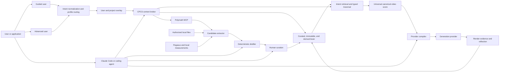
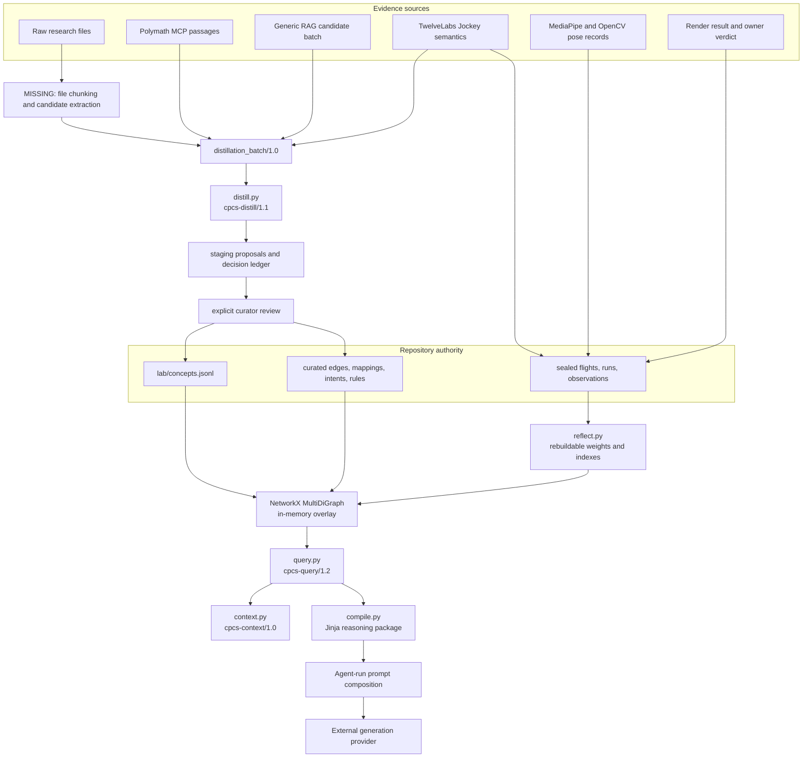
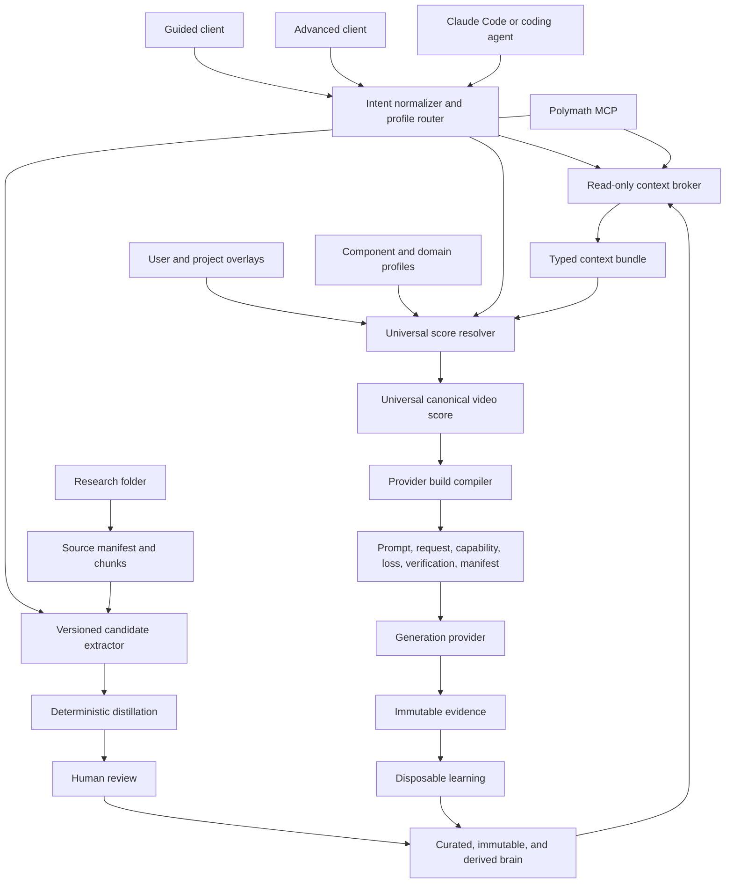

# Codebase Intent Gap Analysis: CPCS Production Architecture

**Verdict:** FAIL
**Repository:** `/Users/king/Documents/New project`
**Plan:** owner contract for one universal end-user video-intent system with a canonical score, composable domain profiles, provider compilation, and verification
**Revision:** Slice 3 intent-runtime audit on `codex/intent-router-slice-3`, based on integrated remote baseline `8e646058db754a13a169ad4a1e3009d6d586f410`
**Audited at:** 2026-08-03

The repository gate is green, but the stated product loop is not yet an end-to-end production
system. Query safety, intent normalization, automatic profile routing, and the read-only context
broker now provide a governed ordinary-language-to-knowledge path. The end-user product path still
has no user or project overlay, universal canonical score, or provider-ready production compiler.
The highest-impact product gap is therefore the missing deterministic bridge from normalized intent
and knowledge context into one versioned video score.
The raw-file extraction bridge, stable `cpcs` command, MCP server, provider submission, and render
verification loop also remain absent.

This file is the architecture source of truth. Root and subsystem `AGENTS.md` files govern how an
agent edits the repository. Runbooks govern procedures. Frozen `research/` packages supply upstream
evidence. `lab/second_brain/IMPLEMENTATION_PLAN.md` remains a dated audit of the control-plane slice.

## Intent Contract

### Product intent

> **CPCS is a universal AI video-intent generator and creative-direction compiler that turns a
> user's goal into an evidence-informed, provider-ready video production plan.**

The end user should not need to understand graphs, FACS, Laban, Pegasus, schemas, retrieval policy,
serialization formats, or provider adapters. The visible product accepts ordinary language,
references, duration, platform, constraints, and preferences. The internal system normalizes that
input, selects or blends domain profiles, retrieves relevant knowledge, reasons through conflicts
and prerequisites, builds one canonical score, negotiates provider capabilities, emits a production
package, and verifies the render.

UGC, advertising, cinema, dialogue, action, anime, VFX, music video, education, social content, and
custom projects are specialized interpretations of one video-intent language. They are not separate
products, ontologies, canonical schemas, or compilers.

CPCS is Claude Code-first, but not Claude Code-dependent. The core remains headless and owns the
knowledge, reasoning, compilation, and evidence contracts. Claude Code is the primary repository
operator. Chat models, Codex, other coding agents, local models, and applications are clients of the
same CLI or MCP boundary rather than alternate knowledge authorities.

The intended user path has seven outcomes:

1. Normalize an ordinary-language request into domain, task, audience effect, workflow, hard
   constraints, soft preferences, and missing inputs.
2. Apply user and project context without turning preferences into curated knowledge.
3. Select or blend domain profiles that configure one universal score contract.
4. Retrieve relevant concepts, prior evidence, provider observations, and external passages through
   the governed knowledge path.
5. Resolve prerequisites, conflicts, locks, alternatives, unsupported controls, and allowed creative
   variation into one canonical score.
6. Compile provider requests, prompts, reference instructions, capability and loss reports, and a
   verification plan from that score.
7. Record renders and verdicts, verify outputs, and rebuild evidence-backed recommendations without
   letting learned data rewrite curated truth.

The knowledge-growth path remains separate. It accepts authorized research, RAG passages, media
semantics, measurements, and experiment records; extracts atomic proposals; performs deterministic
deduplication and placement; and requires explicit curation before promotion.

### Primary users and decisions

| User or actor | Decision | Required output |
|---|---|---|
| Guided end user | Describe a video, provide references, choose duration or platform, and review detected intent | canonical score summary and provider-ready build |
| Advanced end user | Edit beats, performance, motion, camera, timing, contacts, profile blend, and verification thresholds | the same canonical score with explicit overrides and conflicts |
| Repository owner | Accept, merge, refine, or reject new knowledge and product contracts | review record and durable IDs |
| Claude Code or repository operator | Implement, validate, curate, compile, test, and maintain CPCS | verified changes through stable CPCS contracts |
| Research and distillation agent | Fill a named knowledge or graph gap | hashed candidate batch |
| Experiment and media operator | Extract or compare controlled media evidence | typed observations, sealed runs, metrics, and verdicts |

### Acceptance criteria

The product path is accepted only when an ordinary-language request can travel through the same
public runtime used by guided and advanced clients: normalized intent, profile resolution, governed
knowledge context, canonical score, provider build, render record, verification, and later learning.
Representative UGC, cinematic dialogue, action or anime, product demonstration, and blended-profile
fixtures must share one score schema and differ only through typed data and rules. Every stage must
support replay, bounded failure, durable lineage, and a verifier through the same public path.

The knowledge-growth acceptance path remains: authorized folder or passage input, bounded candidate
extraction, deterministic distillation, explicit promotion, later retrieval, and source trace. The
same headless core must return read-only client context without changing curated, immutable, derived,
or staging stores. Claude-specific code cannot own business rules or be required at runtime.

### Constraints and non-goals

| Constraint | Architectural consequence |
|---|---|
| `research/` is frozen | new findings enter staging and curated lab stores, never upstream files |
| Human authority owns truth | retrieval and extraction may propose; only curation may promote |
| IDs survive refactors | fingerprints aid deduplication but never replace durable curated IDs |
| Semantic evidence is not measurement | Pegasus output cannot claim exact joints, force, contact, or FACS intensity |
| Learned data is disposable | derived files must rebuild byte-identically from curated and immutable inputs |
| The repository is file-backed | current persistence is JSONL, JSON, YAML, CSV, Git, and ignored `work/` artifacts |
| Clients do not own knowledge | Claude Code, chat models, and MCP hosts call CPCS contracts but cannot redefine authority |
| Read and write surfaces differ | ordinary chat receives read tools; curation and immutable writes require an explicit operator boundary |
| LLM extraction is bounded | models receive selected passage packets, never an entire large source file as one prompt |
| One universal score owns video meaning | profiles and providers configure or project that score; none may fork it |
| User and project context is an overlay | preferences affect selection and compilation but do not become curated research truth |
| Automatic routing is the default | clients show detected profiles and allow correction; they do not require domain expertise |
| Guided and advanced modes share data | advanced editing exposes more fields but never changes the underlying score contract |

The system is not currently a hosted service, a vector database, a production graph database, a
general chat-memory product, or an autonomous truth authority. TwelveLabs analyzes media; it is not
the video-generation backend. Claude Code is not the second brain, and query-time Polymath results
are not repository knowledge.

### System boundary



### Universal kernel and domain profiles

The universal score owns the stable video language:

```text
project, intent, entities, shots, beats, actions, performance, motion, interaction,
camera, editing, audio, marketing function, style, continuity, constraints, assets,
provenance, provider disposition, verification
```

Domain profiles extend that contract with required layers, defaults, composition rules, conflicts,
preferred workflows, serialization preferences, and verification metrics. A domain profile may
blend existing component profiles such as movement, capture, camera, performance, screen action,
and style. It cannot add a parallel canonical schema or knowledge authority.

The intended profile contract has this logical shape:

```json
{
  "profile_id": "profile://ugc/product_demo/1.0",
  "extends": ["profile://universal/video/1.0"],
  "required_layers": [
    "marketing",
    "performance",
    "product_interaction",
    "camera"
  ],
  "defaults": {},
  "composition_rules": [],
  "conflicts": [],
  "preferred_workflows": [],
  "verification_metrics": []
}
```

Merge precedence is deterministic:

```text
universal defaults
-> user defaults
-> project profile
-> domain profiles
-> scene overrides
-> shot overrides
-> event locks
```

Later defaults may override earlier defaults. Hard constraints and event locks never silently drop.
A named dominance rule resolves each conflict; unresolved conflicts become explicit user decisions.
Automatic routing is the default, but the detected profile set remains visible and editable.

### User build contract

Guided and advanced clients operate on the same canonical score. Guided clients show the original
request, detected intent and profiles, missing inputs, major constraints, and a render action.
Advanced clients expose score fields and provider projections without creating a second authoring
format.

A successful build is intended to produce:

```text
build/
├── canonical_score.json
├── provider_request.json
├── prompt.txt
├── reference_still_prompt.txt
├── capability_report.json
├── loss_report.json
├── verification_plan.json
└── build_manifest.json
```

`canonical_score.json` preserves provider-neutral meaning. `provider_request.json` and `prompt.txt`
are projections. `capability_report.json` names supported controls. `loss_report.json` records what
the selected provider cannot represent. `verification_plan.json` defines observable checks.
`build_manifest.json` binds every artifact to intent, profiles, concepts, evidence, compiler policy,
provider, model, assets, and hashes.

### Product surfaces

The intended product hierarchy has seven surfaces over one kernel:

| Surface | Responsibility |
|---|---|
| Intent Studio | ordinary-language planning, detected intent, missing inputs, and score editing |
| Reference Intelligence | Pegasus and measurement analysis, segmentation, and recreation inputs |
| Creative Compiler | canonical score, merge policy, capability negotiation, and provider builds |
| Domain Profiles | UGC, advertising, cinema, dialogue, action, anime, VFX, music, education, and custom configuration |
| Knowledge Brain | research, concepts, graph reasoning, provenance, and evidence |
| Render Lab | controlled alternatives, provider comparisons, and experiment records |
| Verification and Learning | output checks, verdicts, immutable evidence, and rebuildable recommendations |

### Agent, Polymath, and chat operating surfaces

CPCS is a headless directing and knowledge-control system. It has three interfaces with different
authority: Polymath supplies evidence, chat consumes temporary context, and Claude Code operates the
repository. They share one CPCS core and cannot promote themselves into competing knowledge stores.

Polymath supports two paths. The query-time path is read-only and ephemeral:

```text
user question
-> CPCS intent and domain classification
-> curated second-brain retrieval
-> Polymath retrieval when coverage is incomplete
-> typed graph expansion with path-level relevance checks
-> conflict, prerequisite, and duplicate resolution
-> evidence reranking and token-budget packing
-> context bundle for the requesting client
```

The governed distillation path proposes a knowledge write:

```text
named knowledge gap
-> Polymath passages with source IDs, locators, hashes, and retrieval metadata
-> bounded LLM candidate extraction
-> distillation_batch/1.0
-> deterministic duplicate, placement, reference, and dependency checks
-> staged proposals
-> explicit human review
-> curated promotion
```

### Bounded LLM distillation contract

Large documents never enter an LLM request as one payload. CPCS owns the source boundary and uses
the model as a bounded interpretation worker:

1. Deterministic discovery and format parsing produce a heading tree, stable locators, chunk IDs,
   byte hashes, media types, and normalized text.
2. Whole-document orientation sends only title, metadata, table of contents, heading tree, a short
   summary, and current CPCS coverage. The model returns section references, not knowledge records.
3. Section-level retrieval selects a configurable packet, initially 4 to 12 passages within a hard
   token and byte budget, for one named research goal.
4. Structured LLM extraction proposes atomic records and cites only passage IDs present in the
   request.
5. Schema validation, deterministic admission, review, and curation decide whether a proposal can
   enter repository authority.

The extractor request carries existing concept references and closed output instructions. A packet
has this logical shape before the adapter builds `distillation_batch/1.0`:

```json
{
  "research_goal": "How does Laban Flow affect restrained acting direction?",
  "existing_concepts": [
    "c_laban_flow",
    "c_restrained_performance"
  ],
  "source_passages": [
    {
      "source_id": "source_001",
      "locator": "section_12.3",
      "content_hash": "sha256:...",
      "text": "..."
    }
  ],
  "allowed_outputs": [
    "concept",
    "edge",
    "intent",
    "mapping",
    "rule"
  ]
}
```

The response is an extraction proposal, not a curated record:

```json
{
  "proposals": [
    {
      "proposal_type": "mapping",
      "concept_ref": "c_laban_flow",
      "control_target": "performance.motion_restraint",
      "claim": "Bound Flow can support restrained or contained movement direction.",
      "evidence_refs": ["source_001#section_12.3"],
      "extractor_confidence": 0.78,
      "limitations": [
        "This is a directorial application, not a universal psychological inference."
      ]
    }
  ]
}
```

`extractor_confidence` is a diagnostic ranking hint. It cannot become curated evidence confidence.
The adapter resolves every evidence reference against the request packet, maps accepted fields into
the current candidate schema, and rejects unknown fields or types. A proposed contradiction becomes
a typed `conflicts_with` or `invalid_for` edge; `contradiction` is not a batch proposal type.

Responsibility remains split at a checkable boundary:

| Owner | May do | Must not do |
|---|---|---|
| Source adapter | discover files, parse formats, build headings and chunks, assign locators, hash bytes, retrieve passages | interpret a claim as true or write curated data |
| LLM extractor | propose concepts, definitions, relationships, mappings, rules, contradictions, limitations, merges, refinements, and compiler implications | assign durable IDs, establish truth, authorize numbers, or promote records |
| Deterministic control plane | validate schemas and allowed types, resolve existing IDs, detect duplicates, enforce references and placement, record provenance | invent unsupported meaning or waive review requirements |
| Human curator | verify sources, judge proposed identity and usefulness, assign durable IDs, and authorize promotion | erase immutable history or bypass repository validation |

Version one uses LLM-first extraction, deterministic parsing and chunking, strict structured output,
the existing deterministic control plane, and human promotion. It does not add an encoder-based
relation extractor. Reconsider an encoder only after measurement shows excessive extraction cost,
insufficient throughput, repeated span or offset errors, dominant simple relation types, or a privacy
requirement for a fully local first pass.

Similarity does not establish truth. A retrieved passage can help a chat model answer one request,
but it remains untrusted external evidence until the candidate, distillation, and review path accepts
it. Derived associations remain rebuildable ranking signals. Session context remains temporary.

The context broker must return a typed package rather than inject arbitrary retrieved chunks:

```json
{
  "schema": "cpcs.context_bundle/1.0",
  "request": {
    "query": "Create restrained fear that becomes physical urgency",
    "intent": "directorial_composition",
    "token_budget": 12000
  },
  "curated_knowledge": [
    {
      "concept_id": "c_example",
      "status": "proven",
      "reason_selected": "Matches restrained affect and escalating movement",
      "evidence_ids": ["e_example"],
      "path": ["intent", "requires", "concept"]
    }
  ],
  "retrieved_evidence": [
    {
      "origin": "polymath_mcp",
      "source_id": "source_123",
      "locator": "chapter_4.section_2",
      "content_hash": "sha256:...",
      "evidence_class": "source_passage",
      "passage": "..."
    }
  ],
  "derived_associations": [],
  "conflicts": [],
  "coverage": {
    "covered_terms": [],
    "uncovered_terms": [],
    "additional_retrieval_recommended": false
  },
  "compiler_candidates": [],
  "trust_boundary": {
    "curated_knowledge": "repository_authority",
    "retrieved_evidence": "untrusted_external_evidence",
    "derived_associations": "rebuildable_ranking_signal",
    "session_context": "ephemeral"
  }
}
```

Claude Code reads repository governance, identifies knowledge and implementation gaps, runs context
and traversal canaries, prepares candidate batches, inspects distillation decisions, performs
authorized promotion, changes adapters and compilers, and runs the repository gate. Those actions
must call stable CPCS contracts. Claude-specific business logic is forbidden.

The target MCP surface separates ordinary read access from controlled writes:

| Tool | Authority | Default client access |
|---|---|---|
| `cpcs.status` | read system and provider state | chat and operators |
| `cpcs.intent.normalize` | normalize user input and detect editable profiles | chat and operators |
| `cpcs.context.get` | build a token-budgeted, read-only context bundle | chat and operators |
| `cpcs.reason` | retrieve concepts and typed paths | chat and operators |
| `cpcs.score.build` | resolve one provider-neutral canonical video score | chat and operators |
| `cpcs.build.compile` | project a validated score into provider build artifacts | chat and operators |
| `cpcs.distill.prepare` | retrieve evidence and construct a candidate batch | operators only |
| `cpcs.distill.run` | execute deterministic admission policy | operators only |
| `cpcs.curate.review` | display review requirements and decisions | operators only |
| `cpcs.curate.promote` | write only after explicit human authorization | controlled write |
| `cpcs.record.render` | append immutable render evidence | controlled write |
| `cpcs.reflect.rebuild` | rebuild derived learning state | operators only |

CLI and MCP adapters must call the same application functions and return the same versioned
contracts. Chat deployments normally expose only the read-only product and reasoning tools above
the distillation boundary.

## Actual Runtime

### Current state snapshot

The repository contains 132 concept cards, 236 curated authored edges, 45 mappings, one intent, one
rule, five sealed flights, five immutable runs, four distillation runs, and 111 historical proposal
rows. Provenance shows all 111 proposals as promoted, although their append-only staging rows remain
`pending`. The live second-brain graph contains 142 nodes and 241 edges. Derived reflection contains
zero learned edges, zero Pegasus observations, and zero measurement observations.

The profile library contains eight component profiles across movement, capture, camera,
performance, screen action, and style. A separate router-only policy defines nine request labels
without defining score controls or knowledge. The single curated intent remains a manually seeded
recurring goal. `src/intent.py` now accepts an end-user request and returns normalized intent,
detected profile labels, conflicts, missing inputs, and a safe context-broker handoff. No production
module returns a universal score or the declared build artifact set.

Of the 236 curated edges, 203 are legacy `pairs_with` associations. The remaining graph contains 21
`refines`, five `applies_to`, four `conflicts_with`, and three `alternative_to` edges. There are no
curated `is_a`, `part_of`, `requires`, `produces`, `valid_for`, or `invalid_for` edges.

The current public surfaces are Python module CLIs under `lab.second_brain.src`. The
`cpcs.context_bundle/1.0` broker now packages the safe query result, curated lineage, active
mappings, and typed external evidence under deterministic full-envelope token accounting. There is
also a `cpcs.normalized_intent/1.0` module CLI and in-process intent-to-context function. There is no
installed `cpcs` command, MCP server, authorization profile, networked query-time Polymath
adapter, or retrieval reranker. `AGENT_PROMPT.md` guides coding agents, but guidance is not a runtime
interface.

### Runtime topology



Solid arrows exist in code or governed data. The raw-file extractor and provider-generation edges
remain missing or manual.

### Pipeline A: research to curated knowledge

#### A1. Source discovery and retrieval

`lab/second_brain/src/ingest.py` owns two implemented inputs. `inventory` upserts verified corpus
rows into `staging/corpus_manifest.jsonl`; `batch` accepts a JSON object that already satisfies
`distillation_batch.schema.json`. Registered external origins are `polymath_mcp`, `pegasus`, and
`rag_pipeline`. Those origins cannot call the manual proposal route.

The batch pins four classes of lineage:

| Contract area | Required data |
|---|---|
| Retrieval | adapter, corpus ID, query, tool, parameters, retrieval timestamp |
| Extractor | agent, model, prompt hash |
| Candidate | candidate ID, proposal type, suggested ID, proposed record, creator, timestamp |
| Evidence | source ID, locator, claim, SHA-256 content hash |

No repository code currently opens an arbitrary research folder, extracts text from each supported
format, chunks it, calls an extraction model, or assembles this batch. Polymath and prior agents did
that work outside the repository boundary.

#### A2. Deterministic distillation

`lab/second_brain/src/distill.py:728` validates and normalizes the batch. Candidate and evidence
order are sorted before hashing. The run ID is derived from the normalized input hash, policy hash,
and curated-snapshot hash. Replaying the same batch against the same snapshot returns the same run.

Policy `cpcs-distill/1.1` applies these decisions in order:

1. Preserve an existing proposal or curated identity when provenance matches.
2. Reject unhashed evidence and exact record duplicates.
3. Compare concepts by normalized token overlap. A score at least `0.92` is treated as exact; a
   score at least `0.55` requires merge review.
4. Reject references that resolve to neither curated concepts nor same-batch proposed concepts.
5. For each new concept, require a typed structural path to a curated concept plus at least one
   operational edge or executable mapping.

The structural proof accepts `is_a`, `part_of`, or `refines`. The operational bridge accepts
`requires`, `applies_to`, `produces`, or a mapping. `pairs_with` cannot satisfy placement. If a
concept or structural member fails admission, dependent records are rejected in the same run.

This distiller is a deterministic admission policy, not an LLM research reader. It evaluates
structured candidates supplied by another actor. Its similarity function is token-based Jaccard
over name, definition, use case, triggers, and layer. NetworkX supplies graph and shortest-path
operations.

#### A3. Staging and review

Admitted candidates become pending proposals in `staging/proposals.jsonl`; every decision, including
rejections and possible duplicates, remains in `staging/distillation_runs.jsonl`. The current
`staging/rejected.jsonl` file is not used by `distill.py`; rejection lineage lives inside the run.

`lab/second_brain/src/curate.py` requires explicit true values for source verification, source
locator resolution, duplicate review, operational usefulness, relationship validation, and numeric
precision support. The curator assigns durable IDs. External proposals also need an admissible
distillation-run reference.

Bundle promotion writes concepts and intents before dependent edges, mappings, and rules. It takes
byte snapshots of every target file and restores them if a later member fails in the same process.
There is no journal or lock for power loss, process termination, or concurrent writers.

#### A4. Curated ownership

| Record | Authority | Meaning |
|---|---|---|
| Concept | `lab/concepts.jsonl` | atomic vocabulary, triggers, status, evidence, source |
| Edge | `lab/second_brain/curated/edges.jsonl` | authored semantic relationship |
| Mapping | `lab/second_brain/curated/mappings.jsonl` | concept to provider-independent control |
| Rule | `lab/second_brain/curated/rules.jsonl` | data bound to one named Python evaluator |
| Intent | `lab/second_brain/curated/intents.jsonl` | normalized recurring goal |

JSON Schema Draft 2020-12 validates all five stores. Curated IDs must be unique across stores, edge
endpoints must exist, mappings must resolve, and rule evaluator names must exist in Python.

### Pipeline B: goal to traversal and compiled output

#### B1. Live graph assembly

`lab/second_brain/src/graph.py:150` creates a NetworkX `MultiDiGraph` in memory. It overlays curated
concepts and authored edges, immutable flights and evidence nodes, and optional derived learned
edges. It does not persist the live graph.

This live reasoning graph is different from `lab/graph.json`. The latter is a repository-wide
derived index containing research packages, blocks, variants, experiments, runbooks, evidence, and
second-brain records. `lab/scripts/build_graph.py` builds that index and
`lab/scripts/sync_repo.py` checks it for drift. `query.py` does not query `lab/graph.json`.

#### B2. Root retrieval

`lab/second_brain/src/query.py:reason` tokenizes the goal, scores every concept from its natural-language
triggers, name, definition, use case, and layer, and chooses at most five roots. Multi-term queries
normally need two overlapping terms, a complete name match, or a one-word trigger match.

Root eligibility filters concept status, excluded layers, and declared encodings. There are no text
embeddings, vector index, BM25 index, reranker, or LLM call in this path. The Marengo embedding
wrapper in the TwelveLabs adapter is not connected to concept retrieval.

#### B3. Hop semantics

The authored edge policy is versioned as `cpcs-edge-policy/1.0`:

| Edge family | Types | Traversal behavior |
|---|---|---|
| Structural | `is_a`, `part_of`, `refines` | bidirectional with named generalize, specialize, part, and whole transitions |
| Operational | `applies_to`, `produces` | bidirectional connection between knowledge and use |
| Dependency | `requires` | bidirectional relation, plus admissibility check for prerequisites |
| Contextual | `alternative_to` | traversable choice |
| Constraint | `conflicts_with`, `valid_for`, `invalid_for` | selection filter, never an expansion hop |
| Legacy | `pairs_with` | low-priority hop, at most one per path and three globally |

Derived learned edges rank below authored hops. Every accepted path row records direction,
transition, family, tier, depth, edge ID, and policy version.

#### B4. Selection safety and prerequisite closure

After root retrieval, policy `cpcs-query/1.2` requires every selected non-root concept to declare
one admission reason: `structural_term_support`, `operational_bridge`, or
`required_prerequisite`. Roots declare `direct_match`. A neighbor with no term support,
operational bridge, or dependency role is rejected with `connectivity_only`; graph reachability
alone cannot import it.

Relevant candidates resolve their complete `requires` closure before selection. A stable
concept-ID topological order places prerequisites before dependents. Missing prerequisites reject
the dependent with `missing_prerequisite`; cycles reject every cycle member with
`dependency_cycle`. Prerequisites inherit relevance only from their dependent and are not expanded
as traversal roots unless another path independently establishes relevance.

The Slice 1 canary is:

```bash
python3 -m lab.second_brain.src.query reason \
  "Laban effort decimal spatial movement" \
  --minimum-status ingested --include-unproven --maximum-depth 5
```

It selects seven Laban or motion concepts, excludes `c_dual_view_color_integration`, and compiles no
VFX color control. `decimal` and `spatial` remain uncovered, so centralized gap policy
`cpcs-gap-policy/1.1` returns `status: partial`, `should_retrieve: true`, and reason
`material_query_terms_uncovered`. Isolated fixtures prove transitive prerequisite ordering,
missing-prerequisite rejection, cycle termination, and byte-equivalent replay of selected order,
paths, rejections, and gap output.

#### B5. Read-only context broker

`lab/second_brain/src/context.py:build_context_bundle` calls `reason()` and never traverses the graph
itself. It enriches only the admitted concept IDs with active provider/model mappings and aggregated
source and evidence references. Typed external passages must name the declared knowledge-gap query,
carry a SHA-256 that matches their UTF-8 text, and remain labelled
`untrusted_external_evidence`. Duplicate passage hashes are retained once with an omission reason.

Policy `cpcs-context/1.0` sorts direct matches before prerequisites, operational bridges, and
structural support. It reserves an omission row for every packable item, then admits items while the
canonical UTF-8 bundle estimate remains within the requested budget. The estimate includes the
request, trust boundary, policies, knowledge gap, selected content, and omission report. Replay with
the same repositories, request, evidence, and budget is byte-identical. The CLI writes only stdout;
tests compare curated, immutable, derived, and staging bytes before and after both function and CLI
calls.

#### B6. Compilation

`lab/second_brain/src/compile.py:compile_result` accepts only `cpcs-query/1.2` results whose selected
rows carry an allowed admission reason. It rejects unsafe policy versions, connectivity-only rows,
and any concept present in both selected and rejected sets. It then resolves mappings for the
already-gated selection, filters provider and model-specific mappings, runs three named
deterministic evaluators, and renders one of four Jinja templates. `hybrid` currently aliases to
JSON.

The output is a reasoning package containing goal, selected concepts, mappings, control IDs, rule
results, paths, evidence, sources, rejections, alternatives, and the knowledge-gap decision. It is
not the full CPCS production compiler described by `lab/FORMAT_CONTROL_MAP.md` and
`lab/UNIVERSAL_MOTION_SKELETON.md`. It does not merge profiles, resolve YAML scope overrides, build
joint or camera tracks, assemble prompt blocks, enforce a provider input budget, or submit a render.

The practical generation workflow remains agent-driven: an agent reads `lab/registry.yaml`,
`lab/blocks.yaml`, profiles, assets, and runbooks, then composes the final prompt. That path is
governed but not implemented as one deterministic program.

### Pipeline C: media analysis, experiments, and learning

#### C1. TwelveLabs transport and Pegasus semantics

`lab/second_brain/src/providers/twelvelabs.py` isolates the provider SDK. It pins API `v1.3`, SDK
`1.3.1`, Jockey for structured responses, and Marengo 3.0 for embeddings. It supports knowledge-store
creation, direct or URL asset upload, bounded asset and item polling, paginated search, strict Jockey
responses, and embeddings.

`lab/second_brain/src/pegasus.py:317` is the governed semantic path. A job binds an authorized asset
reference to a ready knowledge-store item and source interval. The adapter saves canonical request,
raw SDK response, normalized payload, and run snapshots under ignored `work/twelvelabs/`. It sends
the same strict JSON Schema to Jockey and to the local validator.

Semantic items are limited to `inferred` or `interpreted`. One hash-chained immutable observation is
appended before any proposed knowledge enters the shared distiller. Current production execution is
blocked: the SDK, API key, knowledge-store ID, and authorized provider asset are absent.

#### C2. Measurement lane

`lab/scripts/extract_pose_tier2.py` uses optional MediaPipe and OpenCV imports to read an analysis
proxy, detect 2D pose landmarks, associate actors by nearest centroid, keyframe tracks, and write
schema-checked observation records. Its stated evidence class is `detected`, not `measured`, because
camera and subject motion remain entangled.

MediaPipe, OpenCV, and the pose model are not installed or declared in the main second-brain
requirements. No measurement observation has entered the immutable control plane. The wider
reference-video workflow still requires separate frozen research scripts for manifest creation,
observation merging, and graph validation, followed by manual reverse compilation and regeneration.

#### C3. Experiment recording

`lab/second_brain/src/record.py` seals a flight by hashing selected concept contents and locking the
intent, arms, provider, model, seed, and compiler version. A run must match the sealed flight and
include its output hash. Runs and observations form independent append-only hash chains.

The older lab workflow still records five result rows in `lab/runs/results.csv`. Migration created
five immutable flights and five runs, but those legacy records do not link concepts. As a result,
reflection currently reports zero concepts with immutable evidence.

#### C4. Reflection

`lab/second_brain/src/reflect.py` deletes and rebuilds `derived/` from immutable data. It creates
co-occurrence associations for success, failure, and confounded runs. A positive `promotes` edge
requires a seed-controlled pair that differs by one declared control. Provider and measurement
observations create zero-weight `confounded_with` edges.

The reflector also writes coverage, concept-to-evidence indexes, and insights. Two consecutive
rebuilds produce byte-identical files. This mechanism works, but the live dataset produces zero
learned edges because current immutable records contain no usable concept-linked evidence.

### Storage and write authority

| Tier | Store | Writer | Mutation model | Read consumers |
|---|---|---|---|---|
| Frozen | `research/` | none in normal operation | SHA-protected upstream package | agents, build scripts |
| Curated | concepts and `curated/` | `curate.py` or reviewed Git edit | append or reviewed edit | graph, query, compiler, recorder |
| Immutable | `immutable/` | `record.py`, governed Pegasus path | append-only hash chain | graph, reflector, validator |
| Derived | `derived/` | `reflect.py` | delete and rebuild | graph, query, coverage review |
| Staging | `staging/` | inventory adapter and distiller | resumable, non-authoritative | curator, validator, status |
| Temporary | `work/` | query and provider adapters | ignored and disposable | operator and replay diagnostics |

`validate.py:55` enforces these actor-to-path boundaries before programmatic writes. It is a local
path check, not an operating-system permission boundary. Direct manual file edits remain possible.

### Direct dependencies and module roles

Versions below come from `lab/second_brain/requirements.txt`; installed versions were checked on
2026-08-02.

| Module | Declared or observed version | Where used | Actual responsibility | License and primary source |
|---|---|---|---|---|
| NetworkX | `>=3.2,<4`; installed `3.2.1` | `graph.py`, `query.py`, `distill.py` | in-memory `MultiDiGraph`, neighbors, paths, parallel typed edges | BSD-3-Clause, [networkx/networkx](https://github.com/networkx/networkx) |
| jsonschema | `>=4.18,<5`; installed `4.25.1` | `validate.py`, optional pose validation | checks 17 second-brain schemas with `Draft202012Validator` | MIT, [python-jsonschema/jsonschema](https://github.com/python-jsonschema/jsonschema) |
| Jinja2 | `>=3.1,<4`; installed `3.1.6` | `compile.py`, four templates | strict rendering of reasoning packages | BSD-3-Clause, [pallets/jinja](https://github.com/pallets/jinja) |
| PyYAML | `>=6,<7`; installed `6.0.3` | migration, registry and experiment validation, frozen compilers | safe parsing of YAML control data | MIT, [yaml/pyyaml](https://github.com/yaml/pyyaml) |
| MediaPipe | optional; not installed | `extract_pose_tier2.py` | on-device 2D pose landmarks | Apache-2.0, [google-ai-edge/mediapipe](https://github.com/google-ai-edge/mediapipe) |
| OpenCV Python | optional; not installed | `extract_pose_tier2.py` | video decode, frame access, color conversion | Apache-2.0 for current releases, [opencv/opencv](https://github.com/opencv/opencv) |
| TwelveLabs Python SDK | pinned `1.3.1`; not installed | `providers/twelvelabs.py` | vendor API transport | public source at [twelvelabs-io/twelvelabs-python](https://github.com/twelvelabs-io/twelvelabs-python); no root license file was present during this audit, so this document does not classify it as open source |

The second brain is custom CPCS code. It does not use LangChain, LlamaIndex, Mem0, Microsoft
GraphRAG, Neo4j, Qdrant, Chroma, FAISS, Weaviate, or a relational database.

### Open-source systems considered for future slices

These projects are references, not current dependencies:

| Project | Relevant capability | Fit decision |
|---|---|---|
| [Microsoft GraphRAG](https://github.com/microsoft/graphrag) | LLM extraction of entities and relationships from raw text, local and global graph search | study its extraction and evaluation contracts; do not import its graph as curated truth |
| [LlamaIndex](https://github.com/run-llama/llama_index) | document readers, transformations, cached ingestion pipelines, property-graph adapters | candidate for the missing raw-folder adapter behind CPCS batch schemas |
| [Qdrant](https://github.com/qdrant/qdrant) | persistent dense and sparse retrieval with metadata filters | defer until corpus scale or latency proves file-backed retrieval inadequate |
| [Mem0](https://github.com/mem0ai/mem0) | conversational and agent memory with multi-signal retrieval | poor primary fit for evidence-governed research truth; useful only for user/session preferences outside curated knowledge |

Any adoption must remain behind the existing versioned batch or query boundary. No external module
may become a second curated authority.

### Operational and security model

The current runtime is a set of Python CLIs and in-process functions, including a read-only context
broker. There is no package build metadata, lockfile, container, service process, HTTP API, MCP
server, scheduler, queue, database migration system, CI workflow, telemetry, or deployment
definition. Installation uses `pip` against bounded requirement ranges.

Provider secrets are read from environment variables and the doctor command returns booleans rather
than values. Provider request and response bodies are saved under ignored `work/`. Source authorization
is represented by a job's asset reference and content hash; the repository does not implement user
authentication, access control, encryption, secret rotation, data retention, or remote artifact
deletion.

## Gap Matrix

| ID | Requirement | Expected evidence | Observed evidence | Status | Impact | Dependency | Smallest remediation | Verifier |
|---|---|---|---|---|---|---|---|---|
| REQ-001 | Governed repository routing and validation | one routed source of truth plus executable drift and integrity gates | entrypoint: `python3 lab/scripts/validate_repo.py`; wiring: root and lab routes call sync, control-plane validation, and tests; outcome: derived graph, registered artifacts, router policy, and schemas remain aligned; verification:PASS gate green with 42 behavioral tests and zero warnings | WORKING | prevents file and authority drift | none | preserve the gate and route this document | `python3 lab/scripts/validate_repo.py` |
| REQ-002 | Frozen research package boundary | sync detects additions, removals, aliases, cards, and index coverage | entrypoint: `python3 lab/scripts/sync_repo.py`; wiring: research directories map through `PAPER_ALIASES` to cards and index entries; outcome: frozen packages remain source evidence rather than writable authority; verification:PASS `SYNC GREEN` | WORKING | protects upstream evidence | REQ-001 | keep package admission in the sync contract | `python3 lab/scripts/sync_repo.py` |
| REQ-003 | Versioned structured RAG intake | public command accepts lineage-complete batches and blocks direct external proposals | entrypoint: `python3 -m lab.second_brain.src.ingest batch`; wiring: batch schema calls shared distiller and write-boundary checks; outcome: four durable distillation runs and 111 proposal rows; verification:PASS ingest, distill, and bypass tests | WORKING | gives all retrieval providers one contract | REQ-001 | retain the batch schema as the only external knowledge port | `python3 -m unittest lab.second_brain.tests.test_distill lab.second_brain.tests.test_curate` |
| REQ-004 | Raw file or Polymath passage to candidate batch | one command parses MD, JSON, YAML, and XML, creates stable heading-aware chunks and hashes, or accepts retrieved passages; it selects a bounded evidence packet, invokes structured LLM extraction, and emits the batch schema | targeted searches of non-research source found no document reader, heading-aware chunker, orientation pass, evidence-packet selector, extractor-model port, folder CLI, or raw-source ledger; `ingest.py` accepts only prebuilt JSON batches | MISSING | the requested growing knowledge base cannot turn supplied research into candidates without an out-of-repository agent | REQ-003 | add one source adapter and extractor port that persist source hashes, normalized chunks, passage selection, model and prompt identity, then emit `distillation_batch/1.0`; never send a complete large file to the model | canary ingests a large fixture twice, proves each LLM request stays within passage and token budgets, resolves every cited locator, and produces one identical batch and run ID |
| REQ-005 | Deterministic deduplication, placement, and bundle decisions | normalized replay, exact and probable dedup, connected placement, dependency reconciliation, and decision lineage | entrypoint: `run_distillation`; wiring: policy `cpcs-distill/1.1` hashes input, policy, and curated snapshot then checks duplicates and connectivity; outcome: 225 durable candidate decisions; verification:PASS distillation and Laban decimal tests | WORKING | prevents orphan and duplicate concepts | REQ-003 | version thresholds and retain decision fixtures | `python3 -m unittest lab.second_brain.tests.test_distill` |
| REQ-006 | Explicit reviewed promotion with rollback | exact bundle assignments, source review, durable lineage, dependency order, and failure rollback | entrypoint: `curate bundle`; wiring: concepts and intents precede dependent members and byte snapshots restore touched stores; outcome: 111 proposals resolve through curated provenance; verification:PASS promotion and rollback tests | WORKING | keeps retrieval separate from truth authority | REQ-005 | add a journal before claiming crash recovery | `python3 -m unittest lab.second_brain.tests.test_curate` |
| REQ-007 | Typed graph coverage | operational knowledge uses structural, dependency, operational, contextual, and constraint edges rather than loose associations | 203 of 236 curated edges are `pairs_with`; six declared edge types have zero curated instances; current traversal therefore depends mainly on legacy associations | PARTIAL | nesting and use-specific hops are too sparse for stable director reasoning | REQ-006 | migrate high-use clusters from `pairs_with` into evidence-backed typed edges without deleting historical IDs until queries are equivalent | edge-distribution gate plus domain query fixtures |
| REQ-008 | Goal-relevant traversal | every selected non-root concept remains relevant to the goal and compiled controls do not cross domains without an explicit bridge | entrypoint: `python3 -m lab.second_brain.src.query reason`; wiring: `cpcs-query/1.2` assigns one allowed admission reason and rejects reachability-only nodes; outcome: Laban canary excludes `c_dual_view_color_integration` and its VFX control while retaining Laban mappings; verification:PASS query and compiler regression | WORKING | prevents connected but unrelated controls from contaminating prompts | REQ-001 | retain admission-reason and connectivity-only fixtures as policy regressions | `python3 -m unittest lab.second_brain.tests.test_query.QueryTests.test_laban_canary_blocks_unrelated_color_and_requests_retrieval` |
| REQ-009 | Dependency-correct traversal | a concept with `requires` causes prerequisite selection before dependent admission | entrypoint: `reason()`; wiring: stable transitive dependency plan validates and topologically orders prerequisites before the relevant candidate; outcome: C then B then A for A-requires-B-requires-C, explicit missing rejection, and deterministic cycle termination; verification:PASS three dependency fixtures | WORKING | makes future dependency edges executable instead of self-blocking | REQ-008 | retain stable-ID ordering and cycle fixtures | `python3 -m unittest lab.second_brain.tests.test_query.QueryTests.test_prerequisites_close_transitively_and_precede_dependents lab.second_brain.tests.test_query.QueryTests.test_missing_prerequisite_rejects_dependent_with_stable_code lab.second_brain.tests.test_query.QueryTests.test_dependency_cycle_is_rejected_and_terminates` |
| REQ-010 | Honest knowledge-gap feedback | any material uncovered term produces a retrieval request with consistent fields | entrypoint: `reason()`; wiring: `cpcs-gap-policy/1.1` produces status, retrieval decision, covered and uncovered terms, suggested query, and reason together; outcome: three of five covered Laban terms returns `partial`, `should_retrieve=true`, and `decimal spatial`; verification:PASS Laban and unknown-goal fixtures | WORKING | exposes missing research without contradictory fields | REQ-008 | retain the invariant that any material uncovered term requests retrieval | `python3 -m unittest lab.second_brain.tests.test_query` |
| REQ-011 | Explainable reasoning package compiler | public command emits controls and preserves selection, path, rule, source, evidence, and gap trace | entrypoint: `python3 -m lab.second_brain.src.compile`; wiring: compiler accepts only `cpcs-query/1.2` rows with allowed admission reasons, then feeds curated mappings into evaluators and strict Jinja templates; outcome: JSON, YAML, XML, or prose reasoning package on stdout without rejected or connectivity-only controls; verification:PASS unsafe reasoning payload is refused and live Laban compile excludes color | WORKING | makes control selection inspectable and preserves query safety | REQ-008 | preserve as an intermediate representation, not the final provider compiler | `python3 -m unittest lab.second_brain.tests.test_query lab.second_brain.tests.test_curate` |
| REQ-012 | Provider-ready CPCS build compiler | one production path projects the universal score into provider requests, prompts, reference instructions, capability and loss reports, verification plans, and a hash-bound manifest | searches found only the intermediate reasoning renderer plus frozen or agent-run authoring procedures; no live compiler consumes a universal score, negotiates provider capability, or emits the declared build artifact set | MISSING | the repository cannot deterministically produce the final video-model request it describes | REQ-021 and REQ-011 | compile one canonical score through format serializers and one provider capability adapter while preserving loss and provenance | golden builds for UGC, cinematic dialogue, action or anime, product demonstration, and a blended-profile request |
| REQ-013 | Evidence-driven learning loop | production runs link concepts and isolated deltas, then reflection produces evidence-backed learned edges | reflection entrypoint and byte-identical rebuild work, but five migrated runs link no concepts; coverage reports zero concepts with immutable evidence and zero learned edges | PARTIAL | the second brain does not yet learn from current renders | REQ-012 | record the next real experiment through sealed flight and run contracts with concept IDs and one tested delta | rebuild yields expected learned edge and query trace cites its run IDs |
| REQ-014 | Production TwelveLabs semantic analysis | installed pinned SDK, credentials, authorized asset, completed Jockey response, immutable observation, and distillation lineage | provider and Pegasus code have fake-client tests; doctor reports SDK absent, API key false, store false, and no production observations | BLOCKED | video semantics cannot yet enter the live repository | credential, store, authorized media | install the pinned SDK, configure a dedicated store, and run one authorized job | `python3 -m lab.second_brain.src.pegasus extract work/twelvelabs/job.json` |
| REQ-015 | Measured reference-video lane | installed local pose dependencies, validated observation output, immutable measurement handoff, reverse compile, regenerate, and round-trip comparison | MediaPipe and OpenCV script exists, but dependencies are absent, immutable measurements are zero, and reverse compilation plus regeneration remain manual | PARTIAL | exact movement reconstruction is not a closed loop | approved test clip and REQ-012 | declare optional pose dependencies, add a measurement adapter, and automate one low-risk round-trip fixture | authorized short-clip run produces observation, compiled score, regenerated artifact, and diff record |
| REQ-016 | Operable end-to-end production job | one idempotent job owns state transitions, retries, resume, cancellation, locking, metrics, and failure recovery | no service, orchestrator, job ledger, lock, queue, deployment unit, CI workflow, telemetry, or cross-process transaction exists | MISSING | operators must coordinate every stage manually and concurrent writers can corrupt JSONL | REQ-004, REQ-012, REQ-013, and REQ-018 | add one local job runner with a journal and file lock before considering a hosted service | kill-and-resume canary finishes exactly once without duplicate curated or immutable records |
| REQ-017 | Read-only context broker with typed external evidence | versioned context bundle combines curated concepts, relevant typed paths, external passages, conflicts, coverage, trust labels, deduplication, and token-budget accounting without persistent writes | entrypoint: `python3 -m lab.second_brain.src.context build`; wiring: `build_context_bundle()` calls `reason()`, expands only admitted concepts and mappings, validates external passage hashes against the declared gap query, and packs the complete schema-valid envelope; outcome: stdout bundle differentiates curated authority from external evidence and all repository tiers remain byte-identical; verification:PASS five context canaries cover forbidden controls, gaps, deduplication, malformed evidence, provider/model filters, replay, budgets, and mutations | WORKING | gives chat and coding clients one safe in-process read contract | REQ-008 and REQ-010 | preserve the versioned schema and keep network retrieval outside this broker | `python3 -m unittest lab.second_brain.tests.test_context` |
| REQ-018 | Shared headless CLI and MCP interfaces | one application service backs a stable `cpcs` CLI and versioned MCP tools with read-only defaults and explicit write authorization | Python module CLIs and the transport-neutral context function exist, but searches found no `cpcs` executable, MCP server registration, shared application facade for every operation, tool authorization policy, or contract parity tests | MISSING | Claude Code, chat, and future clients still need client-specific command orchestration | REQ-017 and REQ-011 | expose status, reason, context, and compile through one application facade, then add thin CLI and MCP adapters | CLI and MCP contract tests return equivalent normalized payloads; chat profile cannot invoke promotion or immutable writes |
| REQ-019 | Time-aware validity and supersession | concepts and relationships can declare validity intervals and replacement links; queries can retrieve current or historical knowledge as of a named time | schema and source searches found timestamps in provenance and immutable events but no `valid_from`, `valid_until`, `supersedes`, replacement traversal, or as-of query parameter | MISSING | refactors and changing provider guidance cannot be queried without losing historical meaning or serving stale controls | REQ-007 and REQ-006 | add one versioned temporal policy and schema fields, preserve durable IDs, and make current plus as-of traversal deterministic | fixtures prove current selection follows the replacement while an earlier as-of query returns the prior concept and source trace |
| REQ-020 | Ordinary-language intent normalization and automatic profile routing | one public contract converts a user goal and constraints into domain, task, audience effect, workflow, hard constraints, soft preferences, missing inputs, and an editable detected profile set | entrypoint: `python3 -m lab.second_brain.src.intent normalize`; wiring: `cpcs.normalized_intent/1.0` loads the router-only YAML policy, reports blends and conflicts, and `build_intent_context()` passes its query and layer gates to `cpcs-context/1.0`; outcome: five domain canaries and an ambiguity fixture replay byte-identically without authority writes or provider output; verification:PASS 9 intent tests plus full repository gate | WORKING | ordinary user language now reaches governed knowledge through a stable machine boundary | REQ-001 and REQ-017 | keep directing controls and score resolution out of the router; expand labels only with fixtures | `python3 -m unittest lab.second_brain.tests.test_intent` |
| REQ-021 | Universal canonical video score and typed profile merge | one versioned score owns project, intent, entities, shots, beats, action, performance, motion, interaction, camera, editing, audio, marketing, style, continuity, constraints, assets, provenance, provider disposition, and verification; all profiles extend it through deterministic precedence | `lab/UNIVERSAL_MOTION_SKELETON.md`, eight component profiles, and a frozen reference compiler provide real design material, but no live universal-score schema, domain-pack contract, merge resolver, conflict disposition, or production entrypoint exists | PARTIAL | domain work still depends on agent interpretation and could fork into incompatible prompt systems | REQ-011, REQ-017, and REQ-020 | add the universal score schema plus a resolver that merges current component profiles, one domain pack, and shot overrides with explicit conflicts and lossless replay | UGC, dialogue, action or anime, and blended fixtures validate against one schema; hard constraints survive every merge; replay is byte-identical |
| REQ-022 | User and project context overlays | preferences, brand rules, approved claims, references, platform defaults, aspect ratios, realism choices, budgets, and durations apply through a separate versioned overlay without entering curated research authority | targeted searches found provider job assets and prompt defaults but no user profile, project context contract, overlay resolver, access boundary, or persistence policy | MISSING | repeated users cannot preserve valid project constraints, and ad hoc preferences risk contaminating research truth | REQ-021 | define local versioned user and project overlays, merge them before domain profiles, and prohibit writes to curated or immutable knowledge stores | two users compile the same intent differently through overlays while curated, immutable, derived, and staging hashes remain unchanged |
| REQ-023 | Guided and advanced end-user surfaces over one score | guided flow accepts description, references, duration, and platform; advanced flow edits typed controls; both call the same application service and produce the same score contract | repository searches found agent instructions and module CLIs but no end-user application, detected-mode review, score editor, render action, user authentication, or parity test between guided and advanced flows | MISSING | the current repository remains operator-facing rather than the universal end-user product described in the contract | REQ-012, REQ-016, REQ-018, REQ-020, REQ-021, and REQ-022 | expose one application API first, then build guided and advanced clients as views over the same score and build records | equivalent guided and advanced inputs yield the same canonical score hash and provider build; advanced edits produce explicit score diffs |

## Directory Contract

### Current ownership

| Capability | Current owner | Public contract | Test owner |
|---|---|---|---|
| Repo governance and architecture | `AGENTS.md`, `ARCHITECTURE.md` | routing and validation commands | `sync_repo.py`, `validate_repo.py` |
| Prompt authoring knowledge | `lab/registry.yaml`, `blocks.yaml`, profiles, assets | agent procedures and record schemas | repo gate and experiment files |
| Component profiles | `lab/profiles/` | eight versioned movement, capture, camera, performance, screen-action, and style YAML profiles | repository YAML parse and agent-run reference compiler only |
| Curated concepts and relations | `lab/concepts.jsonl`, `lab/second_brain/curated/` | 17 JSON Schemas and curation CLI | `lab/second_brain/tests/` |
| Evidence and learned state | `immutable/`, `derived/` | recorder, reflector, query CLIs | record, reflect, query tests |
| Read-only client context | `lab/second_brain/src/context.py` | `cpcs.context_bundle/1.0` and module CLI | `test_context.py` |
| External semantic transport | `providers/twelvelabs.py`, `pegasus.py` | provider functions and job schemas | fake-client provider tests |
| External agent guidance | `AGENT_PROMPT.md` | pasteable operating instructions | repository gate only; no runtime contract test |

### Target ownership for missing slices

| Missing capability | Target owner | Boundary rule |
|---|---|---|
| Raw research ingestion | `lab/second_brain/src/sources/` or one equivalent adapter module | emits batches only; cannot stage or curate directly |
| Extraction model | provider-neutral extractor port under the source adapter | receives only bounded passage packets; returns candidate records plus model and prompt hashes; never assigns durable IDs or evidence confidence |
| Intent normalization and routing | `lab/second_brain/src/intent.py`, `schemas/normalized_intent.schema.json`, and `lab/profiles/intent_routing.yaml` | converts user input to a versioned normalized intent and editable profile selection; contains no provider or knowledge-write logic |
| Universal score and merge policy | `lab/compiler/` only after Slice 4 is admitted | owns one schema and resolver; domain profiles, user context, project context, and providers cannot fork it |
| Domain packs | `lab/profiles/` under a routed contract added with their first executable consumer | extend the universal score and compose existing component profiles; no parallel schema or compiler |
| User and project overlays | application-core contract with local ignored instances under `work/` until a persistence decision is admitted | influence resolution but never enter curated, immutable, derived, or staging knowledge authority |
| CLI and MCP adapters | thin adapters over the same application service | transport code contains no traversal, authority, or compilation rules |
| Temporal knowledge policy | second-brain schemas, query policy, and curation migration | preserves durable IDs and source history; current and as-of reads are deterministic |
| Provider build compiler | adapter boundary behind the universal score resolver | consumes a validated score, emits projections plus capability and loss reports, and performs no knowledge writes |
| Job orchestration | one `lab/jobs/` owner only after local runner behavior is specified | journals state and calls public CLIs or functions; no second data authority |
| Generation providers | adapters behind the compiler job boundary | submit and retrieve artifacts; immutable recorder owns evidence |
| Guided and advanced clients | thin future clients over the same application service and score contract | guided mode hides fields; advanced mode exposes fields; neither owns business rules |

Forbidden dependencies remain: external adapters to curated files, reflector to curated writes,
query to persistent graph mutation, compiler to staging, provider transport to repository authority,
user overlays to curated knowledge, domain profiles to alternate canonical schemas, client interfaces
to business rules, and generated output to `research/`.

Current mismatches are the manual bridge between prompt lab and second brain, component profiles
without a live resolver, one narrow curated intent without user-intent normalization, optional pose
dependencies outside a declared extra, hard-coded Polymath capability metadata in `ingest.py`, and
two separate graph products whose names do not make their different purposes obvious. Agent guidance
also describes procedures that have no matching end-user application contract.

## Remediation Order

### Slice 1: query safety, implemented

`cpcs-query/1.2` now gates every post-root admission by continuing relevance, resolves transitive
prerequisites in stable topological order, and records stable rejection codes. Gap policy
`cpcs-gap-policy/1.1` requests retrieval whenever material terms remain uncovered. The compiler
accepts only a gated result. Exit evidence is the passing Laban, dependency, cycle, replay, and
compiler tests; curated, immutable, and derived data do not change. Rollback is limited to query
policy, compiler validation, tests, and this status record.

### Slice 2: context bundle and token-budgeted broker

`cpcs-context/1.0` now calls the gated query path, combines curated facts with explicitly untrusted
typed external passages, preserves conflicts, rejections, source trace, and knowledge gaps,
deduplicates evidence, and packs the complete canonical bundle within a declared token budget.
Provider and model filters share the compiler's mapping selector. Exit evidence is the passing
schema, Laban safety, trust, hash validation, deduplication, priority, replay, provider/model, CLI,
and byte-identical authority canaries. Networked Polymath transport remains outside this slice.

### Product contract: universal end-user kernel, governed

Root governance now defines CPCS as one end-user intent-to-video system. UGC, advertising, cinema,
dialogue, action, anime, VFX, music, education, social, and custom work share one future score
contract. The product documents name guided and advanced users, domain-profile constraints, merge
precedence, expected build artifacts, ownership, runtime gaps, and verifiers. This is an enforceable
architecture decision, not evidence that the corresponding runtime exists.

### Slice 3: intent normalization and automatic profile routing

`cpcs.normalized_intent/1.0` and `cpcs-intent-router/1.0` now route ordinary-language UGC product,
cinematic dialogue, action or anime, educational product, and blended-profile goals into domain,
task, audience effect, workflow, constraints, preferences, missing inputs, and an editable profile
set. `build_intent_context()` passes the resulting knowledge query and layer gates into the existing
context broker. Replay, override, provider-neutrality, ambiguity, schema, and no-mutation canaries
pass. Retrieval and directing knowledge remain outside the router.

### Slice 4: universal score and typed profile resolver

Define one canonical video-score schema and a deterministic resolver. Convert the normalized intent
plus context into project, entities, shots, beats, actions, performance, motion, interaction,
camera, editing, audio, marketing, style, continuity, constraints, assets, provenance, provider
disposition, and verification. Merge current component profiles, the first domain pack, and shot
overrides through declared precedence and conflict dispositions. Exit when UGC, dialogue, action or
anime, and blended fixtures validate against the same schema and replay byte-identically.

### Slice 5: user and project overlays

Define separate user and project contracts for providers, platforms, aspect ratios, brand rules,
approved claims, visual references, style, verbosity, realism, budget, and duration. Apply them
before domain profiles without writing knowledge tiers. Exit when two overlays produce intentional
score differences from the same request, every difference has a source scope, and repository
authority hashes remain unchanged.

### Slice 6: shared application service, CLI, and MCP facade

Expose status, normalize, context, score, reason, and intermediate compile through one application
service with thin CLI and MCP adapters. Read profiles cannot call curation or immutable writers;
write tools require explicit authorization. Exit when function, CLI, and MCP calls return equivalent
normalized payloads and the read profile cannot invoke promotion or recording.

### Slice 7: bounded raw-file and Polymath extraction

Implement one adapter for Markdown, JSON, YAML, XML, and source-traceable Polymath passages. Persist
source hashes and normalized heading-aware chunks, select bounded passage packets, record extractor
and prompt identity, and emit the existing distillation-batch contract. Exit when replay is
byte-identical, every locator resolves, no request contains a whole large fixture, and extracted
proposals remain staged until review.

### Slice 8: temporal validity and typed-graph depth

Add validity intervals, supersession, and deterministic current or as-of retrieval while preserving
durable IDs and source history. Use observed safe-query gaps to replace high-use `pairs_with`
associations with sourced structural, dependency, operational, alternative, or constraint edges.
Exit with historical retrieval fixtures and an edge-distribution gate.

### Slice 9: provider build compiler

Project a validated universal score into prose, YAML, JSON, XML, references, model parameters,
first or last frame instructions, control assets, postproduction instructions, capability and loss
reports, a verification plan, and a hash-bound manifest. Begin with one provider adapter. Exit with
golden builds for UGC product, cinematic dialogue, action or anime, and one blended request.

### Slice 10: provider submission and closed-loop learning

Add generation-provider submission behind the build boundary and a journaled job runner with
locking, retry, resume, and cancellation. Run one authorized experiment through submission,
artifact hashing, verification, owner verdict, reflection, and a later query. Exit when interruption
and replay produce one immutable outcome whose learned trace names its evidence.

### Slice 11: guided and advanced product surfaces

Build the guided description and reference flow plus the advanced score editor over the same
application service. Show detected profiles, missing inputs, conflicts, capability loss, build
status, and verification results. Exit when equivalent guided and advanced inputs produce the same
score and build hashes, while an advanced edit produces one explicit score diff.

The target production flow is:



## Verification Record

| Check | Result | Evidence and limit |
|---|---|---|
| Repository gate | exit 0 | 13 gate groups, 42 second-brain tests, zero warnings; shared client transports and later production paths remain absent |
| Control-plane validator | exit 0 | 18 schemas, curated and immutable references, staging lineage, two byte-identical reflection rebuilds |
| Current data | observed | 132 concepts, 236 curated edges, 45 mappings, five flights, five runs, zero learned edges |
| Ingestion status | observed | 80 corpus items, four distillation runs, 225 decisions, 111 effectively promoted proposals |
| Laban query canary | query safety passed | selected seven Laban or motion concepts, excluded the VFX color concept and mapping, and requested retrieval for `decimal spatial` |
| Dependency canaries | query safety passed | transitive closure selected C then B then A; missing prerequisites and cycles produced stable deterministic rejections |
| Context broker canaries | context safety passed | schema-valid Laban bundle excludes VFX color, reports `decimal spatial`, differentiates trust, deduplicates hash-matched passages, enforces the complete bundle budget, replays byte-identically, and leaves all four tiers unchanged |
| Intent-router canaries | intent boundary passed | five representative requests select stable profiles, the cinematic UGC blend exposes its realism conflict, ambiguous input exposes alternatives, explicit overrides remain visible, and the generated knowledge query enters the safe context path without authority mutation or provider output |
| Universal product contract | governance passed | `README.md`, `AGENTS.md`, this intent contract, gap rows REQ-020 through REQ-023, directory boundaries, and remediation Slices 3 through 11 define one kernel and label every missing runtime path without promoting a documentation claim to `WORKING` |
| Pegasus doctor | blocked | SDK not installed, API key absent, knowledge-store ID absent |
| Optional pose runtime | blocked | `mediapipe` and `opencv-python` not installed; no immutable measurement rows |
| Deployment search | absent | no container, service, job queue, API framework, CI workflow, lockfile, or package build metadata outside frozen research |
| Product-interface search | partial | normalized-intent and context schemas, in-process builders, and module CLIs exist; no universal score schema, overlay resolver, stable `cpcs` executable, MCP server, end-user client, or networked Polymath retrieval adapter exists |

Commands used:

```bash
python3 /Users/king/.codex/skills/codebase-intent-gap-analysis/scripts/inventory.py \
  --repo "/Users/king/Documents/New project"
python3 lab/scripts/validate_repo.py
python3 -m lab.second_brain.src.validate control-plane
python3 -m lab.second_brain.src.ingest status
python3 -m lab.second_brain.src.distill status
python3 -m lab.second_brain.src.graph stats
python3 -m lab.second_brain.src.context build \
  "Laban effort decimal spatial movement" --token-budget 12000 \
  --minimum-status ingested --target-format json --no-external-evidence
python3 lab/scripts/concepts.py stats
python3 -m lab.second_brain.src.pegasus doctor
```

### Client-interface acceptance canaries

The transport-neutral REQ-017 canary now runs through the module CLI:

Read-only context must not mutate repository authority:

```bash
git status --short
python3 -m lab.second_brain.src.context build \
  "restrained fear escalating into urgent movement" --token-budget 12000
git status --short
```

The two Git outputs must be identical. The future stable `cpcs` CLI and MCP adapter in REQ-018 must
preserve that result. Polymath evidence must remain external until review:

```bash
cpcs distill prepare --source polymath --gap "body connectivity"
cpcs distill run work/distillation_batch.json
```

This may append staging decisions and proposals. It must not modify curated concepts or immutable
history. Traversal precision must exclude unrelated controls:

```bash
cpcs reason "Laban effort decimal spatial movement"
```

The result must exclude VFX color controls. Deterministic replay must return the same distillation
run ID when the batch, policy, and curated snapshot are unchanged:

```bash
cpcs distill run work/distillation_batch.json
cpcs distill run work/distillation_batch.json
```

The repository gate remains the final integrity check:

```bash
python3 lab/scripts/validate_repo.py
```

## Residual Unknowns

| Unknown | Why unresolved | Exact next check |
|---|---|---|
| Intent-taxonomy expansion threshold | the router policy deliberately covers only the current canaries; no labeled corpus measures when another label is justified | build an expected-profile fixture set before adding another routing label or signal |
| User and project persistence and privacy boundary | the repository is local and has no identity, access, retention, encryption, or multi-user storage contract | choose local single-user, encrypted local, or hosted multi-user scope before admitting persistent overlays |
| Production TwelveLabs response compatibility | no SDK, credentials, store, or authorized asset in this environment | run one bounded authorized Jockey job and archive its request and response artifacts |
| Generation-provider prompt acceptance | no generation provider adapter or contract exists | choose one target model and validate one canonical IR serializer against its current API |
| Retrieval precision across the whole corpus | tests cover policies and canaries, not a labeled benchmark | create at least one expected-concept and forbidden-concept set per priority domain |
| Concurrency behavior | file-backed writers have no lock and tests are single-process | run two competing staging, curation, and recorder processes against an isolated repository |
| Scale limit for NetworkX and JSONL | 132 concepts are too small to expose latency or memory pressure | benchmark ingest, build, query, and rebuild at 10x and 100x cloned-but-uniquely-IDed fixtures |
| Two Polymath records with zero chunks | upstream retrieval returned no content | reingest those source records and repeat the corpus manifest pass |
