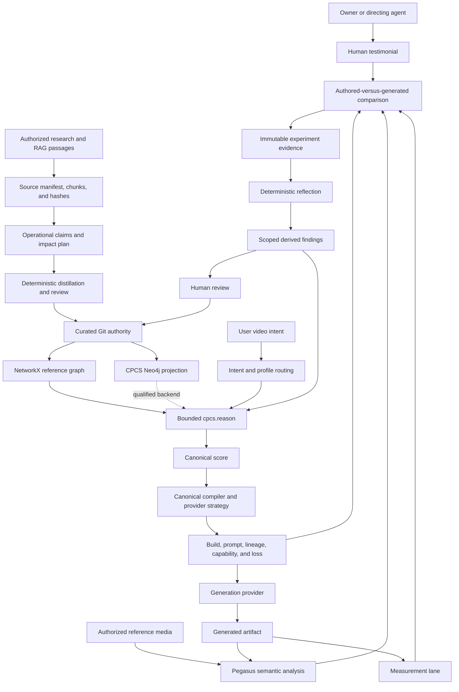

# CPCS Repository Continuity and V2 Implementation Plan

## 0. BLUF

CPCS must grow from its existing owners, contracts, and authority tiers. New research, provider
behavior, generated media, graph backends, and coding agents may propose changes, but none may
create a second ontology, compiler, experiment system, knowledge authority, or unreviewed path into
production behavior.

The target loop is:

```text
authorized research and media
-> governed evidence intake
-> reviewed CPCS knowledge
-> normalized intent
-> relevance-gated typed traversal
-> one canonical control score
-> provider-aware compilation
-> journaled rendering
-> Pegasus, measurement, and human verification
-> immutable experiment evidence
-> deterministic reflection
-> scoped derived learning
-> later retrieval and compiler-strategy selection
```

Neo4j is a CPCS-owned, rebuildable projection of Git authority. It is never a replacement for
curated JSONL and is never directly writable by an agent.

Research may automatically produce impact reports, operational claims, tests, and staged patch
proposals. Only reviewed changes with passing gates may alter executable or curated authority.

## 1. Document authority and use

This file owns follow-on continuity, growth rules, dependency order, and target acceptance for CPCS
V2. It does not report what is implemented now.

Authority order:

```text
owner instruction
-> AGENTS.md governance
-> ARCHITECTURE.md current executable truth
-> this continuity and target-state plan
-> subsystem AGENTS.md contracts
-> runbooks and implementation notes
```

An agent must verify the current branch, revision, worktree, public operations, tests, gates, and
remote state before admitting a slice. If `ARCHITECTURE.md` proves that a planned capability is
already working, the agent preserves it and works on the next verified gap. A target in this file is
not evidence of implementation.

Use these categorical states:

```text
not_started
planned
in_progress
implemented_unqualified
qualified
blocked
superseded
retired
```

A capability is `qualified` only when its public path, contracts, failure behavior, replay behavior,
tests, and recovery path pass.

## 2. Product continuity contract

### 2.1 One universal kernel

CPCS is one provider-neutral video-intent and creative-direction system with configurable profiles.
The universal kernel owns:

```text
project
intent
entities
shots
beats
actions
performance
motion
interaction
camera
editing
audio
marketing function
style
continuity
constraints
assets
provenance
provider disposition
verification
```

UGC, product advertising, dialogue, cinematic direction, action, anime, VFX, music video,
education, and future domains are profiles over that kernel. Profiles may set defaults, required
layers, composition rules, provider preferences, and verification metrics. They may not define a
parallel canonical schema.

### 2.2 Authority table

| Information class | Authority | Allowed writer |
|---|---|---|
| Frozen research evidence | `research/` packages and integrity manifests | Package admission workflow only |
| Curated knowledge | `lab/concepts.jsonl` and `lab/second_brain/curated/` | Reviewed curation path |
| Immutable evidence | `lab/second_brain/immutable/` | Governed recorders |
| Staged knowledge proposals | `lab/second_brain/staging/` | Distillation and reviewed proposal paths |
| Derived learning | `lab/second_brain/derived/` | Deterministic reflection |
| Build outputs | Canonical build directory under ignored work state | Canonical compiler |
| Neo4j | Rebuildable CPCS projection | Synchronization adapter |

No provider adapter, LLM, retrieval client, watcher, Neo4j query, or generated-video analysis may
write curated knowledge directly.

### 2.3 One compiler

There is one production compile path:

```text
normalized intent
-> profile resolution
-> knowledge selection
-> canonical control score
-> provider capability negotiation
-> prompt and control projection
-> build manifest, lineage, and loss report
```

Natural language, YAML, XML, JSON, JSONL, keyframes, images, video references, and dense control
assets are inputs or projections with declared roles. They are not separate semantic authorities.

### 2.4 One bounded public reasoning boundary

Keep `cpcs.reason` and the shared application service as the public reasoning boundary. Storage
backends may change behind the contract. Do not expose arbitrary Cypher, unrestricted traversal,
arbitrary repository paths, mutable authority operations, or provider credentials through MCP.

### 2.5 One experiment authority

Prompt strategy, provider behavior, format behavior, compression, ordering, and creative-performance
claims enter the same sealed experiment system. Notebook-only, agent-memory-only, CSV-only, and
Neo4j-only experiment authorities are forbidden.

## 3. Baseline preservation and gap admission

Every follow-on agent must rerun the repository audit. Preserve these implemented foundations when
their current verifiers pass:

- Git-readable authority and schema validation.
- Directed NetworkX reasoning with typed paths and bounded MCP access.
- Deterministic repository-graph and reflection rebuilds.
- Source, evidence, and authority labels in query and context results.
- Universal score, provider build, runtime, verification, application, and release owners.
- Resumable MCP research extraction and explicit curation boundaries.
- Local Hermes access through the tracked MCP launcher.

The continuity plan currently identifies these high-value follow-on gaps. Their live status remains
owned by `ARCHITECTURE.md`:

1. Research-to-code impact planning and staged implementation proposals.
2. CPCS-owned Neo4j projection, parity, rebuild, incremental sync, and qualified hot-load.
3. Accepted-experiment orchestration around the existing deterministic reflector.
4. Broader semantic and measurement verification with live TwelveLabs qualification.
5. Held-out calibration, recovery drills, and no-manual-bridge production qualification.

## 4. Target architecture



The build package remains one versioned directory containing:

```text
canonical_score.json
provider_request.json
prompt.txt
reference_still_prompt.txt
capability_report.json
loss_report.json
verification_plan.json
build_manifest.json
```

The manifest binds intent, score, compiler, profiles, concepts, blocks, provider capability,
serialization strategy, prompt spans, references, losses, and verification schemas by hash.

## 5. Growth policy

### 5.1 Vertical growth

Vertical growth makes an existing path deeper or safer. It must identify the existing owner,
preserve durable IDs, add evidence-backed mappings and fixtures, compare against the current
qualified behavior, and retain rollback to the prior policy or compiler version.

Examples include improved UGC authenticity, camera-intent recovery, motion timing, prompt
compression, attribution, and verification quality.

### 5.2 Horizontal growth

Horizontal growth adds a profile, provider, modality, workflow, or client. It must reuse normalized
intent, the canonical score, profile merge rules, authority tiers, experiment records, provider
dispositions, verification contracts, and the public application boundary.

Reject a horizontal feature that introduces a second canonical root, domain truth store, compiler,
experiment store, private graph authority, unbounded agent path, orphan schema, or provider rule
without scope and loss semantics.

### 5.3 Enforced growth checks

Repository validation should reject:

- Duplicate canonical schema roots or production compiler registrations.
- Duplicate durable concept, edge, mapping, experiment, or provider-strategy IDs.
- Unrouted files and schemas.
- Profile fields that do not resolve to the universal kernel.
- Learned outputs attempting curated writes.
- Neo4j-only records with no Git authority.
- Prompt blocks without evidence or an explicit unproven state.

## 6. Prompt continuity

The canonical score owns meaning. YAML, XML, JSON, prose, and control media are projections.

Every compiler version preserves canonical fields, stable entities and events, temporal order,
constraints, provenance, provider disposition, and explicit loss records. Compare normalized typed
values and semantic hashes rather than byte equality across serialization formats.

Golden fixtures must cover at least:

- Natural UGC talking head and product demonstration.
- Restrained cinematic dialogue.
- Action with staged near-contact.
- Anime-stylized action.
- Multi-shot identity continuity.
- Reference-to-video transfer.
- First-frame and last-frame control.

Each fixture retains canonical input, selected knowledge, long and constrained prompts, provider
request, capability and loss reports, verification plan, semantic hash, and forbidden regressions.

Prompt changes use one classification:

```text
non_semantic_format_change
semantic_addition
semantic_refinement
provider_scoped_strategy_change
compression_change
breaking_semantic_change
```

A breaking semantic change requires a contract or compiler version, migration notes, old and new
goldens, controlled evidence or a source-backed correction, and rollback.

Compression is deterministic. It preserves safety, rights, identity, product, continuity, required
action, causal order, provider-native controls, and high-confidence direction before optional
expressive detail. If locked fields do not fit, compilation fails, splits the shot, selects another
control asset, or reports the loss.

Prompt-affecting rollout order:

```text
proposal
-> deterministic fixtures
-> shadow compilation
-> controlled experiment
-> bounded provider and domain rollout
-> scoped default
-> periodic revalidation
```

## 7. Research-to-implementation continuity

### 7.1 Research classification

Every accepted research claim receives one change class:

```text
knowledge_only
contract_affecting
implementation_affecting
provider_version_affecting
verification_affecting
policy_affecting
contradictory_or_unverified
```

It also receives an evidence knowledge class such as `established_standard`,
`research_derived_parameterization`, `project_specific_synthesis`,
`empirical_repository_finding`, or `unverified`.

### 7.2 Research-delta pipeline

```text
source registration and byte hash
-> existing-owner and overlap audit
-> bounded operational-claim extraction
-> source, locator, and content-hash binding
-> change classification
-> affected-owner impact traversal
-> staged schema, mapping, test, and patch proposal
-> isolated implementation after approval
-> repository and semantic regression gates
-> human-authorized promotion
```

A research document never directly edits `blocks.yaml`, profiles, mappings, compiler rules,
schemas, or source code.

An operational claim records:

```json
{
  "claim_id": "",
  "source_refs": [],
  "content_hashes": [],
  "knowledge_class": "",
  "change_class": "",
  "scope": {},
  "claim": "",
  "limitations": [],
  "current_owner": "",
  "affected_contracts": [],
  "required_tests": [],
  "status": "staged"
}
```

The impact planner traverses:

```text
research claim
-> supports concept
-> constrains evidence class
-> maps to canonical field
-> compiled by rule, block, or profile
-> serialized to prompt span or control asset
-> evaluated by metric
-> implemented in module
-> protected by test
```

Pegasus semantic evidence may describe scenes, beats, actions, directorial purpose, camera
interpretation, performance hypotheses, marketing function, VFX, and audio relationships. It may
not become measured geometry, exact contact, force, torque, exact FACS intensity, or frame-accurate
kinematics without a measurement source.

Automatic actions may inventory, hash, classify, report impact, propose contracts and tests, apply
an approved patch in an isolated worktree, and run gates. Automatic actions may not edit frozen
research, assign curated IDs, merge, push, replace qualified prompt behavior, raise confidence, or
promote code or knowledge.

## 8. Verification, testimonials, and learning

The closed loop is:

```text
frozen authored evaluation target
-> generated artifact
-> Pegasus semantic observation
+ measurement observation
+ exact raw human testimonial
-> dimensional comparison
-> attribution candidates
-> immutable experiment record
-> deterministic reflection
-> scoped derived findings
-> staged improvement candidates
```

The verifier compares against the frozen canonical target, not a rewritten description inferred
from the generated artifact.

Preserve every human statement verbatim. An LLM may propose a normalized verdict, dimension tags,
strengths, failures, and confidence. A correction appends a superseding record and never overwrites
the raw testimonial.

Verification dimensions include intent, beat order, timing, performance, displayed affect, face,
gaze, head, blink, breath, motion, contact, interaction, camera, editing, identity, product,
continuity, audio, style, negative constraints, and provider adherence. Each result declares its
target, observation, method, tolerance, observability class, evidence, confidence, failure class,
and attribution candidates. Unobservable dimensions receive no fabricated score.

Reflection runs automatically only after an experiment becomes accepted and evidence-complete. It
does not trigger from a render upload, Pegasus completion, partial arms, unreviewed testimony, raw
measurement, LLM diagnosis, or failed run. The orchestrator calls the existing reflector with an
idempotent evidence snapshot and records its derived-state delta. It does not calculate another set
of weights.

Keep authored targets, generated artifacts, Pegasus observations, measurement observations, human
verdicts, derived findings, and curated knowledge as distinct evidence classes.

## 9. Graph continuity and Neo4j

| Graph product | Role | Authority |
|---|---|---|
| Curated JSONL | Reviewed knowledge and relationships | Authoritative |
| NetworkX live graph | Reference traversal and parity oracle | Rebuildable runtime |
| `lab/graph.json` | Repository navigation and governance view | Derived |
| CPCS Neo4j | Persistent query projection | Rebuildable read model |

Use a CPCS-owned Neo4j database or a separately credentialed and isolated namespace. Do not write
CPCS authority into Polymath's graph.

Each projected record includes durable ID, canonical record hash, tier, schema version, source file
and locator, provenance, evidence, active or retired state, and synchronization generation. Preserve
directed parallel edges and durable edge IDs.

Synchronization order:

```text
validate Git authority
-> hash authority snapshot
-> build normalized projection plan
-> acquire sync lock
-> upsert nodes and edges by durable ID
-> retire records absent from the snapshot
-> verify IDs, counts, hashes, endpoints, and provenance
-> publish active generation
-> write checkpoint manifest
```

The same authority snapshot and projection-policy version must produce the same logical graph.
Replay creates no duplicates or logical changes.

Implement `NetworkXBackend` and `Neo4jBackend` behind one internal interface. NetworkX remains the
reference until Neo4j shadow parity covers concepts, path order, edge IDs, sources, evidence,
rejections, alternatives, conflicts, and knowledge gaps. Query operations stay read-only and no
Cypher operation is public.

Add file watching only after full sync, incremental sync, idempotency, interruption recovery, and
parity pass. The watcher only debounces and calls the same sync operation.

## 10. Follow-on workstreams

Every workstream begins with current-state verification and ends with an update to
`ARCHITECTURE.md`. A working capability is preserved, not reimplemented.

### Workstream 0: Continuity freeze and owner inventory

Record the branch, revision, dirty-state exclusions, public owners, schemas, current fixtures, and
gate output. Mark duplicate, manual, obsolete, and conflicting paths. Use an isolated branch or
worktree for implementation.

Exit: owner matrix, baseline semantic hashes, current gate record, and clean implementation scope.

### Workstream 1: Retrieval and typed-graph preservation

Re-run goal relevance, prerequisite closure, dependency order, typed-edge, knowledge-gap, expected
concept, and forbidden-concept canaries. Migrate only remaining high-value legacy relationships with
source-backed semantics.

Exit: priority queries retain required controls, exclude unrelated concepts, and report uncovered
terms without authority mutation.

### Workstream 2: Owned research ingestion preservation

Re-run authorized Markdown, JSON, YAML, XML, and retrieved-passage extraction through the existing
distillation batch and research-session contracts. Add formats only through that owner.

Exit: exact replay produces the same normalized batch and no direct curated write.

### Workstream 3: Research Delta Compiler

Add operational-claim and implementation-proposal schemas, change classification, existing-owner
impact planning, source-to-code-to-test lineage, and approved isolated-worktree patch execution.

Exit: one Pegasus claim creates a source-bound impact plan, schema or mapping proposal, regression
tests, an isolated patch, passing gates, and no automatic promotion.

### Workstream 4: Canonical compiler continuity

Re-run the universal score, translation, profile, provider build, prompt-budget, lock, lineage, and
semantic-loss fixtures. Extend the existing compiler only when a verified gap remains.

Exit: golden builds replay exactly and no parallel compiler or semantic root appears.

### Workstream 5: Provider strategies and live qualification

Add or qualify version-pinned provider capabilities, native and fallback dispositions, prompt
strategy versions, retries, and artifact lineage behind the existing compiler and runtime owners.

Exit: an authorized live provider request and artifact pass build, runtime, verification, rights,
and loss-report gates without modifying the universal kernel.

### Workstream 6: Pegasus and measurement verification

Expand narrow Pegasus schemas, local measurement adapters, normalized observations, comparison
metrics, calibration fixtures, and authored-versus-generated evidence through existing owners.

Exit: one authorized artifact produces separate semantic and measurement results with explicit
observability, disagreement, and no invented measurements.

### Workstream 7: Testimonial and attribution evidence

Preserve raw testimony, reviewed normalization, supersession, mixed verdicts, dimension metrics,
prompt-span lineage, and human-versus-evaluator disagreement.

Exit: corrected feedback retains both versions and every metric resolves to authored and observed
evidence.

Implementation state on 2026-08-05: the deterministic contract and public MCP path are working.
Exact UTF-8 statements bind to verified render bytes, human or LLM normalization cites checked
codepoint spans, correction chains are append-only and non-branching, and an experiment receipt can
select the current review by immutable hashes.

Completed local slice on 2026-08-05: historical controlled-evidence `1.0` records remain valid and
new `1.1` runs derive a closed evidence row for every sealed metric. Compliance metrics resolve the
compiler-authored requirement and canonical controls to exact assertion and source hashes. Human
metrics resolve an exact current testimonial finding, checked raw-statement spans, and a sealed
concept or canonical control. Missing, mismatched, unobservable, or ungrounded metrics fail before
immutable append. Workflow status exposes sealed metrics and compliance statuses, and the task-aware
agent brief directs the reviewer to the closed `metric_findings` contract. The existing recorder and
testimonial owners remain the only writers. The remaining Workstream 7 gap is one live
generated-render evidence pass, not another metric or testimonial store.

### Workstream 8: Governed improvement orchestration

Add the accepted-and-complete experiment trigger, causal-eligibility check, evidence snapshot,
existing reflection invocation, derived-state diff, typed candidates, and replay receipt.

Exit: a controlled experiment produces the same output as manual reflection, changes a later scoped
query trace, and leaves curated files unchanged.

Implementation state on 2026-08-05: the public `cpcs.experiment.accept` path is working offline. It
requires every isolated arm, conclusive evidence, and current testimonial review; checkpoints
admission and reflection; returns one exact replay receipt; records later evidence citations; stages
six unreviewed candidate families; and leaves curated hashes unchanged. One live generated A/B is
still required for provider qualification.

### Workstream 9: CPCS Neo4j projection

Add a CPCS connection contract, durable-ID constraints, full rebuild, incremental create, update,
retire, restore, replay checkpoints, synchronization locking, NetworkX parity, and qualified
hot-load.

Exit: deleting the CPCS projection and replaying Git restores the same logical digest; replay makes
zero changes; one edited record appears without restarting MCP; Polymath data is untouched.

Implementation state on 2026-08-05: the local projection is qualified through
`cpcs-neo4j-projection/1.0`. Four bounded application and MCP operations plan, inspect, synchronize,
and compare the graph. A real isolated Neo4j 2026.06.0 container passed incremental create, update,
retire, restore, exact replay, polling hot-load, namespace deletion and Git rebuild, three full
reasoning comparisons, and persistent restart. NetworkX remains the default and Python owns all
reasoning policy. No Cypher or credential enters a tool argument, and Polymath namespaces fail
closed.

### Workstream 10: Journaled end-to-end orchestration

Re-run the existing runtime resume, cancellation, reconciliation, idempotency, and exact-outcome
canaries. Add only missing cross-system orchestration through existing application operations.

Exit: kill and resume completes once, writes one immutable outcome, and preserves an operator-readable
recovery trail.

Implementation state on 2026-08-05: implemented and locally qualified through
`cpcs-render-evidence-workflow/1.0`, but not live-provider qualified. Five application and MCP
operations bind one sealed arm, exact build, artifact, analysis, optional measurement, metrics, and
human review into a content-derived workflow. Mode-`0600` request, state, event, step, and result
records are hash checked; exact authorization advances only the persisted next step; a child receipt
is fsynced before the state transition; resume reuses it after interruption; cancellation delegates
to the runtime owner; and the workflow stops for exact human feedback rather than inventing it.
Public canaries prove tamper rejection, crash recovery, cancellation replay, one provider submission,
and one immutable run. The remaining acceptance is the same path on one separately authorized live
generated artifact. No second score, adapter, verifier, testimonial store, run store, or learning
path was added.

### Workstream 11: Production qualification and legacy retirement

Run retrieval, compiler, provider, Pegasus, measurement, experiment, graph parity, recovery,
concurrency, security, rights, retention, and remote-head qualification. Retire legacy and diagnostic
paths only after equivalence tests and migration.

Current implementation adds a deterministic evaluator-stability preflight under the release owner.
It binds reference and candidate evaluator identities, exact optimization cases, source-grounded
human calibration, disjoint held-out cases, thresholds, revision, and working-tree state. It detects
candidate error regression, evaluator drift, human-versus-evaluator delta gaps, sign disagreement,
and recursive optimization collapse. Two shared application operations expose evaluation and exact
replay to agents. The output is supporting evidence only: dirty source is ineligible, and calibration
or held-out qualification still requires a separately trusted external attestation that binds the
exact report, canonical request, and every gate-relevant suite, evaluator, case, human-review,
evaluator-output, and optimization artifact named by that request. Deterministic closure derivation,
safe-byte verification, and the external-evidence item limit make omissions and oversized suites
fail closed. Live calibration and held-out evidence remain unfinished.

Exit: every production gate named in `AGENTS.md` passes with revision-bound evidence.

## 11. Dependency order

```text
continuity freeze
-> verified current-state gap map
-> research-delta compiler
-> live verification and evidence completion
-> improvement orchestration
-> qualified Neo4j projection and parity
-> no-manual-bridge production qualification
```

Typed-edge maintenance and research-delta contract design may run in parallel after the baseline is
frozen. Neo4j schema design may start early, but runtime adoption waits for stable reasoning
semantics. Pegasus schemas may develop beside provider qualification, but authored-versus-generated
comparison waits for a stable canonical score and exact build lineage.

## 12. Ownership targets

Search for and extend an existing owner before creating any path.

| Concern | Owner | Boundary |
|---|---|---|
| Raw source extraction | `lab/second_brain/src/source_extract.py` and research-session owners | Existing distillation batches only |
| Research-delta planning | `lab/second_brain/` staging and control plane | Proposals only; no code or curated writes |
| Canonical compilation | `lab/compiler/` | Read-only knowledge consumer |
| Verification | `lab/verification/` | Evidence through governed recorder only |
| Improvement orchestration | Shared application operation calling `reflect.py` | No second weight calculator or promotion path |
| Neo4j projection | Internal second-brain projection adapter | Read model only |
| Render execution | `lab/runtime/` and shared application owner | Journaled transport; no knowledge authority |
| Provider transport | Existing provider adapters | Credentials and network calls only |
| Evaluator stability | `lab/release/stability.py` through the shared application service | Supporting evidence only; no self-qualification |

Forbidden dependencies:

```text
external adapter -> curated files
research document -> production source write
reflector -> curated write
query -> persistent graph mutation
compiler -> staging or curation
provider transport -> repository authority
Neo4j -> Git authority mutation
generated artifact -> research/
LLM diagnosis -> confidence or promotion
```

## 13. Agent operating protocol

### Before work

```bash
git status --short
git branch --show-current
git rev-parse HEAD
python3 lab/scripts/concepts.py validate
python3 lab/scripts/sync_repo.py
python3 lab/scripts/validate_repo.py
```

Run subsystem tests and public canaries for the affected owner. Record pre-existing dirty files.
Use a clean branch or isolated worktree when unrelated changes exist.

### Ownership audit

Classify each requested capability as `existing_complete`, `existing_partial`, `missing`,
`conflicting`, or `obsolete`. Name its owner, schema, public operation, durable outcome, and test.

### Change packet

Before editing, record intent, current runtime truth, owner, change class, affected contracts,
compatibility risk, prompt-semantic risk, migration, tests, and rollback boundary.

### Implementation

Preserve durable IDs and provenance. Add schemas and tests with behavior. Use deterministic
normalization and hashing. Keep provider findings scoped. Route and register new artifacts in the
same change. Rebuild derived artifacts last and never hand-edit `lab/graph.json`.

### Final verification

```bash
python3 lab/scripts/concepts.py validate
python3 lab/scripts/sync_repo.py
python3 lab/scripts/validate_repo.py
git diff --check
```

Run the authoritative discovered test commands for every changed subsystem. A prior green run does
not prove the final tree.

### Completion report

Return the baseline branch and revision, dirty-state exclusions, reused owners, exact files changed,
contract and migration effects, prompt-semantic comparison, test outputs, blocks, residual unknowns,
and exact local and remote revisions when committed and pushed.

## 14. Cross-system verification matrix

| Invariant | Required verifier |
|---|---|
| One canonical root | Schema and registry uniqueness gate |
| One production compiler | Registration and public-entrypoint gate |
| Research cannot write code authority | Research-delta boundary tests |
| Generated evidence cannot become curated truth | Authority-boundary tests |
| Pegasus semantics remain interpreted or inferred | Evidence-class tests |
| Measurement remains separate | Observation namespace and method tests |
| Prompt meaning survives serialization | Semantic round-trip hashes and loss reports |
| Locked fields survive compression | Budget and golden-fixture tests |
| Provider findings remain scoped | Provider-strategy retrieval tests |
| One run cannot establish causality | Experiment and reflection eligibility tests |
| Reflection replays exactly | Double-rebuild digest test |
| Neo4j rebuilds from Git | Delete and rebuild logical-digest test |
| NetworkX and Neo4j agree | Shadow parity suite |
| MCP remains bounded | Application and MCP security tests |
| Job replay produces one outcome | Kill, resume, and idempotency tests |
| New profiles use the universal kernel | Profile compatibility gate |
| New files are routed | Registry and sync gate |
| Negative results remain available | Immutable-chain and index tests |

## 15. Definition of Done for CPCS V2

### Research and knowledge

- One command ingests an authorized folder into lineage-complete candidate records.
- Research deltas find existing owners and stage operational changes without direct authority.
- Promotion remains reviewed, replayable, and provenance-complete.
- Priority graph paths use typed operational and structural edges.

### Reasoning and compilation

- Ordinary intent resolves through compatible profiles into one canonical score.
- Traversal remains relevant across every hop and closes prerequisites.
- One compiler produces provider-neutral meaning and provider-specific execution packages.
- Prompt projections preserve locked fields and report semantic loss.

### Generation and verification

- At least one authorized generation provider passes the complete public workflow.
- Artifacts retain hashes, settings, prompts, references, and compiler lineage.
- Pegasus and measurements produce separate typed observations.
- Comparison reports dimensions, observability, evidence, and attribution candidates.
- Human testimony preserves raw wording and reviewed supersession.

### Learning

- A controlled concept-linked experiment creates immutable evidence.
- Accepted complete evidence invokes deterministic reflection exactly once.
- Derived learning changes a later trace only inside its declared scope.
- Curated knowledge changes only through explicit promotion.
- Held-out fixtures detect evaluator drift and recursive optimization failure.

### Persistence and operations

- CPCS Neo4j rebuilds from Git and passes NetworkX parity.
- Incremental synchronization is idempotent and hot-loads accepted changes.
- Journaled execution survives interruption and records one immutable outcome.
- Hermes reaches the complete bounded workflow through registered operations.
- Recovery can delete derived and Neo4j state and reconstruct it from authority.

### Governance

- Repository validation passes after final edits.
- No unrouted artifacts, duplicate authorities, parallel compilers, or unscoped provider rules remain.
- Obsolete paths retire only after migration and equivalence tests.
- The worktree is clean and the reported remote revision matches the local commit.

## 16. Immediate admitted order

Based on the current verified gap record in `ARCHITECTURE.md`, follow-on work should continue with:

1. Qualify one real Pegasus-derived claim through the now-working Research Delta planning and
   separately authorized isolated patch path; retain owner review and explicit no-promotion
   disposition.
2. Complete one live generated-render Pegasus and measurement round trip, then use the working
   testimonial path to admit its exact owner feedback.
3. Qualify the implemented `cpcs.experiment.accept` orchestrator against that live A/B. The offline
   public canary already proves complete-arm and current-testimonial gates, recovery checkpoints,
   exact replay, existing-reflector equivalence, later evidence citations, typed unreviewed
   candidates, and no curated mutation.
4. Keep the qualified Neo4j projection and NetworkX parity canaries green while the evidence loop
   changes.
5. Run no-manual-bridge qualification, recovery drills, and legacy retirement.

The first narrow qualification canary is:

```text
one user goal
-> one canonical score
-> two controlled compiler strategies
-> two registered renders from one provider and model
-> Pegasus semantic re-analysis
-> available measurement observations
-> raw and normalized owner verdict
-> dimensional comparison and attribution candidates
-> accepted sealed experiment
-> deterministic reflection
-> later scoped reasoning trace changes
-> no curated mutation
-> Neo4j and NetworkX parity
```

## 17. Final continuity rule

Every proposed feature, research package, prompt strategy, provider adapter, graph backend, and agent
workflow must answer:

1. Which existing CPCS owner does this extend?
2. Which canonical meaning or evidence contract does it preserve?
3. How is it verified without contaminating curated truth?
4. How can it be removed or rebuilt without losing authority or history?

If those questions have no concrete answers, the change is not admitted into CPCS.
