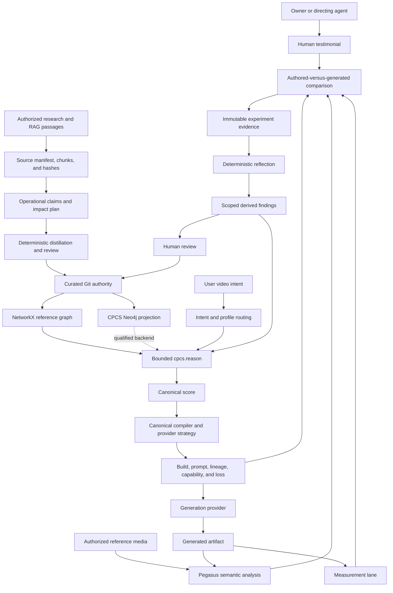

# CPCS Repository Continuity and V2 Implementation Plan

## 0. BLUF

CPCS must grow from its existing owners, contracts, and authority tiers. New research, provider
behavior, generated media, graph backends, and coding agents may propose changes, but none may
create a second ontology, compiler, experiment system, knowledge authority, or unreviewed path into
production behavior.

The target loop is:

```text
authorized research and media
-> governed evidence intake
-> reviewed CPCS knowledge
-> normalized intent
-> relevance-gated typed traversal
-> one canonical control score
-> provider-aware compilation
-> journaled rendering
-> Pegasus, measurement, and human verification
-> immutable experiment evidence
-> deterministic reflection
-> scoped derived learning
-> later retrieval and compiler-strategy selection
```

Neo4j is a CPCS-owned, rebuildable projection of Git authority. It is never a replacement for
curated JSONL and is never directly writable by an agent.

Research may automatically produce impact reports, operational claims, tests, and staged patch
proposals. Only reviewed changes with passing gates may alter executable or curated authority.

## 1. Document authority and use

This file owns follow-on continuity, growth rules, dependency order, and target acceptance for CPCS
V2. It does not report what is implemented now.

Authority order:

```text
owner instruction
-> AGENTS.md governance
-> ARCHITECTURE.md current executable truth
-> this continuity and target-state plan
-> subsystem AGENTS.md contracts
-> runbooks and implementation notes
```

An agent must verify the current branch, revision, worktree, public operations, tests, gates, and
remote state before admitting a slice. If `ARCHITECTURE.md` proves that a planned capability is
already working, the agent preserves it and works on the next verified gap. A target in this file is
not evidence of implementation.

Use these categorical states:

```text
not_started
planned
in_progress
implemented_unqualified
qualified
blocked
superseded
retired
```

A capability is `qualified` only when its public path, contracts, failure behavior, replay behavior,
tests, and recovery path pass.

## 2. Product continuity contract

### 2.1 One universal kernel

CPCS is one provider-neutral video-intent and creative-direction system with configurable profiles.
The universal kernel owns:

```text
project
intent
entities
shots
beats
actions
performance
motion
interaction
camera
editing
audio
marketing function
style
continuity
constraints
assets
provenance
provider disposition
verification
```

UGC, product advertising, dialogue, cinematic direction, action, anime, VFX, music video,
education, and future domains are profiles over that kernel. Profiles may set defaults, required
layers, composition rules, provider preferences, and verification metrics. They may not define a
parallel canonical schema.

### 2.2 Authority table

| Information class | Authority | Allowed writer |
|---|---|---|
| Frozen research evidence | `research/` packages and integrity manifests | Package admission workflow only |
| Curated knowledge | `lab/concepts.jsonl` and `lab/second_brain/curated/` | Reviewed curation path |
| Immutable evidence | `lab/second_brain/immutable/` | Governed recorders |
| Staged knowledge proposals | `lab/second_brain/staging/` | Distillation and reviewed proposal paths |
| Derived learning | `lab/second_brain/derived/` | Deterministic reflection |
| Build outputs | Canonical build directory under ignored work state | Canonical compiler |
| Neo4j | Rebuildable CPCS projection | Synchronization adapter |

No provider adapter, LLM, retrieval client, watcher, Neo4j query, or generated-video analysis may
write curated knowledge directly.

### 2.3 One compiler

There is one production compile path:

```text
normalized intent
-> profile resolution
-> knowledge selection
-> canonical control score
-> provider capability negotiation
-> prompt and control projection
-> build manifest, lineage, and loss report
```

Natural language, YAML, XML, JSON, JSONL, keyframes, images, video references, and dense control
assets are inputs or projections with declared roles. They are not separate semantic authorities.

### 2.4 One bounded public reasoning boundary

Keep `cpcs.reason` and the shared application service as the public reasoning boundary. Storage
backends may change behind the contract. Do not expose arbitrary Cypher, unrestricted traversal,
arbitrary repository paths, mutable authority operations, or provider credentials through MCP.

### 2.5 One experiment authority

Prompt strategy, provider behavior, format behavior, compression, ordering, and creative-performance
claims enter the same sealed experiment system. Notebook-only, agent-memory-only, CSV-only, and
Neo4j-only experiment authorities are forbidden.

## 3. Baseline preservation and gap admission

Every follow-on agent must rerun the repository audit. Preserve these implemented foundations when
their current verifiers pass:

- Git-readable authority and schema validation.
- Directed NetworkX reasoning with typed paths and bounded MCP access.
- Deterministic repository-graph and reflection rebuilds.
- Source, evidence, and authority labels in query and context results.
- Universal score, provider build, runtime, verification, application, and release owners.
- Resumable MCP research extraction and explicit curation boundaries.
- Local Hermes access through the tracked MCP launcher.

The continuity plan currently identifies these high-value follow-on gaps. Their live status remains
owned by `ARCHITECTURE.md`:

1. Research-to-code impact planning and staged implementation proposals.
2. CPCS-owned Neo4j projection, parity, rebuild, incremental sync, and qualified hot-load.
3. Accepted-experiment orchestration around the existing deterministic reflector.
4. Broader semantic and measurement verification with live TwelveLabs qualification.
5. Held-out calibration, recovery drills, and no-manual-bridge production qualification.

## 4. Target architecture



The build package remains one versioned directory containing:

```text
canonical_score.json
provider_request.json
prompt.txt
reference_still_prompt.txt
capability_report.json
loss_report.json
verification_plan.json
build_manifest.json
```

The manifest binds intent, score, compiler, profiles, concepts, blocks, provider capability,
serialization strategy, prompt spans, references, losses, and verification schemas by hash.

## 5. Growth policy

### 5.1 Vertical growth

Vertical growth makes an existing path deeper or safer. It must identify the existing owner,
preserve durable IDs, add evidence-backed mappings and fixtures, compare against the current
qualified behavior, and retain rollback to the prior policy or compiler version.

Examples include improved UGC authenticity, camera-intent recovery, motion timing, prompt
compression, attribution, and verification quality.

### 5.2 Horizontal growth

Horizontal growth adds a profile, provider, modality, workflow, or client. It must reuse normalized
intent, the canonical score, profile merge rules, authority tiers, experiment records, provider
dispositions, verification contracts, and the public application boundary.

Reject a horizontal feature that introduces a second canonical root, domain truth store, compiler,
experiment store, private graph authority, unbounded agent path, orphan schema, or provider rule
without scope and loss semantics.

### 5.3 Enforced growth checks

Repository validation should reject:

- Duplicate canonical schema roots or production compiler registrations.
- Duplicate durable concept, edge, mapping, experiment, or provider-strategy IDs.
- Unrouted files and schemas.
- Profile fields that do not resolve to the universal kernel.
- Learned outputs attempting curated writes.
- Neo4j-only records with no Git authority.
- Prompt blocks without evidence or an explicit unproven state.

## 6. Prompt continuity

The canonical score owns meaning. YAML, XML, JSON, prose, and control media are projections.

Every compiler version preserves canonical fields, stable entities and events, temporal order,
constraints, provenance, provider disposition, and explicit loss records. Compare normalized typed
values and semantic hashes rather than byte equality across serialization formats.

Golden fixtures must cover at least:

- Natural UGC talking head and product demonstration.
- Restrained cinematic dialogue.
- Action with staged near-contact.
- Anime-stylized action.
- Multi-shot identity continuity.
- Reference-to-video transfer.
- First-frame and last-frame control.

Each fixture retains canonical input, selected knowledge, long and constrained prompts, provider
request, capability and loss reports, verification plan, semantic hash, and forbidden regressions.

Prompt changes use one classification:

```text
non_semantic_format_change
semantic_addition
semantic_refinement
provider_scoped_strategy_change
compression_change
breaking_semantic_change
```

A breaking semantic change requires a contract or compiler version, migration notes, old and new
goldens, controlled evidence or a source-backed correction, and rollback.

Compression is deterministic. It preserves safety, rights, identity, product, continuity, required
action, causal order, provider-native controls, and high-confidence direction before optional
expressive detail. If locked fields do not fit, compilation fails, splits the shot, selects another
control asset, or reports the loss.

Prompt-affecting rollout order:

```text
proposal
-> deterministic fixtures
-> shadow compilation
-> controlled experiment
-> bounded provider and domain rollout
-> scoped default
-> periodic revalidation
```

## 7. Research-to-implementation continuity

### 7.1 Research classification

Every accepted research claim receives one change class:

```text
knowledge_only
contract_affecting
implementation_affecting
provider_version_affecting
verification_affecting
policy_affecting
contradictory_or_unverified
```

It also receives an evidence knowledge class such as `established_standard`,
`research_derived_parameterization`, `project_specific_synthesis`,
`empirical_repository_finding`, or `unverified`.

### 7.2 Research-delta pipeline

```text
source registration and byte hash
-> existing-owner and overlap audit
-> bounded operational-claim extraction
-> source, locator, and content-hash binding
-> change classification
-> affected-owner impact traversal
-> staged schema, mapping, test, and patch proposal
-> isolated implementation after approval
-> repository and semantic regression gates
-> human-authorized promotion
```

A research document never directly edits `blocks.yaml`, profiles, mappings, compiler rules,
schemas, or source code.

An operational claim records:

```json
{
  "claim_id": "",
  "source_refs": [],
  "content_hashes": [],
  "knowledge_class": "",
  "change_class": "",
  "scope": {},
  "claim": "",
  "limitations": [],
  "current_owner": "",
  "affected_contracts": [],
  "required_tests": [],
  "status": "staged"
}
```

The impact planner traverses:

```text
research claim
-> supports concept
-> constrains evidence class
-> maps to canonical field
-> compiled by rule, block, or profile
-> serialized to prompt span or control asset
-> evaluated by metric
-> implemented in module
-> protected by test
```

Pegasus semantic evidence may describe scenes, beats, actions, directorial purpose, camera
interpretation, performance hypotheses, marketing function, VFX, and audio relationships. It may
not become measured geometry, exact contact, force, torque, exact FACS intensity, or frame-accurate
kinematics without a measurement source.

Automatic actions may inventory, hash, classify, report impact, propose contracts and tests, apply
an approved patch in an isolated worktree, and run gates. Automatic actions may not edit frozen
research, assign curated IDs, merge, push, replace qualified prompt behavior, raise confidence, or
promote code or knowledge.

### 7.3 Canonical placement and graph-growth contract

New research extends one ontology through six governed namespaces: production, creative,
knowledge, evidence, execution, and projection. The namespaces classify one canonical system. They
must not become parallel graphs, scores, compilers, or authority stores. The core vocabulary is
closed and versioned; reviewed domain packs may extend it through registered aliases, parents,
controls, metrics, and typed edge families.

The same registry owns canonical terminology and identifier resolution. Source extraction, packet
anchoring, ontology placement, query, context, and compiler admission must call one resolver rather
than carrying separate synonym lists. Resolver output includes normalized terms, canonical IDs,
domain-qualified senses, rejected senses, evidence for the decision, alternatives, and unresolved
ambiguity. Pattern aliases such as `AU1`, `AU01`, `au-1`, and `facial AU 1` normalize to `AU01` only
when the facial Action Unit sense is resolved. A bare homonym without enough context returns
alternatives rather than selecting by embedding score.

The governed growth path is:

```text
authorized bytes or exact retrieved passages
-> stable source-unit inventory and bounded semantic packets
-> typed proposals or evidence-linked no-result dispositions
-> cpcs.ontology_placement/1.0
-> deterministic identity, alias, parent, control, metric, and edge resolution
-> cpcs.research_graph_growth_plan/1.0
-> schema, reference, placement, coverage, and dependency checks
-> staging and explicit review
-> journaled promotion
-> selective index invalidation and incremental Neo4j synchronization
-> retrieval, traversal, compiler, and no-regression qualification
```

Every proposal receives one primary placement, optional source-supported secondary domain links,
and one closed disposition: `merge`, `refine`, `extend`, `contradict`, `supersede`, `new`,
`no_candidate`, or `needs_review`. The LLM may propose interpretations and alternatives.
Deterministic code owns source closure, durable identity, exact duplicates, allowed roots, parent and
edge compatibility, referential integrity, coverage, promotion eligibility, and rebuild scope.

The working source-closure baseline is `lab/second_brain/immutable/source_units.jsonl`. Completed
research sessions can admit exact passages through `cpcs.research.source.units.admit`; promotion
must resolve typed evidence to one immutable unit; `cpcs.source.status`, `cpcs.source.resolve`, and
`cpcs.context.get` expose bounded hash-verified local passages. Existing external-only references
remain explicit quarantines. Polymath is therefore optional for already admitted evidence and
remains useful only for discovering or retrieving evidence that the local registry does not hold.

Vertical growth adds depth along a registered path, for example framework to mechanism to technique
to canonical control. Horizontal growth adds one explicit typed bridge between existing domains.
Neither may overwrite authority, introduce an unregistered root, silently merge synonyms, or make a
production-critical path depend only on `pairs_with` or vector similarity.

For FACS research, one placement bundle distinguishes the coding framework, Action Unit family,
canonical AU term, claim, method, mechanism, rule, mapping, and observation classes. A new AU term
must be structurally attached to the FACS family and mapped to the canonical
`performance.facs.events` control. Existing `performance.facs_action_units` is a compatibility
projection until the compiler migration is qualified. Detector estimates remain measured or
detected evidence and cannot promote a formal AU definition or intensity claim.

After reviewed promotion, rebuild only derived records whose authority hash or incident
neighborhood changed. Neo4j upserts or retires by durable ID and record hash. The same authority
snapshot, ontology version, placement policy, and projection policy must reproduce the same logical
graph, derived indexes, and query results.

### 7.4 Temporal knowledge evolution

LLM context must reproduce both meaning and history. CPCS therefore keeps four clocks separate:

1. Source time is the publication, observation, or authored effective time stated by evidence.
2. Valid time is when a concept, claim, relationship, mapping, rule, or provider finding applies.
3. System time is when CPCS registered, reviewed, promoted, superseded, or retired the record.
4. Media time is the timecode of a source asset, generated artifact, VOG observation, or canonical
   timed control.

The current temporal implementation owns valid-time intervals, supersession, and the bitemporal
`known_at` view beside `valid_at`. A query can
ask what applies now, what applied at an earlier represented time, what CPCS knew when an earlier
decision was made, or what applied then using only what was known then.

Promotion transactions and repository revisions define system-time boundaries. Corrections append
successors and close intervals; they never overwrite predecessor bytes. Backfilled research retains
its older source and valid dates but begins system visibility only when CPCS registers or promotes
it. Conflicting claims may coexist with independent sources and scopes. Query and context output
must identify the temporal view, replacement lineage, selected version, and excluded later
knowledge.

Version-one timeless records remain readable through an explicit open-system-time migration default. Qualification
must cover current, valid-at, known-at, combined bitemporal, supersession, contradiction,
provider-version, NetworkX, Neo4j, and context-replay cases before version two becomes the default.

### 7.5 First-class maintenance and anti-decay

Every agent-facing knowledge workflow begins and ends with one revision-bound brain-health check.
The check combines schema and source integrity, valid-time and system-known-time eligibility,
supersession, alias collisions, domain completeness, graph reachability, retrieval canaries, derived
freshness, and projection parity. Separate passing checks do not imply a healthy whole unless one
report binds their exact inputs, results, policies, and authority snapshot.

Maintenance follows a typed, resumable state graph:

```text
inspect -> classify -> plan -> retrieve exact source if needed -> validate
-> await explicit review -> authorized promotion -> selective rebuild -> qualify -> close
```

Each transition is content addressed, checkpointed, guarded, and replayable. A LangGraph adapter
may schedule the workflow after the direct runtime qualifies, but it must call the same headless
application operations. It cannot own schema rules, graph placement, durable IDs, journals,
promotion, or recovery.

The repeatedly loaded core-memory view contains concise reviewed concepts, claims, controls, rules,
relationships, limitations, and source anchors. Raw passages, full documents, long model responses,
and per-asset observations stay outside that view. The view is derived, bounded, temporally filtered,
and byte-rebuildable from Git authority.

Domain completeness requires more than one disposition per parsed section. A
`cpcs.domain_coverage_manifest/1.0` compares the expected items in a registered vocabulary or
source-declared catalog with extracted, staged, curated, compiler-mapped, and retrieval-qualified
items. Ambiguous, excluded, and missing items remain visible. The first canary uses an authorized
FACS catalog and canonical AU identifiers. If one AU is absent, the graph returns a coverage gap.
It must not substitute another AU or claim the catalog is complete.

When a graph gap needs source detail, the working local bounded fallback produces
`cpcs.source_answer_trace/1.0`: original question, unresolved graph slot, exact source ID and
locator, content hash, answer span, evidence class, uncertainty, and closed result. The local result
can be `answered_local`, `not_found`, `ambiguous`, or `not_required`. External retrieval and the
later domain-coverage repair loop retain their separate authorization and qualification work. An
answered passage may start a proposal but cannot bypass source admission, distillation, or reviewed
promotion.

Implementation state on 2026-08-07: `cpcs.brain.health` produces one revision-bound report over
authority validation, source closure, domain coverage, graph reachability, and projection identity.
`cpcs.maintenance.prepare`, `.status`, and exactly authorized `.advance` persist hash-chained state
for inspect, selective rebuild, optional sealed-snapshot Neo4j synchronization, and qualification.
Derived `core_memory.json`, `outcome_memory.json`, and `domain_coverage.json` rebuild byte-identically.
The first FACS manifest deliberately covers only the admitted seed subset. Promotion-spanning repair,
cancellation, complete domain inventories, and live configured Neo4j parity remain open.

### 7.6 Outcome memory and deterministic maintenance events

The second brain must remember direction, not only connectivity. Good, bad, mixed, inconclusive,
and reviewed no-go outcomes remain distinct. Each outcome binds the tested concepts and controls,
provider, model, task, duration, seed, artifacts, score, metrics, passed and failed dimensions,
exact human statement and reviewed rationale references, limitations, causal status, validity, and
scope.

`cpcs.outcome_memory/1.0` now rebuilds immutable runs into success, failure, mixed, or inconclusive
records with concept, provider, model, intent, tested-delta, verdict, remark, and exact run lineage.
It does not create another experiment or feedback store. Folding exact testimonial dimensions,
limitations, out-of-scope explanations, and reviewed no-go cards into this view remains open. A
`no_go` may block only after explicit review promotes a scoped failure card or rule; one failed
render, derived correlation, or LLM diagnosis cannot prohibit a concept.

Every reasoning response identifies the positive evidence that raised a path, negative evidence
that lowered it, curated no-go rule that rejected it, and out-of-scope evidence ignored. Evidence
references drill back to exact run, artifact, metric, review, statement span, and remark.

Knowledge maintenance uses `cpcs.knowledge_maintenance_event/1.0`. Events are append-only,
sequence checked, hash chained, and folded into `cpcs.maintenance_state/1.0`. The implemented first
path binds request, authority snapshot, state content, stage input, output payload, policy, prior
event hash, and event hash across inspect, selective rebuild, optional projection, qualification,
and failure. Interrupted execution resumes at the last verified event; stale or changed state fails
closed. Promotion, cancellation, and supersession events remain planned extensions.

FACS is only the first domain catalog and homonym canary. The same contracts must admit unrelated
domains with different object types, vocabularies, evidence standards, and traversal needs. Every
qualification set therefore includes at least one non-performance domain case.

## 8. Verification, testimonials, and learning

The closed loop is:

```text
frozen authored evaluation target
-> generated artifact
-> Pegasus semantic observation
+ measurement observation
+ exact raw human testimonial
-> dimensional comparison
-> attribution candidates
-> immutable experiment record
-> deterministic reflection
-> scoped derived findings
-> staged improvement candidates
```

The verifier compares against the frozen canonical target, not a rewritten description inferred
from the generated artifact.

Preserve every human statement verbatim. An LLM may propose a normalized verdict, dimension tags,
strengths, failures, and confidence. A correction appends a superseding record and never overwrites
the raw testimonial.

Verification dimensions include intent, beat order, timing, performance, displayed affect, face,
gaze, head, blink, breath, motion, contact, interaction, camera, editing, identity, product,
continuity, audio, style, negative constraints, and provider adherence. Each result declares its
target, observation, method, tolerance, observability class, evidence, confidence, failure class,
and attribution candidates. Unobservable dimensions receive no fabricated score.

Reflection runs automatically only after an experiment becomes accepted and evidence-complete. It
does not trigger from a render upload, Pegasus completion, partial arms, unreviewed testimony, raw
measurement, LLM diagnosis, or failed run. The orchestrator calls the existing reflector with an
idempotent evidence snapshot and records its derived-state delta. It does not calculate another set
of weights.

Keep authored targets, generated artifacts, Pegasus observations, measurement observations, human
verdicts, derived findings, and curated knowledge as distinct evidence classes.

## 9. Graph continuity and Neo4j

| Graph product | Role | Authority |
|---|---|---|
| Curated JSONL | Reviewed knowledge and relationships | Authoritative |
| NetworkX live graph | Reference traversal and parity oracle | Rebuildable runtime |
| `lab/graph.json` | Repository navigation and governance view | Derived |
| CPCS Neo4j | Persistent query projection | Rebuildable read model |

Use a CPCS-owned Neo4j database or a separately credentialed and isolated namespace. Do not write
CPCS authority into Polymath's graph.

Each projected record includes durable ID, canonical record hash, tier, schema version, source file
and locator, provenance, evidence, active or retired state, and synchronization generation. Preserve
directed parallel edges and durable edge IDs.

Synchronization order:

```text
validate Git authority
-> hash authority snapshot
-> build normalized projection plan
-> acquire sync lock
-> upsert nodes and edges by durable ID
-> retire records absent from the snapshot
-> verify IDs, counts, hashes, endpoints, and provenance
-> publish active generation
-> write checkpoint manifest
```

The same authority snapshot and projection-policy version must produce the same logical graph.
Replay creates no duplicates or logical changes.

Implement `NetworkXBackend` and `Neo4jBackend` behind one internal interface. NetworkX remains the
reference until Neo4j shadow parity covers concepts, path order, edge IDs, sources, evidence,
rejections, alternatives, conflicts, and knowledge gaps. Query operations stay read-only and no
Cypher operation is public.

Add file watching only after full sync, incremental sync, idempotency, interruption recovery, and
parity pass. The watcher only debounces and calls the same sync operation.

### 9.1 Query-context adaptive traversal

Every read begins with one derived `cpcs.retrieval_frame/1.0` produced from normalized intent plus
authorized user, project, asset, session, provider, model, and temporal context. It records primary
and secondary domains, required coverage slots, hard constraints, requested outputs, excluded
layers, valid-at and known-at views, and root, hop, prerequisite, and token budgets. It is cache
identity and execution policy, not knowledge authority.

```text
retrieval frame
-> global lexical, alias, and semantic root nomination
-> canonical identity resolution and duplicate collapse
-> domain-masked typed local expansion
-> prerequisite closure in stable dependency order
-> conflict, validity, provider, model, and evidence-scope gates
-> continuing path relevance after every hop
-> required-slot coverage and explicit missing-slot gaps
-> source and evidence reranking
-> token-budgeted context with selected and rejected path reasons
```

Structural hops are low cost when they improve specificity or coverage. Operational mapping hops
are medium cost and require a registered control path. Cross-domain hops are higher cost and require
an explicit source-supported bridge demanded by the frame. `requires` uses a separate bounded
closure budget. Constraint edges are evaluated but never expanded. A legacy `pairs_with` edge may
appear at most once in a path during migration and cannot admit a production-critical node by
itself.

Traversal stops when required coverage is satisfied and marginal relevance falls below policy, or
when a declared budget is exhausted. An uncovered required slot returns a gap and suggested bounded
research query instead of being silently omitted. Cache keys bind the retrieval frame, ontology
snapshot, index policy, traversal policy, valid-at view, and known-at view. Embeddings rank roots
and evidence; they never create identity, satisfy prerequisites, or authorize a bridge.

Efficiency comes from precomputed typed adjacency and constraint indexes, domain masks, best-first
bounded expansion, stable representative deduplication, and evidence packing after concept
selection. Qualification must preserve exact replay, read-only authority, required and forbidden
concept labels, selected and rejected path reasons, explicit gaps, and 10x and 100x latency and
memory bounds across multi-domain held-out queries.

FACS is the first homonym and identifier canary. `Action units coding` must resolve to the facial
coding sense; `physical action units for fight choreography` must resolve to action atoms; a truly
bare ambiguous term returns both senses and asks for missing context. `AU4`, `AU04`, and `au-4`
normalize to one identifier. A directorial FACS frame requires AU identity, actor, timing,
intensity, side or asymmetry, control mapping, and projection loss. A detection frame instead
requires method, calibration, observability, evidence class, source locator, and uncertainty. The
retriever stops only when the request-class slots are covered or returned as explicit gaps.

## 10. Follow-on workstreams

Every workstream begins with current-state verification and ends with an update to
`ARCHITECTURE.md`. A working capability is preserved, not reimplemented.

### Workstream 0: Continuity freeze and owner inventory

Record the branch, revision, dirty-state exclusions, public owners, schemas, current fixtures, and
gate output. Mark duplicate, manual, obsolete, and conflicting paths. Use an isolated branch or
worktree for implementation.

Exit: owner matrix, baseline semantic hashes, current gate record, and clean implementation scope.

Implemented control slice on 2026-08-07: the CPCS-owned repository-control layer reads live
requirements from `ARCHITECTURE.md`, emits a deterministic derived directory and dependency map,
overlays current Git WIP for bounded impact inspection, identifies dependency-ready requirements,
and records implementation work in a closed append-only hash chain. The rooted
`cpcs-repo-control` skill supplies the agent workflow, while schemas and runtime transition checks
remain the enforcement boundary. This layer does not install Beads, Aider, Git hooks, Dolt, or a
second task database. Their useful dependency-graph, repository-map, root-cause, and fresh-
verification methods are adapted behind CPCS owners instead.

### Workstream 1: Retrieval and typed-graph preservation

Re-run goal relevance, prerequisite closure, dependency order, typed-edge, knowledge-gap, expected
concept, and forbidden-concept canaries. Add the shared retrieval-frame contract, profile-owned
coverage slots, domain masks, hop costs, budgets, continuing path relevance, selected and rejected
path reasons, and explicit missing-slot gaps through the existing query and context owners. Migrate
only remaining high-value legacy relationships with source-backed semantics. Add opposing FACS
Action Unit and physical action-atom cases plus canonical AU identifier normalization before broad
retrieval qualification.

Exit: multi-domain priority queries fill required coverage slots, retain required controls, exclude
unrelated concepts, explain every admitted and rejected path, report uncovered terms, replay
exactly, and remain inside qualified scale limits without authority mutation. A graph gap must bind
to a domain-coverage record and an exact source-answer disposition.

### Workstream 2: Owned research ingestion preservation

Re-run authorized Markdown, JSON, YAML, XML, and retrieved-passage extraction through the existing
distillation batch and research-session contracts. Add the six-namespace ontology registry,
proposal placement, graph-growth plan, deterministic identity resolution, vertical and horizontal
edge admission, bitemporal source, valid, and system-time treatment, and selective derived-index and
Neo4j invalidation through existing owners. Add formats only through the source-extraction owner.

Exit: exact replay produces the same normalized batch, placement dispositions, graph-growth plan,
and affected projection set; no direct curated write occurs, and reviewed promotion updates only
the planned authority and derived neighborhoods. Brain health, domain completeness, and concise
core-memory views must pass before and after the update.

Implemented first slice on 2026-08-07: `cpcs.ontology_registry/1.2` closes the concept kinds,
semantic layers, mapping target families, control namespaces, representation roles, and declared
alias ambiguities present in the current curated corpus. Curated validation rejects unknown
classifications, duplicate normalized names or fingerprints, and undeclared alias collisions; the
distiller rejects exact incoming name or alias collisions before staging. Mapping `1.1` also carries
an optional evidence-scoped representation strategy for natural language, YAML, JSON, and XML
projections. Deterministic placement and graph-growth plans now bind exact registry and source
snapshots before promotion. The initial terminology controller normalizes AU identifier spellings,
separates two Action Unit and two follow-through senses, pauses ambiguous traversal, and allows a
source-backed agent to stage one exact-query choice without canonical promotion. The 1.2 edge
contracts close every runtime edge type to a family, directionality, endpoint-kind set, and
cross-layer-root set, validate authored relationships, and reject incompatible research
associations before staging. Interpreted Pegasus observation edges may be quarantined in staging for
typed reclassification, but incompatible edges cannot promote. Extraction, placement, context, directing-strategy, and score admission
now recompute the same terminology resolver, with proposal IDs remaining source-backed and
staging-only. Remaining Workstream 2 work includes ontology parents, typed control values, durable
terminology-change review, complete domain inventories, selective projection invalidation,
promotion-triggered automatic Neo4j delta submission, and reviewed live examples that qualify format effects
without universalizing them.

Implemented extraction-completeness slice on 2026-08-07:
`cpcs.semantic_extraction_response/1.1` makes every new bounded packet explicit. It accepts one or
more source-cited candidates with a null no-candidate field, or one closed no-candidate reason with
evidence, unresolved questions, limitations, and exact assessed-chunk coverage. Runtime source
closure requires both the assessed and cited chunk sets to equal the packet passages. Public
coverage inspection exposes the disposition, exact replay is stable, detached evidence fails, and
all knowledge tiers remain unchanged. Historical `1.0` captures and completed sessions remain
readable but cannot accept another write. This closes packet-result completeness, not held-out
semantic recall, domain-catalog completeness, ontology placement, or promotion qualification.

### Workstream 3: Research Delta Compiler

Add operational-claim and implementation-proposal schemas, change classification, existing-owner
impact planning, source-to-code-to-test lineage, and approved isolated-worktree patch execution.

Exit: one Pegasus claim creates a source-bound impact plan, schema or mapping proposal, regression
tests, an isolated patch, passing gates, and no automatic promotion.

### Workstream 4: Canonical compiler continuity

Re-run the universal score, translation, profile, provider build, prompt-budget, lock, lineage, and
semantic-loss fixtures. Extend the existing compiler only when a verified gap remains.

Exit: golden builds replay exactly and no parallel compiler or semantic root appears.

### Workstream 5: Provider strategies and live qualification

Add or qualify version-pinned provider capabilities, native and fallback dispositions, prompt
strategy versions, retries, and artifact lineage behind the existing compiler and runtime owners.

Exit: an authorized live provider request and artifact pass build, runtime, verification, rights,
and loss-report gates without modifying the universal kernel.

### Workstream 6: Pegasus and measurement verification

Expand narrow Pegasus schemas, local measurement adapters, normalized observations, comparison
metrics, calibration fixtures, and authored-versus-generated evidence through existing owners.

Exit: one authorized artifact produces separate semantic and measurement results with explicit
observability, disagreement, and no invented measurements.

Add one application-owned dual-video comparison workflow with two modes. `pegasus_direct` runs the
same fixed analysis schedule against the exact reference and candidate, preserves separate VOGs,
and produces deterministic temporal, speech, motion, semantic, conflict, and visual-review
differences. `knowledge_lens` first freezes a source-traceable context bundle for the user's goal,
maps selected concepts to declared observable slots, then uses the same paired analysis to report
which researched mechanisms match, diverge, conflict, remain unobservable, or expose a research
gap. The graph chooses lenses; it does not manufacture observations or verdicts.

The workflow must use `cpcs.video.compare.prepare`, `.status`, `.advance`, `.inspect`, and `.cancel`
through the existing application service so CLI, HTTP, MCP, and future clients share one state
machine. Preparation is provider-free. An external advance requires exact authorization, persists
the child receipt before transition, advances one step, and replays without another provider call.
Neither mode writes curated knowledge, merges the two VOGs into the research graph, or promotes a
repair suggestion.

Implementation state on 2026-08-07: `pegasus_direct` is working offline through the five shared
application and MCP operations. Four closed schemas bind request, plan, hash-chained state, and
report identities. Preparation validates identical paired profile sets and a fixed provider-call
maximum without contacting TwelveLabs. Exact-authorized one-step advances reuse the existing
atomic planner, operational-only cascade, optional same-tool pose measurement, and verifier;
receipt-first recovery prevents duplicate child calls after interruption. Comparison now aligns
separate source-bound VOG observations by profile, normalized interval, and declared subject map
while preserving claims, provenance, evidence class, conflicts, and unobservable rows. Focused
canaries pass replay, cancellation, state tamper rejection, role discovery, authorization,
profile-drift and budget rejection, VOG isolation, and zero mutation across all four knowledge
tiers. `cpcs.video.comparison.lens` now creates a deterministic pre-comparison knowledge snapshot
from two separately validated VOGs, while `cpcs.video.research_gaps` reports graph coverage and
unbridged observations. Reviewed bridges use a dedicated non-traversable curated record. Automatic
attachment of the lens hash to the five-step comparison workflow and live provider qualification
remain follow-on work.

### Workstream 7: Testimonial and attribution evidence

Preserve raw testimony, reviewed normalization, supersession, mixed verdicts, dimension metrics,
prompt-span lineage, and human-versus-evaluator disagreement.

Exit: corrected feedback retains both versions and every metric resolves to authored and observed
evidence.

Implementation state on 2026-08-05: the deterministic contract and public MCP path are working.
Exact UTF-8 statements bind to verified render bytes, human or LLM normalization cites checked
codepoint spans, correction chains are append-only and non-branching, and an experiment receipt can
select the current review by immutable hashes.

Completed local slice on 2026-08-05: historical controlled-evidence `1.0` records remain valid and
new `1.1` runs derive a closed evidence row for every sealed metric. Compliance metrics resolve the
compiler-authored requirement and canonical controls to exact assertion and source hashes. Human
metrics resolve an exact current testimonial finding, checked raw-statement spans, and a sealed
concept or canonical control. Missing, mismatched, unobservable, or ungrounded metrics fail before
immutable append. Workflow status exposes sealed metrics and compliance statuses, and the task-aware
agent brief directs the reviewer to the closed `metric_findings` contract. The existing recorder and
testimonial owners remain the only writers. The remaining Workstream 7 gap is one live
generated-render evidence pass, not another metric or testimonial store.

### Workstream 8: Governed improvement orchestration

Add the accepted-and-complete experiment trigger, causal-eligibility check, evidence snapshot,
existing reflection invocation, derived-state diff, typed candidates, and replay receipt.

Exit: a controlled experiment produces the same output as manual reflection, changes a later scoped
query trace, and leaves curated files unchanged.

Implementation state on 2026-08-05: the public `cpcs.experiment.accept` path is working offline. It
requires every isolated arm, conclusive evidence, and current testimonial review; checkpoints
admission and reflection; returns one exact replay receipt; records later evidence citations; stages
six unreviewed candidate families; and leaves curated hashes unchanged. One live generated A/B is
still required for provider qualification.

Remaining outcome-memory work: preserve success, failure, mixed, inconclusive, and reviewed no-go
classes in one derived view; include exact rationale, remarks, failed dimensions, limitations, and
scope in later traversal; and require reviewed promotion before any failure becomes a blocking rule.
The current negative learned weight changes ranking but does not explain these details.

### Workstream 9: CPCS Neo4j projection

Add a CPCS connection contract, durable-ID constraints, full rebuild, incremental create, update,
retire, restore, replay checkpoints, synchronization locking, NetworkX parity, and qualified
hot-load.

Exit: deleting the CPCS projection and replaying Git restores the same logical digest; replay makes
zero changes; one edited record appears without restarting MCP; Polymath data is untouched.

Implementation state on 2026-08-05: the local projection is qualified through
`cpcs-neo4j-projection/1.0`. Four bounded application and MCP operations plan, inspect, synchronize,
and compare the graph. A real isolated Neo4j 2026.06.0 container passed incremental create, update,
retire, restore, exact replay, polling hot-load, namespace deletion and Git rebuild, three full
reasoning comparisons, and persistent restart. NetworkX remains the default and Python owns all
reasoning policy. No Cypher or credential enters a tool argument, and Polymath namespaces fail
closed.

### Workstream 10: Journaled end-to-end orchestration

Re-run the existing runtime resume, cancellation, reconciliation, idempotency, and exact-outcome
canaries. Add only missing cross-system orchestration through existing application operations.

Exit: kill and resume completes once, writes one immutable outcome, and preserves an operator-readable
recovery trail.

Implementation state on 2026-08-05: implemented and locally qualified through
`cpcs-render-evidence-workflow/1.0`, but not live-provider qualified. Five application and MCP
operations bind one sealed arm, exact build, artifact, analysis, optional measurement, metrics, and
human review into a content-derived workflow. Mode-`0600` request, state, event, step, and result
records are hash checked; exact authorization advances only the persisted next step; a child receipt
is fsynced before the state transition; resume reuses it after interruption; cancellation delegates
to the runtime owner; and the workflow stops for exact human feedback rather than inventing it.
Public canaries prove tamper rejection, crash recovery, cancellation replay, one provider submission,
and one immutable run. The remaining acceptance is the same path on one separately authorized live
generated artifact. No second score, adapter, verifier, testimonial store, run store, or learning
path was added.

### Workstream 11: Production qualification and legacy retirement

Run retrieval, compiler, provider, Pegasus, measurement, experiment, graph parity, recovery,
concurrency, security, rights, retention, and remote-head qualification. Retire legacy and diagnostic
paths only after equivalence tests and migration.

Current implementation adds a deterministic evaluator-stability preflight under the release owner.
It binds reference and candidate evaluator identities, exact optimization cases, source-grounded
human calibration, disjoint held-out cases, thresholds, revision, and working-tree state. It detects
candidate error regression, evaluator drift, human-versus-evaluator delta gaps, sign disagreement,
and recursive optimization collapse. Two shared application operations expose evaluation and exact
replay to agents. The output is supporting evidence only: dirty source is ineligible, and calibration
or held-out qualification still requires a separately trusted external attestation that binds the
exact report, canonical request, and every gate-relevant suite, evaluator, case, human-review,
evaluator-output, and optimization artifact named by that request. Deterministic closure derivation,
safe-byte verification, and the external-evidence item limit make omissions and oversized suites
fail closed. Live calibration and held-out evidence remain unfinished.

Exit: every production gate named in `AGENTS.md` passes with revision-bound evidence.

## 11. Dependency order

```text
continuity freeze
-> verified current-state gap map
-> canonical ontology namespaces, terminology, placement, and bitemporal contract
-> brain-health, domain-completeness, source-answer, and maintenance-state contracts
-> outcome-memory and deterministic maintenance-event contracts
-> governed research-graph growth and query-context adaptive traversal
-> compiler-owned reasoning-strategy admission
-> explicit Video Observation Graph bridge and Pegasus research-gap report
-> live verification and evidence completion
-> improvement orchestration
-> qualified Neo4j projection and parity
-> no-manual-bridge production qualification
```

The ontology registry, term resolver, placement contract, and bitemporal compatibility rules precede
broad corpus ingestion. The health report and maintenance state machine then become the admission
and exit gates for every knowledge change. Typed-edge migration, research-object population, and retrieval-frame
fixtures may proceed together only after those contracts are frozen. Neo4j projection changes
follow the graph-growth plan rather than inventing placement or time semantics. Pegasus gap-report
work may develop beside strategy admission, but reviewed bridge effects wait for stable ontology
identity, traversal semantics, canonical score, and build lineage.

## 12. Ownership targets

Search for and extend an existing owner before creating any path.

| Concern | Owner | Boundary |
|---|---|---|
| Raw source extraction | `lab/second_brain/src/source_extract.py` and research-session owners | Existing distillation batches only |
| Canonical ontology and placement | Existing second-brain concept, schema, mapping, validation, and curation owners; compiler owns canonical control value contracts | Six namespaces inside one ontology; one primary placement per proposal; no LLM-assigned durable identity or direct write |
| Canonical terminology | Ontology registry consumed by source extraction, query, context, and compiler owners | One alias, identifier-pattern, domain-sense, normalization, and ambiguity contract; no client-specific FACS or domain resolver |
| Temporal knowledge | Existing `temporal.py`, curation journal, query, context, index, NetworkX, and Neo4j owners | Source, valid, system-known, and media time remain distinct; historical agent context is reproducible |
| Brain health and maintenance | Existing validation, temporal, source, query, index, graph, reflection, curation-journal, Neo4j, and application owners | One revision-bound report and checkpointed workflow; no LangGraph-only logic or autonomous promotion |
| Domain completeness and source fallback | Existing source extraction, ontology, context enrichment, research session, mapping, and retrieval owners | Catalog-scoped accounting plus exact source spans; external answers remain unpromoted evidence |
| Concise core memory | Existing derived index and context owners | Bounded reviewed summaries with temporal filters and source drill-down; no second authority store |
| Outcome memory | Existing run, testimonial, verification, accepted-experiment, reflection, index, query, and context owners | Derived directional view only; exact positive, negative, mixed, inconclusive, and no-go evidence remains scope bound and source traceable |
| Maintenance events | Existing application workflow-state pattern plus second-brain validation, curation, reflection, and projection owners | Hash-chained state fold and receipts; no duplicate workflow engine, hidden agent state, or event-owned authority |
| Agent skills | Root `SKILL.md`, `AGENT_PROMPT.md`, typed agent brief, and repository gate | Guidance mirrors live operations and authority boundaries; skills never enforce or bypass runtime policy |
| Research graph-growth planning | Existing distillation, curation, index, graph, and Neo4j projection owners | Reviewed, journaled authority change followed by selective rebuild; no parallel graph or projection-owned truth |
| Query-context adaptive traversal | Existing intent, profile, query, context, and index owners | One derived retrieval frame; bounded typed hops and explicit coverage gaps; no persistent mutation |
| Research-delta planning | `lab/second_brain/` staging and control plane | Proposals only; no code or curated writes |
| Canonical compilation | `lab/compiler/` | Read-only knowledge consumer |
| Verification | `lab/verification/` | Evidence through governed recorder only |
| Improvement orchestration | Shared application operation calling `reflect.py` | No second weight calculator or promotion path |
| Neo4j projection | Internal second-brain projection adapter | Read model only |
| Render execution | `lab/runtime/` and shared application owner | Journaled transport; no knowledge authority |
| Provider transport | Existing provider adapters | Credentials and network calls only |
| Evaluator stability | `lab/release/stability.py` through the shared application service | Supporting evidence only; no self-qualification |

Forbidden dependencies:

```text
external adapter -> curated files
research document -> production source write
LLM placement proposal -> durable ID or curated write
vector similarity -> identity, parent, or cross-domain bridge
source publication time -> system-known time
media timeline -> knowledge validity interval
reflector -> curated write
query -> persistent graph mutation
compiler -> staging or curation
provider transport -> repository authority
Neo4j -> Git authority mutation
generated artifact -> research/
LLM diagnosis -> confidence or promotion
```

## 13. Agent operating protocol

### Before work

```bash
git status --short
git branch --show-current
git rev-parse HEAD
python3 lab/scripts/concepts.py validate
python3 lab/scripts/sync_repo.py
python3 lab/scripts/validate_repo.py
```

Run subsystem tests and public canaries for the affected owner. Record pre-existing dirty files.
Use a clean branch or isolated worktree when unrelated changes exist.

### Ownership audit

Classify each requested capability as `existing_complete`, `existing_partial`, `missing`,
`conflicting`, or `obsolete`. Name its owner, schema, public operation, durable outcome, and test.

### Change packet

Before editing, record intent, current runtime truth, owner, change class, affected contracts,
compatibility risk, prompt-semantic risk, ontology placement, graph-growth and affected-index plan,
retrieval coverage and hop-policy impact, migration, tests, and rollback boundary.

### Implementation

Preserve durable IDs and provenance. Add schemas and tests with behavior. Use deterministic
normalization and hashing. Keep provider findings scoped. Route and register new artifacts in the
same change. Rebuild derived artifacts last and never hand-edit `lab/graph.json`.

### Final verification

```bash
python3 lab/scripts/concepts.py validate
python3 lab/scripts/sync_repo.py
python3 lab/scripts/validate_repo.py
git diff --check
```

Run the authoritative discovered test commands for every changed subsystem. A prior green run does
not prove the final tree.

### Completion report

Return the baseline branch and revision, dirty-state exclusions, reused owners, exact files changed,
contract and migration effects, prompt-semantic comparison, test outputs, blocks, residual unknowns,
and exact local and remote revisions when committed and pushed.

## 14. Cross-system verification matrix

| Invariant | Required verifier |
|---|---|
| One canonical root | Schema and registry uniqueness gate |
| One production compiler | Registration and public-entrypoint gate |
| Research cannot write code authority | Research-delta boundary tests |
| Generated evidence cannot become curated truth | Authority-boundary tests |
| Pegasus semantics remain interpreted or inferred | Evidence-class tests |
| Measurement remains separate | Observation namespace and method tests |
| Prompt meaning survives serialization | Semantic round-trip hashes and loss reports |
| Locked fields survive compression | Budget and golden-fixture tests |
| Provider findings remain scoped | Provider-strategy retrieval tests |
| One run cannot establish causality | Experiment and reflection eligibility tests |
| Reflection replays exactly | Double-rebuild digest test |
| Neo4j rebuilds from Git | Delete and rebuild logical-digest test |
| NetworkX and Neo4j agree | Shadow parity suite |
| MCP remains bounded | Application and MCP security tests |
| Job replay produces one outcome | Kill, resume, and idempotency tests |
| New profiles use the universal kernel | Profile compatibility gate |
| New research has one stable placement | Equivalent-packet placement replay and closed-disposition gate |
| Graph growth changes only planned neighborhoods | Authority-hash diff, selective-index rebuild, and incremental projection replay |
| Required query dimensions are not silently lost | Retrieval-frame coverage-slot and explicit-gap canaries |
| Production-critical paths avoid generic association | Typed-path audit and legacy-edge ratchet |
| New files are routed | Registry and sync gate |
| Negative results remain available | Immutable-chain and index tests |

## 15. Definition of Done for CPCS V2

### Research and knowledge

- One revision-bound health report proves schema, provenance, temporal, coverage, graph, retrieval,
  derived, and projection checks before and after every knowledge change.
- One command ingests an authorized folder into lineage-complete candidate records.
- Every source unit receives a candidate or evidence-linked no-result disposition.
- Every candidate receives one replay-stable ontology placement and graph-growth disposition.
- Reviewed graph growth distinguishes typed vertical depth from source-supported horizontal bridges
  and selectively rebuilds affected derived views.
- Canonical aliases and identifier patterns resolve through one shared domain-sense contract;
  facial Action Units and physical action atoms cannot silently collide.
- Valid-at and known-at views reproduce knowledge applicability and the exact information available
  to an earlier agent without mixing media time into knowledge validity.
- Every registered domain catalog accounts for expected, extracted, staged, curated, mapped,
  retrieval-qualified, ambiguous, excluded, and missing items. FACS is one initial catalog canary;
  no domain becomes the universal ontology shape.
- An unanswered graph question returns an exact source-answer trace or a closed not-found,
  ambiguous, or retrieval-denied result without silent promotion.
- The core-memory view stays concise, source-linked, temporally eligible, and byte-rebuildable.
- Research deltas find existing owners and stage operational changes without direct authority.
- Promotion remains reviewed, replayable, and provenance-complete.
- Priority graph paths use typed operational and structural edges.

### Reasoning and compilation

- Ordinary intent resolves through compatible profiles into one canonical score.
- One retrieval frame binds query and project context, required coverage slots, excluded layers, and
  root, hop, prerequisite, and token budgets.
- Traversal remains relevant across every hop, closes prerequisites, explains selected and rejected
  paths, and returns explicit gaps when required coverage cannot be satisfied.
- No production-critical concept is admitted only through `pairs_with` or vector similarity.
- FACS canaries retrieve a newly admitted AU by canonical code, spelling variant, visible-action
  description, and directorial intent while rejecting the choreography homonym.
- At least one unrelated domain canary proves retrieval, outcome memory, and maintenance do not
  require FACS, Laban, face, or performance records.
- One compiler produces provider-neutral meaning and provider-specific execution packages.
- Prompt projections preserve locked fields and report semantic loss.

### Generation and verification

- At least one authorized generation provider passes the complete public workflow.
- Artifacts retain hashes, settings, prompts, references, and compiler lineage.
- Pegasus and measurements produce separate typed observations.
- Comparison reports dimensions, observability, evidence, and attribution candidates.
- Human testimony preserves raw wording and reviewed supersession.

### Learning

- A controlled concept-linked experiment creates immutable evidence.
- Accepted complete evidence invokes deterministic reflection exactly once.
- Positive, negative, mixed, inconclusive, and reviewed no-go outcomes retain exact remarks,
  dimension findings, limitations, tested deltas, scope, and evidence lineage.
- Later reasoning explains which outcome evidence raised, lowered, or rejected every affected path;
  a hard no-go requires a reviewed scoped failure card or curated rule.
- Derived learning changes a later trace only inside its declared scope.
- Curated knowledge changes only through explicit promotion.
- Held-out fixtures detect evaluator drift and recursive optimization failure.

### Persistence and operations

- CPCS Neo4j rebuilds from Git and passes NetworkX parity.
- Incremental synchronization is idempotent and hot-loads accepted changes.
- Journaled execution survives interruption and records one immutable outcome.
- Knowledge maintenance resumes from a sequence-checked, hash-chained event head and produces one
  revision-bound final health state.
- Hermes reaches the complete bounded workflow through registered operations.
- Recovery can delete derived and Neo4j state and reconstruct it from authority.

### Governance

- Repository validation passes after final edits.
- No unrouted artifacts, duplicate authorities, parallel compilers, or unscoped provider rules remain.
- Obsolete paths retire only after migration and equivalence tests.
- The worktree is clean and the reported remote revision matches the local commit.

## 16. Immediate admitted order

Based on the current verified gap record in `ARCHITECTURE.md`, follow-on work should continue with:

1. Freeze the active tree and close the semantic empty-result loophole so every new packet has a
   candidate or evidence-linked no-result disposition.
2. Implement the six-namespace canonical registry, shared terminology resolver,
   `cpcs.ontology_placement/1.0`, and bitemporal compatibility contract. Add the brain-health,
   domain-coverage, source-answer, maintenance-state, maintenance-event, outcome-memory, and
   core-memory contracts as the admission and exit gates for knowledge changes, preserving all
   durable IDs through explicit aliases and migration replay.
3. Admit compiled reasoning strategies into the canonical score through the compiler-owned path.
4. Implement `cpcs.research_graph_growth_plan/1.0`, populate a small reviewed Research Intelligence
   corpus, retype only source-supported high-value edges, and add query-context retrieval frames with
   required coverage slots and bounded typed hops. Use a previously absent FACS Action Unit as the
   first full placement, semantic-completeness, source-fallback, promotion, time-view, maintenance,
   outcome, and retrieval canary. Pair it with one unrelated domain canary.
5. Add the explicit Video Observation Graph bridge and read-only Pegasus research-gap report, then
   implement the journaled direct and knowledge-lens comparison modes through the shared MCP
   application boundary before evidence-scoped strategy qualification and the remaining live gates.

The first narrow qualification canary is:

```text
one user goal
-> one canonical score
-> two controlled compiler strategies
-> two registered renders from one provider and model
-> Pegasus semantic re-analysis
-> available measurement observations
-> raw and normalized owner verdict
-> dimensional comparison and attribution candidates
-> accepted sealed experiment
-> deterministic reflection
-> later scoped reasoning trace changes
-> no curated mutation
-> Neo4j and NetworkX parity
```

## 17. Final continuity rule

Every proposed feature, research package, prompt strategy, provider adapter, graph backend, and agent
workflow must answer:

1. Which existing CPCS owner does this extend?
2. Which canonical meaning or evidence contract does it preserve?
3. How is it verified without contaminating curated truth?
4. How can it be removed or rebuilt without losing authority or history?

If those questions have no concrete answers, the change is not admitted into CPCS.
